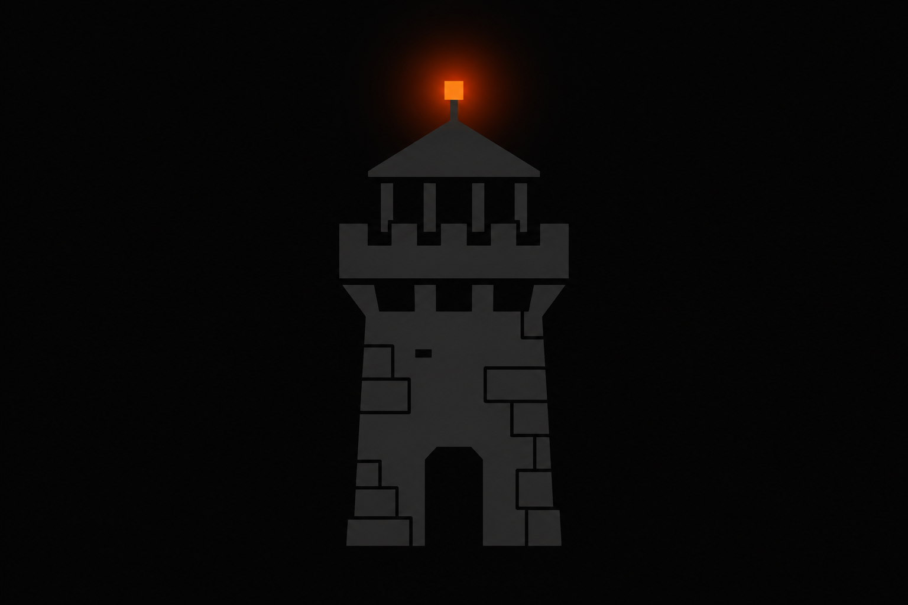
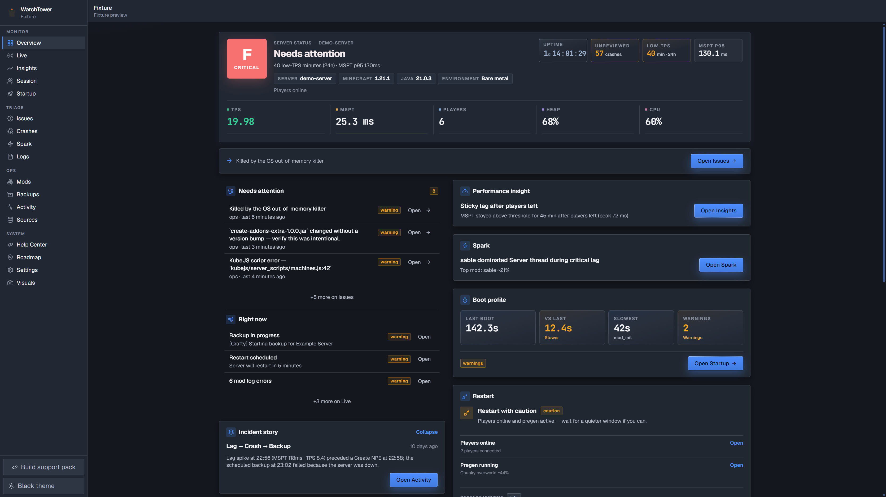
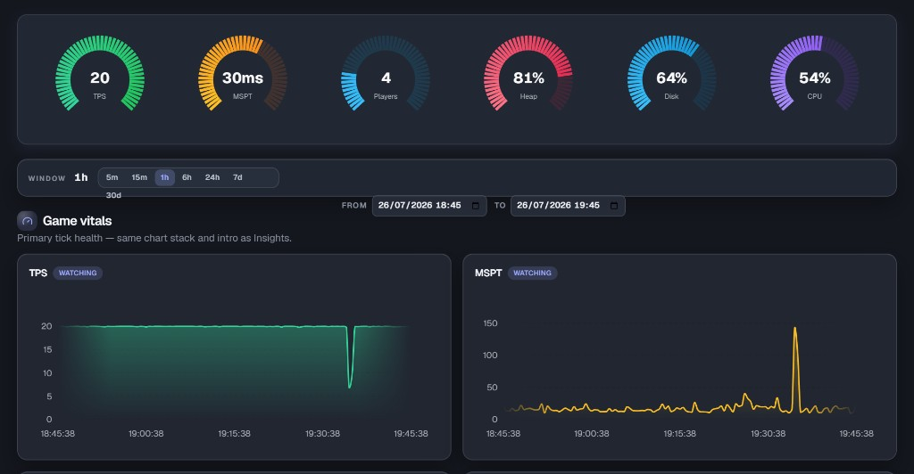
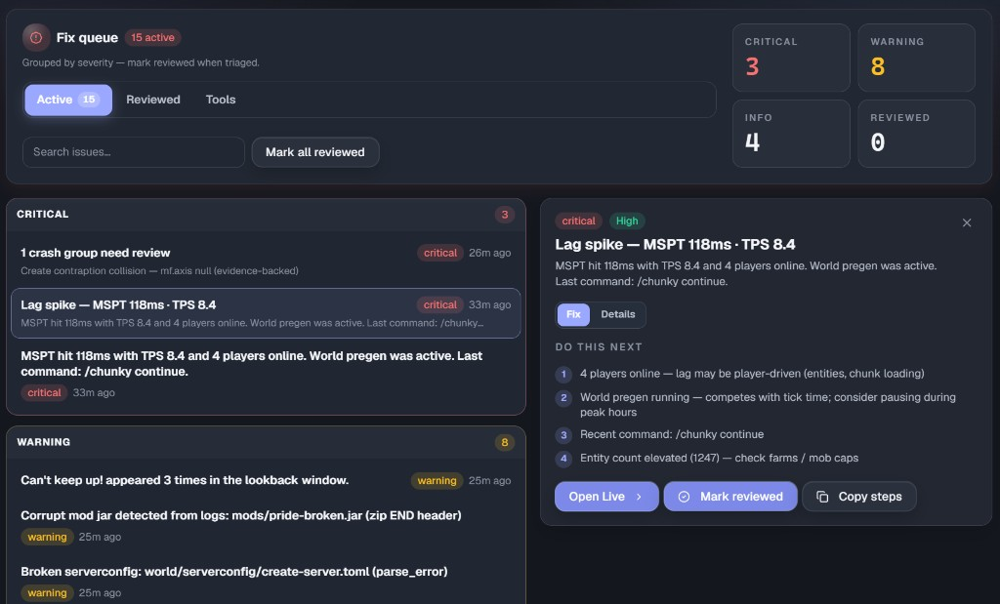
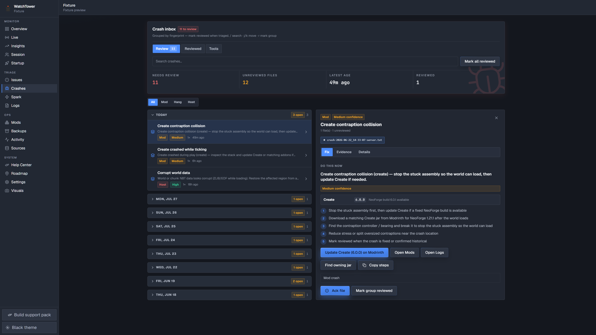

  

# Watchtower

**What's happening on your Minecraft server — and what to do next.**

  
  
  
  

  <a href="https://modrinth.com/mod/watchtower">Modrinth</a> ·
  <a href="https://github.com/djinnbanter/WatchTower/releases">Releases</a> ·
  <a href="https://github.com/djinnbanter/WatchTower/wiki">Wiki</a> ·
  <a href="CHANGELOG.md">Changelog</a> ·
  <a href="https://github.com/djinnbanter/WatchTower/issues">Issues</a>

---

I built Watchtower for the nights when a modded server goes weird and you’re bouncing between the host panel, `latest.log`, crash folders, and backup paths — just to answer two questions:

1. **Is the server okay right now?**
2. **What should I fix next?**

It’s a **local ops dashboard** for NeoForge dedicated servers. It watches while the game runs, turns lag / crashes / mods / backups into plain next steps, and stays on your machine. No cloud account. No telemetry service. Not a player-stats / analytics mod.

**Works on:** Linux dedicated servers · NeoForge **1.21.x** · Java **21**

---

## What you get

- **Overview** — a clear “how’s my server?” page: health grade, live vitals, what needs attention, and **restart advice** (Safe / Caution / Wait). It does **not** restart the server for you.
- **Live** — TPS, lag, players, memory, CPU, and host charts while you watch.
- **Issues & Crashes** — a fix inbox that stays useful without running giant reports every day. Pick a row, see what to do next.
- **Mods** — inventory with optional [Modrinth](https://modrinth.com/) update / conflict hints. Watchtower **never downloads mod jars for you**.
- **Spark** — when lag needs proof, read [Spark](https://modrinth.com/mod/spark) profiles in plain steps (needs Spark installed). The deep Spark workspace is still **alpha**.
- **Backups** — see if backups look fresh. Point it at a **local backup folder** (best path). Panel / cloud tracking exists but is **alpha** — don’t fully trust it yet.
- **Support pack** — build a zip (logs, crashes, Spark, extras) from the side rail to send to a helper or mod author.
- **CLI (optional)** — if Minecraft won’t stay up, the matching CLI jar can still build a local disaster-recovery bundle over SSH.

Everything important lives under your server’s `watchtower/` folder on disk.

---

## Quick start

1. Download **[GitHub Releases](https://github.com/djinnbanter/WatchTower/releases)** or **[Modrinth](https://modrinth.com/mod/watchtower)**:
   - `watchtower-neoforge-1.1.2+mc1.21.jar` — **required** (the mod)
   - `watchtower-cli-1.1.2.jar` — **recommended** (disaster recovery when the game won’t boot)
2. Put both files in your server’s **`mods/`** folder (replace older Watchtower jars).
3. Restart the server.
4. Open **`http://<server-ip>:8787`** in your browser.
5. Sign in with **`watchtower` / `password`**, then **change the password** right away and finish first-time setup.

**Security tip:** Prefer opening the dashboard on the machine itself (or through an SSH tunnel). Don’t leave port **8787** open to the whole internet.

More detail: [Installation](https://github.com/djinnbanter/WatchTower/wiki/Installation) · [Quick Start Checklist](https://github.com/djinnbanter/WatchTower/wiki/Quick-Start-Checklist) · [Security](https://github.com/djinnbanter/WatchTower/wiki/Security-and-Access)

The CLI is **not** loaded as a Minecraft mod. Keep it in `mods/` next to Watchtower, and run it with `java -jar` over SSH when you need it. [Disaster recovery →](https://github.com/djinnbanter/WatchTower/wiki/Disaster-Recovery)

---

## Screenshots

   
  <em>Overview — health, vitals, and what needs attention</em>

   
  <em>Live — tick and host charts while the server runs</em>

   
  <em>Issues — a fix inbox with clear next steps</em>

   
  <em>Crashes — grouped reports you can actually work through</em>

---

## Where it’s going

I keep shipping in small steps: clearer advice, better crash / mod help, then wider loader support later. The long-term goal stays the same — **one place on the server** for what’s happening and what to do next.

Full plan: [docs/ROADMAP.md](docs/ROADMAP.md) (there’s also a Roadmap page inside the dashboard).

---

## Docs & help

- **[GitHub Wiki](https://github.com/djinnbanter/WatchTower/wiki)** — main guide for server owners (same content is in the in-app Help Center)
- **[Changelog](CHANGELOG.md)** — what changed in each release
- **[Issues](https://github.com/djinnbanter/WatchTower/issues)** — bugs and ideas

Something still feels wrong after updating? Open an issue or send a Support pack — I’ll take a look.

---

## Contributing

Clone, build, and test notes: [CONTRIBUTING.md](CONTRIBUTING.md)

---

## License

GPL-3.0-or-later — see [LICENSE](LICENSE).
