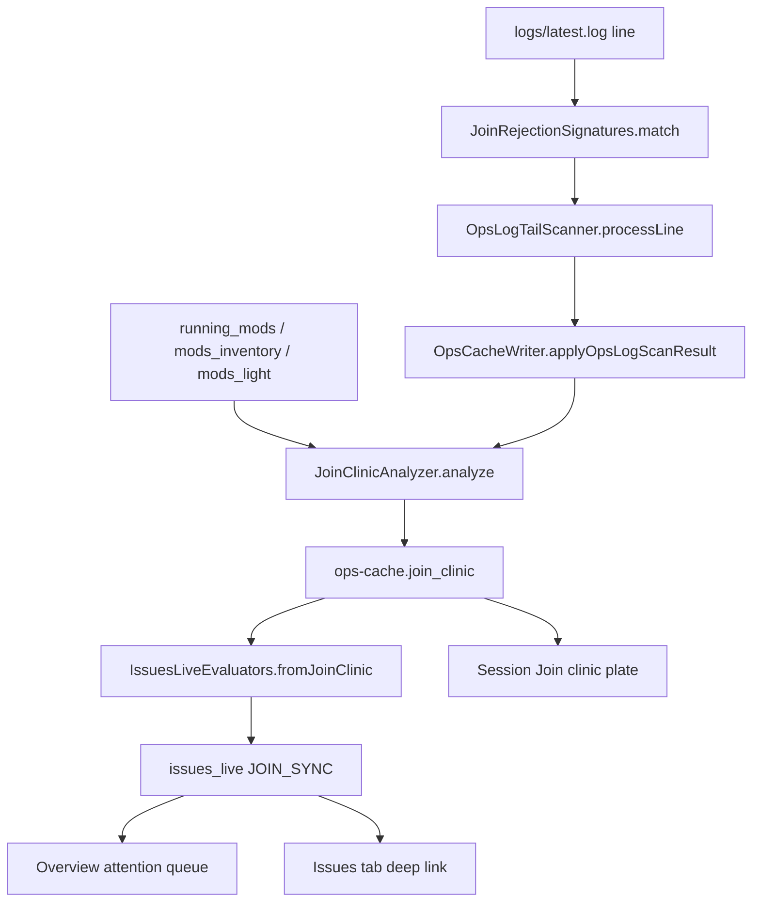

# Join & Pack Sync Clinic (1.1.10) Implementation Plan

> **For agentic workers:** REQUIRED SUB-SKILL: Use superpowers:subagent-driven-development (recommended) or superpowers:executing-plans to implement this plan task-by-task. Steps use checkbox (`- [ ]`) syntax for tracking.
>
> **First step before Task 1:** copy this plan verbatim to [`docs/superpowers/plans/2026-07-29-join-pack-sync-clinic.md`](docs/superpowers/plans/2026-07-29-join-pack-sync-clinic.md) so the repo carries its own copy (matches [`docs/superpowers/plans/2026-07-29-storage-treemap-ui.md`](docs/superpowers/plans/2026-07-29-storage-treemap-ui.md)).

**Goal:** While the server is up, turn "my friend can't join" into a named jar diff — missing / extra / wrong-version mods — surfaced as an Issue and a Session-tab clinic card with a redacted, player-safe fix list.

**Architecture:** Follow the shipped `silent_fails` pipeline end to end. A new `JoinRejectionSignatures` matcher runs inside `OpsLogTailScanner.processLine`, anchored on the vanilla disconnect / "lost connection" line and gated by a reason-text classifier so ordinary kicks/timeouts never enter. A new `JoinClinicAnalyzer` enriches each raw hit with a diff against the server's own mod inventory (already present in the same ops-cache object), suppressing mods the server has already scored client-only. `OpsCacheWriter` merges the result into a new `join_clinic` block; `IssuesLiveEvaluators.fromJoinClinic` raises pack-shaped `JOIN_SYNC:*` rows. The dashboard reads `ops.join_clinic` in a new Session plate.

**Tech Stack:** Java 21 (Gradle, Gson, JUnit 5), React 18 + TypeScript (Vite, `tsx --test`), no new dependencies.

## Global Constraints

- **Server log only** — no client-log paste/upload UI. Derive mod ids from channel/registry namespaces and rejection text; label confidence honestly when versions are unknown.
- **Never quietly change `mods/` or the world** — clinic is read-only advice + copy text.
- **No player analytics** — no retention, GeoIP, kick/ban controls; only the failed-join event + named mod diffs.
- **False-positive gate** — suppress intentional client-only differences already scored as `likely_removable` / `client_library` (mirror `fromClientOnServer` filters); ignore ordinary kicks/timeouts/auth fails.
- **Pin correlate is soft** — if pack pin (1.1.8) is absent, omit the "vs known-good pack" label; do not block the clinic.
- **Copy output has no IPs/tokens** — run player-facing text through `SupportRedactor.redactText`.
- **Kill-switch** — `JOIN_CLINIC_ENABLED` (default `true`), same pattern as `SILENT_FAIL_DETECT_ENABLED` / `WORLD_PRESSURE_ENABLED`.
- **Commits:** Only when the user asks; do not commit unless requested.
- **Version:** This is 1.1.10 work. Do not bump `gradle.properties` `mod_version` in this plan (currently `1.1.9` built/unreleased); changelog goes under `[Unreleased]` until a release cut.



---

## File Structure

| File | Responsibility |
|------|----------------|
| [`watchtower-core/.../collect/JoinRejectionSignatures.java`](watchtower-core/src/main/java/dev/mcstatus/watchtower/core/collect/JoinRejectionSignatures.java) (new) | Known Forge/NeoForge/Fabric join-rejection log signatures → structured hit |
| [`watchtower-core/.../analyze/JoinClinicAnalyzer.java`](watchtower-core/src/main/java/dev/mcstatus/watchtower/core/analyze/JoinClinicAnalyzer.java) (new) | Diff hit mods vs server inventory; suppress client-only; build fix copy |
| [`watchtower-core/.../ops/OpsLogTailScanner.java`](watchtower-core/src/main/java/dev/mcstatus/watchtower/core/ops/OpsLogTailScanner.java) | Call matcher in `processLine`; add `joinRejections` to `ScanResult` |
| [`watchtower-core/.../ops/OpsCacheSchema.java`](watchtower-core/src/main/java/dev/mcstatus/watchtower/core/ops/OpsCacheSchema.java) | `JOIN_CLINIC` field constants |
| [`watchtower-core/.../ops/OpsCacheWriter.java`](watchtower-core/src/main/java/dev/mcstatus/watchtower/core/ops/OpsCacheWriter.java) | Merge `join_clinic` in `applyOpsLogScanResult`; pass kill-switch into `refreshIssuesLive` |
| [`watchtower-core/.../ops/IssuesLiveEvaluators.java`](watchtower-core/src/main/java/dev/mcstatus/watchtower/core/ops/IssuesLiveEvaluators.java) | `fromJoinClinic` + resolve `JOIN_SYNC*` when clear |
| [`watchtower-core/.../report/ReportConfig.java`](watchtower-core/src/main/java/dev/mcstatus/watchtower/core/report/ReportConfig.java) | `joinClinicEnabled` / `JOIN_CLINIC_ENABLED` |
| [`watchtower-neoforge-common/.../OpsScanService.java`](watchtower-neoforge-common/src/main/java/dev/mcstatus/watchtower/OpsScanService.java) | Pass `joinClinicEnabled` into `refreshIssuesLive` |
| [`web/dashboard/src/features/session/join-clinic.tsx`](web/dashboard/src/features/session/join-clinic.tsx) (new) | Session plate: last N failures + Copy fix |
| [`web/dashboard/src/features/session/view.tsx`](web/dashboard/src/features/session/view.tsx) | Wire plate + `api.opsCache()` query |
| [`web/dashboard/src/features/issues/helpers.ts`](web/dashboard/src/features/issues/helpers.ts) | `JOIN_SYNC` → primaryAction Session |
| [`samples/fixtures/join-clinic/`](samples/fixtures/join-clinic/) (new) | Log snippets + ops-cache slices |
| Docs / conf / mock | Wiki page, sidebar, Issues/HTTP-API/Session cross-links, `watchtower.conf.example`, `generate-mock-data.mjs` |

---

### Task 1: JoinRejectionSignatures matcher (TDD)

**Files:**
- Create: `watchtower-core/src/main/java/dev/mcstatus/watchtower/core/collect/JoinRejectionSignatures.java`
- Create: `watchtower-core/src/test/java/dev/mcstatus/watchtower/core/collect/JoinRejectionSignaturesTest.java`
- Create: `samples/fixtures/join-clinic/neoforge-mismatched-channel.log`
- Create: `samples/fixtures/join-clinic/neoforge-missing-mod.log`
- Create: `samples/fixtures/join-clinic/fabric-mod-rejection.log`
- Create: `samples/fixtures/join-clinic/ordinary-timeout.log` (must NOT match)

**Interfaces:**
- Produces:

```java
public final class JoinRejectionSignatures {
  public record Hit(
      String kind,           // mismatched_channel | missing_mod | wrong_version | registry | unknown_pack
      String platform,       // neoforge | forge | fabric | unknown
      String player,         // may be blank
      List<String> modIds,   // derived namespaces / named mods (may be empty)
      String reason,         // short reason snippet (no IPs)
      String sampleLine,
      String confidence      // high | medium | low
  ) {}

  /** Match a single log line. Returns null when blank or not a join/pack rejection. */
  public static Hit match(String line) { ... }

  public static List<String> fixStepsFor(String kind) { ... }
}
```

- Kind → fix-step mapping (used later by Issues + Copy fix):
  - `mismatched_channel` → "Install/update the listed mods on the client to match the server." / "Remove client mods that register network channels the server does not have."
  - `missing_mod` → "Install the missing mod(s) on the client (same version as the server)."
  - `wrong_version` → "Update the named mod(s) on the client to the server's version."
  - `registry` → "Client and server registries disagree — sync the pack (same loader + same mod set)."
  - `unknown_pack` → "Client was rejected for a pack/network mismatch — compare mods folders."

- [ ] **Step 1: Write fixture log lines**

`samples/fixtures/join-clinic/neoforge-mismatched-channel.log` (one representative NeoForge-style line; adjust wording to real samples you validate against public logs, but keep this shape):

```text
[29Jul2026 20:15:01.123] [Server thread/INFO]: com.example.Player123 lost connection: Failed to connect to server: Incompatible mod set: mismatched channels: [create:main, flywheel:network]
```

`samples/fixtures/join-clinic/neoforge-missing-mod.log`:

```text
[29Jul2026 20:16:02.456] [Server thread/INFO]: FriendName lost connection: Mod Rejection: Missing required mods: [create, jei]
```

`samples/fixtures/join-clinic/fabric-mod-rejection.log`:

```text
[29Jul2026 20:17:03.789] [Server thread/INFO]: FabricPlayer lost connection: Incompatible client: Mod mismatch: fabric-api@0.100.0 required, client has 0.99.0
```

`samples/fixtures/join-clinic/ordinary-timeout.log`:

```text
[29Jul2026 20:18:04.001] [Server thread/INFO]: IdlePlayer lost connection: Timed out
```

- [ ] **Step 2: Write the failing test**

```java
package dev.mcstatus.watchtower.core.collect;

import org.junit.jupiter.api.Test;
import java.nio.file.Files;
import java.nio.file.Path;
import static org.junit.jupiter.api.Assertions.*;

class JoinRejectionSignaturesTest {
  private static String load(String name) throws Exception {
    Path cwd = Path.of("").toAbsolutePath();
    for (Path c : List.of(
        cwd.resolve("samples/fixtures/join-clinic").resolve(name),
        cwd.resolve("../samples/fixtures/join-clinic").resolve(name),
        cwd.resolve("../../samples/fixtures/join-clinic").resolve(name))) {
      if (Files.isRegularFile(c)) return Files.readString(c).strip();
    }
    throw new IllegalStateException("fixture not found: " + name);
  }

  @Test
  void mismatchedChannelParsesModIds() throws Exception {
    var hit = JoinRejectionSignatures.match(load("neoforge-mismatched-channel.log"));
    assertNotNull(hit);
    assertEquals("mismatched_channel", hit.kind());
    assertTrue(hit.modIds().contains("create"));
    assertTrue(hit.modIds().contains("flywheel"));
    assertFalse(hit.player().isBlank());
  }

  @Test
  void missingModParsesModIds() throws Exception {
    var hit = JoinRejectionSignatures.match(load("neoforge-missing-mod.log"));
    assertNotNull(hit);
    assertEquals("missing_mod", hit.kind());
    assertTrue(hit.modIds().contains("create"));
    assertTrue(hit.modIds().contains("jei"));
  }

  @Test
  void fabricWrongVersionParsesModId() throws Exception {
    var hit = JoinRejectionSignatures.match(load("fabric-mod-rejection.log"));
    assertNotNull(hit);
    assertEquals("wrong_version", hit.kind());
    assertTrue(hit.modIds().stream().anyMatch(id -> id.contains("fabric")));
  }

  @Test
  void ordinaryTimeoutDoesNotMatch() throws Exception {
    assertNull(JoinRejectionSignatures.match(load("ordinary-timeout.log")));
  }
}
```

- [ ] **Step 3: Run test to verify it fails**

```powershell
.\gradlew.bat :watchtower-core:test --tests "dev.mcstatus.watchtower.core.collect.JoinRejectionSignaturesTest" --no-configuration-cache
```

Expected: FAIL — `JoinRejectionSignatures` not found / class missing.

- [ ] **Step 4: Write minimal implementation**

Mirror [`SilentFailSignatures.java`](watchtower-core/src/main/java/dev/mcstatus/watchtower/core/collect/SilentFailSignatures.java):

1. Require an anchor: line matches `lost connection:` / `Disconnecting` / `disconnected` (reuse spirit of `LogPatterns.PLAYER_DISCONNECT`) **and** reason text matches a pack/sync classifier (case-insensitive):
   - `mismatched channel` / `incompatible mod set` / `mod rejection` / `missing required mod` / `registry` / `incompatible client` / `mod mismatch`
2. Extract player from the text before `lost connection:` when present.
3. Extract mod ids from bracket lists (`[create:main, flywheel:network]` → `create`, `flywheel`) and from `ModName@version` / `mod_id` tokens.
4. Strip channel suffixes after `:` when they look like channel names (`create:main` → `create`); keep vanilla `minecraft` out of `modIds` unless it is the only token.
5. Cap `sampleLine` at 240 chars (same as silent fails).
6. Set `confidence`: `high` when ≥1 mod id captured; `medium` when kind known but mod list empty; `low` for `unknown_pack`.

Do **not** match: `Timed out`, `Internal Exception`, plain `Kicked`, `You are not whitelisted`, or `MC_AUTH_FAIL`-style auth lines.

- [ ] **Step 5: Run test to verify it passes**

Same Gradle command as Step 3. Expected: PASS.

- [ ] **Step 6: Commit** (only if user asked)

```bash
git add watchtower-core/src/main/java/dev/mcstatus/watchtower/core/collect/JoinRejectionSignatures.java \
  watchtower-core/src/test/java/dev/mcstatus/watchtower/core/collect/JoinRejectionSignaturesTest.java \
  samples/fixtures/join-clinic/
git commit -m "$(cat <<'EOF'
feat: add join rejection log signatures for pack sync clinic

EOF
)"
```

---

### Task 2: Wire signatures into OpsLogTailScanner

**Files:**
- Modify: [`OpsLogTailScanner.java`](watchtower-core/src/main/java/dev/mcstatus/watchtower/core/ops/OpsLogTailScanner.java) — `ScanResult`, `ParseState`, `processLine`, `emptyResult`, both `hadNewData` aggregations
- Modify: [`OpsLogTailScannerTest.java`](watchtower-core/src/test/java/dev/mcstatus/watchtower/core/ops/OpsLogTailScannerTest.java)

**Interfaces:**
- Extends `ScanResult` with:

```java
public record ScanResult(
    Instant scannedAt,
    int newActivityCount,
    List<JsonObject> activityEvents,
    JsonArray modLogErrors,
    List<JsonObject> kubejsFailures,
    List<JsonObject> silentFails,
    List<JsonObject> joinRejections,   // NEW
    List<JsonObject> backgroundJobs,
    JsonObject updatedOffset,
    JsonObject context,
    boolean hadNewData
) {}
```

- Row shape written into `joinRejections` (same style as silent fails):

```json
{
  "kind": "mismatched_channel",
  "platform": "neoforge",
  "player": "FriendName",
  "mod_ids": ["create", "flywheel"],
  "reason": "Incompatible mod set: mismatched channels: [create:main, flywheel:network]",
  "confidence": "high",
  "time": "2026-07-29T20:15:01+01:00",
  "sample_line": "..."
}
```

- Consumes: `JoinRejectionSignatures.match(String)`
- **Breaking:** every `new ScanResult(...)` construction site in this file (and any test helpers) must add the new list argument. Grep for `new ScanResult(` and `scan.silentFails()` call sites — update `OpsCacheWriter.applyOpsLogScanResult` only in Task 4; for Task 2 keep the scanner compiling by updating writer temporarily to ignore the new field if needed, or do Task 2+4 in one PR slice if the compiler forces it. Prefer: add the field to `ScanResult` and thread an empty merge stub in writer so `:watchtower-core:compileJava` stays green, then flesh merge in Task 4.

- [ ] **Step 1: Write failing scanner test** (inline log under `@TempDir`, same style as existing join tests)

```java
@Test
void scanTailCapturesJoinRejection() throws Exception {
  Path server = temp.resolve("server");
  Files.createDirectories(server.resolve("logs"));
  Files.writeString(server.resolve("logs/latest.log"),
      "[29Jul2026 20:15:01] [Server thread/INFO]: FriendName lost connection: "
          + "Failed to connect to server: Incompatible mod set: mismatched channels: [create:main]\n");
  OpsLogTailScanner.ScanResult r = OpsLogTailScanner.scanTail(server.toString(), 50, 0);
  assertEquals(1, r.joinRejections().size());
  assertEquals("mismatched_channel", r.joinRejections().get(0).get("kind").getAsString());
}

@Test
void scanTailIgnoresOrdinaryTimeout() throws Exception {
  Path server = temp.resolve("server");
  Files.createDirectories(server.resolve("logs"));
  Files.writeString(server.resolve("logs/latest.log"),
      "[29Jul2026 20:18:04] [Server thread/INFO]: IdlePlayer lost connection: Timed out\n");
  OpsLogTailScanner.ScanResult r = OpsLogTailScanner.scanTail(server.toString(), 50, 0);
  assertTrue(r.joinRejections().isEmpty());
}
```

- [ ] **Step 2: Run test — expect FAIL** (no `joinRejections()`)

```powershell
.\gradlew.bat :watchtower-core:test --tests "dev.mcstatus.watchtower.core.ops.OpsLogTailScannerTest" --no-configuration-cache
```

- [ ] **Step 3: Implement**

In `processLine`, after `detectSilentFail(...)`:

```java
detectJoinRejection(stripped, ts, state);
```

```java
private static void detectJoinRejection(String stripped, ZonedDateTime ts, ParseState state) {
  JoinRejectionSignatures.Hit hit = JoinRejectionSignatures.match(stripped);
  if (hit == null) return;
  String dedupeKey = hit.kind() + "|" + hit.player() + "|"
      + String.join(",", hit.modIds()) + "|"
      + Integer.toHexString(hit.sampleLine().hashCode());
  if (!state.joinRejectionKeys.add(dedupeKey)) return;
  JsonObject row = new JsonObject();
  row.addProperty("kind", hit.kind());
  row.addProperty("platform", hit.platform());
  if (!hit.player().isBlank()) row.addProperty("player", hit.player());
  JsonArray ids = new JsonArray();
  for (String id : hit.modIds()) ids.add(id);
  row.add("mod_ids", ids);
  row.addProperty("reason", hit.reason());
  row.addProperty("confidence", hit.confidence());
  row.addProperty("time", CollectSupport.iso(ts));
  row.addProperty("sample_line", hit.sampleLine());
  state.joinRejections.add(row);
}
```

Add `List<JsonObject> joinRejections` + `Set<String> joinRejectionKeys` to `ParseState`. Include `!state.joinRejections.isEmpty()` in every `hadNewData` expression. Update `emptyResult` to pass `List.of()` for join rejections.

- [ ] **Step 4: Run tests — expect PASS** (same command). Fix any `ScanResult` call-site compile errors in core + common modules.

- [ ] **Step 5: Commit** (only if user asked)

---

### Task 3: JoinClinicAnalyzer (diff + suppress + fix copy)

**Files:**
- Create: `watchtower-core/src/main/java/dev/mcstatus/watchtower/core/analyze/JoinClinicAnalyzer.java`
- Create: `watchtower-core/src/test/java/dev/mcstatus/watchtower/core/analyze/JoinClinicAnalyzerTest.java`
- Create: `samples/fixtures/join-clinic/analyze-missing-vs-server.json`
- Create: `samples/fixtures/join-clinic/analyze-client-only-suppressed.json`

**Interfaces:**
- Produces:

```java
public final class JoinClinicAnalyzer {
  public static final int MAX_ENTRIES = 25;
  public static final int RETENTION_DAYS = 7;

  /**
   * Enrich raw rejection rows against the current ops-cache inventory snapshot.
   * @param rawRows list of scanner rows (Task 2 shape)
   * @param cache full ops-cache root (for running_mods, mods_inventory, mods_light)
   * @param prev previous join_clinic block (may be null) for merge/retention
   */
  public static JsonObject analyze(List<JsonObject> rawRows, JsonObject cache, JsonObject prev) { ... }

  /** Player-safe Discord/plain text for one entry (already redacted). */
  public static String buildPlayerSafeCopy(JsonObject entry) { ... }
}
```

- Output block shape (`ops-cache.join_clinic`):

```json
{
  "scanned_at": "ISO",
  "new_count": 1,
  "entries": [
    {
      "key": "mismatched_channel|FriendName|create,flywheel",
      "kind": "mismatched_channel",
      "platform": "neoforge",
      "player": "FriendName",
      "time": "ISO",
      "confidence": "high",
      "reason": "...",
      "sample_line": "...",
      "missing": [{"mod_id": "create", "server_version": "6.0.0", "display_name": "Create"}],
      "extra": [],
      "wrong_version": [],
      "suppressed_client_only": [{"mod_id": "modmenu", "bucket": "likely_removable"}],
      "vs_known_good": false,
      "fix_copy": "Hey FriendName — the server rejected your join (mismatched channels).\n\nInstall/update on your client:\n- create (server has 6.0.0)\n\nAsk the admin if you need the pack download."
    }
  ]
}
```

**Diff rules (server-log-only honesty):**
- Server mod set = ids from `cache.running_mods.mods[]` if present, else `cache.mods_inventory` snapshot `mod_id`s.
- For each hit `mod_ids[]` that **is on the server** → put in `missing` (client lacks what server has / channel the server expects). Include `server_version` + `display_name` when known.
- For each hit `mod_ids[]` that **is not on the server** → candidate `extra`. If that id is in `mods_light.client_only_mods` / `modrinth_scan.client_only_mods` with bucket `likely_removable` or `client_library`, move to `suppressed_client_only` instead of `extra`.
- `wrong_version`: only when the reason text clearly names both versions for the same mod id (Fabric-style); otherwise leave empty and keep `confidence` honest.
- `vs_known_good`: `true` only when `cache.mods_inventory.diff.drift` is non-empty **or** a future pin field exists; for 1.1.10 without 1.1.8 pin ceremony, set `true` when drift_count > 0 and append "Server jars have drifted since the last baseline — confirm the pack pin." to fix copy; otherwise `false`.
- Merge with `prev.entries` by `key`, keep newest first, drop entries older than `RETENTION_DAYS`, cap at `MAX_ENTRIES`.
- `buildPlayerSafeCopy`: build plain text from structured fields, then `SupportRedactor.redactText(...)`. Never include `sample_line` IPs/paths raw without redaction.

- [ ] **Step 1: Write fixtures + failing tests**

```java
@Test
void missingModsLabeledAgainstRunningMods() throws Exception {
  JsonObject fixture = load("analyze-missing-vs-server.json");
  JsonObject block = JoinClinicAnalyzer.analyze(
      List.of(fixture.getAsJsonObject("raw")),
      fixture.getAsJsonObject("cache"),
      null);
  JsonObject entry = block.getAsJsonArray("entries").get(0).getAsJsonObject();
  assertTrue(entry.getAsJsonArray("missing").size() >= 1);
  assertEquals("create", entry.getAsJsonArray("missing").get(0).getAsJsonObject().get("mod_id").getAsString());
}

@Test
void clientOnlyExtraIsSuppressed() throws Exception {
  JsonObject fixture = load("analyze-client-only-suppressed.json");
  JsonObject block = JoinClinicAnalyzer.analyze(
      List.of(fixture.getAsJsonObject("raw")),
      fixture.getAsJsonObject("cache"),
      null);
  JsonObject entry = block.getAsJsonArray("entries").get(0).getAsJsonObject();
  assertEquals(0, entry.getAsJsonArray("extra").size());
  assertTrue(entry.getAsJsonArray("suppressed_client_only").size() >= 1);
}

@Test
void playerSafeCopyHasNoIp() {
  JsonObject entry = new JsonObject();
  entry.addProperty("player", "Friend");
  entry.addProperty("kind", "missing_mod");
  entry.addProperty("reason", "see 203.0.113.10 for help"); // should redact
  JsonArray missing = new JsonArray();
  JsonObject m = new JsonObject();
  m.addProperty("mod_id", "create");
  m.addProperty("server_version", "6.0.0");
  missing.add(m);
  entry.add("missing", missing);
  entry.add("extra", new JsonArray());
  entry.add("wrong_version", new JsonArray());
  String copy = JoinClinicAnalyzer.buildPlayerSafeCopy(entry);
  assertFalse(copy.contains("203.0.113.10"));
  assertTrue(copy.contains("create"));
}
```

Fixture `analyze-missing-vs-server.json` sketch:

```json
{
  "raw": {
    "kind": "mismatched_channel",
    "platform": "neoforge",
    "player": "FriendName",
    "mod_ids": ["create", "flywheel"],
    "reason": "mismatched channels",
    "confidence": "high",
    "time": "2026-07-29T20:15:01Z",
    "sample_line": "FriendName lost connection: mismatched channels: [create:main]"
  },
  "cache": {
    "running_mods": {
      "mods": [
        {"id": "create", "version": "6.0.0", "display_name": "Create"},
        {"id": "flywheel", "version": "1.0.0", "display_name": "Flywheel"}
      ]
    }
  }
}
```

- [ ] **Step 2: Run — expect FAIL**

```powershell
.\gradlew.bat :watchtower-core:test --tests "dev.mcstatus.watchtower.core.analyze.JoinClinicAnalyzerTest" --no-configuration-cache
```

- [ ] **Step 3: Implement analyzer** (static utility + private helpers for inventory extract / client-only set / keying).

- [ ] **Step 4: Run — expect PASS**.

- [ ] **Step 5: Commit** (only if user asked).

---

### Task 4: Ops-cache schema, writer merge, config kill-switch

**Files:**
- Modify: [`OpsCacheSchema.java`](watchtower-core/src/main/java/dev/mcstatus/watchtower/core/ops/OpsCacheSchema.java)
- Modify: [`OpsCacheWriter.java`](watchtower-core/src/main/java/dev/mcstatus/watchtower/core/ops/OpsCacheWriter.java) — `applyOpsLogScanResult` + `refreshIssuesLive` overloads
- Modify: [`ReportConfig.java`](watchtower-core/src/main/java/dev/mcstatus/watchtower/core/report/ReportConfig.java)
- Modify: [`OpsScanService.java`](watchtower-neoforge-common/src/main/java/dev/mcstatus/watchtower/OpsScanService.java)
- Modify: [`tools/watchtower.conf.example`](tools/watchtower.conf.example)
- Test: extend writer/scanner integration via existing `OpsLogTailScannerTest` or a small writer test if one exists; otherwise cover via Task 5 fixture merge.

**Interfaces:**
- Schema constants:

```java
public static final String JOIN_CLINIC = "join_clinic";
public static final String JOIN_CLINIC_SCANNED_AT = "scanned_at";
public static final String JOIN_CLINIC_NEW_COUNT = "new_count";
public static final String JOIN_CLINIC_ENTRIES = "entries";
```

- In `applyOpsLogScanResult`, after silent-fails merge:

```java
JsonObject prevClinic = cache.has(JOIN_CLINIC) && cache.get(JOIN_CLINIC).isJsonObject()
    ? cache.getAsJsonObject(JOIN_CLINIC) : null;
JsonObject clinic = JoinClinicAnalyzer.analyze(scan.joinRejections(), cache, prevClinic);
cache.add(JOIN_CLINIC, clinic);
```

- `ReportConfig`: field + env `JOIN_CLINIC_ENABLED` default `true`; builder + copy-from-existing.
- `refreshIssuesLive(...)` / `evaluateAndMerge(...)`: add `boolean joinClinicEnabled` parameter (same overload chaining pattern as `worldPressureEnabled`). Update `OpsScanService.refreshIssuesLive` to pass `config.joinClinicEnabled()`.
- Conf example:

```properties
# JOIN_CLINIC_ENABLED=true
# Surfaces Forge/NeoForge/Fabric join rejections as a Session clinic + Issues (read-only).
```

- [ ] **Step 1: Add config + schema constants; compile.**

- [ ] **Step 2: Wire analyzer into `applyOpsLogScanResult`; thread kill-switch into refresh overloads.**

- [ ] **Step 3: Run core + common compile/tests**

```powershell
.\gradlew.bat :watchtower-core:test :watchtower-neoforge-common:test --no-configuration-cache
```

Expected: PASS (existing suites green).

- [ ] **Step 4: Commit** (only if user asked).

---

### Task 5: IssuesLiveEvaluators.fromJoinClinic

**Files:**
- Modify: [`IssuesLiveEvaluators.java`](watchtower-core/src/main/java/dev/mcstatus/watchtower/core/ops/IssuesLiveEvaluators.java)
- Modify: [`IssuesLiveEvaluatorsTest.java`](watchtower-core/src/test/java/dev/mcstatus/watchtower/core/ops/IssuesLiveEvaluatorsTest.java)
- Create: `samples/fixtures/issues-live/join-sync-positive.json`

**Interfaces:**
- Produces issue id: `JOIN_SYNC:<key>` where `<key>` is the entry `key` (stable).
- Severity: `warning` when `missing` or `wrong_version` non-empty; `info` when only `extra` after suppress; skip entry entirely if all of missing/extra/wrong_version empty (pure suppress / unknown with no actionable ids).
- Message example: `FriendName can't join — missing create, flywheel (mismatched channels)`.
- Evidence: fingerprint `join_sync:<key>`; ref `ops:join_clinic`.
- Fix steps: from `JoinRejectionSignatures.fixStepsFor(kind)` plus "Open Session → Join clinic and Copy fix for a player-safe list."
- In `evaluateAndMerge`: `detected.addAll(fromJoinClinic(cache, joinClinicEnabled));` and resolve keys starting with `JOIN_SYNC` when absent from this pass.

- [ ] **Step 1: Write fixture + failing test**

```java
@Test
void fromJoinClinicProducesJoinSyncKey() throws Exception {
  JsonObject cache = loadFixture("samples/fixtures/issues-live/join-sync-positive.json");
  List<IssuesLiveRecord> rows = IssuesLiveEvaluators.fromJoinClinic(cache, true);
  assertFalse(rows.isEmpty());
  assertTrue(rows.get(0).normalizedKey().startsWith("JOIN_SYNC"));
  assertEquals("warning", rows.get(0).severity());
}

@Test
void fromJoinClinicDisabledReturnsEmpty() throws Exception {
  JsonObject cache = loadFixture("samples/fixtures/issues-live/join-sync-positive.json");
  assertTrue(IssuesLiveEvaluators.fromJoinClinic(cache, false).isEmpty());
}
```

Fixture is an ops-cache slice with a populated `join_clinic.entries[]` (copy one analyzer output).

- [ ] **Step 2: Run — expect FAIL**

```powershell
.\gradlew.bat :watchtower-core:test --tests "dev.mcstatus.watchtower.core.ops.IssuesLiveEvaluatorsTest" --no-configuration-cache
```

- [ ] **Step 3: Implement `fromJoinClinic` + merge/resolve wiring.**

- [ ] **Step 4: Run — expect PASS. Also add an evaluateAndMerge case that resolves when entries clear (same style as silent_fails).**

- [ ] **Step 5: Commit** (only if user asked).

---

### Task 6: Dashboard — Session plate + Issues deep link + mock data

**Files:**
- Create: `web/dashboard/src/features/session/join-clinic.tsx`
- Create: `web/dashboard/src/features/session/join-clinic.test.ts` (pure helpers: pick entries, format copy)
- Modify: [`web/dashboard/src/features/session/view.tsx`](web/dashboard/src/features/session/view.tsx)
- Modify: [`web/dashboard/src/features/session/session.css`](web/dashboard/src/features/session/session.css)
- Modify: [`web/dashboard/src/features/issues/helpers.ts`](web/dashboard/src/features/issues/helpers.ts)
- Modify: [`web/dashboard/src/features/issues/helpers.test.ts`](web/dashboard/src/features/issues/helpers.test.ts)
- Modify: [`web/dashboard/scripts/generate-mock-data.mjs`](web/dashboard/scripts/generate-mock-data.mjs) — add `join_clinic` + a `JOIN_SYNC:*` issues_live row
- Modify: `web/dashboard/package.json` — add `"test:session": "tsx --test src/features/session/join-clinic.test.ts"` if useful

**Interfaces:**
- Session plate props:

```tsx
export function JoinClinicPlate({ ops }: { ops: Record<string, unknown> }) { ... }
```

- UI behavior:
  - Read `asRecord(ops.join_clinic)` / `asArray(entries)`.
  - Empty state: "No pack sync join failures yet" + one-line hint about NeoForge/Fabric rejections.
  - Cap list at 5 (`useCappedList` or local show-more like Session roster).
  - Per entry: player, kind pill, timeAgo, chips for missing/extra/wrong_version counts, **Copy fix** button writing `str(entry.fix_copy)` (fallback: rebuild a short client-side list from arrays if `fix_copy` absent).
  - Place the plate in `view.tsx` **above** the directory/sessions split (after the daily chart / playtime CTA), so failed joins are visible without scrolling past the roster.
  - Add `useQuery({ queryKey: ['ops-cache'], queryFn: api.opsCache, refetchInterval: 10_000 })`.

- Issues `fromLedgerRow` branch (before generic MOD):

```ts
} else if (id.startsWith('JOIN_SYNC') || id.includes('JOIN_SYNC')) {
  primaryAction = { label: 'Open Join clinic', tab: 'session' };
}
```

- Overview attention queue needs **no special case** — it already iterates open `issues_live`.

- [ ] **Step 1: Write helper tests** (parse entries, prefer `fix_copy`).

- [ ] **Step 2: Run**

```powershell
cd web\dashboard
npx tsx --test src/features/session/join-clinic.test.ts
npx tsx --test src/features/issues/helpers.test.ts
```

Expected: FAIL until helpers exist / JOIN_SYNC assertion added.

- [ ] **Step 3: Implement plate + wire view + Issues mapping + regenerate mock**

```powershell
npm run generate:mock
```

- [ ] **Step 4: Typecheck**

```powershell
npx tsc -b --pretty false
```

Expected: PASS.

- [ ] **Step 5: Commit** (only if user asked).

---

### Task 7: Docs + roadmap status

**Files:**
- Create: `docs/wiki/Join-Clinic.md` (operator page; mirror World-Pressure.md structure: what it detects, classifiers table, where you see it, what to do, kill-switch, related)
- Modify: [`docs/wiki/_Sidebar.md`](docs/wiki/_Sidebar.md) — under Use the dashboard, after Session / World Pressure as appropriate: `- [[Join Clinic]]`
- Modify: [`docs/wiki/Issues.md`](docs/wiki/Issues.md) — Active findings row for Join clinic / `JOIN_SYNC`
- Modify: [`docs/wiki/HTTP-API.md`](docs/wiki/HTTP-API.md) — mention `join_clinic` on `/api/ops-cache`
- Modify: [`docs/wiki/Dashboard-Tabs.md`](docs/wiki/Dashboard-Tabs.md) — Session row mentions Join clinic
- Modify: [`docs/wiki/Configuration.md`](docs/wiki/Configuration.md) — `JOIN_CLINIC_ENABLED`
- Modify: [`CHANGELOG.md`](CHANGELOG.md) — under `[Unreleased]` → Added bullet
- Modify: [`docs/wiki/Changelog.md`](docs/wiki/Changelog.md) — matching Unreleased / next-release note
- Modify: [`docs/ROADMAP.md`](docs/ROADMAP.md) / [`docs/wiki/Roadmap.md`](docs/wiki/Roadmap.md) — move 1.1.10 toward works-today when built
- Modify: [`docs/dev/roadmap/versions/1.1.8-1.1.18-day2-ops-and-apply.md`](docs/dev/roadmap/versions/1.1.8-1.1.18-day2-ops-and-apply.md) — Status → Built, unreleased; check Ship-when boxes when verified

**Ship-when checklist (from roadmap) — verify before marking Built:**
- [ ] Mismatched-channel + missing-mod fixtures parse to correct mod ids
- [ ] Copy output has no IPs/tokens
- [ ] False positives suppressed for intentional client-only differences already scored as client-only

- [ ] **Step 1: Write wiki page + cross-links + conf already done in Task 4.**
- [ ] **Step 2: Run docs audit**

```powershell
node tools\audit-docs.mjs
```

- [ ] **Step 3: Full verification**

```powershell
.\gradlew.bat :watchtower-core:test :watchtower-neoforge-common:test --no-configuration-cache
cd web\dashboard; npx tsc -b --pretty false
node tools\audit-dashboard-parity.mjs
node tools\audit-docs.mjs
```

- [ ] **Step 4: Commit** (only if user asked).

---

## Self-review

1. **Spec coverage (roadmap 1.1.10):**
   - Join rejection parser → Tasks 1–2
   - Clinic card (last N failed joins + named jar diffs) → Tasks 3, 6 (Session)
   - Copy fix (player-safe) → Task 3 `buildPlayerSafeCopy` + Task 6 button
   - Correlate with pin → soft `vs_known_good` via drift/baseline in Task 3 (no hard dep on deferred 1.1.8)
   - Overview banner → automatic via `issues_live` (Task 5)
   - Issues → Task 5 + Task 6 deep link
   - Ship-when items → Task 7 checklist

2. **Placeholder scan:** No TBD / "implement later" / "similar to Task N" without restated code.

3. **Type consistency:** `joinRejections` on `ScanResult`, ops key `join_clinic`, issue prefix `JOIN_SYNC`, kill-switch `JOIN_CLINIC_ENABLED` / `joinClinicEnabled()` used consistently across Tasks 2–6.

## Out of scope (explicit)

- Client log paste/upload UI
- 1.1.8 pin ceremony UI (only soft drift label)
- 1.1.12 player-safe ops context / Discord blurb expansion (clinic copy is the foundation only)
- Kick/ban/whitelist controls, GeoIP, retention analytics
- Changing `mods/` jars from the dashboard
