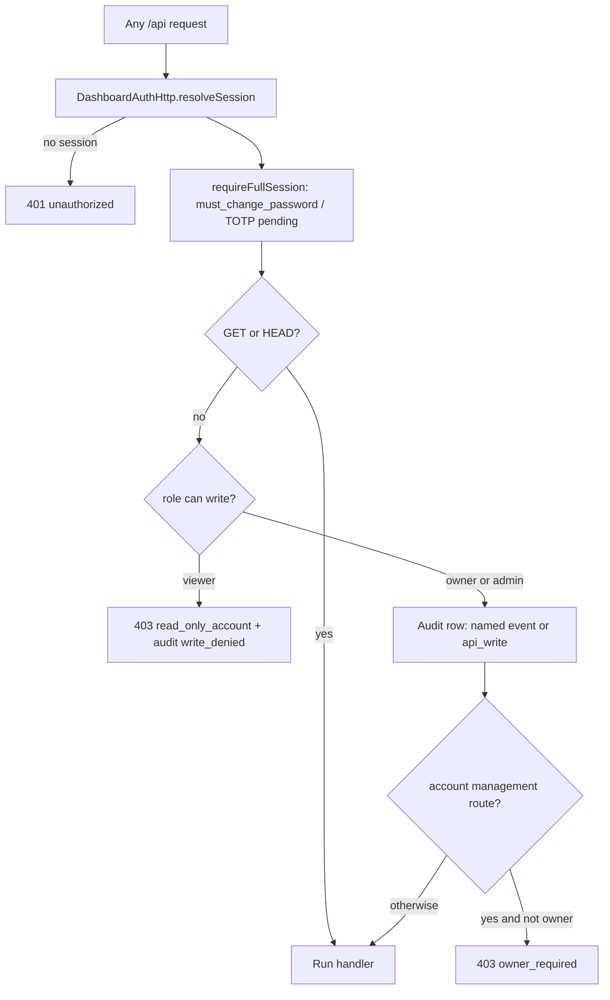

## 1.1.18 Multi-admin roles and settings audit log — Implementation Plan

> **For agentic workers:** REQUIRED SUB-SKILL: Use [subagent-driven-development](c:\Users\DJINN\.agents\skills\subagent-driven-development\SKILL.md) (recommended) or [executing-plans](c:\Users\DJINN\.agents\skills\executing-plans\SKILL.md) to implement this plan task-by-task. Steps use checkbox (`- [ ]`) syntax. Read **Skills to use during implementation** below before Task 1 — Required skills are not optional.
> On approval, copy this plan to `docs/superpowers/plans/2026-07-30-multi-admin-roles-and-audit-log.md` (repo convention) before starting Task 1.

**Goal:** Replace the single shared dashboard login with named accounts (`owner` / `admin` / `viewer`), attribute every mutating action to the account that performed it, and keep an append-only audit log readable from Settings.

**Architecture:** `dashboard-auth.json` migrates from schema 1 (one top-level credential) to schema 2 (`accounts[]`), with the existing credential becoming the `owner`. `SessionManager.SessionState` carries `accountId` + `role` + `totpRequired`, so the single `requireApiAuth()` gate in `DashboardHttpServer` can reject any non-GET request from a `viewer` in one place. A new `watchtower-core` audit module appends JSONL rows to `watchtower/audit-log.jsonl`; the HTTP layer writes rows for auth events, account management, named actions (settings/ack/suppress), plus a generic `api_write` row for every other mutating endpoint. The dashboard reads `role` from `GET /api/auth/session`, hides write affordances for viewers, and adds `Accounts` and `Audit log` Settings panels. The schema 2 file keeps a top-level mirror of the owner credential so a rolled-back jar still authenticates — see Upgrade and rollback safety below.

**Tech Stack:** Java 21 (`watchtower-core`, `watchtower-neoforge-common`), Gson, JUnit 5 + `@TempDir` (`.\gradlew :watchtower-core:test`), React 19 + TanStack Query + Zustand, Tailwind v4 with `--wt-`* tokens, `tsx --test` for pure-helper tests.

### Skills to use during implementation

Agents executing this plan must read and follow these skills at the moments listed. Do not skip Required skills.

#### Required

| Skill | When | Why |
| --- | --- | --- |
| [test-driven-development](c:\Users\DJINN\.agents\skills\test-driven-development\SKILL.md) | Every Task 1–3, 7, 9, 12 unit step | Red → green → refactor; no production code before a failing test |
| [subagent-driven-development](c:\Users\DJINN\.agents\skills\subagent-driven-development\SKILL.md) (preferred) **or** [executing-plans](c:\Users\DJINN\.agents\skills\executing-plans\SKILL.md) | Whole plan execution | Fresh subagent per task + review gates, or batch with checkpoints |
| [anthropic-frontend-design](c:\Users\DJINN\.agents\skills\anthropic-frontend-design\SKILL.md) | Tasks 8–10 (Accounts + Audit log UI, View only badge, write gating) | Distinctive Settings panels that fit Session/Activity language — not generic admin chrome |
| [anti-ai-writing-humanizer](c:\Users\DJINN\.agents\skills\anti-ai-writing-humanizer\SKILL.md) | Task 11 docs/changelog/wiki + all UI copy (empty states, tooltips, 403 messages, temp-password handoff) | Plain operator voice; no marketing or ChatGPT tell |
| [verification-before-completion](c:\Users\DJINN\.agents\skills\verification-before-completion\SKILL.md) | Before claiming Task 12 / release done | Evidence from `.\gradlew` tests, preview `?role=`, upgrade rehearsal — never assert green without running |
| [review-security](C:\Users\DJINN\.cursor\skills-cursor\review-security\SKILL.md) | After Tasks 5–6 (viewer gate + account APIs) and again after Task 12 | Auth, roles, temp passwords, audit log PII, migration/rollback — security review is non-negotiable |

#### Strongly recommended

| Skill | When | Why |
| --- | --- | --- |
| [simplify](c:\Users\DJINN\.agents\skills\simplify\SKILL.md) | After Tasks 6 and 10 land | Cut unused abstraction / duplicated role checks before docs |
| [requesting-code-review](c:\Users\DJINN\.agents\skills\requesting-code-review\SKILL.md) | After Task 6 (HTTP complete) and after Task 10 (UI complete) | Second pair of eyes on role gate + actor attribution |
| [review-bugbot](C:\Users\DJINN\.cursor\skills-cursor\review-bugbot\SKILL.md) | On the PR / branch diff before merge | Automated bug hunt on auth and migration paths |
| [java-gradle](c:\Users\DJINN\.agents\skills\java-gradle\SKILL.md) | Tasks 1–6, 12 when Gradle/test wiring is sticky | Correct module test filters and build caching |
| [human-writing](c:\Users\DJINN\.agents\skills\human-writing\SKILL.md) | Task 11 alongside anti-ai-writing-humanizer | Wiki/changelog prose pass |
| [systematic-debugging](c:\Users\DJINN\.agents\skills\systematic-debugging\SKILL.md) | Any unexpected test/login failure | Especially migration or 503 `auth_unavailable` paths |

#### Optional / situational

| Skill | When | Why |
| --- | --- | --- |
| [openai-frontend-design](c:\Users\DJINN\.agents\skills\openai-frontend-design\SKILL.md) | If Accounts/Audit need a second visual pass after anthropic | Alternate taste for dense ledger/table polish |
| [web-design-guidelines](c:\Users\DJINN\.agents\skills\web-design-guidelines\SKILL.md) | Task 9–10 a11y (tabs, focus, contrast) | Checklist for keyboard and StatusPill contrast |
| [vercel-react-best-practices](c:\Users\DJINN\.agents\skills\vercel-react-best-practices\SKILL.md) | Tasks 7–10 if React Query / store patterns get messy | Keep hooks and data fetching idiomatic |
| [web-performance-optimization](c:\Users\DJINN\.agents\skills\web-performance-optimization\SKILL.md) | Only if Audit log preview feels slow with ~2k rows | Cap + capped-list first; profile only if needed |
| [minecraft-modding](c:\Users\DJINN\.agents\skills\minecraft-modding\SKILL.md) | Task 4 in-game `/watchtower dashboard reset-password` | NeoForge command patterns |
| [dispatching-parallel-agents](c:\Users\DJINN\.agents\skills\dispatching-parallel-agents\SKILL.md) | Independent tasks (e.g. core audit + permissions.ts) | Only when no shared-file conflict |
| [create-pr](c:\Users\DJINN\.agents\skills\create-pr\SKILL.md) / [commit-staged](c:\Users\DJINN\.agents\skills\commit-staged\SKILL.md) | When the user asks to commit or open a PR | Do not invent commits beyond each task’s Step N |

#### Already used (do not re-run unless requirements change)

- [writing-plans](c:\Users\DJINN\.agents\skills\writing-plans\SKILL.md) — this document
- [brainstorming](c:\Users\DJINN\.agents\skills\brainstorming\SKILL.md) / [grill-me](c:\Users\DJINN\.agents\skills\grill-me\SKILL.md) — scope and role/audit decisions locked

### Global Constraints

- Strict viewer: **every** non-GET/HEAD `/api/`* request from a `viewer` returns 403 `read_only_account`. No exceptions for scans, digest generation, or support compose.
- Audit log records actions **and** auth events (login success, login failure, logout, 2FA enable/disable, password change), per the agreed scope.
- Three roles only. No per-tab/per-action permission matrix (roadmap: "Three roles only; expand later only if requested").
- Existing installs keep working with their current username and password; the account becomes `owner`. No credential reset, no config edit.
- Passwords stay PBKDF2-HMAC-SHA256, `PasswordHasher.ITERATIONS = 120_000`; never log or return a password hash.
- TOTP secrets stay AES-GCM encrypted per account via `SecretCipher` keyed from `watchtower/.auth-key`.
- Audit retention: newest 2000 entries, 90 day maximum age, pruned on append.
- All new endpoints are `POST` for writes / `GET` for reads (this codebase uses no PUT/DELETE anywhere).
- Every file write uses the established tmp + `ATOMIC_MOVE` + `WatchtowerPathLocks.lockFor(path)` pattern, and `AuthFilePermissions.restrictToOwner` for auth files.
- **Upgrade is one-way and silent:** an operator who drops in the new jar keeps their username, password, 2FA secret, and recovery codes, and never sees a migration prompt.
- **A rollback must not brick the dashboard:** a schema 2 file has to stay readable by pre-1.1.18 builds.
- **A failed migration must not lock anyone out:** if the migrated file cannot be written, the dashboard still runs this boot on the in-memory result.

### Two roadmap corrections to make while implementing

- Ship-gate "upgrade cleanly to `owner` role **with no re-login required**" cannot be met literally: sessions live in a `ConcurrentHashMap` in `SessionManager` and are lost on every server restart, so an upgrade always lands on the login screen. Reword to "existing credentials keep working unchanged and the account becomes `owner`".
- Ship-gate "restart trigger" has nothing to record: there is no restart endpoint in `DashboardHttpServer`. The closest real rows are `settings_changed` plus generic `api_write` rows for scan/compose endpoints. Reword that bullet to "settings change, crash ack, rule suppression, account management".

### Upgrade and rollback safety

An operator updating the jar on a live server must not lose access. Four hazards were checked against the current code, with the mitigation each one gets:

- **Unreadable auth file bricks login.** `WatchtowerBootstrap.java:100-106` catches an `init` failure, logs it, and then starts the HTTP server anyway. With `authStore`/`sessionManager` left null, `handleLogin` answers 401 `invalid_credentials` for correct credentials, and `resolveSession` throws NPE for anyone holding a stale cookie. So any migration bug presents as "my password stopped working" with no usable message. Mitigation: Task 1 tolerates a failed migration write, and Task 4 Step 6 adds an explicit unavailable state (503 `auth_unavailable` with the recovery command in the message) instead of NPE and misleading 401s.
- **Rollback to an older jar.** Old `DashboardAuthStore.loadOrNull` parses the file into the flat `DashboardAuthRecord` and throws `Invalid dashboard-auth.json` when `password` is null, which is exactly what a pure `{schema, accounts}` file produces. Mitigation: **schema 2 keeps a legacy mirror of the owner account at the top level** (`username`, `password`, `must_change_password`, `totp_enabled`, `totp_secret_enc`, `recovery_code_hashes`). Gson on the old build ignores the unknown `accounts` array and reads the mirror, so a rolled-back server logs the owner in with the same password and the same authenticator. New builds always prefer `accounts` and rewrite the mirror on every save, so it cannot drift.
- **Pre-migration state is unrecoverable.** Mitigation: before the first schema 2 write, copy the original file to `dashboard-auth.json.pre-1.1.18.bak` (owner-only permissions, written once, never overwritten if it already exists).
- **Sessions end at the update.** Sessions are in-memory, so every restart already signs everyone out. No regression, but the changelog and wiki say plainly that everyone signs in again after the update, as with any restart.

Two consequences to document rather than engineer around:

- If someone rolls back **and then changes credentials on the old build**, the old build rewrites the file without the `accounts` array, so the extra accounts are gone. Re-upgrading recovers the owner only; the other accounts need adding again. This goes in the wiki page as a one-line caveat.
- Acknowledgements and suppressions recorded before the update keep `by: "dashboard"`. No dashboard view renders that field today (checked: no `ackedBy` / `acked_by` consumer anywhere in `web/dashboard/src`), so nothing looks broken; the audit log starts from the update forward.

Legacy-mirror shape written by schema 2 (the `accounts[0]` entry and the mirror are the same owner credential):

```json
{
  "schema": 2,
  "accounts": [
    { "id": "acc_…", "username": "ella", "role": "owner", "disabled": false, "password": { "…": "…" } },
    { "id": "acc_…", "username": "marco", "role": "admin", "disabled": false, "password": { "…": "…" } }
  ],
  "username": "ella",
  "password": { "…": "…" },
  "must_change_password": false,
  "totp_enabled": true,
  "totp_secret_enc": "…",
  "recovery_code_hashes": ["…"]
}
```

### Request gate after this change




### File structure


| Path                                                             | Responsibility                                                                               |
| ---------------------------------------------------------------- | -------------------------------------------------------------------------------------------- |
| `watchtower-core/.../core/auth/AccountRole.java` (new)           | Role enum: `canWrite()`, `canManageAccounts()`, `fromWire()`                                 |
| `watchtower-core/.../core/auth/DashboardAuthRecord.java`         | Becomes the per-account record: adds `id`, `role`, `disabled`, `created_by`, `last_login_at` |
| `watchtower-core/.../core/auth/DashboardAuthFile.java` (new)     | `schema` + `List<DashboardAuthRecord> accounts` container                                    |
| `watchtower-core/.../core/auth/DashboardAuthStore.java`          | Multi-account load/migrate/save + per-account credential and TOTP operations                 |
| `watchtower-core/.../core/auth/SessionManager.java`              | `SessionState` gains `accountId`, `role`, `totpRequired`; adds `revokeForAccount`            |
| `watchtower-core/.../core/audit/AuditEvent.java` (new)           | One immutable audit row + JSON mapping                                                       |
| `watchtower-core/.../core/audit/AuditLog.java` (new)             | Append, prune, read newest-first from `audit-log.jsonl`                                      |
| `watchtower-neoforge-common/.../WatchtowerPaths.java`            | `auditLogPath(serverDir)`                                                                    |
| `watchtower-neoforge-common/.../DashboardAuthServices.java`      | Holds audit path; owner-account bootstrap                                                    |
| `watchtower-neoforge-common/.../DashboardAudit.java` (new)       | Thin static recorder (no-ops before init)                                                    |
| `watchtower-neoforge-common/.../DashboardAuthHttp.java`          | Per-account login/password/TOTP, role in session JSON, accounts endpoints, audit rows        |
| `watchtower-neoforge-common/.../DashboardHttpServer.java`        | Role gate in `requireApiAuth`, actor attribution, new routes                                 |
| `web/dashboard/src/app/permissions.ts` (new)                     | Pure role helpers + `useCanWrite()` / `useIsOwner()`                                         |
| `web/dashboard/src/features/settings/accounts-panel.tsx` (new)   | Owner-only account management                                                                |
| `web/dashboard/src/features/settings/audit-log-panel.tsx` (new)  | Audit ledger view                                                                            |
| `web/dashboard/src/features/settings/audit-log-helpers.ts` (new) | Pure parse + `describeAuditEvent` sentence builder                                           |
| `web/dashboard/src/features/settings/settings.css` (new)         | `st-` prefixed styles for the accounts table and audit ledger                                |


---

### Task 1: Roles and multi-account store with schema 2 migration

**Files:**

- Create: `watchtower-core/src/main/java/dev/mcstatus/watchtower/core/auth/AccountRole.java`
- Create: `watchtower-core/src/main/java/dev/mcstatus/watchtower/core/auth/DashboardAuthFile.java`
- Modify: `watchtower-core/src/main/java/dev/mcstatus/watchtower/core/auth/DashboardAuthRecord.java`
- Modify: `watchtower-core/src/main/java/dev/mcstatus/watchtower/core/auth/DashboardAuthStore.java`
- Test: `watchtower-core/src/test/java/dev/mcstatus/watchtower/core/auth/AccountRoleTest.java` (new), `watchtower-core/src/test/java/dev/mcstatus/watchtower/core/auth/DashboardAuthStoreTest.java` (extend)

**Interfaces produced (later tasks depend on these exact signatures):**

```java
public enum AccountRole { OWNER, ADMIN, VIEWER;
    public boolean canWrite();              // OWNER, ADMIN
    public boolean canManageAccounts();     // OWNER
    public String wire();                   // "owner" | "admin" | "viewer"
    public static AccountRole fromWire(String raw); // unknown/null -> VIEWER
}

// DashboardAuthStore
public DashboardAuthRecord findByUsername(String username);   // null when absent or disabled
public DashboardAuthRecord findById(String accountId);
public List<DashboardAuthRecord> accounts();                  // unmodifiable, owner first
public boolean verifyPassword(String accountId, char[] password);
public void setPassword(String accountId, char[] newPassword) throws IOException;
public void changeUsername(String accountId, String newUsername) throws IOException;
public GeneratedCredentials createAccount(String username, AccountRole role, String createdByAccountId) throws IOException;
public void setRole(String accountId, AccountRole role) throws IOException;
public void setDisabled(String accountId, boolean disabled) throws IOException;
public void deleteAccount(String accountId) throws IOException;
public GeneratedCredentials resetAccountPassword(String accountId, boolean clear2fa) throws IOException;
public void recordLogin(String accountId) throws IOException;   // stamps last_login_at
public String beginTotpSetup(String accountId) throws IOException;
public RecoveryCodeService.GeneratedCodes confirmTotpSetup(String accountId, String code) throws IOException;
public void disableTotp(String accountId, char[] password, String totpOrRecovery) throws IOException;
public RecoveryCodeService.GeneratedCodes regenerateRecoveryCodes(String accountId, char[] password, String totpCode) throws IOException;
public boolean verifyTotpCode(String accountId, String code);
public boolean verifyTotpOrRecovery(String accountId, String code) throws IOException;
public boolean totpEnabled(String accountId);
public boolean mustChangePassword(String accountId);
public DashboardAuthRecord ownerAccount();                     // first enabled OWNER
```

- [ ] **Step 1: Write the failing role test**

`AccountRoleTest.java`:

```java
package dev.mcstatus.watchtower.core.auth;

import org.junit.jupiter.api.Test;
import static org.junit.jupiter.api.Assertions.*;

class AccountRoleTest {
    @Test
    void ownerCanManageAndWrite() {
        assertTrue(AccountRole.OWNER.canWrite());
        assertTrue(AccountRole.OWNER.canManageAccounts());
    }

    @Test
    void adminWritesButCannotManageAccounts() {
        assertTrue(AccountRole.ADMIN.canWrite());
        assertFalse(AccountRole.ADMIN.canManageAccounts());
    }

    @Test
    void viewerCannotWrite() {
        assertFalse(AccountRole.VIEWER.canWrite());
        assertFalse(AccountRole.VIEWER.canManageAccounts());
    }

    @Test
    void unknownWireValueFallsBackToViewer() {
        assertEquals(AccountRole.VIEWER, AccountRole.fromWire("superuser"));
        assertEquals(AccountRole.VIEWER, AccountRole.fromWire(null));
        assertEquals(AccountRole.ADMIN, AccountRole.fromWire("ADMIN"));
        assertEquals("owner", AccountRole.OWNER.wire());
    }
}
```

- [ ] **Step 2: Run it and watch it fail**

Run: `.\gradlew :watchtower-core:test --tests "dev.mcstatus.watchtower.core.auth.AccountRoleTest"`
Expected: compile failure, `cannot find symbol: class AccountRole`.

- [ ] **Step 3: Write `AccountRole`**

```java
package dev.mcstatus.watchtower.core.auth;

import java.util.Locale;

/** Dashboard account roles. Least privilege wins on anything unrecognized. */
public enum AccountRole {
    OWNER,
    ADMIN,
    VIEWER;

    public boolean canWrite() {
        return this == OWNER || this == ADMIN;
    }

    public boolean canManageAccounts() {
        return this == OWNER;
    }

    public String wire() {
        return name().toLowerCase(Locale.ROOT);
    }

    public static AccountRole fromWire(String raw) {
        if (raw == null) {
            return VIEWER;
        }
        return switch (raw.trim().toLowerCase(Locale.ROOT)) {
            case "owner" -> OWNER;
            case "admin" -> ADMIN;
            default -> VIEWER;
        };
    }
}
```

- [ ] **Step 4: Run the role test to green**

Run: `.\gradlew :watchtower-core:test --tests "dev.mcstatus.watchtower.core.auth.AccountRoleTest"`
Expected: PASS.

- [ ] **Step 5: Write the failing migration and account-management tests**

Append to `DashboardAuthStoreTest.java`:

```java
    @Test
    void schema1FileMigratesToOwnerAccount() throws Exception {
        Path authPath = tempDir.resolve("dashboard-auth.json");
        AuthKeyStore keys = new AuthKeyStore(tempDir.resolve(".auth-key"));
        // Legacy schema 1 shape: credential fields at the top level.
        String legacy = "{\"schema\":1,\"username\":\"ella\",\"password\":"
                + new com.google.gson.Gson().toJson(PasswordHasher.hashPassword("keep-this-pw".toCharArray()))
                + ",\"must_change_password\":false,\"totp_enabled\":false,"
                + "\"recovery_code_hashes\":[],\"created_at\":\"2026-01-01T00:00:00Z\"}";
        Files.writeString(authPath, legacy);

        DashboardAuthStore store = new DashboardAuthStore(authPath, keys);

        assertEquals(1, store.accounts().size());
        DashboardAuthRecord owner = store.findByUsername("ella");
        assertNotNull(owner);
        assertEquals(AccountRole.OWNER, AccountRole.fromWire(owner.role));
        assertNotNull(owner.id);
        assertFalse(owner.disabled);
        assertTrue(store.verifyPassword(owner.id, "keep-this-pw".toCharArray()));
        // Migration is persisted, not recomputed each boot.
        assertTrue(Files.readString(authPath).contains("\"accounts\""));
        assertTrue(new DashboardAuthStore(authPath, keys).verifyPassword(owner.id, "keep-this-pw".toCharArray()));
    }

    @Test
    void migrationKeepsForcedPasswordChangeAndDefaultPassword() throws Exception {
        // An install that never completed first login must still sign in with watchtower/password.
        Path authPath = tempDir.resolve("dashboard-auth.json");
        AuthKeyStore keys = new AuthKeyStore(tempDir.resolve(".auth-key"));
        DashboardAuthRecord legacy = DashboardAuthRecord.freshDefault(
                DashboardAuthRecord.DEFAULT_USERNAME,
                PasswordHasher.hashPassword("password".toCharArray()));
        legacy.role = null;
        legacy.id = null;
        Files.writeString(authPath, new com.google.gson.Gson().toJson(legacy));

        DashboardAuthStore store = new DashboardAuthStore(authPath, keys);
        DashboardAuthRecord owner = store.ownerAccount();

        assertNotNull(owner);
        assertEquals(AccountRole.OWNER, AccountRole.fromWire(owner.role));
        assertTrue(store.mustChangePassword(owner.id));
        assertTrue(store.verifyPassword(owner.id, "password".toCharArray()));
        assertFalse(store.alignPendingDefaultPassword());
    }

    @Test
    void migrationKeeps2faAndRecoveryCodesWorking() throws Exception {
        Path authPath = tempDir.resolve("dashboard-auth.json");
        AuthKeyStore keys = new AuthKeyStore(tempDir.resolve(".auth-key"));

        // Build a 2FA-enabled schema 1 file the way 1.1.x wrote it.
        DashboardAuthStore seed = new DashboardAuthStore(authPath, keys);
        seed.ensureDefaultAccount();
        String seedOwner = seed.ownerAccount().id;
        String secret = seed.beginTotpSetup(seedOwner);
        dev.samstevens.totp.code.DefaultCodeGenerator gen =
                new dev.samstevens.totp.code.DefaultCodeGenerator(dev.samstevens.totp.code.HashingAlgorithm.SHA1);
        String code = gen.generate(secret, System.currentTimeMillis() / 1000 / 30);
        RecoveryCodeService.GeneratedCodes codes = seed.confirmTotpSetup(seedOwner, code);
        DashboardAuthRecord flat = seed.ownerAccount();
        flat.id = null;
        flat.role = null;
        Files.writeString(authPath, new com.google.gson.Gson().toJson(flat));

        DashboardAuthStore store = new DashboardAuthStore(authPath, keys);
        String ownerId = store.ownerAccount().id;

        assertTrue(store.totpEnabled(ownerId));
        assertTrue(store.verifyTotpCode(ownerId, gen.generate(secret, System.currentTimeMillis() / 1000 / 30)));
        assertTrue(store.verifyTotpOrRecovery(ownerId, codes.plainCodes().get(0)));
    }

    @Test
    void schema2KeepsLegacyOwnerMirrorSoOlderBuildsStillParse() throws Exception {
        Path authPath = tempDir.resolve("dashboard-auth.json");
        AuthKeyStore keys = new AuthKeyStore(tempDir.resolve(".auth-key"));
        DashboardAuthStore store = new DashboardAuthStore(authPath, keys);
        store.ensureDefaultAccount();
        String ownerId = store.ownerAccount().id;
        store.setPassword(ownerId, "owner-real-pw".toCharArray());
        store.createAccount("marco", AccountRole.ADMIN, ownerId);

        // A pre-1.1.18 build reads the flat top-level fields and ignores "accounts".
        DashboardAuthRecord asOldBuildSeesIt = new com.google.gson.Gson()
                .fromJson(Files.readString(authPath), DashboardAuthRecord.class);
        assertNotNull(asOldBuildSeesIt.password);
        assertEquals(store.ownerAccount().username, asOldBuildSeesIt.username);
        assertTrue(PasswordHasher.verify("owner-real-pw".toCharArray(), asOldBuildSeesIt.password));
        assertFalse(asOldBuildSeesIt.must_change_password);
    }

    @Test
    void migrationWritesOneTimeBackupOfTheOriginalFile() throws Exception {
        Path authPath = tempDir.resolve("dashboard-auth.json");
        Path backup = tempDir.resolve("dashboard-auth.json.pre-1.1.18.bak");
        AuthKeyStore keys = new AuthKeyStore(tempDir.resolve(".auth-key"));
        DashboardAuthRecord legacy = DashboardAuthRecord.freshDefault(
                "ella", PasswordHasher.hashPassword("keep-this-pw".toCharArray()));
        legacy.id = null;
        legacy.role = null;
        String original = new com.google.gson.Gson().toJson(legacy);
        Files.writeString(authPath, original);

        DashboardAuthStore store = new DashboardAuthStore(authPath, keys);
        assertEquals(original, Files.readString(backup).trim());

        // Re-opening an already-migrated file must not overwrite the backup.
        store.setPassword(store.ownerAccount().id, "changed-since".toCharArray());
        new DashboardAuthStore(authPath, keys);
        assertEquals(original, Files.readString(backup).trim());
    }

    @Test
    void createAccountReturnsTempPasswordAndForcesChange() throws Exception {
        DashboardAuthStore store = freshStoreWithOwner();
        String ownerId = store.ownerAccount().id;

        GeneratedCredentials creds = store.createAccount("marco", AccountRole.ADMIN, ownerId);

        assertEquals("marco", creds.username());
        DashboardAuthRecord created = store.findByUsername("marco");
        assertEquals(AccountRole.ADMIN, AccountRole.fromWire(created.role));
        assertTrue(store.mustChangePassword(created.id));
        assertTrue(store.verifyPassword(created.id, creds.password().toCharArray()));
        assertEquals(ownerId, created.created_by);
    }

    @Test
    void duplicateUsernameRejectedCaseInsensitively() throws Exception {
        DashboardAuthStore store = freshStoreWithOwner();
        store.createAccount("marco", AccountRole.ADMIN, store.ownerAccount().id);
        assertThrows(IllegalArgumentException.class,
                () -> store.createAccount("MARCO", AccountRole.VIEWER, store.ownerAccount().id));
    }

    @Test
    void lastEnabledOwnerCannotBeDemotedDisabledOrDeleted() throws Exception {
        DashboardAuthStore store = freshStoreWithOwner();
        String ownerId = store.ownerAccount().id;
        store.createAccount("marco", AccountRole.ADMIN, ownerId);

        assertThrows(IllegalStateException.class, () -> store.setRole(ownerId, AccountRole.VIEWER));
        assertThrows(IllegalStateException.class, () -> store.setDisabled(ownerId, true));
        assertThrows(IllegalStateException.class, () -> store.deleteAccount(ownerId));
    }

    @Test
    void secondOwnerAllowsFirstToStepDown() throws Exception {
        DashboardAuthStore store = freshStoreWithOwner();
        String firstOwner = store.ownerAccount().id;
        GeneratedCredentials second = store.createAccount("nina", AccountRole.OWNER, firstOwner);

        store.setRole(firstOwner, AccountRole.ADMIN);

        assertEquals("nina", store.ownerAccount().username);
        assertEquals(AccountRole.ADMIN, AccountRole.fromWire(store.findById(firstOwner).role));
        assertTrue(store.verifyPassword(store.findByUsername("nina").id, second.password().toCharArray()));
    }

    @Test
    void disabledAccountNotFoundByUsername() throws Exception {
        DashboardAuthStore store = freshStoreWithOwner();
        store.createAccount("marco", AccountRole.ADMIN, store.ownerAccount().id);
        String marcoId = store.findByUsername("marco").id;

        store.setDisabled(marcoId, true);

        assertNull(store.findByUsername("marco"));
        assertNotNull(store.findById(marcoId));
    }

    @Test
    void totpIsPerAccount() throws Exception {
        DashboardAuthStore store = freshStoreWithOwner();
        String ownerId = store.ownerAccount().id;
        store.createAccount("marco", AccountRole.ADMIN, ownerId);
        String marcoId = store.findByUsername("marco").id;

        String secret = store.beginTotpSetup(ownerId);
        dev.samstevens.totp.code.DefaultCodeGenerator gen =
                new dev.samstevens.totp.code.DefaultCodeGenerator(dev.samstevens.totp.code.HashingAlgorithm.SHA1);
        store.confirmTotpSetup(ownerId, gen.generate(secret, System.currentTimeMillis() / 1000 / 30));

        assertTrue(store.totpEnabled(ownerId));
        assertFalse(store.totpEnabled(marcoId));
    }

    @Test
    void resetAccountPasswordForcesChangeAndKeepsOtherAccounts() throws Exception {
        DashboardAuthStore store = freshStoreWithOwner();
        String ownerId = store.ownerAccount().id;
        store.createAccount("marco", AccountRole.ADMIN, ownerId);
        String marcoId = store.findByUsername("marco").id;
        store.setPassword(marcoId, "marco-chosen-pw".toCharArray());

        GeneratedCredentials reset = store.resetAccountPassword(marcoId, false);

        assertTrue(store.verifyPassword(marcoId, reset.password().toCharArray()));
        assertFalse(store.verifyPassword(marcoId, "marco-chosen-pw".toCharArray()));
        assertTrue(store.mustChangePassword(marcoId));
        assertTrue(store.verifyPassword(ownerId, "password".toCharArray()));
    }

    private DashboardAuthStore freshStoreWithOwner() throws Exception {
        Path authPath = tempDir.resolve("dashboard-auth.json");
        AuthKeyStore keys = new AuthKeyStore(tempDir.resolve(".auth-key"));
        DashboardAuthStore store = new DashboardAuthStore(authPath, keys);
        store.ensureDefaultAccount();
        return store;
    }
```

Add `import static org.junit.jupiter.api.Assertions.assertThrows;` to the existing import block.

- [ ] **Step 6: Run and watch them fail**

Run: `.\gradlew :watchtower-core:test --tests "dev.mcstatus.watchtower.core.auth.DashboardAuthStoreTest"`
Expected: compile failure on `store.accounts()`, `record.role`, `findByUsername`.

- [ ] **Step 7: Extend `DashboardAuthRecord` with account identity**

Add fields and keep `SCHEMA` for the file container:

```java
    public String id;
    public String role = AccountRole.OWNER.wire();
    public boolean disabled = false;
    public String created_by;
    public String last_login_at;
```

Add a factory used by account creation:

```java
    public static DashboardAuthRecord newAccount(
            String username, AccountRole role, PasswordHasher.HashRecord passwordHash, String createdByAccountId) {
        DashboardAuthRecord r = new DashboardAuthRecord();
        r.id = "acc_" + java.util.UUID.randomUUID().toString().replace("-", "").substring(0, 16);
        r.username = username;
        r.role = role.wire();
        r.password = passwordHash;
        r.must_change_password = true;
        r.created_at = Instant.now().toString();
        r.created_by = createdByAccountId;
        return r;
    }
```

- [ ] **Step 8: Add the file container**

`DashboardAuthFile.java`:

```java
package dev.mcstatus.watchtower.core.auth;

import java.util.ArrayList;
import java.util.List;

/**
 * On-disk dashboard-auth.json envelope (schema 2: multiple accounts).
 *
 * <p>The trailing fields mirror the owner account exactly as schema 1 stored it. Pre-1.1.18
 * builds ignore {@code accounts} and read the mirror, so rolling the jar back still signs the
 * owner in. Never read the mirror here — {@code accounts} is the source of truth.
 */
public final class DashboardAuthFile {
    public static final int SCHEMA = 2;

    public int schema = SCHEMA;
    public List<DashboardAuthRecord> accounts = new ArrayList<>();

    public String username;
    public PasswordHasher.HashRecord password;
    public boolean must_change_password;
    public boolean totp_enabled;
    public String totp_secret_enc;
    public List<String> recovery_code_hashes = new ArrayList<>();
}
```

- [ ] **Step 9: Rewrite `DashboardAuthStore` around the account list**

Replace the single `record` field with `private DashboardAuthFile file;`. Key implementation points:

Load with migration (replaces `loadOrNull`):

```java
    private DashboardAuthFile loadOrNull() throws IOException {
        if (!Files.isRegularFile(authPath)) {
            return null;
        }
        String text = Files.readString(authPath, StandardCharsets.UTF_8);
        if (text.isBlank()) {
            return null;
        }
        JsonObject root = GSON.fromJson(text, JsonObject.class);
        if (root == null) {
            throw new IOException("Invalid dashboard-auth.json");
        }
        if (root.has("accounts")) {
            DashboardAuthFile loaded = GSON.fromJson(root, DashboardAuthFile.class);
            if (loaded.accounts == null || loaded.accounts.isEmpty()) {
                throw new IOException("Invalid dashboard-auth.json: no accounts");
            }
            loaded.accounts.forEach(DashboardAuthStore::normalize);
            return loaded;
        }
        return migrateSchema1(text, root);
    }

    /** Schema 1 kept one credential at the top level; it becomes the owner account. */
    private DashboardAuthFile migrateSchema1(String originalText, JsonObject legacyRoot) throws IOException {
        DashboardAuthRecord legacy = GSON.fromJson(legacyRoot, DashboardAuthRecord.class);
        if (legacy == null || legacy.password == null) {
            throw new IOException("Invalid dashboard-auth.json");
        }
        legacy.role = AccountRole.OWNER.wire();
        legacy.disabled = false;
        normalize(legacy);
        DashboardAuthFile migrated = new DashboardAuthFile();
        migrated.accounts.add(legacy);
        this.file = migrated;
        backupOnce(originalText);
        try {
            save();
        } catch (IOException e) {
            // Run this boot on the in-memory result rather than locking the operator out.
            migrationWriteFailed = e;
        }
        return migrated;
    }

    /** One-time copy of the pre-1.1.18 file, never overwritten once it exists. */
    private void backupOnce(String originalText) {
        Path backup = authPath.resolveSibling(authPath.getFileName() + ".pre-1.1.18.bak");
        try {
            if (Files.exists(backup)) {
                return;
            }
            Files.writeString(backup, originalText, StandardCharsets.UTF_8);
            AuthFilePermissions.restrictToOwner(backup);
        } catch (IOException | RuntimeException ignored) {
            // A missing backup must not stop the upgrade.
        }
    }

    private static void normalize(DashboardAuthRecord r) {
        if (r.id == null || r.id.isBlank()) {
            r.id = "acc_" + java.util.UUID.randomUUID().toString().replace("-", "").substring(0, 16);
        }
        if (r.role == null || r.role.isBlank()) {
            r.role = AccountRole.VIEWER.wire();
        }
        if (r.recovery_code_hashes == null) {
            r.recovery_code_hashes = new ArrayList<>();
        }
    }
```

Lookups and guards:

```java
    public DashboardAuthRecord findByUsername(String username) {
        if (file == null || username == null) {
            return null;
        }
        String target = username.trim();
        for (DashboardAuthRecord r : file.accounts) {
            if (!r.disabled && r.username.equalsIgnoreCase(target)) {
                return r;
            }
        }
        return null;
    }

    public DashboardAuthRecord ownerAccount() {
        if (file == null) {
            return null;
        }
        for (DashboardAuthRecord r : file.accounts) {
            if (!r.disabled && AccountRole.fromWire(r.role) == AccountRole.OWNER) {
                return r;
            }
        }
        return null;
    }

    /** Refuses changes that would leave the install with no usable owner. */
    private void guardLastOwner(String accountId) {
        DashboardAuthRecord target = requireAccount(accountId);
        if (AccountRole.fromWire(target.role) != AccountRole.OWNER || target.disabled) {
            return;
        }
        long remaining = file.accounts.stream()
                .filter(r -> !r.id.equals(accountId))
                .filter(r -> !r.disabled)
                .filter(r -> AccountRole.fromWire(r.role) == AccountRole.OWNER)
                .count();
        if (remaining == 0) {
            throw new IllegalStateException("This is the only owner — promote someone else first");
        }
    }
```

`setRole`, `setDisabled(true)`, and `deleteAccount` all call `guardLastOwner(accountId)` first. `createAccount` validates the username with the existing rules (3-32 chars, `[a-zA-Z0-9_-]+`), rejects a case-insensitive duplicate against **all** accounts including disabled ones, and generates the temp password with `PasswordHasher.generatePassword(16)`.

Every per-account operation resolves through:

```java
    private DashboardAuthRecord requireAccount(String accountId) {
        DashboardAuthRecord r = findById(accountId);
        if (r == null) {
            throw new IllegalArgumentException("Unknown account");
        }
        return r;
    }
```

`ensureDefaultAccount()` and `alignPendingDefaultPassword()` keep their existing behaviour but operate on the owner account, creating the schema-2 envelope on first run.

`save()` keeps the tmp + `ATOMIC_MOVE` + `AuthFilePermissions.restrictToOwner` body, serializes `file` instead of `record`, and refreshes the legacy mirror first so a rolled-back build always sees the current owner:
```java
    private void save() throws IOException {
        syncLegacyMirror();
        Files.createDirectories(authPath.getParent());
        Path temp = authPath.resolveSibling(authPath.getFileName() + ".tmp");
        Files.writeString(temp, GSON.toJson(file) + System.lineSeparator(), StandardCharsets.UTF_8);
        Files.move(temp, authPath, StandardCopyOption.REPLACE_EXISTING, StandardCopyOption.ATOMIC_MOVE);
        AuthFilePermissions.restrictToOwner(authPath);
    }

    /** Keeps the schema 1 shaped owner fields in step so pre-1.1.18 builds can still read the file. */
    private void syncLegacyMirror() {
        DashboardAuthRecord owner = ownerAccount();
        if (owner == null) {
            return;
        }
        file.username = owner.username;
        file.password = owner.password;
        file.must_change_password = owner.must_change_password;
        file.totp_enabled = owner.totp_enabled;
        file.totp_secret_enc = owner.totp_secret_enc;
        file.recovery_code_hashes = owner.recovery_code_hashes != null
                ? new ArrayList<>(owner.recovery_code_hashes)
                : new ArrayList<>();
    }
```

Add `private IOException migrationWriteFailed;` plus `public IOException migrationWriteFailure()` so Task 4 can log a clear warning when the migrated file could not be persisted. Delete the now-ambiguous no-arg `verifyPassword`, `setPassword`, `changeUsername`, `totpEnabled`, `mustChangePassword`, `verifyTotpCode`, `verifyTotpOrRecovery`, `consumeRecoveryCode`, `username`, `verifyUsername`, `getRecord`, `disableTotp`, `regenerateRecoveryCodes`, `beginTotpSetup`, `confirmTotpSetup`, and `resetPassword`; the account-scoped versions replace them. Fix the compile errors this produces in later tasks (Tasks 3, 4, 6 cover every call site).

- [ ] **Step 10: Run the store tests to green**

Run: `.\gradlew :watchtower-core:test --tests "dev.mcstatus.watchtower.core.auth.*"`
Expected: PASS. `watchtower-neoforge-common` will not compile yet — that is Task 3.

- [ ] **Step 11: Commit**

```bash
git add watchtower-core/src/main/java/dev/mcstatus/watchtower/core/auth watchtower-core/src/test/java/dev/mcstatus/watchtower/core/auth
git commit -m "feat(auth): multi-account dashboard credentials with roles and schema 2 migration"
```

---

### Task 2: Audit log core

**Files:**

- Create: `watchtower-core/src/main/java/dev/mcstatus/watchtower/core/audit/AuditEvent.java`
- Create: `watchtower-core/src/main/java/dev/mcstatus/watchtower/core/audit/AuditLog.java`
- Test: `watchtower-core/src/test/java/dev/mcstatus/watchtower/core/audit/AuditLogTest.java`

**Interfaces:**

- Consumes: `AccountRole` (Task 1), `WatchtowerPathLocks.lockFor(Path)` from `dev.mcstatus.watchtower.core.util`.
- Produces:

```java
public record AuditEvent(String at, String event, String actor, String actorId, String role,
                         String target, String detail, String ip, String result) {
    public static AuditEvent of(String event, String actor, String actorId, AccountRole role,
                                String target, String detail, String ip, String result);
}
public final class AuditLog {
    public static final int MAX_ENTRIES = 2000;
    public static final int RETENTION_DAYS = 90;
    public static void append(Path auditPath, AuditEvent event);       // never throws
    public static List<AuditEvent> read(Path auditPath, int limit);    // newest first
}
```

- [ ] **Step 1: Write the failing test**

```java
package dev.mcstatus.watchtower.core.audit;

import dev.mcstatus.watchtower.core.auth.AccountRole;
import org.junit.jupiter.api.Test;
import org.junit.jupiter.api.io.TempDir;

import java.nio.file.Files;
import java.nio.file.Path;
import java.time.Instant;
import java.time.temporal.ChronoUnit;
import java.util.List;

import static org.junit.jupiter.api.Assertions.*;

class AuditLogTest {
    @TempDir
    Path tempDir;

    @Test
    void appendThenReadReturnsNewestFirst() {
        Path log = tempDir.resolve("audit-log.jsonl");
        AuditLog.append(log, AuditEvent.of("settings_changed", "ella", "acc_1", AccountRole.OWNER,
                "tps_warn", "19.5 -> 18.5", "10.0.0.4", "ok"));
        AuditLog.append(log, AuditEvent.of("issue_acked", "marco", "acc_2", AccountRole.ADMIN,
                "DISK_LOW", null, "10.0.0.9", "ok"));

        List<AuditEvent> rows = AuditLog.read(log, 10);

        assertEquals(2, rows.size());
        assertEquals("issue_acked", rows.get(0).event());
        assertEquals("marco", rows.get(0).actor());
        assertEquals("settings_changed", rows.get(1).event());
        assertEquals("19.5 -> 18.5", rows.get(1).detail());
    }

    @Test
    void readHonoursLimit() {
        Path log = tempDir.resolve("audit-log.jsonl");
        for (int i = 0; i < 5; i++) {
            AuditLog.append(log, AuditEvent.of("api_write", "ella", "acc_1", AccountRole.OWNER,
                    "POST /api/mods/scan", null, "10.0.0.4", "ok"));
        }
        assertEquals(2, AuditLog.read(log, 2).size());
    }

    @Test
    void appendPrunesBeyondMaxEntries() throws Exception {
        Path log = tempDir.resolve("audit-log.jsonl");
        for (int i = 0; i < AuditLog.MAX_ENTRIES + 25; i++) {
            AuditLog.append(log, AuditEvent.of("api_write", "ella", "acc_1", AccountRole.OWNER,
                    "POST /api/crashes/scan", "n=" + i, "10.0.0.4", "ok"));
        }
        assertEquals(AuditLog.MAX_ENTRIES, Files.readAllLines(log).size());
        // Oldest rows are the ones dropped.
        assertEquals("n=" + (AuditLog.MAX_ENTRIES + 24), AuditLog.read(log, 1).get(0).detail());
    }

    @Test
    void appendDropsRowsOlderThanRetention() throws Exception {
        Path log = tempDir.resolve("audit-log.jsonl");
        String stale = "{\"at\":\"" + Instant.now().minus(RETENTION_PLUS, ChronoUnit.DAYS)
                + "\",\"event\":\"login_ok\",\"actor\":\"ghost\",\"result\":\"ok\"}";
        Files.writeString(log, stale + System.lineSeparator());

        AuditLog.append(log, AuditEvent.of("login_ok", "ella", "acc_1", AccountRole.OWNER,
                null, null, "10.0.0.4", "ok"));

        List<AuditEvent> rows = AuditLog.read(log, 10);
        assertEquals(1, rows.size());
        assertEquals("ella", rows.get(0).actor());
    }

    @Test
    void corruptLinesAreSkippedNotFatal() throws Exception {
        Path log = tempDir.resolve("audit-log.jsonl");
        Files.writeString(log, "not json at all" + System.lineSeparator());
        AuditLog.append(log, AuditEvent.of("logout", "ella", "acc_1", AccountRole.OWNER,
                null, null, "10.0.0.4", "ok"));

        List<AuditEvent> rows = AuditLog.read(log, 10);
        assertEquals(1, rows.size());
        assertEquals("logout", rows.get(0).event());
    }

    @Test
    void readMissingFileReturnsEmpty() {
        assertTrue(AuditLog.read(tempDir.resolve("nope.jsonl"), 10).isEmpty());
    }

    private static final long RETENTION_PLUS = AuditLog.RETENTION_DAYS + 1L;
}
```

- [ ] **Step 2: Run and watch it fail**

Run: `.\gradlew :watchtower-core:test --tests "dev.mcstatus.watchtower.core.audit.AuditLogTest"`
Expected: compile failure, `package dev.mcstatus.watchtower.core.audit does not exist`.

- [ ] **Step 3: Implement `AuditEvent`**

```java
package dev.mcstatus.watchtower.core.audit;

import dev.mcstatus.watchtower.core.auth.AccountRole;

import java.time.Instant;

/** One append-only audit row. */
public record AuditEvent(
        String at,
        String event,
        String actor,
        String actorId,
        String role,
        String target,
        String detail,
        String ip,
        String result
) {
    public static final String OK = "ok";
    public static final String DENIED = "denied";
    public static final String FAILED = "failed";

    public static AuditEvent of(
            String event,
            String actor,
            String actorId,
            AccountRole role,
            String target,
            String detail,
            String ip,
            String result
    ) {
        return new AuditEvent(
                Instant.now().toString(),
                event,
                actor != null && !actor.isBlank() ? actor : "unknown",
                actorId,
                role != null ? role.wire() : null,
                target,
                detail,
                ip,
                result != null ? result : OK
        );
    }
}
```

- [ ] **Step 4: Implement `AuditLog`**

```java
package dev.mcstatus.watchtower.core.audit;

import com.google.gson.Gson;
import dev.mcstatus.watchtower.core.util.WatchtowerPathLocks;

import java.io.IOException;
import java.nio.charset.StandardCharsets;
import java.nio.file.Files;
import java.nio.file.Path;
import java.nio.file.StandardCopyOption;
import java.nio.file.StandardOpenOption;
import java.time.Instant;
import java.time.temporal.ChronoUnit;
import java.util.ArrayList;
import java.util.Collections;
import java.util.List;

/** Append-only JSONL audit trail for dashboard actions (watchtower/audit-log.jsonl). */
public final class AuditLog {
    public static final int MAX_ENTRIES = 2000;
    public static final int RETENTION_DAYS = 90;

    private static final Gson GSON = new Gson();

    private AuditLog() {
    }

    /** Best effort: an audit write must never break the action it describes. */
    public static void append(Path auditPath, AuditEvent event) {
        if (auditPath == null || event == null) {
            return;
        }
        synchronized (WatchtowerPathLocks.lockFor(auditPath)) {
            try {
                Files.createDirectories(auditPath.getParent());
                Files.writeString(
                        auditPath,
                        GSON.toJson(event) + System.lineSeparator(),
                        StandardCharsets.UTF_8,
                        StandardOpenOption.CREATE,
                        StandardOpenOption.APPEND
                );
                prune(auditPath);
            } catch (IOException | RuntimeException ignored) {
                // Auditing is observability, not a transaction participant.
            }
        }
    }

    public static List<AuditEvent> read(Path auditPath, int limit) {
        if (auditPath == null || !Files.isRegularFile(auditPath)) {
            return List.of();
        }
        List<AuditEvent> parsed = new ArrayList<>();
        synchronized (WatchtowerPathLocks.lockFor(auditPath)) {
            try {
                for (String line : Files.readAllLines(auditPath, StandardCharsets.UTF_8)) {
                    AuditEvent row = parseOrNull(line);
                    if (row != null) {
                        parsed.add(row);
                    }
                }
            } catch (IOException e) {
                return List.of();
            }
        }
        Collections.reverse(parsed);
        int cap = limit > 0 ? Math.min(limit, parsed.size()) : parsed.size();
        return List.copyOf(parsed.subList(0, cap));
    }

    private static void prune(Path auditPath) throws IOException {
        List<String> lines = Files.readAllLines(auditPath, StandardCharsets.UTF_8);
        Instant cutoff = Instant.now().minus(RETENTION_DAYS, ChronoUnit.DAYS);
        List<String> kept = new ArrayList<>(lines.size());
        for (String line : lines) {
            AuditEvent row = parseOrNull(line);
            if (row == null) {
                continue;
            }
            if (isBefore(row.at(), cutoff)) {
                continue;
            }
            kept.add(line);
        }
        if (kept.size() > MAX_ENTRIES) {
            kept = new ArrayList<>(kept.subList(kept.size() - MAX_ENTRIES, kept.size()));
        }
        if (kept.size() == lines.size()) {
            return;
        }
        Path temp = auditPath.resolveSibling(auditPath.getFileName() + ".tmp");
        Files.writeString(temp, String.join(System.lineSeparator(), kept)
                + (kept.isEmpty() ? "" : System.lineSeparator()), StandardCharsets.UTF_8);
        Files.move(temp, auditPath, StandardCopyOption.REPLACE_EXISTING, StandardCopyOption.ATOMIC_MOVE);
    }

    private static AuditEvent parseOrNull(String line) {
        if (line == null || line.isBlank()) {
            return null;
        }
        try {
            AuditEvent row = GSON.fromJson(line, AuditEvent.class);
            return row != null && row.event() != null ? row : null;
        } catch (RuntimeException e) {
            return null;
        }
    }

    private static boolean isBefore(String isoInstant, Instant cutoff) {
        if (isoInstant == null) {
            return false;
        }
        try {
            return Instant.parse(isoInstant).isBefore(cutoff);
        } catch (RuntimeException e) {
            return false;
        }
    }
}
```

- [ ] **Step 5: Run the audit tests to green**

Run: `.\gradlew :watchtower-core:test --tests "dev.mcstatus.watchtower.core.audit.AuditLogTest"`
Expected: PASS.

- [ ] **Step 6: Commit**

```bash
git add watchtower-core/src/main/java/dev/mcstatus/watchtower/core/audit watchtower-core/src/test/java/dev/mcstatus/watchtower/core/audit
git commit -m "feat(audit): append-only JSONL audit log with retention pruning"
```

---

### Task 3: Sessions carry account, role, and TOTP requirement

**Files:**

- Modify: `watchtower-core/src/main/java/dev/mcstatus/watchtower/core/auth/SessionManager.java`
- Modify: `watchtower-core/src/test/java/dev/mcstatus/watchtower/core/auth/SessionManagerTest.java`
- Modify: `watchtower-neoforge-common/src/main/java/dev/mcstatus/watchtower/OpsPollScheduler.java:95-97`

**Interfaces:**

- Consumes: `AccountRole` (Task 1).
- Produces:

```java
public record SessionState(String sessionId, String accountId, String username, AccountRole role,
                           long issuedAtEpochSec, long expiresAtEpochSec,
                           boolean totpRequired, boolean totpVerified, boolean mustChangePassword) {
    public boolean isExpired(long nowEpochSec);
    public boolean isFullyAuthenticated();     // no argument any more
}
public SessionState createSession(String accountId, String username, AccountRole role,
                                  boolean mustChangePassword, boolean totpRequired,
                                  boolean totpVerified, long ttlSeconds);
public SessionState markRole(String sessionId, AccountRole role);
public void revokeForAccount(String accountId);
public int fullyAuthenticatedCount();          // no argument any more
```

- [ ] **Step 1: Write the failing session tests**

Append to `SessionManagerTest.java`:

```java
    @Test
    void sessionCarriesAccountAndRole() {
        SessionManager sessions = new SessionManager(new AuthKeyStore(tempDir.resolve(".auth-key")));
        SessionManager.SessionState s = sessions.createSession(
                "acc_1", "ella", AccountRole.OWNER, false, false, true, 60);

        assertEquals("acc_1", s.accountId());
        assertEquals(AccountRole.OWNER, s.role());
        assertTrue(s.isFullyAuthenticated());
    }

    @Test
    void totpRequiredSessionIsNotFullyAuthenticatedUntilVerified() {
        SessionManager sessions = new SessionManager(new AuthKeyStore(tempDir.resolve(".auth-key")));
        SessionManager.SessionState s = sessions.createSession(
                "acc_1", "ella", AccountRole.ADMIN, false, true, false, 60);
        assertFalse(s.isFullyAuthenticated());

        assertTrue(sessions.markTotpVerified(s.sessionId()).isFullyAuthenticated());
        assertEquals(1, sessions.fullyAuthenticatedCount());
    }

    @Test
    void revokeForAccountDropsOnlyThatAccountsSessions() {
        SessionManager sessions = new SessionManager(new AuthKeyStore(tempDir.resolve(".auth-key")));
        SessionManager.SessionState mine = sessions.createSession(
                "acc_1", "ella", AccountRole.OWNER, false, false, true, 60);
        SessionManager.SessionState theirs = sessions.createSession(
                "acc_2", "marco", AccountRole.ADMIN, false, false, true, 60);

        sessions.revokeForAccount("acc_2");

        assertNotNull(sessions.get(mine.sessionId()));
        assertNull(sessions.get(theirs.sessionId()));
    }
```

Update the existing tests in this file to the new `createSession` signature and no-arg `isFullyAuthenticated()` / `fullyAuthenticatedCount()`.

- [ ] **Step 2: Run and watch it fail**

Run: `.\gradlew :watchtower-core:test --tests "dev.mcstatus.watchtower.core.auth.SessionManagerTest"`
Expected: compile failure on the new `createSession` arity.

- [ ] **Step 3: Implement the session changes**

Rewrite the record and the mutators; `markTotpVerified`, `markPasswordChanged`, and `markAccountSetup` rebuild the record preserving the new fields, and add:

```java
    public void revokeForAccount(String accountId) {
        if (accountId == null) {
            return;
        }
        sessions.entrySet().removeIf(e -> accountId.equals(e.getValue().accountId()));
    }

    public SessionState markRole(String sessionId, AccountRole role) {
        SessionState current = get(sessionId);
        if (current == null) {
            return null;
        }
        SessionState updated = new SessionState(current.sessionId(), current.accountId(), current.username(),
                role, current.issuedAtEpochSec(), current.expiresAtEpochSec(),
                current.totpRequired(), current.totpVerified(), current.mustChangePassword());
        sessions.put(sessionId, updated);
        return updated;
    }
```

`fullyAuthenticatedCount()` keeps its expired-entry sweep and now calls `isFullyAuthenticated()` with no argument.

- [ ] **Step 4: Fix the one non-test caller**

`OpsPollScheduler.java:95-97` becomes:

```java
            return DashboardAuthServices.sessions().fullyAuthenticatedCount() > 0;
```

Drop the now-unused `DashboardAuthStore store = ...` / `boolean totp = ...` lines and the `DashboardAuthStore` import if it becomes unused.

- [ ] **Step 5: Run the core auth tests to green**

Run: `.\gradlew :watchtower-core:test --tests "dev.mcstatus.watchtower.core.auth.*"`
Expected: PASS.

- [ ] **Step 6: Commit**

```bash
git add watchtower-core/src/main/java/dev/mcstatus/watchtower/core/auth/SessionManager.java watchtower-core/src/test/java/dev/mcstatus/watchtower/core/auth/SessionManagerTest.java watchtower-neoforge-common/src/main/java/dev/mcstatus/watchtower/OpsPollScheduler.java
git commit -m "feat(auth): sessions carry account id, role, and per-account 2FA requirement"
```

---

### Task 4: Per-account auth HTTP plus audit wiring

**Files:**

- Create: `watchtower-neoforge-common/src/main/java/dev/mcstatus/watchtower/DashboardAudit.java`
- Modify: `watchtower-neoforge-common/src/main/java/dev/mcstatus/watchtower/WatchtowerPaths.java`
- Modify: `watchtower-neoforge-common/src/main/java/dev/mcstatus/watchtower/DashboardAuthServices.java`
- Modify: `watchtower-neoforge-common/src/main/java/dev/mcstatus/watchtower/DashboardAuthHttp.java`
- Modify: `mods/neoforge-1.21/src/main/java/dev/mcstatus/watchtower/neoforge/WatchtowerCommands.java:336-362`

**Interfaces:**

- Consumes: Tasks 1-3.
- Produces:

```java
// DashboardAudit
public static void record(String event, SessionManager.SessionState session, String target, String detail, String ip);
public static void recordDenied(SessionManager.SessionState session, String target, String ip);
public static void recordAnonymous(String event, String username, String target, String ip, String result);
// DashboardAuthHttp
public static SessionManager.SessionState sessionOf(HttpExchange ex);   // exchange attribute "wt.session"
public static String actorOf(HttpExchange ex);                          // username, or "dashboard" when absent
public static boolean requireOwner(HttpExchange ex, SessionManager.SessionState session) throws IOException;
public static void sendReadOnly(HttpExchange ex) throws IOException;    // 403 read_only_account
```

- [ ] **Step 1: Add the audit path and service plumbing**

`WatchtowerPaths`, next to `dashboardAuthPath`:

```java
    public static Path auditLogPath(Path serverDir) {
        return watchtowerRoot(serverDir).resolve("audit-log.jsonl");
    }
```

Add the matching `ServerContext` overload beside the existing `dashboardAuthPath(ServerContext)`.

`DashboardAuthServices`: add `private static Path auditPath;`, set it first in `init(server)` (`auditPath = WatchtowerPaths.auditLogPath(server);`), null it in `shutdown()`, expose `public static Path auditPath()`. Update the two bootstrap log lines to use `authStore.ownerAccount().username`.

`DashboardAudit.java`:

```java
package dev.mcstatus.watchtower;

import dev.mcstatus.watchtower.core.audit.AuditEvent;
import dev.mcstatus.watchtower.core.audit.AuditLog;
import dev.mcstatus.watchtower.core.auth.SessionManager;

/** Records dashboard audit rows; no-ops until auth services are initialized. */
public final class DashboardAudit {
    private DashboardAudit() {
    }

    public static void record(String event, SessionManager.SessionState session,
                              String target, String detail, String ip) {
        if (session == null) {
            return;
        }
        AuditLog.append(DashboardAuthServices.auditPath(), AuditEvent.of(
                event, session.username(), session.accountId(), session.role(),
                target, detail, ip, AuditEvent.OK));
    }

    public static void recordDenied(SessionManager.SessionState session, String target, String ip) {
        if (session == null) {
            return;
        }
        AuditLog.append(DashboardAuthServices.auditPath(), AuditEvent.of(
                "write_denied", session.username(), session.accountId(), session.role(),
                target, null, ip, AuditEvent.DENIED));
    }

    public static void recordAnonymous(String event, String username, String target, String ip, String result) {
        AuditLog.append(DashboardAuthServices.auditPath(), AuditEvent.of(
                event, username, null, null, target, null, ip, result));
    }
}
```

- [ ] **Step 2: Rework `DashboardAuthHttp` login onto accounts, with audit rows**

`handleLogin` resolves the account, records the login, and stamps the session:

```java
        DashboardAuthStore store = DashboardAuthServices.store();
        DashboardAuthRecord account = store != null ? store.findByUsername(username) : null;
        if (account == null || !store.verifyPassword(account.id, password.toCharArray())) {
            DashboardAuthServices.rateLimiter().recordFailure(ip);
            DashboardAudit.recordAnonymous("login_failed", username, null, ip, AuditEvent.FAILED);
            sendJson(ex, 401, errorJson("invalid_credentials", "Invalid username or password"));
            return;
        }
        DashboardAuthServices.rateLimiter().recordSuccess(ip);

        boolean totpEnabled = store.totpEnabled(account.id);
        boolean mustChange = store.mustChangePassword(account.id);
        AccountRole role = AccountRole.fromWire(account.role);
        long ttl = remember ? SessionManager.REMEMBER_TTL_SECONDS : SessionManager.DEFAULT_TTL_SECONDS;
        SessionManager.SessionState session = DashboardAuthServices.sessions().createSession(
                account.id, account.username, role, mustChange, totpEnabled, !totpEnabled, ttl);
        store.recordLogin(account.id);
        DashboardAudit.record("login_ok", session, null, remember ? "remember=true" : null, ip);
```

The response gains `out.addProperty("role", role.wire());`.

`requireSession` replaces the global `store.totpEnabled()` with the session's own flag and stashes the session for handlers:

```java
        if (!allowMustChange && session.mustChangePassword()) {
            sendJson(ex, 403, errorJson("password_change_required", "Password change required"));
            return null;
        }
        if (!allowTotpPending && session.totpRequired() && !session.totpVerified()) {
            sendJson(ex, 403, errorJson("totp_required", "Authenticator code required"));
            return null;
        }
        ex.setAttribute("wt.session", session);
        return session;
```

Add:

```java
    public static SessionManager.SessionState sessionOf(HttpExchange ex) {
        Object attr = ex.getAttribute("wt.session");
        return attr instanceof SessionManager.SessionState s ? s : null;
    }

    /** Actor name for state records; falls back to the legacy literal when no session is attached. */
    public static String actorOf(HttpExchange ex) {
        SessionManager.SessionState s = sessionOf(ex);
        return s != null ? s.username() : "dashboard";
    }

    public static void sendReadOnly(HttpExchange ex) throws IOException {
        sendJson(ex, 403, errorJson("read_only_account",
                "Your account can view Watchtower but not change it"));
    }

    public static boolean requireOwner(HttpExchange ex, SessionManager.SessionState session) throws IOException {
        if (session != null && session.role().canManageAccounts()) {
            return true;
        }
        DashboardAudit.recordDenied(session, requestTarget(ex), clientIp(ex));
        sendJson(ex, 403, errorJson("owner_required", "Only an owner can manage accounts"));
        return false;
    }

    public static String requestTarget(HttpExchange ex) {
        return ex.getRequestMethod().toUpperCase(java.util.Locale.ROOT) + " " + ex.getRequestURI().getPath();
    }
```

- [ ] **Step 3: Scope the remaining auth handlers to the session's account**

`handleTotp`, `handleChangePassword`, `handleChangeUsername`, `handleTotpSetup`, `handleTotpConfirm`, `handleTotpDisable`, `handleRecoveryRegenerate` all switch from the global store methods to `session.accountId()`. `handleChangePassword` keeps the first-login rules (username required, cannot stay `watchtower`) and ends with `DashboardAudit.record("password_changed", session, null, null, clientIp(ex))`. `handleLogout` records `logout` before revoking. `handleTotpConfirm` records `totp_enabled`; `handleTotpDisable` records `totp_disabled`; `handleRecoveryRegenerate` records `recovery_codes_regenerated`.

`buildSessionJson` adds the role and drops the global TOTP lookup:

```java
        DashboardAuthRecord account = store != null && session != null ? store.findById(session.accountId()) : null;
        out.addProperty("totp_enabled", account != null && account.totp_enabled);
        out.addProperty("role", session.role().wire());
        out.addProperty("can_write", session.role().canWrite());
        out.addProperty("can_manage_accounts", session.role().canManageAccounts());
        out.addProperty("fully_authenticated", session.isFullyAuthenticated());
```

The unauthenticated branch keeps `totp_enabled` off the payload entirely (it leaked a global flag before there were accounts).

- [ ] **Step 4: Point the in-game reset command at the owner account**

`WatchtowerCommands.executeDashboardResetPassword` becomes:

```java
        var owner = store.ownerAccount();
        if (owner == null) {
            ctx.getSource().sendFailure(Component.literal("[Watchtower] No owner account found."));
            return 0;
        }
        GeneratedCredentials creds = store.resetAccountPassword(owner.id, clear2fa);
        DashboardAuthServices.invalidateAllSessions();
```

The success message keeps its current wording plus " (owner account)".

- [ ] **Step 5: Say so out loud when auth is unavailable**

Today a broken `dashboard-auth.json` produces 401 `invalid_credentials` for correct passwords and an NPE for anyone holding a stale cookie, because `WatchtowerBootstrap.java:100-106` logs the `init` failure and starts the HTTP server regardless. Give that state a name so a bad upgrade is diagnosable.

In `DashboardAuthServices`, record the failure and expose it:
```java
    private static String unavailableReason;

    public static void markUnavailable(String reason) {
        unavailableReason = reason;
    }

    public static boolean isUnavailable() {
        return unavailableReason != null || authStore == null || sessionManager == null;
    }

    public static String unavailableReason() {
        return unavailableReason != null ? unavailableReason : "Dashboard auth is not initialized";
    }
```
`init` clears it on success, sets it in a `catch` around the store load, and logs a warning when `authStore.migrationWriteFailure() != null` ("Account file could not be saved — running from memory this boot; fix disk permissions on watchtower/dashboard-auth.json").

In `WatchtowerBootstrap`, the existing `catch (IOException e)` block adds `DashboardAuthServices.markUnavailable(e.toString());`.

In `DashboardAuthHttp`, short-circuit both entry points before anything can NPE:
```java
    private static boolean rejectWhenAuthUnavailable(HttpExchange ex) throws IOException {
        if (!DashboardAuthServices.isUnavailable()) {
            return false;
        }
        sendJson(ex, 503, errorJson("auth_unavailable",
                "Dashboard accounts could not be loaded. Check the server log, then run "
                        + "/watchtower dashboard reset-password to rebuild the owner account."));
        return true;
    }
```
Call it at the top of `handleLogin`, `handleSession` (which answers 503 instead of a misleading `authenticated: false`), and `requireSession`. `resolveSession` returns null when `DashboardAuthServices.sessions() == null` rather than throwing.

- [ ] **Step 6: Compile the mod modules**

Run: `.\gradlew :watchtower-neoforge-common:compileJava :mods:neoforge-1.21:compileJava`
Expected: BUILD SUCCESSFUL. Fix any remaining references to the deleted single-account methods.

- [ ] **Step 7: Commit**

```bash
git add watchtower-neoforge-common/src/main/java/dev/mcstatus/watchtower mods/neoforge-1.21/src/main/java/dev/mcstatus/watchtower/neoforge/WatchtowerCommands.java mods/neoforge-1.21/src/main/java/dev/mcstatus/watchtower/neoforge/WatchtowerBootstrap.java
git commit -m "feat(auth): per-account login, session role payload, and auth audit rows"
```

---

### Task 5: Strict viewer gate and real actor attribution

**Files:**

- Modify: `watchtower-neoforge-common/src/main/java/dev/mcstatus/watchtower/DashboardHttpServer.java` (`requireApiAuth` at 382-388; actor literals at 2701, 2793, 2860, 3757, 3846, 3848, 4036, 4361; settings POST handler)

**Interfaces:**

- Consumes: `DashboardAuthHttp.sessionOf/actorOf/sendReadOnly/requestTarget`, `DashboardAudit` (Task 4).
- Produces: `requireApiAuth(HttpExchange)` now enforces role and emits audit rows.

- [ ] **Step 1: Replace the gate**

```java
    /** Endpoints that write their own detailed audit row; skip the generic api_write entry. */
    private static final Set<String> SELF_AUDITED = Set.of(
            "/api/settings",
            "/api/issues/ack",
            "/api/issues/acknowledge-all",
            "/api/issues/suppress",
            "/api/issues/unsuppress",
            "/api/crashes/ack",
            "/api/crashes/acknowledge-all",
            "/api/accounts",
            "/api/accounts/update",
            "/api/accounts/delete",
            "/api/accounts/reset-password");

    private boolean requireApiAuth(HttpExchange ex) throws IOException {
        SessionManager.SessionState session = DashboardAuthHttp.requireFullSession(ex);
        if (session == null) {
            return false;
        }
        String method = ex.getRequestMethod();
        boolean write = !"GET".equalsIgnoreCase(method) && !"HEAD".equalsIgnoreCase(method);
        if (write) {
            String ip = DashboardAuthHttp.clientIp(ex);
            if (!session.role().canWrite()) {
                DashboardAudit.recordDenied(session, DashboardAuthHttp.requestTarget(ex), ip);
                DashboardAuthHttp.sendReadOnly(ex);
                return false;
            }
            if (!SELF_AUDITED.contains(ex.getRequestURI().getPath())) {
                DashboardAudit.record("api_write", session, DashboardAuthHttp.requestTarget(ex), null, ip);
            }
        }
        OpsPollScheduler.get().refreshSchedule();
        return true;
    }
```

- [ ] **Step 2: Attribute state mutations to the signed-in account**

Replace each hardcoded `"dashboard"` actor with `DashboardAuthHttp.actorOf(ex)`:

- `2701` `StateManager.acknowledgeIssue(statePath, id, Instant.now(), DashboardAuthHttp.actorOf(ex))`
- `2793` `StateManager.acknowledgeAllIssues(...)`
- `2860` `store.suppress(issueId.trim(), DashboardAuthHttp.actorOf(ex))`
- `3757` `StateManager.acknowledgeCrash(...)`
- `3846`, `3848` `acknowledgeAllCrashes` / `recordAcknowledgedGroup`
- `4036` `StateManager.dismissInboxItem(...)`
- `4361` `StateManager.ignoreClientMod(...)`

- [ ] **Step 3: Add the detailed audit rows for the self-audited routes**

In the settings POST branch, diff the applied keys and record what actually changed:

```java
        String changed = changedSettingKeys(previous, applied); // e.g. "tps_warn 19.5 -> 18.5, disk_warn_pct 85 -> 90"
        DashboardAudit.record("settings_changed", DashboardAuthHttp.sessionOf(ex),
                null, changed.isEmpty() ? "no effective change" : changed, DashboardAuthHttp.clientIp(ex));
```

`changedSettingKeys` is a private static helper comparing the pre-write and post-write `JsonObject` snapshots already available in that handler, emitting `key old -> new` pairs joined by `", "`, capped at 12 pairs with a trailing `" (+N more)"`.

Issue and crash handlers record with the target id:

```java
        DashboardAudit.record(reviewed ? "issue_acked" : "issue_unacked",
                DashboardAuthHttp.sessionOf(ex), id, null, DashboardAuthHttp.clientIp(ex));
```

Ack-all records `target = null`, `detail = acknowledged + " issues"`. Suppress/unsuppress record `issue_suppressed` / `issue_unsuppressed` with the rule id. Crash ack records `crash_acked` / `crash_unacked` with the crash file name; ack-all records `detail = acknowledged + " crash reports"`.

- [ ] **Step 4: Verify the gate by hand against a live server**

Run: `.\gradlew :mods:neoforge-1.21:build` then start a dev server with the built jar, sign in as the owner, create a viewer (Task 6 UI is not needed — use the endpoint from Task 6, or temporarily set `role` to `viewer` in `dashboard-auth.json` and restart).
Expected: as viewer, `POST /api/settings` returns 403 `read_only_account`; `GET /api/live` returns 200; `watchtower/audit-log.jsonl` gains a `write_denied` row and a `login_ok` row.

- [ ] **Step 5: Commit**

```bash
git add watchtower-neoforge-common/src/main/java/dev/mcstatus/watchtower/DashboardHttpServer.java
git commit -m "feat(dashboard): block viewer writes at the API gate and attribute writes to the signed-in account"
```

---

### Task 6: Accounts and audit-log endpoints

**Files:**

- Modify: `watchtower-neoforge-common/src/main/java/dev/mcstatus/watchtower/DashboardHttpServer.java` (route table at 219-228; new handlers)
- Modify: `watchtower-neoforge-common/src/main/java/dev/mcstatus/watchtower/DashboardAuthHttp.java` (account handlers)

**Interfaces:**

- Consumes: Tasks 1-5.
- Produces these endpoints (all JSON, session cookie auth):
  - `GET /api/accounts` — owner only. `{ accounts: [{ id, username, role, disabled, totp_enabled, created_at, last_login_at, is_you }] }`
  - `POST /api/accounts` — owner only. Body `{ username, role }`. Returns `{ ok, id, username, role, temp_password }` (shown once).
  - `POST /api/accounts/update` — owner only. Body `{ id, role?, disabled? }`. Revokes that account's sessions when the role changes or it is disabled.
  - `POST /api/accounts/reset-password` — owner only. Body `{ id, clear_2fa? }`. Returns `{ ok, temp_password }`, revokes that account's sessions.
  - `POST /api/accounts/delete` — owner only. Body `{ id }`. Refuses self-delete and last owner.
  - `GET /api/audit-log?limit=200` — owner or admin. `{ entries: [...], truncated: bool, retention_days: 90, max_entries: 2000 }`

- [ ] **Step 1: Register the routes**

```java
            server.createContext("/api/accounts", this::handleAccounts);
            server.createContext("/api/accounts/update", this::handleAccountUpdate);
            server.createContext("/api/accounts/reset-password", this::handleAccountResetPassword);
            server.createContext("/api/accounts/delete", this::handleAccountDelete);
            server.createContext("/api/audit-log", this::handleAuditLog);
```

Note: `com.sun.net.httpserver` longest-prefix matching means `/api/accounts/update` must be registered as its own context, exactly as `/api/crashes/ack` is today.

- [ ] **Step 2: Implement the handlers**

Each handler starts with `if (!requireApiAuth(ex)) return;` (which already blocks viewers on POST) and then, for account routes, `SessionManager.SessionState session = DashboardAuthHttp.sessionOf(ex); if (!DashboardAuthHttp.requireOwner(ex, session)) return;`. `handleAccounts` branches on method: GET lists, POST creates.

Create:

```java
        String username = str(body, "username");
        AccountRole role = AccountRole.fromWire(str(body, "role"));
        if (role == AccountRole.OWNER && !"owner".equalsIgnoreCase(str(body, "role"))) {
            // fromWire falls back to VIEWER for junk, so an explicit owner request is the only way in.
        }
        try {
            GeneratedCredentials creds = DashboardAuthServices.store()
                    .createAccount(username, role, session.accountId());
            DashboardAudit.record("account_created", session, creds.username(),
                    "role=" + role.wire(), DashboardAuthHttp.clientIp(ex));
            JsonObject out = new JsonObject();
            out.addProperty("ok", true);
            out.addProperty("username", creds.username());
            out.addProperty("role", role.wire());
            out.addProperty("temp_password", creds.password());
            sendJson(ex, 200, out);
        } catch (IllegalArgumentException e) {
            sendJson(ex, 400, errorJson("invalid_account", e.getMessage()));
        }
```

Update records `account_role_changed` (`detail = "admin -> viewer"`) and/or `account_disabled` / `account_enabled`, then `sessions().revokeForAccount(id)` whenever the role changed or the account was disabled. Delete refuses `id.equals(session.accountId())` with 400 `cannot_delete_self`, records `account_deleted`, and revokes. Reset records `account_password_reset` and returns the temp password once. `IllegalStateException` from the last-owner guard maps to 409 `last_owner`.

Audit read:

```java
    private void handleAuditLog(HttpExchange ex) throws IOException {
        if (!requireApiAuth(ex)) {
            return;
        }
        SessionManager.SessionState session = DashboardAuthHttp.sessionOf(ex);
        if (session == null || !session.role().canWrite()) {
            DashboardAuthHttp.sendReadOnly(ex);
            return;
        }
        int limit = clampInt(queryParam(ex, "limit"), 200, 1, AuditLog.MAX_ENTRIES);
        List<AuditEvent> entries = AuditLog.read(WatchtowerPaths.auditLogPath(serverContext), limit);
        ...
    }
```

The audit log stays hidden from viewers: it is staff accountability data, and `canWrite()` is exactly the owner-or-admin test.

- [ ] **Step 3: Verify by hand**

Run: `.\gradlew :mods:neoforge-1.21:build`, start the dev server, then from the browser console on the dashboard origin:

```js
await (await fetch('/api/accounts', {method:'POST', body: JSON.stringify({username:'marco', role:'viewer'})})).json()
await (await fetch('/api/audit-log?limit=20')).json()
```

Expected: the create call returns a `temp_password`; the audit call includes `account_created` with `actor` set to the owner username. Signing in as `marco` forces the password-change screen, and `GET /api/accounts` as `marco` returns 403 `owner_required`.

- [ ] **Step 4: Commit**

```bash
git add watchtower-neoforge-common/src/main/java/dev/mcstatus/watchtower
git commit -m "feat(dashboard): owner-only account management endpoints and audit log read API"
```

---

### Task 7: Dashboard permissions layer

**Files:**

- Create: `web/dashboard/src/app/permissions.ts`
- Create: `web/dashboard/src/app/permissions.test.ts`
- Modify: `web/dashboard/src/app/session-store.ts` (fixture session payload)
- Modify: `web/dashboard/package.json` (add `test:settings`)

**Interfaces:**

- Produces:

```ts
export type Role = 'owner' | 'admin' | 'viewer';
export function roleFromSession(session: Record<string, unknown> | null | undefined): Role;
export function canWrite(role: Role): boolean;
export function canManageAccounts(role: Role): boolean;
export function useRole(): Role;
export function useCanWrite(): boolean;
export function useIsOwner(): boolean;
```

- [ ] **Step 1: Write the failing test**

`permissions.test.ts`:

```ts
import assert from 'node:assert/strict';
import { describe, it } from 'node:test';
import { canManageAccounts, canWrite, roleFromSession } from './permissions';

describe('roleFromSession', () => {
  it('reads the role from the session payload', () => {
    assert.equal(roleFromSession({ role: 'admin' }), 'admin');
    assert.equal(roleFromSession({ role: 'VIEWER' }), 'viewer');
  });

  it('treats an unknown or missing role as viewer', () => {
    assert.equal(roleFromSession({ role: 'superuser' }), 'viewer');
    assert.equal(roleFromSession({}), 'viewer');
    assert.equal(roleFromSession(null), 'viewer');
  });

  it('keeps fixture preview usable as owner', () => {
    assert.equal(roleFromSession({ preview: true, role: 'owner' }), 'owner');
  });
});

describe('capabilities', () => {
  it('lets owner and admin write', () => {
    assert.equal(canWrite('owner'), true);
    assert.equal(canWrite('admin'), true);
    assert.equal(canWrite('viewer'), false);
  });

  it('limits account management to owner', () => {
    assert.equal(canManageAccounts('owner'), true);
    assert.equal(canManageAccounts('admin'), false);
    assert.equal(canManageAccounts('viewer'), false);
  });
});
```

- [ ] **Step 2: Run and watch it fail**

Run: `npm run test:settings --prefix web/dashboard` after adding the script:

```json
    "test:settings": "tsx --test src/app/permissions.test.ts src/features/settings/audit-log-helpers.test.ts",
```

Expected: FAIL, cannot find module `./permissions`. (The second path arrives in Task 9; until then run `npx tsx --test src/app/permissions.test.ts`.)

- [ ] **Step 3: Implement `permissions.ts`**

```ts
import { useSessionStore } from '@/app/session-store';

export type Role = 'owner' | 'admin' | 'viewer';

const ROLES: readonly Role[] = ['owner', 'admin', 'viewer'];

/** Least privilege on anything we do not recognize. */
export function roleFromSession(session: Record<string, unknown> | null | undefined): Role {
  const raw = session?.role;
  if (typeof raw !== 'string') return 'viewer';
  const lowered = raw.trim().toLowerCase() as Role;
  return ROLES.includes(lowered) ? lowered : 'viewer';
}

export function canWrite(role: Role): boolean {
  return role === 'owner' || role === 'admin';
}

export function canManageAccounts(role: Role): boolean {
  return role === 'owner';
}

export function useRole(): Role {
  return roleFromSession(useSessionStore((s) => s.session));
}

export function useCanWrite(): boolean {
  return canWrite(useRole());
}

export function useIsOwner(): boolean {
  return canManageAccounts(useRole());
}
```

- [ ] **Step 4: Give fixture preview a role, switchable by query string**

`session-store.ts` fixture branch:

```ts
    if (isFixturePreview()) {
      const previewRole = new URLSearchParams(window.location.search).get('role') ?? 'owner';
      set({
        gate: 'none',
        session: { authenticated: true, username: 'admin', preview: true, role: previewRole },
        bootPhase: 'loading',
      });
```

This makes `?role=viewer` a one-URL way to review the read-only dashboard without a live server.

- [ ] **Step 5: Run the test to green**

Run: `npx tsx --test src/app/permissions.test.ts` from `web/dashboard`
Expected: PASS.

- [ ] **Step 6: Commit**

```bash
git add web/dashboard/src/app/permissions.ts web/dashboard/src/app/permissions.test.ts web/dashboard/src/app/session-store.ts web/dashboard/package.json
git commit -m "feat(dashboard): role-aware permission helpers with preview role override"
```

---

### Task 8: Hide write affordances from viewers

**Skills:** [anthropic-frontend-design](c:\Users\DJINN\.agents\skills\anthropic-frontend-design\SKILL.md) for the View only badge and disabled-control affordances; keep Session/Activity plate language.
**Files:**

- Modify: `web/dashboard/src/api/client.ts` (accounts + audit functions)
- Modify: `web/dashboard/src/features/settings/view.tsx` (Save bar, `SecurityPanel` note)
- Modify: `web/dashboard/src/features/issues/view.tsx` (ack, ack-all, suppress/unsuppress buttons)
- Modify: `web/dashboard/src/features/mods/log-errors-tab.tsx` (ack buttons), `web/dashboard/src/features/mods/view.tsx` (scan button)
- Modify: `web/dashboard/src/features/crashes/view.tsx` (ack, ack-all, scan)
- Modify: `web/dashboard/src/features/backups/local-folder-setup.tsx`, `web/dashboard/src/features/backups/external-tracking-setup.tsx` (Save buttons)
- Modify: `web/dashboard/src/features/support/view.tsx` (Compose button)
- Modify: `web/dashboard/src/app/App.tsx` or the shell header component (read-only badge)

**Interfaces:**

- Consumes: `useCanWrite()` (Task 7).
- Produces: no new exports; the server gate stays the source of truth, this is the honest UI in front of it.

- [ ] **Step 1: Add the API client functions**

```ts
  accounts: () => apiFetch<Record<string, unknown>>('/api/accounts'),
  createAccount: (username: string, role: string) =>
    apiFetch<Record<string, unknown>>('/api/accounts', {
      method: 'POST',
      body: JSON.stringify({ username, role }),
    }),
  updateAccount: (id: string, patch: { role?: string; disabled?: boolean }) =>
    apiFetch<Record<string, unknown>>('/api/accounts/update', {
      method: 'POST',
      body: JSON.stringify({ id, ...patch }),
    }),
  resetAccountPassword: (id: string, clear2fa = false) =>
    apiFetch<Record<string, unknown>>('/api/accounts/reset-password', {
      method: 'POST',
      body: JSON.stringify({ id, clear_2fa: clear2fa }),
    }),
  deleteAccount: (id: string) =>
    apiFetch<Record<string, unknown>>('/api/accounts/delete', {
      method: 'POST',
      body: JSON.stringify({ id }),
    }),
  auditLog: (limit = 200) =>
    apiFetch<Record<string, unknown>>(`/api/audit-log?limit=${limit}`),
```

- [ ] **Step 2: Gate the write buttons**

The pattern at every site, using the existing `Button` component's `disabled` prop and `title` for the reason:

```tsx
const canWrite = useCanWrite();
// ...
<Button
  kind="primary"
  disabled={!canWrite || saveMutation.isPending || !dirty}
  title={canWrite ? undefined : 'Your account can view Watchtower but not change it'}
  onClick={() => saveMutation.mutate(form)}
>
  <Save size={14} className="mr-1.5" /> Save changes
</Button>
```

In `settings/view.tsx` also swap the Save bar hint and set `showSave = CONF_PANELS.has(panel) && canWrite`. In `SecurityPanel`, a viewer still changes their **own** password and 2FA — those endpoints are `/api/auth/`* and are deliberately not role-gated — so leave that panel fully enabled and add the hint "Everyone manages their own password and 2FA here."

- [ ] **Step 3: Add the read-only badge to the shell header**

Next to the existing header content, for viewers only:

```tsx
{canWrite ? null : (
  <StatusPill tone="info" title="An owner can change your role in Settings, Accounts">
    View only
  </StatusPill>
)}
```

- [ ] **Step 4: Verify both roles in the preview**

Run: `npm run preview --prefix web/dashboard`, open `http://localhost:8081/?role=viewer`
Expected: Settings Save bar is gone, Issues ack buttons are disabled with the tooltip, the header shows "View only"; `?role=owner` restores everything.

- [ ] **Step 5: Type-check and commit**

Run: `npx tsc -b` from `web/dashboard`
Expected: no errors.

```bash
git add web/dashboard/src
git commit -m "feat(dashboard): hide write actions from view-only accounts"
```

---

### Task 9: Settings, Audit log panel

**Skills:** [anthropic-frontend-design](c:\Users\DJINN\.agents\skills\anthropic-frontend-design\SKILL.md) (ledger signature element); [anti-ai-writing-humanizer](c:\Users\DJINN\.agents\skills\anti-ai-writing-humanizer\SKILL.md) for empty-state and sentence copy; [test-driven-development](c:\Users\DJINN\.agents\skills\test-driven-development\SKILL.md) for helpers.
**Files:**

- Create: `web/dashboard/src/features/settings/audit-log-helpers.ts`
- Create: `web/dashboard/src/features/settings/audit-log-helpers.test.ts`
- Create: `web/dashboard/src/features/settings/audit-log-panel.tsx`
- Create: `web/dashboard/src/features/settings/settings.css`
- Modify: `web/dashboard/src/features/settings/view.tsx` (`PANELS`, panel render, CSS import)

**Interfaces:**

- Consumes: `api.auditLog` (Task 8), `useCanWrite` (Task 7), `Section` / `EmptyState` / `ErrorState` / `StatusPill` / `useCappedList` from `@/ui/patterns`, `FadeIn` / `Stagger` from `@/ui/motion`, `useDashboardTimezone` from `@/app/timezone`.
- Produces:

```ts
export type AuditRow = { id: string; at: string; event: string; actor: string; role: string | null;
                         target: string | null; detail: string | null; ip: string | null; result: string };
export function parseAuditRows(payload: Record<string, unknown>): AuditRow[];
export function describeAuditEvent(row: AuditRow): string;   // "Ella changed settings"
export function auditTone(row: AuditRow): 'neutral' | 'ok' | 'warn' | 'danger' | 'info';
export function groupAuditRowsByDay(rows: AuditRow[], timeZone: string): { day: string; rows: AuditRow[] }[];
```

**Design intent:** the panel reads as a ledger, not a log dump. Each row is one plain sentence with the actor as the anchor ("Marco acknowledged crash report crash-2026-07-28.txt"), a monospaced time in a fixed left rail so the eye scans one column, and day headers reusing the Activity tab's grouping. The single bold move is the left rail: a hairline vertical rule with the actor initial in a small square, which is the only ornament on the page. Denied rows get a `danger` pill because a blocked write is the one line an owner is actually hunting for. Type: JetBrains Mono for time and IP, Geist for the sentence, sizes from `--wt-fs-xs` / `--wt-fs-sm`. Motion: `FadeIn` on the plate and `Stagger` on the first page of rows only, nothing on filter changes.

- [ ] **Step 1: Write the failing helper test**

`audit-log-helpers.test.ts`:

```ts
import assert from 'node:assert/strict';
import { describe, it } from 'node:test';
import { auditTone, describeAuditEvent, groupAuditRowsByDay, parseAuditRows } from './audit-log-helpers';

const payload = {
  entries: [
    { at: '2026-07-30T09:15:00Z', event: 'settings_changed', actor: 'ella', role: 'owner',
      detail: 'tps_warn 19.5 -> 18.5', ip: '10.0.0.4', result: 'ok' },
    { at: '2026-07-30T08:02:00Z', event: 'write_denied', actor: 'sam', role: 'viewer',
      target: 'POST /api/settings', ip: '10.0.0.7', result: 'denied' },
    { at: '2026-07-29T21:40:00Z', event: 'login_failed', actor: 'unknown', ip: '203.0.113.9', result: 'failed' },
  ],
};

describe('parseAuditRows', () => {
  it('reads entries and assigns stable ids', () => {
    const rows = parseAuditRows(payload);
    assert.equal(rows.length, 3);
    assert.equal(rows[0].event, 'settings_changed');
    assert.equal(rows[0].actor, 'ella');
    assert.notEqual(rows[0].id, rows[1].id);
  });

  it('tolerates a missing or malformed payload', () => {
    assert.deepEqual(parseAuditRows({}), []);
    assert.deepEqual(parseAuditRows({ entries: 'nope' } as never), []);
    assert.deepEqual(parseAuditRows({ entries: [{}] }), []);
  });
});

describe('describeAuditEvent', () => {
  it('writes one plain sentence per known event', () => {
    const [settings, denied, failed] = parseAuditRows(payload);
    assert.equal(describeAuditEvent(settings), 'ella changed settings');
    assert.equal(describeAuditEvent(denied), 'sam was blocked from POST /api/settings');
    assert.equal(describeAuditEvent(failed), 'Failed sign-in for unknown');
  });

  it('falls back to the raw event name for anything new', () => {
    const [row] = parseAuditRows({ entries: [{ at: '2026-07-30T09:15:00Z', event: 'brand_new_thing', actor: 'ella', result: 'ok' }] });
    assert.equal(describeAuditEvent(row), 'ella — brand_new_thing');
  });
});

describe('auditTone', () => {
  it('flags denials and failures', () => {
    const [settings, denied, failed] = parseAuditRows(payload);
    assert.equal(auditTone(denied), 'danger');
    assert.equal(auditTone(failed), 'warn');
    assert.equal(auditTone(settings), 'neutral');
  });
});

describe('groupAuditRowsByDay', () => {
  it('groups newest day first and keeps row order', () => {
    const groups = groupAuditRowsByDay(parseAuditRows(payload), 'UTC');
    assert.equal(groups.length, 2);
    assert.equal(groups[0].rows.length, 2);
    assert.equal(groups[0].rows[0].event, 'settings_changed');
    assert.equal(groups[1].rows[0].event, 'login_failed');
  });
});
```

- [ ] **Step 2: Run and watch it fail**

Run: `npx tsx --test src/features/settings/audit-log-helpers.test.ts` from `web/dashboard`
Expected: FAIL, cannot find module `./audit-log-helpers`.

- [ ] **Step 3: Implement the helpers**

Sentence map (only these keys; everything else falls through to ``${actor} — ${event}``):

```ts
const SENTENCES: Record<string, (r: AuditRow) => string> = {
  login_ok: (r) => `${r.actor} signed in`,
  login_failed: (r) => `Failed sign-in for ${r.actor}`,
  logout: (r) => `${r.actor} signed out`,
  password_changed: (r) => `${r.actor} changed their password`,
  totp_enabled: (r) => `${r.actor} turned on two-factor`,
  totp_disabled: (r) => `${r.actor} turned off two-factor`,
  recovery_codes_regenerated: (r) => `${r.actor} generated new recovery codes`,
  settings_changed: (r) => `${r.actor} changed settings`,
  issue_acked: (r) => `${r.actor} acknowledged ${r.target ?? 'an issue'}`,
  issue_unacked: (r) => `${r.actor} reopened ${r.target ?? 'an issue'}`,
  issue_suppressed: (r) => `${r.actor} suppressed ${r.target ?? 'a rule'}`,
  issue_unsuppressed: (r) => `${r.actor} un-suppressed ${r.target ?? 'a rule'}`,
  crash_acked: (r) => `${r.actor} acknowledged crash ${r.target ?? ''}`.trim(),
  crash_unacked: (r) => `${r.actor} reopened crash ${r.target ?? ''}`.trim(),
  account_created: (r) => `${r.actor} added the account ${r.target ?? ''}`.trim(),
  account_role_changed: (r) => `${r.actor} changed ${r.target ?? 'an account'}'s role`,
  account_disabled: (r) => `${r.actor} disabled ${r.target ?? 'an account'}`,
  account_enabled: (r) => `${r.actor} re-enabled ${r.target ?? 'an account'}`,
  account_deleted: (r) => `${r.actor} removed ${r.target ?? 'an account'}`,
  account_password_reset: (r) => `${r.actor} reset the password for ${r.target ?? 'an account'}`,
  api_write: (r) => `${r.actor} ran ${r.target ?? 'an action'}`,
  write_denied: (r) => `${r.actor} was blocked from ${r.target ?? 'a change'}`,
};
```

`parseAuditRows` drops any entry without both `at` and `event`, and builds `id` as `${at}#${index}`. `groupAuditRowsByDay` formats the day with `new Intl.DateTimeFormat('en-GB', { timeZone, weekday: 'short', day: 'numeric', month: 'short' })`, mirroring the Activity tab.

- [ ] **Step 4: Build the panel and its CSS**

`audit-log-panel.tsx` renders a `Section` titled "Audit log" with the hint "Who changed what, and who tried. Keeps the newest 2,000 entries for 90 days." Inside: a filter band (`role="tablist"`) with `All / Changes / Accounts / Sign-ins / Blocked`, then the day-grouped ledger, then a "Show more" via `useCappedList(30)`. Loading uses the existing pulse skeleton idiom from `settings/view.tsx`; failure uses `ErrorState`; empty uses `EmptyState` with "Nothing recorded yet. Changes appear here as soon as someone saves a setting or acknowledges an issue."

`settings.css` adds `.st-ledger`, `.st-ledger__day`, `.st-ledger__row`, `.st-ledger__time`, `.st-ledger__who`, `.st-ledger__text`, `.st-ledger__meta`, `.st-ledger__bands`, all built from `--wt-*` tokens, `1px solid var(--wt-line)` rules, `var(--radius-wt)`, and `color-mix(in srgb, var(--wt-bg1) 90%, transparent)` surfaces to match `.ss-plate`. Import it once at the top of `settings/view.tsx`.

- [ ] **Step 5: Wire the panel into Settings**

Add `{ id: 'audit', label: 'Audit log', icon: ScrollText }` to `PANELS` (import the icon from `@/ui/icons`; add it there if missing), filter `PANELS` by role when rendering the pill nav (`audit` requires `canWrite`), and render:

```tsx
      {panel === 'audit' ? <AuditLogPanel /> : null}
```

`resolvePanel` must send a viewer who deep-links `?panel=audit` back to `general`.

- [ ] **Step 6: Run the tests and review the panel**

Run: `npm run test:settings --prefix web/dashboard` then `npm run preview --prefix web/dashboard` and open Settings, Audit log.
Expected: tests PASS; the ledger renders from the fixture (Task 10 supplies the data, so until then it shows the empty state).

- [ ] **Step 7: Commit**

```bash
git add web/dashboard/src/features/settings
git commit -m "feat(settings): audit log ledger panel"
```

---

### Task 10: Settings, Accounts panel and fixture data

**Skills:** [anthropic-frontend-design](c:\Users\DJINN\.agents\skills\anthropic-frontend-design\SKILL.md) for the accounts table and one-time temp-password handoff; [anti-ai-writing-humanizer](c:\Users\DJINN\.agents\skills\anti-ai-writing-humanizer\SKILL.md) for role hints and confirm copy.
**Files:**

- Create: `web/dashboard/src/features/settings/accounts-panel.tsx`
- Create: `web/dashboard/data/accounts.json`, `web/dashboard/data/audit-log.json`
- Modify: `web/dashboard/scripts/vite-fixture-api.ts`
- Modify: `web/dashboard/scripts/generate-mock-data.mjs` (timestamp refresh for the two new fixtures)
- Modify: `web/dashboard/src/features/settings/view.tsx` (`accounts` panel entry + render)

**Interfaces:**

- Consumes: `api.accounts` / `createAccount` / `updateAccount` / `resetAccountPassword` / `deleteAccount` (Task 8), `useIsOwner` (Task 7), the `st-` styles (Task 9).

- [ ] **Step 1: Add the fixtures**

`data/accounts.json`:

```json
{
  "accounts": [
    { "id": "acc_owner01", "username": "ella", "role": "owner", "disabled": false,
      "totp_enabled": true, "created_at": "2026-05-02T10:12:00Z",
      "last_login_at": "2026-07-30T07:41:00Z", "is_you": true },
    { "id": "acc_admin01", "username": "marco", "role": "admin", "disabled": false,
      "totp_enabled": false, "created_at": "2026-06-18T19:03:00Z",
      "last_login_at": "2026-07-29T22:15:00Z", "is_you": false },
    { "id": "acc_view01", "username": "sam", "role": "viewer", "disabled": false,
      "totp_enabled": false, "created_at": "2026-07-21T08:44:00Z",
      "last_login_at": null, "is_you": false }
  ]
}
```

`data/audit-log.json` holds ~24 entries covering `login_ok`, `login_failed`, `settings_changed`, `issue_acked`, `issue_suppressed`, `crash_acked`, `api_write`, `write_denied`, `account_created`, `account_role_changed`, spread across three days so the day grouping and every tone are visible.

- [ ] **Step 2: Serve them from the fixture plugin**

In `vite-fixture-api.ts`, add `/api/accounts` and `/api/audit-log` to the static GET map, and add POST handlers that mutate the in-memory `session` copy so create / role change / delete feel real in preview:

```ts
  if (method === 'POST' && pathOnly === '/api/accounts') {
    const body = await readBody(req);
    session.accounts = session.accounts ?? readJson('accounts.json').accounts;
    const created = { id: `acc_${Math.random().toString(36).slice(2, 10)}`, username: body.username,
      role: body.role, disabled: false, totp_enabled: false,
      created_at: new Date().toISOString(), last_login_at: null, is_you: false };
    session.accounts.push(created);
    return json(res, { ok: true, ...created, temp_password: 'Preview-Temp-1234' });
  }
```

`GET /api/auth/session` in the fixture gains `role` from the `?role=` override so the two new panels can be reviewed as owner, admin, and viewer.

- [ ] **Step 3: Build the Accounts panel**

`Section` "Accounts", hint "Everyone gets their own login. Roles decide who can change things." Table columns: Person (username + "you" pill), Role (a `select` for owner, inline text for yourself), Two-factor (`StatusPill` ok/neutral), Last seen (`timeAgo`), Actions (Reset password, Disable/Enable, Remove). The new-account form is a single row: username field, role select, "Add account" button. After creation, a one-time panel shows the temp password with a copy button and the line "Give this to them once. They will choose their own password when they sign in." Destructive actions require an inline confirm (reuse the existing confirm idiom in `local-folder-setup.tsx` rather than `window.confirm`). Last-owner and self-delete errors from the server (409 `last_owner`, 400 `cannot_delete_self`) render inline under the row.

- [ ] **Step 4: Wire it in**

Add `{ id: 'accounts', label: 'Accounts', icon: Users }` to `PANELS`, visible only when `useIsOwner()`; `resolvePanel` sends non-owners away from `?panel=accounts`; render `{panel === 'accounts' ? <AccountsPanel /> : null}`.

- [ ] **Step 5: Review all three roles in preview**

Run: `npm run preview --prefix web/dashboard`
Expected: `?role=owner` shows Accounts and Audit log; `?role=admin` shows Audit log only; `?role=viewer` shows neither and the header carries "View only".

- [ ] **Step 6: Type-check, audit parity, commit**

Run: `npx tsc -b` and `npm run audit:parity` from `web/dashboard`
Expected: no type errors; fix anything the parity auditor reports about the new endpoints.

```bash
git add web/dashboard
git commit -m "feat(settings): owner account management panel with preview fixtures"
```

---

### Task 11: Docs, changelog, and roadmap status

**Skills:** [anti-ai-writing-humanizer](c:\Users\DJINN\.agents\skills\anti-ai-writing-humanizer\SKILL.md) + [human-writing](c:\Users\DJINN\.agents\skills\human-writing\SKILL.md) on every markdown touch; [verification-before-completion](c:\Users\DJINN\.agents\skills\verification-before-completion\SKILL.md) before the “Built” status claim.
**Files:**

- Modify: `CHANGELOG.md` (Unreleased, Added)
- Modify: `docs/wiki/Configuration.md` (auth section: accounts, roles, file shape)
- Create: `docs/wiki/Accounts-And-Audit-Log.md`
- Modify: `docs/wiki/_Sidebar.md`, `docs/wiki/Dashboard-Tabs.md` (Settings row), `docs/wiki/HTTP-API.md` (six new endpoints + the 403 codes), `docs/wiki/On-disk-Files.md` (`audit-log.jsonl`, schema 2)
- Modify: `docs/end-user/DASHBOARD.md` (Settings panels)
- Modify: `docs/dev/roadmap/versions/1.1.8-1.1.18-day2-ops-and-apply.md` (1.1.18 status Built, corrected ship gates), `docs/dev/roadmap/README.md`, `docs/ROADMAP.md`, `docs/wiki/Roadmap.md`
- Modify: `tools/watchtower.conf.example` only if a setting was added (none planned)

- [ ] **Step 1: Write the wiki page**

`Accounts-And-Audit-Log.md` covers: what each role can do (one table), how the owner adds someone and hands over the temp password, what happens when a role changes (that person's sessions end), how to recover the owner account with `/watchtower dashboard reset-password`, what the audit log records and for how long, and where the file lives. Plain register, no marketing.

It also carries an **Updating from an older Watchtower** section: your existing login keeps working and becomes the owner, everyone signs in again after the restart (same as any restart), the original file is kept as `dashboard-auth.json.pre-1.1.18.bak`, and the one caveat — if you roll the jar back and then change your password on the old version, the extra accounts are dropped and need adding again after you upgrade.

- [ ] **Step 2: Update the changelog**

Under `## [Unreleased]` / `### Added`:

```markdown
- **Named admin accounts (1.1.18)** — per-person logins with three roles: **owner** (everything, including accounts), **admin** (operate, no account management), **viewer** (read-only). Existing installs keep their credentials and become the owner
- **Audit log (1.1.18)** — `watchtower/audit-log.jsonl` records settings changes, acknowledgements, suppressions, account management, and sign-ins (including failures and blocked writes), readable from **Settings → Audit log**
```

Under `### Changed`: acknowledgements and suppressions now record the account name instead of the literal `dashboard` (rows written before the update keep `dashboard`).

Add an explicit upgrade note so nobody thinks their password broke:
```markdown
> **Updating from 1.1.x:** your existing dashboard login keeps working and becomes the **owner** account — no reset, no config change. Everyone signs in again after the restart, as with any server restart. The pre-upgrade credential file is kept as `watchtower/dashboard-auth.json.pre-1.1.18.bak`.
```

- [ ] **Step 3: Correct the roadmap ship gates**

In the 1.1.18 section, set `**Status:** Built — unreleased`, and replace the two unmeetable gates as described at the top of this plan (re-login wording, restart trigger). Update the version-line summary row and the roadmap hub's current-priority line.

- [ ] **Step 4: Full verification pass**

Run: `.\gradlew :watchtower-core:test`, then `.\gradlew :mods:neoforge-1.21:build`, then from `web/dashboard`: `npm run test:settings`, `npx tsc -b`, `npm run audit:parity`, `npm run audit:packaging`.
Expected: all green.

- [ ] **Step 5: Commit**

```bash
git add CHANGELOG.md docs tools
git commit -m "docs: named accounts, roles, and audit log"
```

---

### Task 12: Upgrade and rollback release gate

**Skills:** [verification-before-completion](c:\Users\DJINN\.agents\skills\verification-before-completion\SKILL.md) (no green claim without fixture + live rehearsal); [review-security](C:\Users\DJINN\.cursor\skills-cursor\review-security\SKILL.md) on the branch; [review-bugbot](C:\Users\DJINN\.cursor\skills-cursor\review-bugbot\SKILL.md) optional but recommended before merge.
Nothing in Tasks 1-11 proves the upgrade works on a real server directory, and the failure mode is "nobody can log in". This task is the gate before the release is tagged.

**Files:**
- Create: `samples/fixtures/dashboard-auth/schema1-plain.json`, `samples/fixtures/dashboard-auth/schema1-default-password.json`, `samples/fixtures/dashboard-auth/schema1-with-2fa.json`
- Create: `watchtower-core/src/test/java/dev/mcstatus/watchtower/core/auth/DashboardAuthUpgradeFixtureTest.java`
- Modify: `watchtower-core/src/test/java/dev/mcstatus/watchtower/core/report/SupportBundleBuilderTest.java`

- [ ] **Step 1: Capture three real schema 1 files as fixtures**

Generate them from a pre-1.1.18 build (or from `git stash` of Task 1) so they are genuine, not hand-written approximations, and land them under `samples/fixtures/dashboard-auth/`:
- `schema1-plain.json` — username changed, password changed, no 2FA
- `schema1-default-password.json` — `username: "watchtower"`, default password, `must_change_password: true`
- `schema1-with-2fa.json` — 2FA enabled with recovery codes present

Each fixture needs its matching `.auth-key` bytes to decrypt the TOTP secret, so store the key alongside as `schema1-with-2fa.auth-key` (base64 in a sibling `.txt` if the raw bytes are awkward in git) and load it in the test with the existing `AuthKeyStore` constructor.

- [ ] **Step 2: Write the failing fixture test**

```java
package dev.mcstatus.watchtower.core.auth;

import org.junit.jupiter.api.Test;
import org.junit.jupiter.api.io.TempDir;

import java.nio.file.Files;
import java.nio.file.Path;

import static org.junit.jupiter.api.Assertions.*;

class DashboardAuthUpgradeFixtureTest {
    @TempDir
    Path tempDir;

    private static final Path FIXTURES = Path.of("..", "samples", "fixtures", "dashboard-auth");

    @Test
    void plainSchema1InstallUpgradesToOwner() throws Exception {
        DashboardAuthStore store = openFixture("schema1-plain.json", null);
        DashboardAuthRecord owner = store.ownerAccount();

        assertNotNull(owner);
        assertEquals(AccountRole.OWNER, AccountRole.fromWire(owner.role));
        assertEquals(1, store.accounts().size());
        assertFalse(store.mustChangePassword(owner.id));
    }

    @Test
    void defaultPasswordInstallStillForcesFirstLoginChange() throws Exception {
        DashboardAuthStore store = openFixture("schema1-default-password.json", null);
        DashboardAuthRecord owner = store.ownerAccount();

        assertEquals(DashboardAuthRecord.DEFAULT_USERNAME, owner.username);
        assertTrue(store.verifyPassword(owner.id, "password".toCharArray()));
        assertTrue(store.mustChangePassword(owner.id));
    }

    @Test
    void twoFactorInstallKeepsItsAuthenticator() throws Exception {
        DashboardAuthStore store = openFixture("schema1-with-2fa.json", "schema1-with-2fa.auth-key");
        DashboardAuthRecord owner = store.ownerAccount();

        assertTrue(store.totpEnabled(owner.id));
        assertFalse(owner.recovery_code_hashes.isEmpty());
        // Secret decrypts with the same key file, which is the part a broken migration would lose.
        assertNotNull(store.buildOtpAuthUri("Watchtower", owner.id));
    }

    @Test
    void migratedFileStaysReadableByOlderBuilds() throws Exception {
        DashboardAuthStore store = openFixture("schema1-plain.json", null);
        Path authPath = tempDir.resolve("dashboard-auth.json");

        DashboardAuthRecord flat = new com.google.gson.Gson()
                .fromJson(Files.readString(authPath), DashboardAuthRecord.class);

        assertNotNull(flat.password);
        assertEquals(store.ownerAccount().username, flat.username);
    }

    private DashboardAuthStore openFixture(String fixtureName, String keyFixtureName) throws Exception {
        Path authPath = tempDir.resolve("dashboard-auth.json");
        Files.copy(FIXTURES.resolve(fixtureName), authPath);
        Path keyPath = tempDir.resolve(".auth-key");
        if (keyFixtureName != null) {
            Files.copy(FIXTURES.resolve(keyFixtureName), keyPath);
        }
        return new DashboardAuthStore(authPath, new AuthKeyStore(keyPath));
    }
}
```
`buildOtpAuthUri` becomes account-scoped in Task 1 (`buildOtpAuthUri(String issuer, String accountId)`); if the signature ended up different, adjust this assertion to whatever decrypts the stored secret.

- [ ] **Step 3: Run it**

Run: `.\gradlew :watchtower-core:test --tests "dev.mcstatus.watchtower.core.auth.DashboardAuthUpgradeFixtureTest"`
Expected: PASS. A failure here means a real install would lose access, so it blocks the release rather than getting worked around.

- [ ] **Step 4: Keep the audit log out of support bundles**

The audit log holds usernames and client IPs. `SupportBundlePackager` adds artifacts explicitly (no directory sweep) and its README already claims "Never includes dashboard-auth, world/playerdata, backups, or mod jars", so the current behaviour is correct — lock it in and extend the claim. Add to `SupportBundleBuilderTest`:
```java
    @Test
    void bundleNeverContainsAuthOrAuditFiles() throws Exception {
        // ... existing bundle build setup, with watchtower/audit-log.jsonl and dashboard-auth.json present on disk
        try (java.util.zip.ZipFile zip = new java.util.zip.ZipFile(bundlePath.toFile())) {
            assertTrue(zip.stream().noneMatch(e -> e.getName().contains("audit-log")));
            assertTrue(zip.stream().noneMatch(e -> e.getName().contains("dashboard-auth")));
        }
    }
```
Update the README line in `SupportBundlePackager.java:232` to "Never includes dashboard-auth, the audit log, world/playerdata, backups, or mod jars."

- [ ] **Step 5: Upgrade rehearsal on a live server**

Take a server directory running the previous release with 2FA on, then:
1. Copy `watchtower/` aside as a restore point.
2. Swap in the new jar, start the server, and sign in with the **old** credentials plus the **old** authenticator. Expected: straight in, no prompt, no reset.
3. Confirm `watchtower/dashboard-auth.json` now has `accounts`, still has the top-level mirror, and that `dashboard-auth.json.pre-1.1.18.bak` exists.
4. Add an admin and a viewer, sign in as each, confirm the viewer sees "View only" and gets 403 on a settings save.
5. Stop the server, put the **old** jar back, start it. Expected: the owner still signs in with the same password and authenticator (this is the mirror doing its job). Note in the release notes if anything about this step surprises you.
6. Put the new jar back and confirm the extra accounts are still listed.

- [ ] **Step 6: Corrupt-file rehearsal**

Truncate `dashboard-auth.json` to `{` and restart. Expected: the log carries a clear auth failure, `GET /api/auth/session` answers 503 `auth_unavailable` with the recovery hint, and `/watchtower dashboard reset-password` rebuilds a usable owner account. Restore the good file afterwards.

- [ ] **Step 7: Commit**

```bash
git add samples/fixtures/dashboard-auth watchtower-core/src/test/java/dev/mcstatus/watchtower/core/auth/DashboardAuthUpgradeFixtureTest.java watchtower-core/src/test/java/dev/mcstatus/watchtower/core/report/SupportBundleBuilderTest.java watchtower-core/src/main/java/dev/mcstatus/watchtower/core/report/SupportBundlePackager.java
git commit -m "test(auth): upgrade fixtures for schema 1 installs and support bundle exclusions"
```

---

### Self-review notes

- **Spec coverage:** roadmap file table maps to Tasks 4-6 (auth HTTP + route gating), Task 2 (audit persistence — placed in a new `core/audit` package rather than growing `StateManager`, which is already 900 lines and about report state), Tasks 8-10 (settings account management + audit sub-tab). Ship gates: clean upgrade to owner is Task 1 Step 5; viewer blocked from all writes is Task 5 Step 1 + Step 4; audit coverage is Task 5 Step 3.
- **Type consistency:** `accountId` (not `account_id`) throughout Java; `AccountRole` everywhere a role crosses a boundary; wire JSON is snake_case (`must_change_password`, `temp_password`, `last_login_at`) matching the existing auth payloads; `AuditRow` on the frontend maps 1:1 to `AuditEvent` on the server.
- **Upgrade coverage:** unit-level in Task 1 (migration, forced-change install, 2FA install, legacy mirror, one-time backup), fixture-level in Task 12 Steps 1-3, live rehearsal in Task 12 Steps 5-6. The rollback path is covered by the mirror plus a manual old-jar boot; the documented limit is a rollback that then rewrites credentials.
- **Known risk:** Task 1 deletes the no-arg credential methods, so `watchtower-neoforge-common` will not compile until Task 4 lands. Tasks 1-4 should be implemented in order without pausing for a green full build in between; `:watchtower-core:test` is the gate for Tasks 1-3.
- **Known risk:** the legacy mirror duplicates the owner's password hash and encrypted TOTP secret inside the same owner-only file. No new exposure surface, but `syncLegacyMirror()` must run on every save or a rolled-back build would authenticate against a stale password.

