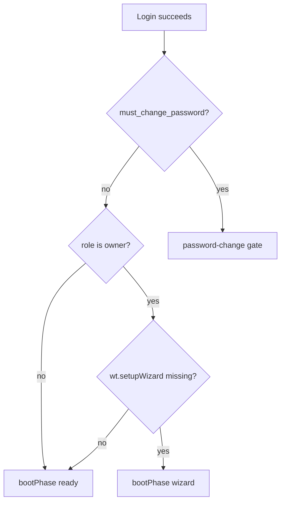
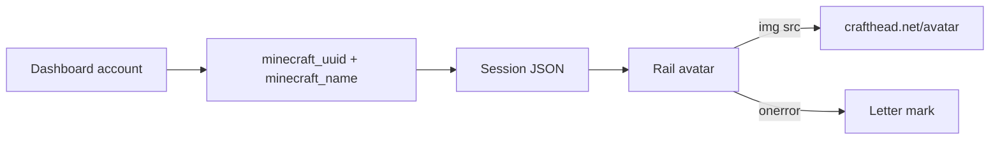

# Owner Wizard Gate + Minecraft Profile Link

> **For agentic workers:** REQUIRED SUB-SKILL: Use superpowers:subagent-driven-development (recommended) or superpowers:executing-plans. Steps use checkbox (`- [ ]`) syntax.
> Save to [`docs/superpowers/plans/2026-07-30-owner-wizard-and-mc-profile-link.md`](docs/superpowers/plans/2026-07-30-owner-wizard-and-mc-profile-link.md) before Task 1.
> Prefer **cursor-grok-4.5-high** for subagents when avoiding premium LLMs.

**Goal:** Stop invited admins/viewers from hitting the full server setup wizard, and let dashboard accounts optionally link a Minecraft player so the rail (and Accounts UI) show that player's skin as the profile picture.

**Architecture:** Wizard boot stays client-side but gains a **role gate**: only `owner` may enter `bootPhase: 'wizard'`. Minecraft link is optional metadata on `DashboardAuthRecord` (`minecraft_uuid`, `minecraft_name`), exposed on session + accounts APIs; skins load from Crafthead (same host as Session tab) via a shared `PlayerAvatar` with fixed dimensions, `decoding="async"`, and letter fallback — no auth change, no Microsoft OAuth.

**Tech Stack:** Zustand session store, DashboardAuthStore / DashboardAuthHttp, React shell + accounts panel, existing `GET /api/players` roster, Crafthead `https://crafthead.net/avatar/{uuid}/{size}`.

## Global Constraints

- Full setup wizard is **owner-only**. Admin/viewer never see it on first browser (password-change gate unchanged).
- No server-side `setup_completed` flag in this plan (YAGNI). Owner on a fresh browser may still see the wizard once; that matches today's localStorage model.
- Minecraft link is **optional metadata**, not login. Username/password/2FA stay the auth boundary.
- Skin CDN: **Crafthead only** (already used in Session). Do not add Crafatar/Minotar/Mojang session fetches from the browser.
- Perf (web-performance): avatar images always have explicit `width`/`height`, `decoding="async"`, `loading="lazy"` outside the rail (rail uses eager tiny 24px), letter mark fallback on error; never block boot on skin fetch; no new JS bundles for skins.
- Copy: plain ops language ("Minecraft player", "Sign out", "Owner"). No marketing fluff.
- Rail mark stays 24×24 (1.5rem); Accounts list may use 32px to match Session.
- Schema: bump **record** fields without bumping file schema 2; unknown fields ignored by older jars is acceptable for additive JSON.
- Who can edit link: **owner** may set/clear any account's link in Accounts; **any signed-in user** may set/clear **their own** link under Settings → Security.
- Fixture preview: fake uuid/name on session when useful; skins still hit Crafthead (network) or fall back to letter if offline.

## Scope note (two subsystems, one plan)

Wizard gate and MC link ship as **sequenced task groups** in one plan so multi-admin UX lands together. They do not share data models; Task 1 can merge alone if needed.





---

### File map

| File | Responsibility |
|------|----------------|
| [`session-store.ts`](web/dashboard/src/app/session-store.ts) | Owner-only wizard gate in `resumeAfterAuth` |
| [`persist.ts`](web/dashboard/src/features/wizard/persist.ts) + tests | Document / helper `shouldEnterSetupWizard(role, wiz)` |
| [`DashboardAuthRecord.java`](watchtower-core/src/main/java/dev/mcstatus/watchtower/core/auth/DashboardAuthRecord.java) | `minecraft_uuid`, `minecraft_name` fields |
| [`DashboardAuthStore.java`](watchtower-core/src/main/java/dev/mcstatus/watchtower/core/auth/DashboardAuthStore.java) | set/clear link, uniqueness |
| [`DashboardAuthHttp.java`](watchtower-neoforge-common/src/main/java/dev/mcstatus/watchtower/DashboardAuthHttp.java) | Session + accounts payloads; update + self endpoints |
| [`player-avatar.tsx`](web/dashboard/src/ui/player-avatar.tsx) (new) | Shared Crafthead avatar + letter fallback |
| [`session/view.tsx`](web/dashboard/src/features/session/view.tsx) | Switch to shared component |
| [`shell.tsx`](web/dashboard/src/app/shell.tsx) / [`shell.css`](web/dashboard/src/app/shell.css) | Rail uses linked skin when UUID present |
| [`accounts-panel.tsx`](web/dashboard/src/features/settings/accounts-panel.tsx) | Owner picker from `/api/players` |
| Settings Security panel | Self link/unlink |
| Wiki + CHANGELOG | Document wizard gate + player link |

---

### Task 1: Owner-only setup wizard gate

**Files:**
- Modify: [`web/dashboard/src/features/wizard/persist.ts`](web/dashboard/src/features/wizard/persist.ts)
- Create or modify: [`web/dashboard/src/features/wizard/persist.test.ts`](web/dashboard/src/features/wizard/persist.test.ts) (create if missing)
- Modify: [`web/dashboard/src/app/session-store.ts`](web/dashboard/src/app/session-store.ts)
- Modify: [`web/dashboard/package.json`](web/dashboard/package.json) — fold test into an existing script if needed
- Modify: [`docs/wiki/Accounts-And-Audit-Log.md`](docs/wiki/Accounts-And-Audit-Log.md) or Security wiki — one sentence: only the owner runs the setup wizard

**Interfaces:**
```ts
export function shouldEnterSetupWizard(
  role: 'owner' | 'admin' | 'viewer',
  wiz: SetupWizardState = readRaw(),
): boolean {
  if (role !== 'owner') return false;
  return shouldShowSetupWizard(wiz);
}
```

- [ ] **Step 1: Failing tests**

```ts
assert.equal(shouldEnterSetupWizard('admin', null), false);
assert.equal(shouldEnterSetupWizard('viewer', null), false);
assert.equal(shouldEnterSetupWizard('owner', null), true);
assert.equal(shouldEnterSetupWizard('owner', { completed: true }), false);
```

- [ ] **Step 2: Implement helper; tests pass**

- [ ] **Step 3: Gate boot** in `resumeAfterAuth` — import `roleFromSession` from permissions:

```ts
const role = roleFromSession(get().session);
if (forceSetup || shouldEnterSetupWizard(role)) {
  set({ bootPhase: 'wizard', gate: 'none' });
  return;
}
```

Keep `?setup=1` working for owners in fixture/dev (`forceSetup` already bypasses fixture skip). For non-owners, `forceSetup` still shows wizard only if you want debug — **lock:** `forceSetup` requires owner too (`forceSetup && role === 'owner' || shouldEnterSetupWizard(role)`), except fixture `?setup=1` with preview owner role.

- [ ] **Step 4: Run** `npm run test:settings` or the script that includes the new test — pass

- [ ] **Step 5: Commit**

```bash
git commit --only -m "fix(wizard): only owners enter the full setup wizard" -- web/dashboard/src/features/wizard/persist.ts web/dashboard/src/features/wizard/persist.test.ts web/dashboard/src/app/session-store.ts web/dashboard/package.json docs/wiki/Accounts-And-Audit-Log.md
```

---

### Task 2: Persist Minecraft link on auth records

**Files:**
- Modify: [`DashboardAuthRecord.java`](watchtower-core/src/main/java/dev/mcstatus/watchtower/core/auth/DashboardAuthRecord.java)
- Modify: [`DashboardAuthStore.java`](watchtower-core/src/main/java/dev/mcstatus/watchtower/core/auth/DashboardAuthStore.java)
- Test: [`DashboardAuthStoreTest.java`](watchtower-core/src/test/java/dev/mcstatus/watchtower/core/auth/DashboardAuthStoreTest.java)

**Interfaces:**
```java
// on DashboardAuthRecord (nullable / empty = unlinked)
public String minecraft_uuid;   // dashed UUID lowercase preferred
public String minecraft_name;   // last known name for display

// on DashboardAuthStore
public void setMinecraftLink(String accountId, String uuid, String name);
public void clearMinecraftLink(String accountId);
```

Rules:
- Normalize UUID to lowercase dashed form; reject invalid UUID strings.
- `minecraft_name` trimmed, max 16 chars (MC name length).
- **Uniqueness:** at most one enabled account per `minecraft_uuid`; setting a UUID already used by another enabled account throws / returns conflict.
- Clearing sets both fields null/empty.

- [ ] **Step 1: Failing store tests** — set link, clear link, reject bad UUID, reject duplicate UUID on second account

- [ ] **Step 2: Implement fields + store methods; tests pass**

- [ ] **Step 3: Commit**

```bash
git commit --only -m "feat(auth): store optional Minecraft player link on accounts" -- watchtower-core/src/main/java/dev/mcstatus/watchtower/core/auth/DashboardAuthRecord.java watchtower-core/src/main/java/dev/mcstatus/watchtower/core/auth/DashboardAuthStore.java watchtower-core/src/test/java/dev/mcstatus/watchtower/core/auth/DashboardAuthStoreTest.java
```

---

### Task 3: HTTP — session fields + link APIs

**Files:**
- Modify: [`DashboardAuthHttp.java`](watchtower-neoforge-common/src/main/java/dev/mcstatus/watchtower/DashboardAuthHttp.java)
- Modify: [`DashboardHttpServer.java`](watchtower-neoforge-common/src/main/java/dev/mcstatus/watchtower/DashboardHttpServer.java) if route registration lives there
- Modify: [`web/dashboard/src/api/client.ts`](web/dashboard/src/api/client.ts)
- Modify fixture: [`web/dashboard/scripts/vite-fixture-api.ts`](web/dashboard/scripts/vite-fixture-api.ts)
- Test: existing auth HTTP tests if present; else store-level coverage already done — add a focused Java test if there is an AuthHttp test class

**Produces:**
- Session JSON adds `minecraft_uuid`, `minecraft_name` (omit or null when unset).
- Account list rows include the same two fields.
- `POST /api/accounts/update` body may include `minecraft_uuid` + `minecraft_name` (owner only; empty string clears).
- `POST /api/accounts/me/minecraft` body `{ uuid, name }` or `{ clear: true }` — any authenticated non-must-change user for **self** only.

Wire client:
```ts
linkMyMinecraft: (body: { uuid: string; name: string } | { clear: true }) =>
  apiFetch('/api/accounts/me/minecraft', { method: 'POST', body: JSON.stringify(body) }),
```

Audit log: append `account_minecraft_link` / `account_minecraft_unlink` with actor + target account id (match existing audit style).

- [ ] **Step 1: Implement HTTP + fixture stubs**

- [ ] **Step 2: Smoke** — session returns fields after store set (unit or manual fixture)

- [ ] **Step 3: Commit**

```bash
git commit --only -m "feat(api): expose Minecraft link on session and account endpoints" -- watchtower-neoforge-common/src/main/java/dev/mcstatus/watchtower/DashboardAuthHttp.java watchtower-neoforge-common/src/main/java/dev/mcstatus/watchtower/DashboardHttpServer.java web/dashboard/src/api/client.ts web/dashboard/scripts/vite-fixture-api.ts
```

---

### Task 4: Shared `PlayerAvatar` + rail skin

**Files:**
- Create: [`web/dashboard/src/ui/player-avatar.tsx`](web/dashboard/src/ui/player-avatar.tsx)
- Modify: [`web/dashboard/src/features/session/view.tsx`](web/dashboard/src/features/session/view.tsx) — replace local `PlayerAvatar`
- Modify: [`web/dashboard/src/app/shell.tsx`](web/dashboard/src/app/shell.tsx), [`shell.css`](web/dashboard/src/app/shell.css)
- Test: small unit test for URL helper if extracted, e.g. `craftheadAvatarUrl(uuid, size)`

**Interfaces:**
```tsx
export function craftheadAvatarUrl(uuid: string, size: number): string {
  return `https://crafthead.net/avatar/${uuid}/${size}`;
}

export function PlayerAvatar(props: {
  uuid?: string | null;
  name: string;           // used for alt + letter fallback
  size?: 24 | 32;         // default 32
  className?: string;
  eager?: boolean;        // rail: true → loading omit/eager; else lazy
}): JSX.Element
```

Behavior: if no uuid → letter mark (first char of name). If uuid → ``. Square `border-radius: 2px` to match `.sh-rail__account-mark`.

Rail: read `session.minecraft_uuid` / `minecraft_name`; pass `size={24}` `eager`. Keep username line as dashboard username (not MC name); MC name can be `title` tooltip on the mark if present.

- [ ] **Step 1: Extract component; Session still renders skins**

- [ ] **Step 2: Wire rail**

- [ ] **Step 3: Commit**

```bash
git commit --only -m "feat(shell): show Minecraft skin on the rail when linked" -- web/dashboard/src/ui/player-avatar.tsx web/dashboard/src/features/session/view.tsx web/dashboard/src/app/shell.tsx web/dashboard/src/app/shell.css
```

---

### Task 5: Accounts picker + Security self-link UI

**Files:**
- Modify: [`accounts-panel.tsx`](web/dashboard/src/features/settings/accounts-panel.tsx)
- Modify: Settings Security section in [`settings/view.tsx`](web/dashboard/src/features/settings/view.tsx) (or dedicated panel if one exists)
- Use `api.players()` / existing client for `GET /api/players` — confirm method name in `client.ts` (`players` / `playerDirectory`)

UI (Accounts, owner):
- Per row: `PlayerAvatar` + optional "Link player" control.
- Picker: searchable list from `player_directory.players` (name + online badge); on select POST update with uuid+name.
- "Clear link" when linked.

UI (Security, self):
- Same picker/clear calling `linkMyMinecraft`.
- Short help: "Optional. Shows your skin on the side rail. Does not change how you sign in."

- [ ] **Step 1: Wire Accounts owner link/clear**

- [ ] **Step 2: Wire Security self link/clear**

- [ ] **Step 3: Fixture preview check** — strip + accounts show avatar when fixture session has uuid

- [ ] **Step 4: Commit**

```bash
git commit --only -m "feat(settings): link Minecraft players for account skins" -- web/dashboard/src/features/settings/accounts-panel.tsx web/dashboard/src/features/settings/view.tsx
```

---

### Task 6: Docs + changelog

**Files:**
- Modify: [`docs/wiki/Accounts-And-Audit-Log.md`](docs/wiki/Accounts-And-Audit-Log.md)
- Modify: [`docs/wiki/HTTP-API.md`](docs/wiki/HTTP-API.md) — new fields/endpoints
- Modify: [`CHANGELOG.md`](CHANGELOG.md) Unreleased

Copy (humanizer light):
- "Only the **owner** runs the full setup wizard. Other accounts sign in, change their temporary password, and go straight to the dashboard."
- "You can link a Minecraft player to a dashboard account. The side rail then shows that player's skin. Linking is optional and does not replace the dashboard password."

- [ ] **Step 1: Edit docs**

- [ ] **Step 2: Commit**

```bash
git commit --only -m "docs: owner wizard gate and Minecraft profile link" -- docs/wiki/Accounts-And-Audit-Log.md docs/wiki/HTTP-API.md CHANGELOG.md
```

---

## Self-review

- Invited admin on fresh browser → no full wizard (Task 1).
- Password-change for new accounts unchanged.
- Skin via Crafthead with dimensions + async + fallback (Tasks 4–5); no new CDN.
- Link optional; uniqueness enforced; self + owner edit paths (Tasks 2–3, 5).
- No Microsoft OAuth / no wizard server flag (explicitly deferred).
