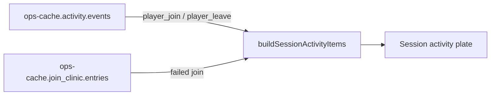

# Session activity logger Implementation Plan

> **For agentic workers:** REQUIRED SUB-SKILL: Use superpowers:subagent-driven-development (recommended) or superpowers:executing-plans to implement this plan task-by-task. Steps use checkbox (`- [ ]`) syntax for tracking.
>
> After approval, copy this plan to [`docs/superpowers/plans/2026-07-30-session-activity-logger.md`](docs/superpowers/plans/2026-07-30-session-activity-logger.md).

**Goal:** On Session, one activity plate shows player joins, leaves, and failed (pack-sync) joins with Copy fix on failures — replacing both the full-width Join clinic and the Recent sessions column.

**Architecture:** Frontend-only merge. Read `ops-cache.activity.events` (`player_join` / `player_leave`) and `ops-cache.join_clinic.entries`, normalize into one chronological list, render in the right `ss-split` column. Backend join clinic + Issues `JOIN_SYNC` stay as they are. No new log parsers (joins/leaves already come from `OpsLogTailScanner` + `LogPatterns`).

**Tech Stack:** React + TypeScript in `web/dashboard` (`tsx --test`), existing Session CSS tokens; no new dependencies; no Java changes required.

## Global Constraints

- Placement: right column of `ss-split` (where Recent sessions is today); remove full-width [`JoinClinicPlate`](web/dashboard/src/features/session/join-clinic.tsx) under Who's here
- Data: merge existing sources only — do not re-parse logs
- Failed-join rows keep named mod chips + player-safe **Copy fix** (reuse [`join-clinic-helpers.ts`](web/dashboard/src/features/session/join-clinic-helpers.ts))
- Plate title: **Session activity** (not “Join clinic”)
- Hide empty noise: if there are zero join/leave/failed events, show a short EmptyState (do not keep a second empty Join clinic)
- Match Session plate language (`ss-plate`, `ss-session-row`-like density, ghost buttons)
- Plain UI copy (no “Discord-safe” / marketing tone)
- Issues deep link stays on `tab: session`; update label to match the new plate
- Do not edit older join-clinic plan files; update wiki/CHANGELOG for the UX rename



## File map

| File | Responsibility |
|------|----------------|
| Create: `web/dashboard/src/features/session/session-activity-helpers.ts` | Parse + merge + sort activity items |
| Create: `web/dashboard/src/features/session/session-activity.test.ts` | Unit tests for merge/sort/kinds |
| Create: `web/dashboard/src/features/session/session-activity.tsx` | Plate UI (list + failed-join expand/Copy fix) |
| Modify: [`view.tsx`](web/dashboard/src/features/session/view.tsx) | Wire plate into right column; remove JoinClinicPlate + Recent sessions |
| Modify: [`session.css`](web/dashboard/src/features/session/session.css) | Styles for activity rows / failed expand |
| Modify: [`issues/helpers.ts`](web/dashboard/src/features/issues/helpers.ts) | Deep-link label |
| Retire or slim: `join-clinic.tsx` | Logic moves into session-activity; keep helpers for parse/fix copy |
| Docs: wiki Join-Clinic / Dashboard-Tabs / Changelog + root CHANGELOG |

---

### Task 1: Merge helpers + tests

**Files:**
- Create: `web/dashboard/src/features/session/session-activity-helpers.ts`
- Create: `web/dashboard/src/features/session/session-activity.test.ts`
- Keep: [`join-clinic-helpers.ts`](web/dashboard/src/features/session/join-clinic-helpers.ts) (parseJoinClinicEntries, kindLabel, formatDiffLines)

**Interfaces:**
- Consumes: `ops-cache` record; `parseJoinClinicEntries(ops)`
- Produces:

```ts
export type SessionActivityKind = 'join' | 'leave' | 'failed';

export type SessionActivityItem = {
  id: string;
  kind: SessionActivityKind;
  player: string;
  time: string | null;
  /** failed only */
  clinic?: JoinClinicEntry;
};

export function buildSessionActivityItems(ops: Record<string, unknown>): SessionActivityItem[];
```

- [ ] **Step 1: Write failing tests**

```ts
import assert from 'node:assert/strict';
import { describe, it } from 'node:test';
import { buildSessionActivityItems } from './session-activity-helpers';

describe('buildSessionActivityItems', () => {
  it('merges joins, leaves, and failed joins newest-first', () => {
    const items = buildSessionActivityItems({
      activity: {
        events: [
          { time: '2026-07-30T10:00:00Z', type: 'player_join', detail: 'Steve' },
          { time: '2026-07-30T10:05:00Z', type: 'player_leave', detail: 'Steve' },
          { time: '2026-07-30T09:00:00Z', type: 'lag_incident', detail: 'ignored' },
        ],
      },
      join_clinic: {
        entries: [
          {
            key: 'missing_mod|Alex|create',
            kind: 'missing_mod',
            player: 'Alex',
            time: '2026-07-30T10:03:00Z',
            missing: [{ mod_id: 'create', display_name: 'Create', server_version: '6.0.4' }],
            fix_copy: 'Hey Alex…',
          },
        ],
      },
    });
    assert.equal(items.length, 3);
    assert.deepEqual(
      items.map((i) => i.kind),
      ['leave', 'failed', 'join'],
    );
    assert.equal(items[1].player, 'Alex');
    assert.ok(items[1].clinic?.fixCopy);
  });

  it('returns empty when neither source has rows', () => {
    assert.equal(buildSessionActivityItems({}).length, 0);
  });
});
```

- [ ] **Step 2: Run tests — expect FAIL**

Run: `cd web/dashboard && npm run test:session` (extend script to include `session-activity.test.ts`, or run `tsx --test src/features/session/*.test.ts`)

Expected: FAIL — module missing

- [ ] **Step 3: Implement helpers**

- Map activity events where `type === 'player_join'|'player_leave'` → kind join/leave; `player` from `detail` or `player`
- Map `parseJoinClinicEntries(ops)` → kind `failed`, attach `clinic`
- Sort by `time` descending (nulls last); stable id: `join|Steve|time` / clinic `key`

- [ ] **Step 4: Run tests — expect PASS**

- [ ] **Step 5: Commit** (only if user asks)

---

### Task 2: Session activity plate UI

**Files:**
- Create: `web/dashboard/src/features/session/session-activity.tsx`
- Modify: [`session.css`](web/dashboard/src/features/session/session.css)
- Modify: [`view.tsx`](web/dashboard/src/features/session/view.tsx) (import + placement)

**Interfaces:**
- Consumes: `buildSessionActivityItems`, `JoinClinicEntry` chips/Copy fix patterns from current join-clinic UI
- Produces: `<SessionActivityPlate ops={…} />`

Layout (right column):

```
Session activity
Joins, leaves, and pack-sync rejects from the live log.
[All] [Joined] [Left] [Failed]     ← ss-pills; default All
────────────────────────────────
Steve · Joined · 2m ago
Alex · Couldn't join · Missing mods · 5m ago   [expand]
  └ Missing on client: Create…     [Copy fix]
Steve · Left · 1m ago
```

- [ ] **Step 1: Implement plate**
  - Cap list (reuse `useCappedList` / show more like Recent sessions, default ~12)
  - Failed rows: click expands inline mod chips + **Copy fix** (ghost Button); auto-expand newest failed when filter is Failed or on Issues deep-link later
  - Join/leave rows: compact `ss-session-row`-style (name, kind pill or muted verb, relative time)
  - EmptyState: “No join activity yet” / hint that Watching + log scan fill this

- [ ] **Step 2: Wire into view.tsx**
  - Remove `<JoinClinicPlate … />` under hero
  - Replace Recent sessions `<Plate>` in right `ss-split__col` with `<SessionActivityPlate ops={asRecord(opsQ.data)} />`
  - Drop unused `windowStats.sessions` / `visibleSessions` / `SESSION_CAP` / Clock-only recent-sessions path if nothing else needs them (keep peak/hours from window_stats for hero)

- [ ] **Step 3: CSS**
  - Reuse session row density; warn tone only on failed rows / pills
  - Delete obsolete `.ss-join-clinic*` / chip board rules that no longer apply (or repurpose under `.ss-activity-*`)

- [ ] **Step 4: Manual check**
  - Fixture preview `:8081/?tab=session` — directory left, activity right; failed row expands + Copy fix
  - Confirm no full-width clinic under Who’s here

- [ ] **Step 5: Commit** (only if user asks)

---

### Task 3: Issues deep link + retire Join clinic plate

**Files:**
- Modify: [`issues/helpers.ts`](web/dashboard/src/features/issues/helpers.ts) (~230)
- Modify: [`issues/helpers.test.ts`](web/dashboard/src/features/issues/helpers.test.ts)
- Delete or stub: [`join-clinic.tsx`](web/dashboard/src/features/session/join-clinic.tsx) (after Task 2 has no imports)
- Keep helpers + `join-clinic.test.ts` (still used by merge)

- [ ] **Step 1: Change action label**

```ts
primaryAction = { label: 'Open Session activity', tab: 'session' };
```

- [ ] **Step 2: Update helpers test assert on label**
- [ ] **Step 3: Remove dead `join-clinic.tsx` if unused**
- [ ] **Step 4: Run `npm run test:issues` and `tsx --test src/features/session/*.test.ts`

---

### Task 4: Mock data + docs

**Files:**
- Ensure [`web/dashboard/data/ops-cache.json`](web/dashboard/data/ops-cache.json) has both `activity.events` (join/leave) and `join_clinic.entries` so the plate demos well
- Update: [`docs/wiki/Join-Clinic.md`](docs/wiki/Join-Clinic.md) (Session activity plate location + Copy fix still on failed rows)
- Update: [`docs/wiki/Dashboard-Tabs.md`](docs/wiki/Dashboard-Tabs.md) Session section
- Update: [`CHANGELOG.md`](CHANGELOG.md) + [`docs/wiki/Changelog.md`](docs/wiki/Changelog.md)
- Soft-rename in copy: “Join clinic” feature name can remain in wiki title (backend/Issue id unchanged); UI says Session activity

- [ ] **Step 1: Patch mock ops-cache if join/leave sparse**
- [ ] **Step 2: Docs + changelog Unreleased note** (combined plate; data sources unchanged)
- [ ] **Step 3: Preview Session + Issues → Open Session activity**

---

## Spec coverage

| Requirement | Task |
|-------------|------|
| Combine Join clinic + Recent sessions | 2 |
| Show joins | 1–2 (`player_join`) |
| Show leaves | 1–2 (`player_leave`) |
| Show failed joins + Copy fix | 1–2 (`join_clinic`) |
| Fits Session page (right column) | 2 |
| No new log parsing | Architecture |
| Issues deep link | 3 |
| Docs/changelog | 4 |

## Out of scope

- Replacing the global Activity tab
- Pairing join→leave into duration rows (old Recent sessions minutes) — event feed only
- New backend `session_activity` ops-cache block
- Changing `JOIN_SYNC` issue ids or analyzer behavior
