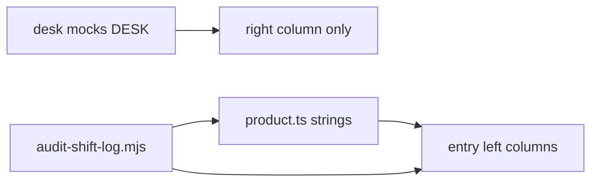

# Feature-first marketing copy Implementation Plan

> **For agentic workers:** REQUIRED SUB-SKILL: Use superpowers:subagent-driven-development (recommended) or superpowers:executing-plans to implement this plan task-by-task. Steps use checkbox (`- [ ]`) syntax for tracking.

**Goal:** Make the WatchTower marketing Shift Log feature-focused and readable for under-18 dedicated-server owners: left columns teach features; mock desks keep the sample numbers.

**Architecture:** Content stays centralized in [`web/marketing/content/product.ts`](web/marketing/content/product.ts). Entry components only render `capability` + `brings` + margin note (no `proof`, no `DESK.*` narrative on the left). Extend [`web/marketing/scripts/audit-shift-log.mjs`](web/marketing/scripts/audit-shift-log.mjs) so those rules fail loudly. Copy was drafted with `/human-writing` + `/anti-ai-writing-humanizer` (house rules: no em/en dashes, no banned vocab, short uneven sentences, contractions OK).

**Tech Stack:** Next.js marketing app (`web/marketing`), TypeScript content modules, Node audit script.

**Spec:** [`docs/superpowers/specs/2026-07-31-marketing-feature-first-copy-design.md`](docs/superpowers/specs/2026-07-31-marketing-feature-first-copy-design.md)

**Plan file to write on kickoff:** `docs/superpowers/plans/2026-07-31-marketing-feature-first-copy.md` (copy this plan body there before coding; do not edit the spec).

## Global Constraints

- Display spelling: **WatchTower**
- Product truth only (PRODUCT.md / wiki / ROADMAP). No invented features. No Fabric shipping claims.
- Loader-agnostic: "dedicated host" / "Minecraft dedicated servers"
- Left column = features. Right desk = fixtures. Never narrate Grade/MSPT/sticky-lag stories on the left.
- Hyphens only in user-facing strings (ASCII `-`). No `—` or `–`.
- No AI filler (no "delve/showcase/landscape/pivotal/vital" as adjective, no "not just X but Y", no rule-of-three padding).
- Do not change mock desk layouts or baked numbers in [`web/marketing/content/baked/desk.ts`](web/marketing/content/baked/desk.ts).
- Out of scope: `features.ts` / `faq.ts` full rewrite (unless a string breaks the build).

## File structure map

| File | Responsibility |
|------|----------------|
| `web/marketing/content/product.ts` | All Shift Log marketing strings (Welcome, TOUR, promises, close, footer) |
| `web/marketing/content/night.ts` | Entry meta + allowed `sources` (update cites away from left-column DESK proof) |
| `web/marketing/components/entries/{live,issues,crashes,overview,insights}.tsx` | Stop rendering proof / DESK narrative / orphan Live vs Insights blurb |
| `web/marketing/components/entries/close-entry.tsx` | Consume `CLOSE_HEADLINE` / `CLOSE_BODY` from product.ts |
| `web/marketing/components/sections/close.tsx` | Same close strings (archive section parity) |
| `web/marketing/components/site-footer.tsx` | Consume `FOOTER_BLURB` |
| `web/marketing/app/layout.tsx` | Metadata description + HTML thesis comment voice |
| `web/marketing/scripts/audit-shift-log.mjs` | Regression gates for proof / DESK left narratives / dash rules |



---

### Task 1: Audit gates (fail first)

**Files:**
- Modify: [`web/marketing/scripts/audit-shift-log.mjs`](web/marketing/scripts/audit-shift-log.mjs)

**Interfaces:**
- Produces: new fail conditions (no `proof:` under `TOUR` in `content/product.ts`; entry files must not contain the banned left-column patterns below)

- [ ] **Step 1: Append these checks** after the existing railLabel checks (before the final `if (fail.length)`):

```js
// Feature-first left columns: no TOUR.proof, no DESK fixture stories in entries
const productPath = join(ROOT, 'content/product.ts');
const productText = readFileSync(productPath, 'utf8');
if (/\bproof\s*:/.test(productText)) {
  fail.push('content/product.ts: TOUR.proof (or other proof:) still present - feature-first copy forbids left-column proofs');
}

const entryBans = [
  ['components/entries/live.tsx', /\.proof\b|Long busy-hour patterns sit on Insights/],
  ['components/entries/issues.tsx', /\.proof\b/],
  ['components/entries/crashes.tsx', /\.proof\b/],
  ['components/entries/overview.tsx', /DESK\.overview\.letter|Restart verdict:/],
  ['components/entries/insights.tsx', /stickyLag/],
];
for (const [relPath, re] of entryBans) {
  const text = readFileSync(join(ROOT, relPath), 'utf8');
  if (re.test(text)) fail.push(`${relPath}: left-column fixture / proof narrative still present`);
}
```

- [ ] **Step 2: Run audit (expect FAIL)**

```bash
cd web/marketing
node scripts/audit-shift-log.mjs
```

Expected: FAIL listing product `proof:` and entry narrative hits.

- [ ] **Step 3: Commit**

```bash
git add web/marketing/scripts/audit-shift-log.mjs docs/superpowers/plans/2026-07-31-marketing-feature-first-copy.md
git commit -m "test: audit gates for feature-first marketing left columns"
```

---

### Task 2: Strip left-column fixture narratives from entries

**Files:**
- Modify: [`web/marketing/components/entries/live.tsx`](web/marketing/components/entries/live.tsx)
- Modify: [`web/marketing/components/entries/issues.tsx`](web/marketing/components/entries/issues.tsx)
- Modify: [`web/marketing/components/entries/crashes.tsx`](web/marketing/components/entries/crashes.tsx)
- Modify: [`web/marketing/components/entries/overview.tsx`](web/marketing/components/entries/overview.tsx)
- Modify: [`web/marketing/components/entries/insights.tsx`](web/marketing/components/entries/insights.tsx)

**Interfaces:**
- Consumes: `TOUR.*.capability`, `TOUR.*.brings`, `TOUR.*.note` only
- Produces: left columns with no proof paragraph and no DESK story text

- [ ] **Step 1: Live** - delete the `{TOUR.live.proof}` `<p>` and the orphan paragraph starting `Long busy-hour patterns sit on Insights...`. Keep h2, capability, `TourBrings`, margin note, right desk.

- [ ] **Step 2: Issues + Crashes** - delete the `{TOUR.*.proof}` `<p>` blocks only.

- [ ] **Step 3: Overview** - delete the Grade paragraph and the Restart verdict callout. Remove unused `DESK` import if nothing else uses it (HeroReadout / ProductDesk still use DESK internally; OverviewEntry may drop `DESK` import entirely).

Target left column:

```tsx
<h2 className="wt-entry text-[color:var(--wt-text)]">Overview</h2>
<p className="mt-4 max-w-[48ch] text-[1.0625rem] leading-relaxed text-[color:var(--wt-text-mid)]">
  {TOUR.overview.capability}
</p>
<TourBrings items={TOUR.overview.brings} />
<MarginNote className="mt-5">{TOUR.overview.note}</MarginNote>
```

- [ ] **Step 4: Insights** - delete the `{DESK.insights.stickyLag}` `<p>`. Drop `DESK` import if unused.

- [ ] **Step 5: Commit** (audit still fails on product.ts `proof:`)

```bash
git add web/marketing/components/entries/live.tsx web/marketing/components/entries/issues.tsx web/marketing/components/entries/crashes.tsx web/marketing/components/entries/overview.tsx web/marketing/components/entries/insights.tsx
git commit -m "fix: drop fixture stories from Shift Log left columns"
```

---

### Task 3: Rewrite Welcome + shared strings (locked copy)

**Files:**
- Modify: [`web/marketing/content/product.ts`](web/marketing/content/product.ts) (Welcome + shared only in this task; leave TOUR/PROMISES structure for Task 4–5 if splitting mid-file is awkward - preferred: replace the listed constants now, TOUR in Task 4)

**Locked strings (humanizer-passed - paste exactly):**

```ts
export const TAGLINE = 'The ops desk for your Minecraft server.';

export const SUPPORT_LINE =
  'It watches the server while it runs, then tells you what to fix. Everything stays on the machine you already use.';

export const HERO_OVERVIEW =
  'It watches the server while it runs, then tells you what to fix. Everything stays on the machine you already use.';

export const HERO_CONTEXT =
  'Local-first · dedicated host · no cloud required';

export const TWO_QUESTIONS = [
  {
    q: 'Is the server okay right now?',
    detail:
      'A health grade, live vitals, and restart advice. WatchTower never restarts anything for you.',
  },
  {
    q: 'What should I fix next?',
    detail:
      'Issues, crashes, mods, backups, and world pressure. Each one has a plain next step.',
  },
] as const;

export const FOOTNOTE =
  'Free forever on your machine. GPL-3.0-or-later. Runs where the server runs.';

export const FOOTER_BLURB =
  'A local ops desk for Minecraft dedicated servers. It runs on the machine your server already runs on.';

export const CLOSE_HEADLINE = 'Try the demo, then get it on Modrinth.';

export const CLOSE_BODY =
  'The demo is the real dashboard on sample data. Click around before you install.';
```

- [ ] **Step 1: Apply the constants above** in `product.ts` (add `FOOTER_BLURB`, `CLOSE_HEADLINE`, `CLOSE_BODY`).

- [ ] **Step 2: Wire consumers**
  - [`close-entry.tsx`](web/marketing/components/entries/close-entry.tsx): import and use `CLOSE_HEADLINE` / `CLOSE_BODY` instead of hardcoded strings.
  - [`sections/close.tsx`](web/marketing/components/sections/close.tsx): same.
  - [`site-footer.tsx`](web/marketing/components/site-footer.tsx): replace hardcoded blurb with `{FOOTER_BLURB}`.
  - [`layout.tsx`](web/marketing/app/layout.tsx): set `description` to `` `${TAGLINE} ${HERO_OVERVIEW}` `` or the two sentences joined; update the HTML thesis comment to say left columns teach features and desk mocks hold fixtures (no "proof under each" wording).

- [ ] **Step 3: Commit**

```bash
git add web/marketing/content/product.ts web/marketing/components/entries/close-entry.tsx web/marketing/components/sections/close.tsx web/marketing/components/site-footer.tsx web/marketing/app/layout.tsx
git commit -m "copy: teen-readable Welcome, close, and footer strings"
```

---

### Task 4: Rewrite TOUR (delete `proof`, locked capability + brings)

**Files:**
- Modify: [`web/marketing/content/product.ts`](web/marketing/content/product.ts) `TOUR` object

**Interfaces:**
- Produces: `TOUR` shape `{ capability, note, brings: {title, detail}[] }` with **no** `proof` field

- [ ] **Step 1: Replace entire `TOUR` with:**

```ts
export const TOUR = {
  live: {
    capability:
      'See how healthy the server is right now - ticks, lag, memory, players, and the host PC - without digging through log files.',
    note: 'desk · Live',
    /** Source: docs/wiki/Live-Charts.md */
    brings: [
      {
        title: 'Game vitals',
        detail:
          'TPS (ticks per second), tick lag (MSPT), memory, and player count, colour-coded so problems stand out.',
      },
      {
        title: 'Host and storage',
        detail:
          'CPU, disk, and Java heap shown separately when free RAM on the host is messy.',
      },
      {
        title: 'Network, thermal, world jobs',
        detail:
          'Bandwidth, thermals, and background world work when those signals are available.',
      },
      {
        title: 'Windows you pick',
        detail:
          'History from 5 minutes to 30 days. Hover or drag for the exact time and value.',
      },
    ],
  },
  issues: {
    capability:
      'Your fix list: live finds, scan results, boot problems, and crash pointers in one place.',
    note: 'desk · Issues',
    /** Source: docs/wiki/Issues.md */
    brings: [
      {
        title: 'Active / Reviewed',
        detail:
          'Work the open list, then mark reviewed. That clears inbox state - it does not delete crash files or jars.',
      },
      {
        title: 'Severity bands',
        detail:
          'Critical, Warning, Info. Jar drift, world pressure, join clinic, and silent script fails land there by severity.',
      },
      {
        title: 'Fix and Details',
        detail:
          'Fix is the next step. Details holds the evidence. Links jump into Crashes, Mods, Live, or Sources.',
      },
      {
        title: 'Tools',
        detail:
          'Filters and inbox utilities. Boot filters help when Startup flagged config or launch problems.',
      },
    ],
  },
  crashes: {
    capability:
      'Crashes grouped by fingerprint, with Fix, Evidence, and Details side by side.',
    note: 'desk · Crashes',
    /** Source: docs/wiki/Crashes.md + PRODUCT.md advisory */
    brings: [
      {
        title: 'Fingerprint groups',
        detail:
          'Same crash shape stacks together so you are not re-reading every identical report.',
      },
      {
        title: 'Fix / Evidence / Details',
        detail:
          'Next steps first, then stacks and linked files, then fingerprint metadata when you need it.',
      },
      {
        title: 'Odd shutdowns',
        detail:
          'External kill and OOM cases still show up when latest.log just stops and there is no crash dump.',
      },
      {
        title: 'Reviewed stays on disk',
        detail:
          'Mark reviewed clears the Review queue. Files stay under crash-reports/ until you remove them.',
      },
    ],
  },
  overview: {
    capability:
      'Your home screen after login: a health grade, a short list of what needs attention, and links into the rest of the desk.',
    note: 'desk · Overview',
    /** Source: docs/wiki/Dashboard-Overview.md */
    brings: [
      {
        title: 'Health grade',
        detail:
          'A snapshot from WatchTower signals. Strong means keep the daily check short. Poor means treat it like an incident.',
      },
      {
        title: 'Needs attention',
        detail:
          'A queue of the next things to open - Issues, crashes, backups, and similar.',
      },
      {
        title: 'Restart advice',
        detail:
          'Safe, Caution, or Wait. Informational only. WatchTower never restarts the server for you.',
      },
      {
        title: 'Jump cards',
        detail:
          'Performance insight, weekly digest, storage, Spark, and boot profile when those signals exist.',
      },
    ],
  },
  insights: {
    capability:
      'Patterns over days and weeks, not the live second. Busy hours, world pressure, storage, and a weekly digest.',
    note: 'desk · Insights',
    /** Source: docs/wiki/Insights.md */
    brings: [
      {
        title: 'Schedule',
        detail:
          'Busy hours and quieter windows so restart advice has a clock behind it. Suggests a window; your panel still runs the restart.',
      },
      {
        title: 'World pressure',
        detail:
          'Live now vs busy-hours p95 and the peak minute in the 7d / 30d window.',
      },
      {
        title: 'Storage and digest',
        detail:
          'Disk trends on Storage. Weekly ops digest from data already on the host - no outbound mail.',
      },
      {
        title: 'Vs Live',
        detail:
          'Live answers what is happening now. Insights answers what keeps repeating.',
      },
    ],
  },
} as const;
```

- [ ] **Step 2: Grep** for `TOUR.*.proof` / `.proof` in marketing source (exclude `.next`); expect zero hits.

- [ ] **Step 3: Commit**

```bash
git add web/marketing/content/product.ts
git commit -m "copy: feature-first TOUR capabilities and brings"
```

---

### Task 5: Standing orders rewrite + night sources

**Files:**
- Modify: [`web/marketing/content/product.ts`](web/marketing/content/product.ts) `PROMISES` / `NOT_OUR_JOB`
- Modify: [`web/marketing/content/night.ts`](web/marketing/content/night.ts)

**Locked promises:**

```ts
export const PROMISES = [
  {
    title: 'Your data stays yours',
    body: "Your files stay on your server. We don't upload logs by default. Anonymous diagnostics and Cloud sync are opt-in.",
  },
  {
    title: "You're in control",
    body: 'Network features are opt-in. Risky actions show a preview and an undo. Nothing quietly edits your mods or world.',
  },
  {
    title: 'Ops, not surveillance',
    body: "It helps you run the server. It doesn't track players like an analytics product.",
  },
  {
    title: 'Drop-in beside your host',
    body: "A jar in mods/. Not a second control panel you have to keep running.",
  },
] as const;
```

Keep `NOT_OUR_JOB` rows; only tighten if needed (current rows are already plain). Orders intro in [`orders.tsx`](web/marketing/components/entries/orders.tsx) stays: `What we promise, and what we do not do.`

**night.ts sources** (DESK cites remain only where the right desk still reads fixtures):

```ts
// welcome
sources: ['TAGLINE', 'HERO_OVERVIEW', 'HERO_CONTEXT', 'PRODUCT.md'],
// live
sources: ['TOUR.live', 'DESK.live.vitals'],
// issues
sources: ['TOUR.issues', 'DESK.issues.bands'],
// crashes
sources: ['TOUR.crashes', 'DESK.crashes'],
// overview
sources: ['TOUR.overview', 'DESK.overview'],
// insights
sources: ['TOUR.insights', 'DESK.insights.*', 'DESK.backups.rows'],
// orders / close unchanged structurally; close may add CLOSE_HEADLINE
sources: ['FOOTNOTE', 'CLOSE_HEADLINE', 'CLOSE_BODY', 'DEMO_URL', 'LINKS.modrinth'],
```

Update file header comment: left column teaches features; fixtures stay on desk mocks. Remove "Night facts live in body proof only."

- [ ] **Step 1: Apply PROMISES + night.ts updates**

- [ ] **Step 2: Run audit (expect PASS)**

```bash
cd web/marketing
node scripts/audit-shift-log.mjs
```

- [ ] **Step 3: Manual skim** at `npm run dev` (or preview): Welcome → Live → Issues → Crashes → Overview → Insights → Orders → Close. Confirm no Grade/stickyLag/MSPT spike stories on the left; desks still show sample UI.

- [ ] **Step 4: Humanizer self-check on `content/product.ts`**
  - Zero `—` / `–`
  - No banned house-rule verbs/adjectives
  - Teen test: can you explain each beat from capability + brings alone?

- [ ] **Step 5: Commit**

```bash
git add web/marketing/content/product.ts web/marketing/content/night.ts
git commit -m "copy: standing orders voice and night source cites"
```

---

## Self-review (plan vs spec)

| Spec requirement | Task |
|------------------|------|
| Remove left fixture narratives | Task 2 |
| Rewrite TOUR capability + brings; drop proof | Task 4 |
| Welcome / PROMISES / close / footer / TWO_QUESTIONS | Tasks 3, 5 |
| Humanizer + no em dashes | Locked strings + Task 5 check |
| `audit-shift-log.mjs` | Tasks 1 + 5 |
| Mock desks unchanged | Explicit non-goal; no `desk.ts` edits |
| night.ts sources | Task 5 |

No placeholders. No Fabric claims. No desk layout changes.

---

## Execution handoff

After this plan is confirmed and saved to `docs/superpowers/plans/2026-07-31-marketing-feature-first-copy.md`:

**1. Subagent-Driven (recommended)** - fresh subagent per task, review between tasks

**2. Inline Execution** - execute in this session with executing-plans checkpoints

Which approach?
