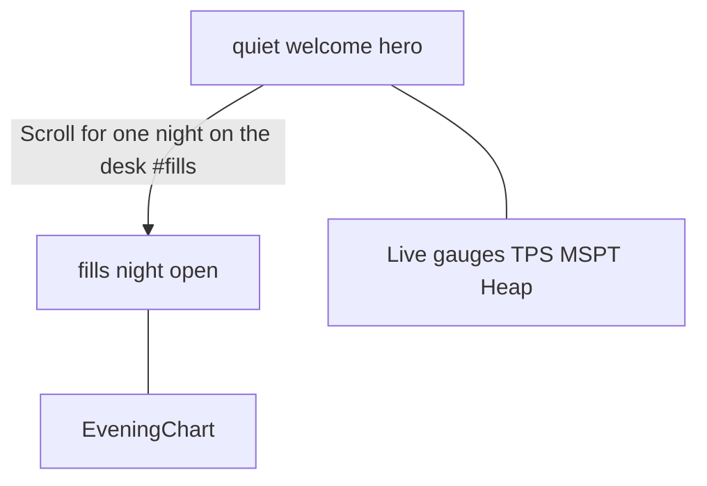

# Brand-First Hero Welcome Implementation Plan

> **For agentic workers:** REQUIRED SUB-SKILL: Use `subagent-driven-development` (recommended) or `executing-plans` to implement task-by-task. Steps use checkbox (`- [ ]`) syntax for tracking.

**Goal:** Rewrite the Shift Log first viewport so newcomers know what WatchTower is, keep live gauges as proof, and move “Most nights, nothing happens.” to open the night story at `#fills`.

**Architecture:** Copy-only reshape of [`quiet.tsx`](web/marketing/components/entries/quiet.tsx) and the top of [`fills.tsx`](web/marketing/components/entries/fills.tsx). Add small string constants in [`product.ts`](web/marketing/content/product.ts). No new entries, no new motion moment, no gauge redesign. Persist this plan to [`docs/superpowers/plans/2026-07-31-marketing-hero-welcome.md`](docs/superpowers/plans/2026-07-31-marketing-hero-welcome.md) as Task 0.

**Tech Stack:** Next.js 15, React 19, Tailwind v4, `motion/react` (existing pulse/jitter only), Geist + JetBrains Mono, existing `Cta` / `MarginNote` / `DeskDial`.

**Spec of truth:** [`docs/superpowers/specs/2026-07-31-marketing-hero-welcome-design.md`](docs/superpowers/specs/2026-07-31-marketing-hero-welcome-design.md)  
**Parent:** [`docs/superpowers/specs/2026-07-31-marketing-shift-log-design.md`](docs/superpowers/specs/2026-07-31-marketing-shift-log-design.md)

## Global Constraints

- Spelling: **WatchTower**
- Zero em-dash / en-dash in user-visible strings; hyphen `-` only
- Claims only from `TAGLINE`, overview sentence in the hero welcome spec, `TWO_QUESTIONS`, PRODUCT.md
- No invented metrics; dials still from `DESK.live.vitals`
- Radii 2 / 4 / 6px; no pills; no Lucide-in-square; no decorative radial-gradient on entries
- Text floor ≥ `0.75rem` in entries (audit script)
- Motion budget unchanged: keep pulse + dial jitter only; no fade-up on LCP
- Visual skills inform craft; **Night Watch Desk + Shift Log win** over Awwwards glass / mesh / pill islands
- User-requested scroll cue to `#fills` is allowed (story handoff)

## Skills while building

| Phase | Skill | When |
|---|---|---|
| Execution | `subagent-driven-development` or `executing-plans` | Whole plan |
| Copy | `human-writing` then `anti-ai-writing-humanizer` | After drafting hero/fills strings; prose only |
| Visual | `impeccable` (context + craft-floor + detect), `design-taste-frontend`, `high-end-visual-design` | Before/after quiet+fills UI; taste/high-end subordinate to DESIGN.md |
| React | `vercel-react-best-practices` | If touching client hooks |
| A11y | `web-design-guidelines` | Scroll link focus, heading order, gauge caption |
| Done gate | `verification-before-completion` | Before claiming done |

## File map

| File | Role |
|---|---|
| `docs/superpowers/plans/2026-07-31-marketing-hero-welcome.md` | Canonical plan copy in repo |
| `web/marketing/content/product.ts` | `HERO_OVERVIEW`, `HERO_CONTEXT`, `SCROLL_CUE` constants |
| `web/marketing/components/entries/quiet.tsx` | Brand-first welcome + scroll link + gauge caption |
| `web/marketing/components/entries/fills.tsx` | Story open with “Most nights…” |
| `docs/superpowers/specs/2026-07-31-marketing-shift-log-design.md` | Amend Entry 0 / Entry 1 to match |



---

### Task 0: Persist plan + skills table

**Files:**
- Create: `docs/superpowers/plans/2026-07-31-marketing-hero-welcome.md`

- [x] **Step 1:** Write this plan (header, Global Constraints, Skills table, Tasks 0–5) into that path so future sessions load it like the Shift Log plan.
- [ ] **Step 2:** Commit only if the user asks (do not commit unprompted).

---

### Task 1: Product copy constants

**Skill:** `human-writing` on the three new strings (light pass; keep plain ops voice).

**Files:**
- Modify: `web/marketing/content/product.ts`

- [ ] **Step 1:** After `TAGLINE` / `SUPPORT_LINE`, add:

```ts
/** Hero welcome overview. Source: PRODUCT.md purpose + local-first host. */
export const HERO_OVERVIEW =
  'It watches while the game runs, then tells you what to fix - on the machine your server already runs on.';

/** Hero context strip. Source: PRODUCT.md local-first, NeoForge, TWO_QUESTIONS. */
export const HERO_CONTEXT =
  'Local-first · NeoForge dedicated · is it okay? · what next?';

/** Scroll cue into Shift Log entry fills. */
export const SCROLL_CUE = 'Scroll for one night on the desk';
```

- [ ] **Step 2:** Confirm no `—` / `–` in `content/`.
- [ ] **Step 3:** Run: `cd web/marketing && node scripts/audit-shift-log.mjs` — expect OK (or only pre-existing failures outside this change).

---

### Task 2: Welcome hero (`quiet`)

**Skills:** `impeccable` context for `quiet.tsx`; `design-taste-frontend` + `high-end-visual-design` for hierarchy only (no glass/orbs); `web-design-guidelines` for the `#fills` link.

**Files:**
- Modify: `web/marketing/components/entries/quiet.tsx`

- [ ] **Step 1:** Imports — add `Link` from `next/link`; add `TAGLINE`, `HERO_OVERVIEW`, `HERO_CONTEXT`, `SCROLL_CUE` from `@/content/product` (keep `DEMO_URL`, `LINKS`).

- [ ] **Step 2:** Replace left-column body (keep Live pulse block) with this structure:

```tsx
<h1 className="wt-hero text-[color:var(--wt-text)]">WatchTower</h1>
<p className="wt-lead mt-5 max-w-[38ch]">{TAGLINE}</p>
<p className="mt-4 max-w-[42ch] text-[1.0625rem] leading-relaxed text-[color:var(--wt-text-mid)]">
  {HERO_OVERVIEW}
</p>
<MarginNote className="mt-5 normal-case tracking-[0.08em]">{HERO_CONTEXT}</MarginNote>

{/* existing CTAs unchanged */}

<Link
  href="#fills"
  className="mt-8 inline-flex items-center gap-2 font-mono text-[0.75rem] font-semibold uppercase tracking-[0.14em] text-[color:var(--wt-text-mid)] transition-colors hover:text-[color:var(--wt-text)] focus-visible:outline focus-visible:outline-2 focus-visible:outline-offset-2 focus-visible:outline-[color:var(--wt-accent)]"
>
  {SCROLL_CUE}
  <span aria-hidden className="text-[color:var(--wt-lantern)]">↓</span>
</Link>
```

- [ ] **Step 3:** Remove `watchtower/ · local data` margin note and the old “Most nights…” / long lead paragraph.

- [ ] **Step 4:** Under `QuietGauges`, add caption:

```tsx
<div className="min-w-0">
  <QuietGauges alive={alive} />
  <MarginNote className="mt-5 text-center">Live vitals · healthy band</MarginNote>
</div>
```

- [ ] **Step 5:** Browser check at `http://localhost:3099/` (or marketing dev port): first viewport shows **WatchTower**, tagline, overview, context, CTAs, scroll link; gauges still jitter when alive.

---

### Task 3: Night open (`fills`)

**Skill:** `human-writing` on the bridge sentence.

**Files:**
- Modify: `web/marketing/components/entries/fills.tsx`

- [ ] **Step 1:** Change `h2` to `Most nights, nothing happens.`

- [ ] **Step 2:** Body — bridge then climb (keep peak interpolation and sampling sentence):

```tsx
<p className="mt-4 max-w-[48ch] text-[1.0625rem] leading-relaxed text-[color:var(--wt-text-mid)]">
  Then the server fills up. Nothing is wrong yet. Players climb and tick time creeps
  with them
  {peak ? ` - ${peak.avgPlayers} players and ${peak.avgMspt}ms MSPT in the heaviest hour` : ''}.
  WatchTower is sampling the whole time. There is no scan to remember to start and no
  audit to sit through.
</p>
```

- [ ] **Step 3:** Leave `EveningChart` and margin note as-is. Click hero scroll cue — lands on `#fills` with new `h2` visible.

---

### Task 4: Parent Shift Log spec amend

**Files:**
- Modify: `docs/superpowers/specs/2026-07-31-marketing-shift-log-design.md` (Entry 0 + Entry 1 sections only)

- [ ] **Step 1:** Entry 0 — `h1` **WatchTower**; lead = `TAGLINE`; overview + context strip + scroll cue; gauges kept; remove “Most nights…” from hero.
- [ ] **Step 2:** Entry 1 — `h2` **Most nights, nothing happens.**; body opens with fills-up bridge into climb + chart.
- [ ] **Step 3:** Point to hero welcome spec as amendment.

---

### Task 5: Verify + visual gate

**Skills:** `verification-before-completion`; `impeccable` detect; light `anti-ai-writing-humanizer` on final visible strings.

- [ ] **Step 1:** `cd web/marketing && npm run build`
- [ ] **Step 2:** `cd web/marketing && node scripts/audit-shift-log.mjs`
- [ ] **Step 3:** `node C:\Users\DJINN\.cursor\skills\impeccable\scripts\detect.mjs --json web/marketing/components/entries/quiet.tsx web/marketing/components/entries/fills.tsx`
- [ ] **Step 4:** Manual: cold load `/` — can answer what / for whom / what next; scroll cue → fills; no new motion; spelling WatchTower; no em dashes.
- [ ] **Step 5:** Commit only if user asks.

## Spec coverage (self-review)

| Spec requirement | Task |
|---|---|
| Brand-first `h1` WatchTower | 2 |
| TAGLINE + overview + context strip | 1–2 |
| CTAs unchanged | 2 |
| Scroll cue `#fills` | 1–2 |
| Gauges + caption | 2 |
| Drop hero “Most nights…” / local-data note | 2 |
| fills opens with “Most nights…” | 3 |
| No new motion / no glass | 2, 5 |
| Parent spec amend | 4 |
| Skills callouts | Skills table + per-task |

## Plain-English outcome

Someone landing on the site sees **WatchTower**, a one-line what-it-is, enough context to trust it, demo/install buttons, and live healthy gauges. A link tells them to scroll for one night on the desk; the story then opens with “Most nights, nothing happens.” before the evening chart.
