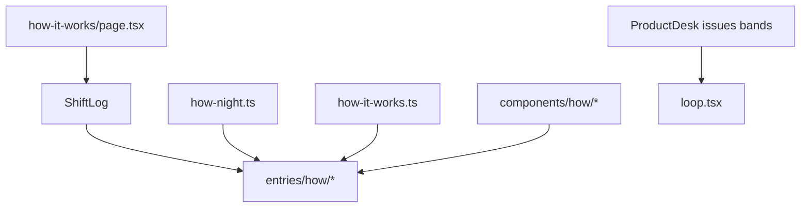

# How it works operating-model Shift Log

> **For agentic workers:** REQUIRED SUB-SKILL: Use `superpowers:subagent-driven-development` (recommended) or `superpowers:executing-plans`. Steps use checkbox syntax in the plan file written on kickoff.

**Goal:** Remake [`web/marketing/app/how-it-works/page.tsx`](web/marketing/app/how-it-works/page.tsx) as a second Shift Log that teaches how WatchTower runs on the host (drop → wizard → loop → disk → desk → CLI → close).

**Architecture:** Sibling tour (spec approach 1). Reuse `ShiftLog` / `ShiftEntry` after widening entry ids from `NightEntryId` to `string` so home and How it works can share the shell without a multi-tour engine. New content (`how-it-works.ts`, `how-night.ts`), mechanism plates under `components/how/`, entries under `components/entries/how/`.

**Tech Stack:** Next.js 15 marketing app, TypeScript, Motion (`motion/react`), existing desk/`TourBrings`/`Cta` primitives, Node audit script.

**Spec:** [`docs/superpowers/specs/2026-07-31-marketing-how-it-works-overhaul-design.md`](docs/superpowers/specs/2026-07-31-marketing-how-it-works-overhaul-design.md)

**Plan file on kickoff:** Write the full checkbox body to `docs/superpowers/plans/2026-07-31-marketing-how-it-works-overhaul.md` before coding (do not edit the spec).

## Global Constraints

- Display spelling: **WatchTower**
- PRODUCT.md / wiki only; no Fabric shipping; no promises/not-our-job on this page
- Left = mechanism teaching; right = plates / one Issues desk peek; no fixture incident stories on the left
- Hyphens only in user-facing strings (no em/en dashes)
- Radii 2/4/6px; Geist + JetBrains Mono; scarce Signal Blue; no glow-orb / icon-square / periwinkle mush
- **Brand wins over attached taste skills:** Night Watch Desk + spec beat high-end-visual-design defaults (no ethereal glass, no `rounded-full` island nav, no 2rem double-bezel)
- Demo CTA uses `newTab`
- Motion ≤3 authored beats; honor `prefers-reduced-motion`

## Execution skills (mandatory while coding)

| When | Skill / tool |
|------|----------------|
| Session start (UI work) | Impeccable `context.mjs --target web/marketing/app/how-it-works` once; load `craft-floor.md` before editing UI |
| Copy drafting | `/human-writing` + `/anti-ai-writing-humanizer` (house rules) |
| Visual implementation | Spec + DESIGN.md first; high-end-visual-design only for hierarchy/motion restraint, not materials |
| After UI ships | Impeccable `detect.mjs --json` on changed marketing targets |
| After UI ships | `/web-design-guidelines` on new entries + plates + page |
| Task loop | `subagent-driven-development` or `executing-plans` |

## File structure map

| File | Responsibility |
|------|----------------|
| `content/how-it-works.ts` | `HOW` strings (capability / brings / notes / close) |
| `content/how-night.ts` | Entry meta (`id`, `railLabel`, `band`, `layout`, `sources`) |
| `content/product.ts` | Add `LINKS.wikiDisasterRecovery` only |
| `components/shift-log/{entry,use-log-progress}.tsx` | Widen ids to `string` |
| `components/how/*.tsx` | Mechanism plates (mods, wizard steps, loop path, disk tree, port, CLI) |
| `components/entries/how/*.tsx` | Seven room entries |
| `app/how-it-works/page.tsx` | Compose `ShiftLog` + entries |
| `scripts/audit-shift-log.mjs` | Gate how-night rail labels + how content dashes + no promises room |



## Room spine (locked)

1. `drop` — jar in `mods/`
2. `wizard` — first-run steps
3. `loop` — Watching → Scanning → Fix (+ optional Issues peek)
4. `disk` — `watchtower/` tree
5. `desk` — `:8787` safety
6. `cli` — DR when game will not boot
7. `close` — demo + Modrinth (`CLOSE_*` from product.ts)

---

### Task 0: Persist plan file

- Create: `docs/superpowers/plans/2026-07-31-marketing-how-it-works-overhaul.md`
- Copy this plan’s full checkbox body there; commit `docs: plan how-it-works operating-model Shift Log`

### Task 1: Widen Shift Log entry ids

**Files:** Modify [`entry.tsx`](web/marketing/components/shift-log/entry.tsx), [`use-log-progress.tsx`](web/marketing/components/shift-log/use-log-progress.tsx)

**Change:** Replace `NightEntryId` with `string` for `id` / `activeId` / `setEntryNode` / node map. Keep importing `NIGHT` only for home default `activeId` init (`NIGHT[0]?.id`). Home entries keep spreading `nightById(...)`.

**Verify:** `cd web/marketing && npx tsc --noEmit` (or `npm run build` if tsc not scripted). Home `/` still renders.

**Commit:** `fix(marketing): allow string ShiftEntry ids for sibling tours`

### Task 2: Content modules + DR wiki link

**Files:**
- Create `content/how-it-works.ts` with `HOW` object for all 7 rooms (capability, optional brings[], optional note). Draft with humanizer; hyphens only; PRODUCT/wiki-backed.
- Create `content/how-night.ts` mirroring night.ts types (`HowNightEntryId`, `HOW_NIGHT`, `howNightById`) with bands/layouts from the spec.
- Modify `product.ts` `LINKS`: add `wikiDisasterRecovery: 'https://github.com/djinnbanter/WatchTower/wiki/Disaster-Recovery'`

**Draft direction (lock meaning, tighten wording in-file):**
- Drop capability: drop jar in `mods/`, restart once; brings point to Install + Modrinth
- Wizard: five steps as brings or capability + step titles matching PRODUCT (account, options, Initial discovery, backups, security)
- Loop: reuse `READOUTS` captions on the plate; left teaches watch/scan/fix
- Desk: port 8787 + localhost/SSH + change default login
- CLI: `java -jar watchtower-cli-<version>.jar dr` (version placeholder, not a fake pin)
- Close: reuse `CLOSE_HEADLINE` / `CLOSE_BODY` / `FOOTNOTE`

**Verify:** `node -e "import('./content/how-it-works.ts')"` not required; instead run audit after Task 6. Grep content for `—`/`–` must be empty.

**Commit:** `feat(marketing): add how-it-works tour content and DR wiki link`

### Task 3: Mechanism plates

**Files under** `components/how/`:
- `mods-plate.tsx` — mono path `mods/watchtower-*.jar` + restart line
- `wizard-steps.tsx` — 5-step vertical strip; Signal Blue mark on step 1 (or “current”); no fake inputs
- `loop-path.tsx` — SVG/CSS path Watching → Scanning → Fix + `READOUTS`; path draw gated on `useReducedMotion` (instant complete when reduce)
- `disk-tree.tsx` — `watchtower/` with ops-cache, state, spark, support
- `port-callout.tsx` — `:8787` + three hard rules
- `cli-plate.tsx` — mono command + link to `LINKS.wikiDisasterRecovery`

**Craft:** Instrument plates / hairlines / `var(--wt-radius-*)`; no `--wt-glow-*`; no sub-12px fonts (audit already bans 0.5625/0.625/0.6875rem under entries — include `components/how/` in audit size targets in Task 6).

**Commit:** `feat(marketing): add how-it-works mechanism plates`

### Task 4: Entries + page composition

**Files:** Create `components/entries/how/{drop,wizard,loop,disk,desk,cli,close}.tsx`; replace [`app/how-it-works/page.tsx`](web/marketing/app/how-it-works/page.tsx).

**Pattern (each room):** Mirror [`issues.tsx`](web/marketing/components/entries/issues.tsx) — `ShiftEntry {...howNightById('…')}`, split grid, `h2` + capability + `TourBrings` + optional `MarginNote`, right column = plate.

**Loop:** Left copy from `HOW.loop`; right = `LoopPath` plus optional `ProductDesk surface="issues" cut="bands" chrome="bare"` beneath (no left DESK narrative).

**Close:** Same CTA structure as [`close-entry.tsx`](web/marketing/components/entries/close-entry.tsx) (`newTab` on demo, Modrinth ghost + mark).

**Page:**

```tsx
import { ShiftLog } from '@/components/shift-log/log';
// import seven How*Entry components
export const metadata = { title: 'How it works' };
export default function HowItWorksPage() {
  return (
    <main>
      <ShiftLog>
        {/* Drop → Wizard → Loop → Disk → Desk → Cli → Close */}
      </ShiftLog>
    </main>
  );
}
```

Update `ShiftLog` `aria-label` only if needed (keep “Desk tour” or use “How it works” via optional prop — **use optional `ariaLabel = 'Desk tour'` default** so home unchanged; how page passes `ariaLabel="How it works"`).

**Commit:** `feat(marketing): ship how-it-works Shift Log tour page`

### Task 5: Motion polish (loop signature + one accent)

- Loop path draw is the signature (already in `loop-path.tsx`)
- Wizard: calm current-step accent only (no infinite loop)
- Entry enter: rely on existing `Reveal` / `TourBrings` whileInView — do not add a fourth motion system

**Verify:** Toggle reduced motion in OS/dev tools; path appears complete, no looping ornament.

**Commit:** `feat(marketing): gate how-it-works loop motion for reduced-motion`

### Task 6: Audit gates

**Modify** [`audit-shift-log.mjs`](web/marketing/scripts/audit-shift-log.mjs):
- Add `components/how/` to size-target and anti-glow/radial home-new filters (or a parallel `howNew` list covering `app/how-it-works/page.tsx`, `components/how/`, `components/entries/how/`)
- Expect `HOW_NIGHT` rail labels: Drop, First run, Loop, On disk, Desk, CLI, End of shift (match `how-night.ts` exactly)
- Fail if `how-it-works.ts` / `how-night.ts` contain em/en dashes (content walk already covers `/content/`)
- Fail if how entries import `PROMISES` or `NOT_OUR_JOB`

**Run:** `cd web/marketing && node scripts/audit-shift-log.mjs` → OK

**Commit:** `test(marketing): audit how-it-works tour content and plates`

### Task 7: Verification pass

1. `cd web/marketing && npm run lint` (and build if lint alone is weak)
2. Manual: `/how-it-works` on marketing preview — desktop + narrow; light/dark/black
3. Links: Install, Modrinth, wiki DR, demo new tab
4. `node <impeccable>/scripts/detect.mjs --json` on changed UI paths — fix findings once
5. `/web-design-guidelines` on new files — fix a11y/contrast/focus hits once
6. Confirm page is mechanism tour, not a second Features catalog

**Commit:** only if fixes landed (`fix(marketing): how-it-works QA polish`)

## Out of scope (do not do)

- Promises / Standing Orders relocation
- Home Shift Log room changes
- Multi-tour config engine
- Features / Install rewrites beyond Drop links
- Interactive wizard or live CLI

## Plain-English end state

Visitors get a scroll tour that feels like the home desk tour but answers how the mod lives on the server: jar drop, first-run, watch/scan/fix, local files, safe dashboard port, and CLI if Minecraft will not start.
