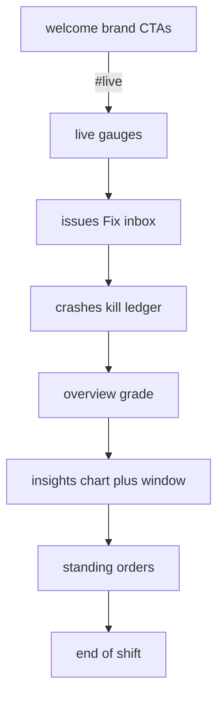

# Shift Log Feature Tour Implementation Plan

> **For agentic workers:** REQUIRED SUB-SKILL: Use `subagent-driven-development` (recommended) or `executing-plans` to implement this plan task-by-task. Steps use checkbox (`- [ ]`) syntax for tracking. After Task 0, the canonical plan lives at [`docs/superpowers/plans/2026-07-31-marketing-shift-log-feature-tour.md`](docs/superpowers/plans/2026-07-31-marketing-shift-log-feature-tour.md) — execute from that file; do not recreate todos.

**Goal:** Remap the home Shift Log so each beat leads with a named WatchTower surface; night fixtures stay as proof under it.

**Architecture:** Rename `NightEntryId`s to feature ids, split Welcome/Live, merge fills+pattern into Insights, rewrite entry copy to a fixed recipe (rail = h2 = surface, capability, proof, `desk · Surface` margin note). Gauges move off Welcome onto Live; evening chart moves under Insights. Extend `audit-shift-log.mjs` to lock rail labels.

**Tech Stack:** Next.js 15, React 19, Tailwind v4, `motion/react`, existing `ShiftEntry` / `DeskDial` / `EveningChart` / DESK fixtures.

**Spec of truth:** [`docs/superpowers/specs/2026-07-31-marketing-shift-log-feature-tour-design.md`](docs/superpowers/specs/2026-07-31-marketing-shift-log-feature-tour-design.md)

## Global Constraints

- Spelling: **WatchTower**
- Zero em-dash / en-dash in user-visible strings; hyphen `-` only
- Claims only from PRODUCT.md / README / DESK / [`web/marketing/content/product.ts`](web/marketing/content/product.ts)
- Feature rail: `railLabel` never matches `^\d{2}:\d{2}$`; clocks only in body proof
- Beat recipe for Live / Issues / Crashes / Overview / Insights: h2 = surface, capability sentence, proof line, `desk · <Surface>` margin note
- No new card chrome, no motion redesign, no dashboard app changes
- Radii 2 / 4 / 6px; no pills; no Lucide-in-square; no decorative radials on entries
- Text floor ≥ `0.75rem` in entries (audit script)
- Visual skills inform craft; **Night Watch Desk + Shift Log win** over glass / mesh / pill islands
- Commit only when the user asks

## Skills while building (required — invoke by reading the skill file before that work)

| Phase | Skill | When / how |
|---|---|---|
| Execution | `subagent-driven-development` or `executing-plans` | Whole plan; fresh subagent per task if SDD |
| Copy draft | `human-writing` | Every new/changed user-facing string in `product.ts` and entries |
| Copy audit | `anti-ai-writing-humanizer` (light) | After drafting tour copy; prose only; report Depth/Replaced/Cut |
| Visual | `impeccable` (context + craft-floor + detect) | Before/after Welcome, Live, Insights layout moves |
| Visual | `design-taste-frontend` + `high-end-visual-design` | Hierarchy/density only; subordinate to DESIGN.md |
| React | `vercel-react-best-practices` | Client splits (gauges, kill pulse on Crashes) |
| A11y | `web-design-guidelines` | Scroll link, heading order (h1 Welcome only; h2 surfaces), focus |
| Done gate | `verification-before-completion` | Before claiming done — run audit + build + skim check with evidence |
| Optional end | `requesting-code-review` | After verification, if user wants a review pass |



## File map

| File | Role |
|---|---|
| [`docs/superpowers/plans/2026-07-31-marketing-shift-log-feature-tour.md`](docs/superpowers/plans/2026-07-31-marketing-shift-log-feature-tour.md) | Canonical plan (Task 0) |
| [`web/marketing/content/night.ts`](web/marketing/content/night.ts) | Remapped ids + feature `railLabel`s; `stamp: null` for all (hollow ticks) |
| [`web/marketing/content/product.ts`](web/marketing/content/product.ts) | `TOUR` capability/proof helpers; update `SCROLL_CUE` |
| [`web/marketing/scripts/audit-shift-log.mjs`](web/marketing/scripts/audit-shift-log.mjs) | Assert feature rail ids/labels; no clock rail labels |
| [`web/marketing/components/entries/welcome.tsx`](web/marketing/components/entries/welcome.tsx) | Brand-only Welcome (from quiet left column) |
| [`web/marketing/components/entries/live.tsx`](web/marketing/components/entries/live.tsx) | Live gauges + recipe copy |
| [`web/marketing/components/entries/issues.tsx`](web/marketing/components/entries/issues.tsx) | Was spike |
| [`web/marketing/components/entries/crashes.tsx`](web/marketing/components/entries/crashes.tsx) | Was killed; `activeId === 'crashes'` |
| [`web/marketing/components/entries/overview.tsx`](web/marketing/components/entries/overview.tsx) | Was answer |
| [`web/marketing/components/entries/insights.tsx`](web/marketing/components/entries/insights.tsx) | Merge fills chart + pattern table |
| [`web/marketing/components/entries/orders.tsx`](web/marketing/components/entries/orders.tsx) | Rail/h2 Standing orders |
| [`web/marketing/components/entries/close-entry.tsx`](web/marketing/components/entries/close-entry.tsx) | Rail End of shift |
| [`web/marketing/app/page.tsx`](web/marketing/app/page.tsx) | New entry order |
| [`web/marketing/app/layout.tsx`](web/marketing/app/layout.tsx) | HTML comment thesis/story update |
| Delete after migrate | `quiet.tsx`, `fills.tsx`, `spike.tsx`, `killed.tsx`, `answer.tsx`, `pattern.tsx` |
| Specs (amend notes) | Parent Shift Log + hero welcome: gauges on Live; feature rail |

**ID rename (locked):** `welcome` | `live` | `issues` | `crashes` | `overview` | `insights` | `orders` | `close`

---

### Task 0: Persist plan + skills table

**Files:**
- Create: `docs/superpowers/plans/2026-07-31-marketing-shift-log-feature-tour.md`

- [ ] **Step 1:** Write this full plan (header, Global Constraints, Skills table, Tasks 0–9) into that path.
- [ ] **Step 2:** Commit only if the user asks.

---

### Task 1: Extend audit for feature rail (fail first)

**Skill:** none (script only).

**Files:**
- Modify: `web/marketing/scripts/audit-shift-log.mjs`
- Modify: `web/marketing/content/night.ts` (minimal — only enough so later tasks compile; full remap in Task 2 is fine if Task 1 asserts expected final shape and is allowed to fail until Task 2)

- [ ] **Step 1:** Append to `audit-shift-log.mjs` after existing checks:

```js
const EXPECTED_RAIL = [
  ['welcome', 'Welcome'],
  ['live', 'Live'],
  ['issues', 'Issues'],
  ['crashes', 'Crashes'],
  ['overview', 'Overview'],
  ['insights', 'Insights'],
  ['orders', 'Standing orders'],
  ['close', 'End of shift'],
];

const nightPath = join(ROOT, 'content/night.ts');
const nightText = readFileSync(nightPath, 'utf8');
for (const [id, label] of EXPECTED_RAIL) {
  if (!new RegExp(`id:\\s*'${id}'`).test(nightText)) {
    fail.push(`night.ts: missing id '${id}'`);
  }
  if (!nightText.includes(`railLabel: '${label}'`) && !nightText.includes(`railLabel: "${label}"`)) {
    fail.push(`night.ts: missing railLabel '${label}'`);
  }
}
if (/railLabel:\s*'[0-2]\d:[0-5]\d'/.test(nightText)) {
  fail.push('night.ts: clock-style railLabel still present');
}
```

- [ ] **Step 2:** Run `cd web/marketing && node scripts/audit-shift-log.mjs` — expect FAIL on missing new ids/labels (until Task 2).
- [ ] **Step 3:** Do not commit until Task 2 lands unless user asks for a WIP commit.

---

### Task 2: Remap `night.ts`

**Files:**
- Modify: `web/marketing/content/night.ts`

- [ ] **Step 1:** Replace `NightEntryId` union and `NIGHT` with:

```ts
export type NightEntryId =
  | 'welcome'
  | 'live'
  | 'issues'
  | 'crashes'
  | 'overview'
  | 'insights'
  | 'orders'
  | 'close';

export const NIGHT: NightEntry[] = [
  { id: 'welcome', stamp: null, railLabel: 'Welcome', temp: 'cool', layout: 'split', sources: ['SUPPORT_LINE / PRODUCT.md'] },
  { id: 'live', stamp: null, railLabel: 'Live', temp: 'cool', layout: 'split', sources: ['DESK.live.vitals'] },
  { id: 'issues', stamp: null, railLabel: 'Issues', temp: 'hot', layout: 'bleed', sources: ['DESK.issues.bands[0].items[0]', 'DESK.overview.attention[0]'] },
  { id: 'crashes', stamp: null, railLabel: 'Crashes', temp: 'hot', layout: 'ledger', sources: ['DESK.issues.bands[0].items[1]', 'DESK.crashes'] },
  { id: 'overview', stamp: null, railLabel: 'Overview', temp: 'cool', layout: 'split', sources: ['DESK.overview', 'TWO_QUESTIONS'] },
  { id: 'insights', stamp: null, railLabel: 'Insights', temp: 'cool', layout: 'bleed', sources: ['DESK.insights.*', 'DESK.backups.rows'] },
  { id: 'orders', stamp: null, railLabel: 'Standing orders', temp: 'cool', layout: 'ledger', sources: ['PROMISES', 'NOT_OUR_JOB'] },
  { id: 'close', stamp: null, railLabel: 'End of shift', temp: 'cool', layout: 'close', sources: ['FOOTNOTE', 'DEMO_URL', 'LINKS.modrinth'] },
];
```

Keep `nightById` unchanged in behavior.

- [ ] **Step 2:** Run audit — expect rail assertions PASS (other entry files may still break TypeScript until Task 3+).
- [ ] **Step 3:** Commit only if user asks.

---

### Task 3: Tour copy constants + humanizer

**Skills:** `human-writing` then `anti-ai-writing-humanizer` (light). Report humanizer Depth/Replaced/Cut in the task summary.

**Files:**
- Modify: `web/marketing/content/product.ts`

- [ ] **Step 1:** Update scroll cue and add tour strings (after humanizer; exact wording may tighten but meaning locked):

```ts
export const SCROLL_CUE = 'Scroll the desk';

export const TOUR = {
  live: {
    capability: 'Live vitals so you can see if the process is healthy without digging logs.',
    proof: 'Healthy band while the process is up. Sampled continuously.',
    note: 'desk · Live',
  },
  issues: {
    capability: 'A ranked Fix inbox: what is wrong, how sure, what to try next.',
    proof: 'Proof from one spike: MSPT 118ms, TPS 8.4, pregen still running.',
    note: 'desk · Issues',
  },
  crashes: {
    capability: 'Crash and odd-shutdown review in plain English, with the evidence beside it.',
    proof: 'Host OOM-killer evidence when the JVM never wrote a crash log.',
    note: 'desk · Crashes',
  },
  overview: {
    capability: 'One desk answer: grade, what is loud, restart advice you run yourself.',
    proof: null, // use DESK.overview letter/headline/sub in the entry
    note: 'desk · Overview',
  },
  insights: {
    capability: 'Schedule and load patterns so you see the busy window, not one sample.',
    proof: null, // stickyLag + peak hour in the entry
    note: 'desk · Insights',
  },
} as const;
```

Keep `HERO_OVERVIEW` / `HERO_CONTEXT` / `TAGLINE` unless humanizer requires a tiny tweak. No em/en dashes.

- [ ] **Step 2:** `node scripts/audit-shift-log.mjs` — content dash check OK.
- [ ] **Step 3:** Commit only if user asks.

---

### Task 4: Welcome + Live split

**Skills:** `impeccable`, `design-taste-frontend`, `high-end-visual-design` (subordinate), `vercel-react-best-practices`, `web-design-guidelines`.

**Files:**
- Create: `web/marketing/components/entries/welcome.tsx`
- Create: `web/marketing/components/entries/live.tsx`
- Delete: `web/marketing/components/entries/quiet.tsx` (after migrate)
- Modify: `web/marketing/app/page.tsx` (partial OK — finish wiring in Task 8)

- [ ] **Step 1:** `welcome.tsx` — brand column only from current quiet left stack (`h1` WatchTower, TAGLINE, HERO_OVERVIEW, HERO_CONTEXT, CTAs). Live pulse dot can stay as “watching” status. Scroll `Link` → `href="#live"` with `SCROLL_CUE`. `nightById('welcome')`. No gauges. No second column required (single column or empty right is fine; prefer full-width brand stack, not a hollow split).

- [ ] **Step 2:** `live.tsx` — move `QuietGauges` (rename `LiveGauges`) + recipe:

```tsx
<h2 className="wt-entry ...">Live</h2>
<p className="mt-4 ...">{TOUR.live.capability}</p>
<p className="mt-3 ...">{TOUR.live.proof}</p>
<MarginNote className="mt-5">{TOUR.live.note}</MarginNote>
{/* gauges */}
```

Keep dial jitter / `useLivePulse` behavior.

- [ ] **Step 3:** Remove `quiet.tsx` once both files exist and page imports them.
- [ ] **Step 4:** Visual skim at marketing preview — Welcome has no gauges; Live has gauges; focus ring on scroll link.

---

### Task 5: Issues + Crashes rename

**Skills:** `human-writing` / light humanizer on new headlines; `vercel-react-best-practices` for kill pulse id.

**Files:**
- Create: `issues.tsx` from `spike.tsx`; Create: `crashes.tsx` from `killed.tsx`
- Delete: `spike.tsx`, `killed.tsx`

- [ ] **Step 1:** Issues — `nightById('issues')`; h2 `Issues`; capability + proof from `TOUR.issues`; keep DisplayNumeral + vitals/context/finding dl as proof instrument; margin note `TOUR.issues.note`.

- [ ] **Step 2:** Crashes — `nightById('crashes')`; change kill effect to `activeId === 'crashes'`; h2 `Crashes`; `TOUR.crashes` capability/proof/note; keep Critical card + crash ledger.

- [ ] **Step 3:** Delete old files; fix any leftover imports.

---

### Task 6: Overview rewrite

**Files:**
- Create: `overview.tsx` from `answer.tsx`; Delete: `answer.tsx`

- [ ] **Step 1:** h2 `Overview`; first paragraph `TOUR.overview.capability`; proof paragraphs use `DESK.overview` grade/headline/sub + restart verdict (existing facts); margin note `TOUR.overview.note`; keep `HeroReadout` + `ProductDesk` right column.

---

### Task 7: Insights merge (fills + pattern)

**Skills:** `impeccable` for bleed chart + ledger density; `human-writing` on capability line.

**Files:**
- Create: `insights.tsx`; Delete: `fills.tsx`, `pattern.tsx`

- [ ] **Step 1:** Structure:

```tsx
// top copy block (padded like fills)
<h2>Insights</h2>
<p>{TOUR.insights.capability}</p>
<p>{DESK.insights.stickyLag}</p>  // proof
<MarginNote>{TOUR.insights.note}</MarginNote>
// EveningChart full bleed (from fills)
// busy hour table + storage/backup bullets (from pattern)
```

Use `layout: 'bleed'` from meta. Peak-hour sentence may stay as proof under the table.

- [ ] **Step 2:** Confirm no duplicate “Most nights…” story open; that line is retired.

---

### Task 8: Orders, Close, page, layout comment

**Files:**
- Modify: `orders.tsx`, `close-entry.tsx`, `app/page.tsx`, `app/layout.tsx`

- [ ] **Step 1:** Orders — ensure h2 is `Standing orders` (match rail; drop trailing period if rail has none, or keep period only in h2 if design system always ends sentences — **locked:** h2 `Standing orders.` is OK; rail stays `Standing orders` without period). Soften “Time stops here…” to feature framing: e.g. `What we promise, and what we do not do.` (humanizer).

- [ ] **Step 2:** Close — rail already `End of shift` via night.ts; optional h2 stay product CTA line (close-shaped exception per spec). No recipe force on close.

- [ ] **Step 3:** `page.tsx`:

```tsx
<ShiftLog>
  <WelcomeEntry />
  <LiveEntry />
  <IssuesEntry />
  <CrashesEntry />
  <OverviewEntry />
  <InsightsEntry />
  <OrdersEntry />
  <CloseEntry />
</ShiftLog>
```

- [ ] **Step 4:** Update `layout.tsx` HTML comment THESIS/STORY/FIRST VIEWPORT to feature-tour wording (organised by surface; gauges on Live; no “Most nights” as first viewport).

---

### Task 9: Spec amendments + verify gate

**Skills:** `verification-before-completion` (mandatory); optional `requesting-code-review` after.

**Files:**
- Amend notes in: `docs/superpowers/specs/2026-07-31-marketing-shift-log-design.md` (story/rail: feature tour)
- Amend: `docs/superpowers/specs/2026-07-31-marketing-hero-welcome-design.md` (gauges on Live, not Welcome)
- Status line on feature-tour design: implemented / plan executing

- [ ] **Step 1:** Run and paste evidence:
  - `cd web/marketing && node scripts/audit-shift-log.mjs`
  - `cd web/marketing && npm run build`
- [ ] **Step 2:** Manual skim checklist (browser or preview):
  - Rail labels = Welcome, Live, Issues, Crashes, Overview, Insights, Standing orders, End of shift
  - No clocks on rail
  - Welcome: no gauges; Live: gauges; Insights: evening chart
  - Each product beat names the surface in h2
- [ ] **Step 3:** Only claim done with Step 1–2 evidence. Commit only if user asks.

---

## Spec coverage (self-review)

| Spec requirement | Task |
|---|---|
| Feature-first remap 8 beats | 2, 4–8 |
| Feature rail / no clock rail | 1–2 |
| Beat recipe | 3–7 |
| Gauges off Welcome → Live | 4 |
| Chart under Insights; merge pattern | 7 |
| Standing orders / End of shift | 8 |
| No invented claims / humanizer | 3, 5–7 |
| Parent spec amendments | 9 |
| Audit + build verification | 1, 9 |
