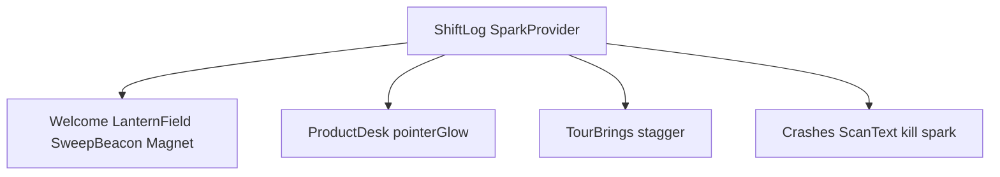

# Shift Log Motion Playbook Implementation Plan

> **For agentic workers:** REQUIRED SUB-SKILL: Use `subagent-driven-development` (recommended) or `executing-plans` to implement this plan task-by-task. Steps use checkbox (`- [ ]`) syntax for tracking. After Task 0, the canonical plan lives at [`docs/superpowers/plans/2026-07-31-marketing-shift-log-motion-playbook.md`](docs/superpowers/plans/2026-07-31-marketing-shift-log-motion-playbook.md) — execute from that file; do not recreate todos.

**Goal:** Make the marketing Shift Log home feel alive (pointer glow, magnet CTAs, sparks, staggered lists, Welcome radar) without changing tour structure, claims, or Night Watch Desk identity.

**Architecture:** Add owned motion leaves under `web/marketing/components/motion/`, inspired by React Bits / dashboard `BorderGlow` but no vendor CLI and no dashboard imports. Wire via `ProductDesk` props, `TourBrings` stagger, a ShiftLog-level spark host, and Welcome ambient layers. Motion only (`motion/react`); Radar = CSS + canvas 2D.

**Tech Stack:** Next.js 15, React 19, Tailwind v4, `motion/react`, existing InstrumentPlate / ProductDesk / ShiftEntry / DESK fixtures.

**Spec of truth:** [`docs/superpowers/specs/2026-07-31-marketing-shift-log-motion-playbook-design.md`](docs/superpowers/specs/2026-07-31-marketing-shift-log-motion-playbook-design.md)

## Global Constraints

- Spelling: **WatchTower**
- Zero em-dash / en-dash in user-visible strings; hyphen `-` only
- Claims / tour copy / entry IDs unchanged (`TOUR`, `PROMISES`, fixtures)
- Owned rewrites only — no React Bits CLI, no three.js / ogl / GSAP
- Animate transform/opacity (sparks: canvas or transform particles)
- No `window.addEventListener('scroll')`
- Honor `useReducedMotion()` everywhere
- Easing: `cubic-bezier(0.16, 1, 0.3, 1)` or spring `{ stiffness: 120, damping: 18 }`
- One continuous ambient on Welcome only; DESIGN.md tokens and radii; no glass / aurora / purple mesh
- Commit only when the user asks

## Skills while building (required)

| Phase | Skill | When |
|---|---|---|
| Execution | `subagent-driven-development` or `executing-plans` | Whole plan |
| Visual | `design-taste-frontend` + `high-end-visual-design` | Hierarchy/density only; subordinate to DESIGN.md |
| Visual | `impeccable` | Welcome ambient + desk glow polish |
| React | `vercel-react-best-practices` | Client leaves; motion values not React state for pointer |
| A11y | `web-design-guidelines` | Reduced motion, ScanText SR text, focus on CTAs |
| Done gate | `verification-before-completion` | audit + tsc + manual skim with evidence |

## File structure

| Path | Responsibility |
|---|---|
| Create `web/marketing/components/motion/desk-border-glow.tsx` + CSS | Pointer edge wash |
| Create `web/marketing/components/motion/desk-spotlight.tsx` | Soft lantern follow |
| Create `web/marketing/components/motion/lantern-spark.tsx` + spark host context | Click / kill sparks |
| Create `web/marketing/components/motion/magnet-hit.tsx` | CTA magnet pull |
| Create `web/marketing/components/motion/scan-text.tsx` | Crash h2 scramble settle |
| Create `web/marketing/components/motion/sweep-beacon.tsx` | Welcome radar |
| Create `web/marketing/components/motion/index.ts` | Barrel exports |
| Modify [`reveal.tsx`](web/marketing/components/reveal.tsx) | Upgrade to WatchReveal API (keep `Reveal` export alias) |
| Modify [`tour-brings.tsx`](web/marketing/components/type/tour-brings.tsx) | Stagger rows in-place (TourList behavior) |
| Modify [`desk-dot-grid.tsx`](web/marketing/components/desk-dot-grid.tsx) | Pause when off-screen; export as LanternField alias |
| Modify [`product-desk.tsx`](web/marketing/components/desk/product-desk.tsx) | `pointerGlow` + optional `spotlight` props |
| Modify [`log.tsx`](web/marketing/components/shift-log/log.tsx) | SparkProvider host |
| Modify entries: welcome, live, issues, crashes, overview, insights, orders, close | Wire map from spec §5 |
| Modify [`audit-shift-log.mjs`](web/marketing/scripts/audit-shift-log.mjs) | Scan `components/motion` for em-dash + sub-12px |

---

### Task 0: Persist plan

**Files:**
- Create: `docs/superpowers/plans/2026-07-31-marketing-shift-log-motion-playbook.md`

- [ ] **Step 1:** Copy this full plan body into that path (canonical execution file).
- [ ] **Step 2:** Commit only if the user asks.

---

### Task 1: Extend audit for motion kit

**Files:**
- Modify: [`web/marketing/scripts/audit-shift-log.mjs`](web/marketing/scripts/audit-shift-log.mjs)

- [ ] **Step 1:** Include `components/motion` in the sub-12px sizeTargets filter (same rule as entries/desk).
- [ ] **Step 2:** Run `node scripts/audit-shift-log.mjs` from `web/marketing` — expect OK (folder may not exist yet; walk must not throw).
- [ ] **Step 3:** Commit if asked.

---

### Task 2: Spark host + LanternSpark

**Files:**
- Create: `web/marketing/components/motion/lantern-spark.tsx`
- Create: `web/marketing/components/motion/spark-context.tsx`
- Modify: [`web/marketing/components/shift-log/log.tsx`](web/marketing/components/shift-log/log.tsx)
- Create: `web/marketing/components/motion/index.ts` (partial)

**Interfaces:**
- Produces: `SparkProvider`, `useSpark(): { burst: (x: number, y: number, tone?: GlowTone) => void }`, `LanternSparkLayer` (fixed/absolute overlay, `pointer-events-none`)
- GlowTone: `'accent' | 'ok' | 'warn' | 'danger'`

- [ ] **Step 1:** Implement context: store short-lived particles `{ id, x, y, tone, born }`; `burst` appends; rAF or timeout removes after ~500ms. Under `useReducedMotion`, `burst` is a no-op.
- [ ] **Step 2:** Render particles as small absolute dots/transforms using lantern-amber / danger CSS vars — no layout shift.
- [ ] **Step 3:** Wrap ShiftLog children with `SparkProvider` + layer sibling inside the section.
- [ ] **Step 4:** `npx tsc --noEmit -p tsconfig.json` in `web/marketing` — expect PASS.
- [ ] **Step 5:** Commit if asked.

---

### Task 3: DeskBorderGlow

**Files:**
- Create: `web/marketing/components/motion/desk-border-glow.tsx`
- Create: `web/marketing/components/motion/desk-border-glow.css` (or append to `desk.css` with `.wt-mkt-glow*` prefixes)
- Reference pattern: dashboard [`BorderGlow`](web/dashboard/src/ui/motion/index.tsx) — **copy adapted, do not import**

**Interfaces:**
- Produces: `DeskBorderGlow({ children, tone?, intensity?, className?, disabled? })`
- Sets CSS vars `--glow-x/y/angle/edge` on pointer move; leaves on leave

- [ ] **Step 1:** Port lean marketing version: 2px frame, conic + radial, Night Watch colors (`--wt-accent` etc).
- [ ] **Step 2:** `useReducedMotion` or `disabled` → static low edge, no pointer handlers.
- [ ] **Step 3:** Export from `motion/index.ts`.
- [ ] **Step 4:** tsc PASS.
- [ ] **Step 5:** Commit if asked.

---

### Task 4: DeskSpotlight

**Files:**
- Create: `web/marketing/components/motion/desk-spotlight.tsx`

**Interfaces:**
- Produces: `DeskSpotlight({ children, className? })` — soft radial `background` follow via CSS vars; intensity lower than border glow

- [ ] **Step 1:** Implement pointer-driven radial on a wrapping `relative` div; reduced motion → no follow.
- [ ] **Step 2:** Export; tsc PASS.
- [ ] **Step 3:** Commit if asked.

---

### Task 5: MagnetHit

**Files:**
- Create: `web/marketing/components/motion/magnet-hit.tsx`

**Interfaces:**
- Produces: `MagnetHit({ children, className?, strength?: number })` wrapping interactive child
- Uses `useMotionValue` / `useSpring` / `useTransform` — **not** `useState` for x/y

- [ ] **Step 1:** On pointer move within padding, translate child toward cursor (max ~8–12px); spring back on leave. Reduced motion → passthrough children.
- [ ] **Step 2:** Export; tsc PASS.
- [ ] **Step 3:** Commit if asked.

---

### Task 6: TourBrings stagger (TourList in-place)

**Files:**
- Modify: [`web/marketing/components/type/tour-brings.tsx`](web/marketing/components/type/tour-brings.tsx)

**Interfaces:**
- Consumes: existing `items: readonly { title, detail }[]`
- Produces: same DOM structure; each `<li>` uses `motion.li` + `whileInView` stagger (once)

- [ ] **Step 1:** Convert list items to motion with `initial={{ opacity: 0, y: 12 }}`, `whileInView={{ opacity: 1, y: 0 }}`, delay `i * 0.05`, ease `[0.16, 1, 0.3, 1]`. Reduced motion → static list.
- [ ] **Step 2:** Manual: Issues/Live brings stagger on scroll. tsc PASS.
- [ ] **Step 3:** Commit if asked.

---

### Task 7: ScanText

**Files:**
- Create: `web/marketing/components/motion/scan-text.tsx`

**Interfaces:**
- Produces: `ScanText({ text: string, active: boolean, className? })`
- Real text always in DOM for SR; scramble overlay `aria-hidden` when animating

- [ ] **Step 1:** When `active` flips true once, cycle glyphs ~300–500ms then settle to `text`. Reduced motion → show `text` immediately.
- [ ] **Step 2:** Export; tsc PASS.
- [ ] **Step 3:** Commit if asked.

---

### Task 8: WatchReveal (upgrade Reveal)

**Files:**
- Modify: [`web/marketing/components/reveal.tsx`](web/marketing/components/reveal.tsx)

**Interfaces:**
- Keep `Reveal` export; add optional `staggerChildren?: boolean` OR document that Orders uses multiple Reveal with delays
- Prefer: enhance existing API; re-export as `WatchReveal = Reveal` from motion barrel

- [ ] **Step 1:** Ensure ease is `[0.16, 1, 0.3, 1]`; no blur. Optional `as` not required.
- [ ] **Step 2:** Barrel export `WatchReveal`. tsc PASS.
- [ ] **Step 3:** Commit if asked.

---

### Task 9: SweepBeacon + LanternField

**Files:**
- Create: `web/marketing/components/motion/sweep-beacon.tsx`
- Modify: [`web/marketing/components/desk-dot-grid.tsx`](web/marketing/components/desk-dot-grid.tsx)

**Interfaces:**
- `SweepBeacon({ className? })` — absolute, `pointer-events-none`; rotating conic sweep + 2–3 faint rings; CSS animation; pause via `IntersectionObserver` when not visible; reduced motion → static rings only
- `DeskDotGrid` / export alias `LanternField`: add IntersectionObserver pause when off-screen (LCP/perf)

- [ ] **Step 1:** Implement SweepBeacon (no three.js).
- [ ] **Step 2:** Pause DeskDotGrid rAF when not intersecting.
- [ ] **Step 3:** Export both; tsc PASS.
- [ ] **Step 4:** Commit if asked.

---

### Task 10: ProductDesk pointerGlow + spotlight

**Files:**
- Modify: [`web/marketing/components/desk/product-desk.tsx`](web/marketing/components/desk/product-desk.tsx)

**Interfaces:**
- Add `pointerGlow?: false | 'accent' | 'ok' | 'warn' | 'danger'` (default false)
- Add `spotlight?: boolean` (default false)
- Wrap InstrumentPlate card with DeskBorderGlow / DeskSpotlight when set (compose outside StatusGlow)

- [ ] **Step 1:** Wire props without breaking existing `glow` (StatusGlow) behavior.
- [ ] **Step 2:** tsc PASS; Features page desks without new props unchanged.
- [ ] **Step 3:** Commit if asked.

---

### Task 11: Wire Welcome + Close CTAs

**Files:**
- Modify: [`welcome.tsx`](web/marketing/components/entries/welcome.tsx)
- Modify: [`close-entry.tsx`](web/marketing/components/entries/close-entry.tsx)
- Modify: [`cta.tsx`](web/marketing/components/cta.tsx) only if needed for onClick spark hook — prefer wrapping in entry with `onPointerDown` calling `burst(clientX, clientY)`

- [ ] **Step 1:** Welcome: absolute `LanternField` + `SweepBeacon` behind brand (`pointer-events-none`, z behind copy). Wrap primary Cta in `MagnetHit`; on pointer down `burst`. Soft `Reveal` on brand block if not already.
- [ ] **Step 2:** Close: same MagnetHit + burst on primary demo Cta.
- [ ] **Step 3:** Reduced motion: no magnet/spark/radar spin. Manual skim. tsc PASS.
- [ ] **Step 4:** Commit if asked.

---

### Task 12: Wire product desks + Overview spotlight

**Files:**
- Modify: [`live.tsx`](web/marketing/components/entries/live.tsx) — wrap dial column in DeskBorderGlow accent OR pass glow via local wrapper (Live has no ProductDesk; wrap dials container)
- Modify: [`issues.tsx`](web/marketing/components/entries/issues.tsx) — `pointerGlow="warn"`
- Modify: [`crashes.tsx`](web/marketing/components/entries/crashes.tsx) — `pointerGlow="danger"` + ScanText on h2 when `activeId === 'crashes'` + `burst` on kill()
- Modify: [`overview.tsx`](web/marketing/components/entries/overview.tsx) — `pointerGlow="accent"` + DeskSpotlight on HeroReadout stack
- Modify: [`insights.tsx`](web/marketing/components/entries/insights.tsx) — `pointerGlow="accent"` + Reveal on chart/desk

- [ ] **Step 1:** Apply map from spec §5 exactly.
- [ ] **Step 2:** Crashes: call `burst` once when kill fires (viewport coords from desk center or pointer).
- [ ] **Step 3:** Manual pointer on Live/Crashes; tsc PASS.
- [ ] **Step 4:** Commit if asked.

---

### Task 13: Wire Standing orders stagger

**Files:**
- Modify: [`orders.tsx`](web/marketing/components/entries/orders.tsx)

- [ ] **Step 1:** Wrap each promise `<li>` with `Reveal kind="lift" delay={i * 0.05}` (solemn; no magnet).
- [ ] **Step 2:** Manual skim; tsc PASS.
- [ ] **Step 3:** Commit if asked.

---

### Task 14: Verification gate

**Files:** none (evidence only)

- [ ] **Step 1:** `cd web/marketing; node scripts/audit-shift-log.mjs` — OK
- [ ] **Step 2:** `npx tsc --noEmit -p tsconfig.json` — OK
- [ ] **Step 3:** Manual checklist: Welcome radar+dots; desk glow tracks; brings stagger; Crashes scan+kill spark; magnet CTAs; OS reduced-motion kills loops/chase/scramble
- [ ] **Step 4:** Skim: no purple glass, no em dash in new strings, Live dials still readable
- [ ] **Step 5:** Per `verification-before-completion`, do not claim done without the above evidence

---

## Spec coverage (self-review)

| Spec requirement | Task |
|---|---|
| DeskBorderGlow | 3, 10, 12 |
| DeskSpotlight | 4, 12 |
| LanternSpark + host | 2, 11, 12 |
| MagnetHit Welcome/Close | 5, 11 |
| TourList / brings stagger | 6 |
| ScanText Crashes | 7, 12 |
| WatchReveal / Reveal | 8, 13 |
| LanternField + SweepBeacon Welcome | 9, 11 |
| Owned only / no three.js | Global + 9 |
| Reduced motion | All motion tasks |
| Audit + verify | 1, 14 |
| No copy/IA change | Global |

## Plain-English end state

Same desk tour, but Welcome watches with a quiet radar, desks glow under the cursor, lists tick in, crash titles scan once, and CTAs tug and spark — all off when reduced motion is on.
