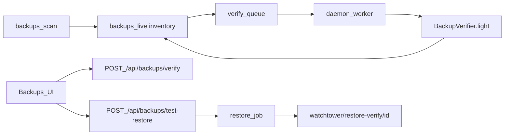

# 1.1.20 Backup integrity verify + test restore — Implementation Plan

> **For agentic workers:** REQUIRED SUB-SKILL: Use [subagent-driven-development](C:\Users\DJINN\.agents\skills\subagent-driven-development\SKILL.md) (recommended) or [executing-plans](C:\Users\DJINN\.agents\skills\executing-plans\SKILL.md). Steps use checkbox (`- [ ]`) syntax.
>
> **On approval:** write design to [`docs/superpowers/specs/2026-08-01-backup-integrity-verify-design.md`](docs/superpowers/specs/2026-08-01-backup-integrity-verify-design.md) and copy this plan to [`docs/superpowers/plans/2026-08-01-backup-integrity-verify.md`](docs/superpowers/plans/2026-08-01-backup-integrity-verify.md) before Task 1. Spec source: [`docs/dev/roadmap/versions/1.1.19-1.1.29-change-safety-and-recovery.md`](docs/dev/roadmap/versions/1.1.19-1.1.29-change-safety-and-recovery.md) §1.1.20. Do **not** edit the Cursor plan file itself during execution.

**Goal:** Let admins trust backup inventory: light-verify each archive (openable + `level.dat` + ≥1 region `.mca`), show chips, Verify now, auto-queue with load defer, optional async test restore into `watchtower/restore-verify/` only, and raise an Issue when the newest backup fails.

**Architecture:** Pure `BackupVerifier` in `watchtower-core` (light + extract helpers). Verify results live on `backups_live.inventory[].verify` (merged via attacher; preserve prior results across rescan by path). Daemon worker (extend or sibling of [`BackupPollScheduler`](watchtower-neoforge-common/src/main/java/dev/mcstatus/watchtower/BackupPollScheduler.java)) runs max-1 light verify off the tick thread. HTTP: sync light verify + async test-restore job/status/cleanup. Dashboard Backups row/detail chips + actions behind `useCanWrite`.

**Tech Stack:** Java 21 (`watchtower-core`, `watchtower-neoforge-common`), Gson, JUnit 5 + `@TempDir`, zip/`tar.gz` listing, React 19 + TanStack Query, existing Backups UI, `.\gradlew :watchtower-core:test`, `node tools/audit-dashboard-packaging.mjs`.

## Global Constraints

- NeoForge **1.21.x** / Java **21** only.
- Display brand: **WatchTower**; plain-English ops copy.
- Writes/actions: admin/owner only (`session.role().canWrite()`); viewer read-only chips.
- Never write the live world; test restore sandboxed under `watchtower/restore-verify/<id>/` only (zip-slip + path guards).
- Never run verify/extract on the server tick thread.
- Do not drive panel restore APIs; do not auto full-extract; do not hash every byte on auto.
- Do **not** overload existing freshness [`BackupStatusResolver`](watchtower-core/src/main/java/dev/mcstatus/watchtower/core/analyze/BackupStatusResolver.java) — new verifier types only.
- Conf kill-switches from roadmap + design lock.

## Locked product decisions

| Decision | Choice |
| -------- | ------ |
| Scope | Full 1.1.20: light + chips + Verify now + manual test restore |
| Persistence | `backups_live` verify map/fields (Approach A), not sidecar next to archives |
| Light “verified” bar | Archive opens + `level.dat` or `level.dat_old` + ≥1 `**/region/*.mca` |
| Missing region only | `suspicious` |
| Unreadable / truncated | `broken` |
| Formats v1 | `.zip`, `.tar.gz`/`.tgz`; else `not_checked` |
| Auto verify | Queue on new inventory path; max 1 concurrent; defer if players>0 or MSPT > threshold |
| Manual Verify now | Bypasses defer |
| Test restore | Async job; free disk ≥ size × 1.5; cleanup endpoint |
| Issue | Newest backup `broken` or `suspicious` → `BACKUP_VERIFY_FAILED` when tracking on |



## File map

| Path | Responsibility |
| ---- | -------------- |
| Create: `watchtower-core/.../analyze/BackupVerifier.java` | Light verify + extract-to-sandbox helpers; result JSON model |
| Create: `watchtower-core/.../analyze/BackupVerifyAttacher.java` | Merge/preserve `verify` onto inventory by absolute path |
| Create: `watchtower-core/.../analyze/BackupTestRestore.java` | Path sandbox, disk-space gate, zip-slip extract, progress callbacks |
| Modify: [`ReportConfig.java`](watchtower-core/src/main/java/dev/mcstatus/watchtower/core/report/ReportConfig.java) | Verify/restore conf keys |
| Modify: [`OpsCacheWriter.applyBackupsLive`](watchtower-core/src/main/java/dev/mcstatus/watchtower/core/ops/OpsCacheWriter.java) | Preserve prior verify when rewriting inventory |
| Modify: [`IssuesLiveEvaluators.java`](watchtower-core/src/main/java/dev/mcstatus/watchtower/core/ops/IssuesLiveEvaluators.java) | `BACKUP_VERIFY_FAILED` |
| Modify: [`BackupPollScheduler.java`](watchtower-neoforge-common/src/main/java/dev/mcstatus/watchtower/BackupPollScheduler.java) or new `BackupVerifyScheduler` | Auto queue + single-flight light verify |
| Modify: [`DashboardHttpServer.java`](watchtower-neoforge-common/src/main/java/dev/mcstatus/watchtower/DashboardHttpServer.java) | verify / test-restore / status / cleanup routes |
| Modify: [`StateManager`](watchtower-core/src/main/java/dev/mcstatus/watchtower/core/report/StateManager.java) | Persist restore job + verify pending queue if needed |
| Modify: [`web/dashboard/src/features/backups/view.tsx`](web/dashboard/src/features/backups/view.tsx) | Chips, findings, Verify now, Test restore, progress, Cleanup |
| Modify: [`web/dashboard/src/api/client.ts`](web/dashboard/src/api/client.ts) | Client methods |
| Create: `samples/fixtures/backup-verify/` | Intact / truncated / missing-region zip fixtures + README |
| Tests: `BackupVerifierTest`, `BackupVerifyAttacherTest`, `BackupTestRestoreTest`, extend IssuesLive tests |

---

### Task 0: Spec + plan copy

- [ ] **Step 1:** Write approved design to `docs/superpowers/specs/2026-08-01-backup-integrity-verify-design.md`
- [ ] **Step 2:** Copy this plan to `docs/superpowers/plans/2026-08-01-backup-integrity-verify.md`
- [ ] **Step 3:** Commit `docs: 1.1.20 backup integrity verify design and plan`

---

### Task 1: `BackupVerifier` light mode (TDD)

**Files:**
- Create: `watchtower-core/src/main/java/dev/mcstatus/watchtower/core/analyze/BackupVerifier.java`
- Test: `watchtower-core/src/test/java/dev/mcstatus/watchtower/core/analyze/BackupVerifierTest.java`
- Fixtures: `samples/fixtures/backup-verify/` (build tiny zips in test `@TempDir` and/or checked-in mini zips)

**Produces:**
```java
public final class BackupVerifier {
  public static final String STATUS_VERIFIED = "verified";
  public static final String STATUS_SUSPICIOUS = "suspicious";
  public static final String STATUS_BROKEN = "broken";
  public static final String STATUS_NOT_CHECKED = "not_checked";
  public static final String STATUS_PENDING = "pending";

  /** Light verify: open archive/folder; never extracts. */
  public static JsonObject lightVerify(Path backupPath);
  // { status, checked_at, mode:"light", findings:[] }
}
```

**Rules:** `.zip`/`.tar.gz` supported; else `not_checked` + `unsupported_format`. Opens + has level.dat(+_old) + ≥1 region `*.mca` → `verified`. Opens + level.dat but no region → `suspicious` + `missing:region_mca`. Cannot open / truncated → `broken`. Cap entry walk (e.g. 50k entries / 30s wall) — on cap still classify from what was seen.

- [ ] **Step 1: Failing tests** — intact zip → verified; zip missing regions → suspicious; truncated/garbage bytes → broken; `.7z` name → not_checked
- [ ] **Step 2:** `.\gradlew :watchtower-core:test --tests BackupVerifierTest` → FAIL
- [ ] **Step 3:** Implement minimal lightVerify
- [ ] **Step 4:** Tests PASS
- [ ] **Step 5:** Commit `feat(core): BackupVerifier light integrity checks`

---

### Task 2: Attach/preserve verify on inventory

**Files:**
- Create: `BackupVerifyAttacher.java`
- Modify: `OpsCacheWriter.applyBackupsLive` — when replacing inventory, merge previous `verify` by absolute `path` string
- Test: `BackupVerifyAttacherTest`

**Produces:** `attach(JsonArray inventory, Map path→verify)` and `mergePreserving(JsonArray fresh, JsonObject previousBackupsLive)`.

- [ ] **Step 1: Failing test** — rescan inventory same path keeps prior verify object
- [ ] **Step 2:** Implement + wire into `applyBackupsLive` (read old block before overwrite)
- [ ] **Step 3:** Commit `feat(core): preserve backup verify state across rescans`

---

### Task 3: Conf keys + WatchtowerSetup / example conf

**Files:**
- Modify: `ReportConfig.java` — `backupVerifyAuto`, `backupVerifyDeferWhenPlayers`, `backupVerifyMaxMspt`, `backupTestRestoreEnabled`
- Modify: `WatchtowerSetup.java` template comments
- Modify: `tools/watchtower.conf.example`

| Key | Default |
| --- | ------- |
| `BACKUP_VERIFY_AUTO` | `true` |
| `BACKUP_VERIFY_DEFER_WHEN_PLAYERS` | `true` |
| `BACKUP_VERIFY_MAX_MSPT` | `40` |
| `BACKUP_TEST_RESTORE_ENABLED` | `true` |

- [ ] **Step 1:** Parse + getters + builder defaults
- [ ] **Step 2:** Commit `feat(core): backup verify/restore conf kill-switches`

---

### Task 4: Auto queue worker (daemon)

**Files:**
- Create: `BackupVerifyScheduler.java` (preferred over bloating poller) — single-thread daemon `watchtower-backup-verify`
- Hook after successful `scanBackupsLive` / poll: enqueue inventory paths with missing/`pending` verify when `BACKUP_VERIFY_AUTO`
- Defer when players>0 or live MSPT > max (read from live snapshot / ops); manual path bypasses

- [ ] **Step 1: Unit-testable pure helper** `shouldDeferAuto(players, mspt, conf)` + queue merge
- [ ] **Step 2:** Wire scheduler bind/unbind with mod lifecycle (mirror BackupPollScheduler)
- [ ] **Step 3:** Commit `feat(http): BackupVerifyScheduler auto light verify`

---

### Task 5: HTTP light verify

**Files:**
- Modify: `DashboardHttpServer.java` — `POST /api/backs/verify` wait — exact path **`POST /api/backups/verify`**
- SELF_AUDITED + audit event `backup_verified`
- Resolve `path`: must be absolute file under configured backup dirs (reuse dir resolution from backup scan); 404/403 on escape

**Response:** `{ ok, path, verify: {...}, backups_live?: ... }`

- [ ] **Step 1:** Handler: auth → kill-switch (treat verify as always on if tracking; or gate with `BACKUP_VERIFY_AUTO` only for auto — **manual verify always allowed when tracking dirs configured**) → lightVerify → attach to ops-cache → JSON
- [ ] **Step 2:** Viewer blocked by existing write gate
- [ ] **Step 3:** Commit `feat(http): POST /api/backups/verify`

---

### Task 6: Test restore (core + HTTP async)

**Files:**
- Create: `BackupTestRestore.java`
- State: `backup_test_restore` job `{ id, path, status, progress_pct, error, dest, started_at, finished_at }`
- Routes:
  - `POST /api/backups/test-restore` `{ path }` → start (409 if busy or `BACKUP_TEST_RESTORE_ENABLED=false`)
  - `GET /api/backups/test-restore/status`
  - `POST /api/backups/test-restore/cleanup` `{ id }` → delete only under restore-verify

**Rules:** dest = `server/watchtower/restore-verify/<id>/`; free bytes ≥ archiveSize * 1.5; zip-slip refuse; after extract run light checks on dest folder; never touch world path.

- [ ] **Step 1: Failing tests** — refuse dest outside sandbox; zip-slip entry rejected; disk gate
- [ ] **Step 2:** Implement extract + HTTP job runner on verify daemon (or restore daemon)
- [ ] **Step 3:** Commit `feat: backup test restore sandbox job`

---

### Task 7: IssuesLive `BACKUP_VERIFY_FAILED`

**Files:**
- Modify: `IssuesLiveEvaluators.fromBackups` (or sibling)
- Test: extend `IssuesLiveEvaluatorsTest`

**Rule:** tracking enabled + newest inventory item (or last_backup path match) has verify.status in `broken|suspicious` → Issue advisory.

- [ ] **Step 1: Fixture → Issue present**
- [ ] **Step 2:** Implement + wire evaluateAndMerge
- [ ] **Step 3:** Commit `feat(issues): BACKUP_VERIFY_FAILED for bad newest backup`

---

### Task 8: Dashboard UI

**Files:**
- `client.ts` — `backupsVerify`, `backupsTestRestore`, `backupsTestRestoreStatus`, `backupsTestRestoreCleanup`
- `view.tsx` (+ css as needed) — chip beside Fresh/Stale; detail findings; Verify now; Test restore + poll status; Cleanup
- Fixture API stubs in `fixture-api-core.ts` / `demo-routes.mjs`
- Audit helper sentences for `backup_verified` / `backup_test_restore_*` if audited

- [ ] **Step 1:** API client + chip mapping helper test (tsx) if non-trivial
- [ ] **Step 2:** Row/detail UI + canWrite gates
- [ ] **Step 3:** `node tools/audit-dashboard-packaging.mjs`
- [ ] **Step 4:** Commit `feat(ui): Backups verify chips and test restore`

---

### Task 9: Docs + verification

**Files:**
- `CHANGELOG.md` Unreleased
- Wiki: [`Backups.md`](docs/wiki/Backups.md), [`On-disk-Files.md`](docs/wiki/On-disk-Files.md) (`restore-verify/`), [`HTTP-API.md`](docs/wiki/HTTP-API.md)
- Roadmap §1.1.20 ship-when → `[x]`
- Rebuild wiki `node scripts/build-wiki.mjs`

**Verify:**
```bash
./gradlew :watchtower-core:test :neoforge-1.21:build
node tools/audit-dashboard-packaging.mjs
```

Human: point `BACKUP_DIRS` at a real zip; chip moves to Verified/Suspicious; Verify now works under load; Test restore extracts only under `watchtower/restore-verify/` and Cleanup removes it; live world untouched.

- [ ] **Step 1:** Docs + changelog + roadmap
- [ ] **Step 2:** Full test + packaging
- [ ] **Step 3:** Commit `docs: 1.1.20 backup integrity verify`

---

## Spec coverage checklist

| Roadmap / design requirement | Task |
| ---------------------------- | ---- |
| Light verify listing | 1 |
| Status chips | 8 |
| Verify now | 5, 8 |
| Auto queue + defer | 3, 4 |
| Test restore sandbox | 6, 8 |
| Issue optional | 7 |
| Conf keys | 3 |
| Fixtures / tests | 1, 6, 7 |
| Never tick thread / never live world | 4, 6 |

## Out of scope

Panel restore APIs, auto full-extract, deep byte hashing, `.7z` support, writing verify sidecars into backup folders, overloading freshness `BackupStatusResolver`.
