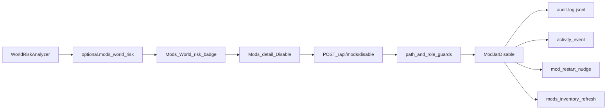

# 1.1.19 Soft jar disable + world-risk badges — Implementation Plan

> **For agentic workers:** REQUIRED SUB-SKILL: Use [subagent-driven-development](C:\Users\DJINN\.agents\skills\subagent-driven-development\SKILL.md) (recommended) or [executing-plans](C:\Users\DJINN\.agents\skills\executing-plans\SKILL.md). Steps use checkbox (`- [ ]`) syntax.
>
> **On approval:** copy this plan to [`docs/superpowers/plans/2026-08-01-soft-jar-disable-world-risk.md`](docs/superpowers/plans/2026-08-01-soft-jar-disable-world-risk.md) before Task 1. Spec source: [`docs/dev/roadmap/versions/1.1.19-1.1.29-change-safety-and-recovery.md`](docs/dev/roadmap/versions/1.1.19-1.1.29-change-safety-and-recovery.md) §1.1.19.

**Goal:** Let admins soft-disable top-level jars under `mods/` via rename to `*.jar.disabled`, re-enable them, see disabled jars in the catalog, show conservative **World risk** badges with a confirm gate, audit every action, and nudge for restart.

**Architecture:** Pure rename helpers live in `watchtower-core` (`ModJarDisable`). Inventory listing expands to include disabled jars (`disabled: true`). `WorldRiskAnalyzer` attaches `world_risk` from disk `world/dimensions/<modId>/…`, optional live census dimension ids, and light jar zip paths under `data/*/dimension/`. HTTP `POST /api/mods/disable|enable` (admin+) renames, audits, emits Activity, refreshes inventory, and sets Overview `meta.mod_restart_nudge`. Dashboard Mods catalog gains Disabled badge, Enabled/Disabled filters, Disable/Enable in the detail panel, and a confirm modal for high world-risk.

**Tech Stack:** Java 21 (`watchtower-core`, `watchtower-neoforge-common`), Gson, JUnit 5 + `@TempDir`, React 19 + TanStack Query, existing `--wt-*` Mods UI, `.\gradlew :watchtower-core:test`, `tsx --test` for catalog helpers, `node tools/audit-dashboard-packaging.mjs` after UI.

## Global Constraints

- NeoForge **1.21.x** / Java **21** only; no Fabric/1.20 work.
- Display brand: **WatchTower**; plain-English ops copy.
- Writes: admin/owner only (`session.role().canWrite()`); `viewer` blocked.
- Rename only under server `mods/`; refuse nested jar-in-jar; **no Delete**, no quarantine folder.
- Suffix: prefer Modrinth-style `name.jar` ↔ `name.jar.disabled`; also accept enable of `name.disabled` if present.
- World-risk v1 is conservative and labeled (`checked` / `not_checked`); no block-entity NBT scan.
- Kill-switches: `MOD_DISABLE_ENABLED=true`, `WORLD_RISK_ENABLED=true` via `ReportConfig` + `WatchtowerSetup` conf template.
- Every disable/enable: named audit (`mod_disabled` / `mod_enabled`) + Activity stub (`mod_disabled` / `mod_enabled`).
- Do not invent Modrinth download/apply; do not auto-restart.

## Locked product decisions

| Decision | Choice |
| -------- | ------ |
| Disabled jar visibility | Stay in **main catalog** with `Disabled` badge; filters **All / Enabled / Disabled** (extend existing `CATALOG_FILTERS`) |
| Rename identity | Always by **jar basename** (`jar` / `jar_file`), never by mod id alone |
| World-risk signals v1 | (1) `world/dimensions/<modId>/…` folders, (2) live census dimension namespaces when server up, (3) zip entry scan for `data/<modId>/dimension/` — `mods_toml_dimensions` stays in `not_checked` (no standard toml field today) |
| Confirm gate | `confirm_world_risk: true` required when `world_risk.level == "high"`; UI modal names reasons |
| Restart nudge | New `meta.mod_restart_nudge` (DiskNudge-style); clear when boot/uptime epoch advances or pending jar list empty after enable-all-pending |



## File map

| Path | Responsibility |
| ---- | -------------- |
| Create: `watchtower-core/.../collect/ModJarDisable.java` | Rename, suffix normalize, path sandbox |
| Create: `watchtower-core/.../analyze/WorldRiskAnalyzer.java` | Risk levels + reasons |
| Create: `watchtower-core/.../analyze/ModRestartNudge.java` | Pending restart chip state in state/ops |
| Modify: `ModJarMetadataReader.java` | List `*.jar` + `*.jar.disabled`; set `disabled`, keep `jar_file` |
| Modify: `ModsInventoryDiff.java` / snapshot rows | Carry `disabled`; treat disable as change not “removed forever” where needed |
| Modify: `StagingBuilder` / facts enrich path | Attach `world_risk` onto mod objects |
| Modify: `IssuesLiveEvaluators.java` | Optional Issue: world still has dims for a currently-disabled mod |
| Modify: `ReportConfig.java`, `WatchtowerSetup.java` | Conf keys |
| Modify: `DashboardHttpServer.java` | Routes + `SELF_AUDITED` + handlers |
| Modify: `web/dashboard/src/api/client.ts` | `modsDisable` / `modsEnable` |
| Modify: `web/dashboard/src/features/mods/*` | Filters, badges, buttons, confirm modal |
| Modify: `web/dashboard/src/features/overview/view.tsx` | Restart nudge chip |
| Create: `samples/fixtures/world-risk/` | Dim folders + disabled jar fixtures |
| Tests: `ModJarDisableTest`, `WorldRiskAnalyzerTest`, extend `ModJarMetadataReaderTest`, catalog helper tests |

---

### Task 1: `ModJarDisable` (core rename + guards)

**Files:**
- Create: `watchtower-core/src/main/java/dev/mcstatus/watchtower/core/collect/ModJarDisable.java`
- Test: `watchtower-core/src/test/java/dev/mcstatus/watchtower/core/collect/ModJarDisableTest.java`

**Produces:**
```java
public final class ModJarDisable {
  public record Result(boolean ok, String jarBefore, String jarAfter, String errorCode, String message) {}
  public static Result disable(Path modsDir, String jarBasename);
  public static Result enable(Path modsDir, String jarBasename);
  public static boolean isDisabledName(String name);
  public static String disabledNameFor(String enabledJarBasename); // foo.jar -> foo.jar.disabled
  public static String enabledNameFor(String disabledJarBasename);
}
```

- [ ] **Step 1: Write failing tests** (`@TempDir` mods dir with dummy jar bytes)

```java
@Test void disableRenamesJarToJarDisabled(@TempDir Path mods) throws Exception {
  Files.writeString(mods.resolve("foo-1.0.jar"), "x");
  var r = ModJarDisable.disable(mods, "foo-1.0.jar");
  assertTrue(r.ok());
  assertEquals("foo-1.0.jar.disabled", r.jarAfter());
  assertTrue(Files.exists(mods.resolve("foo-1.0.jar.disabled")));
  assertFalse(Files.exists(mods.resolve("foo-1.0.jar")));
}

@Test void refusePathEscape(@TempDir Path mods) {
  var r = ModJarDisable.disable(mods, "../secrets.jar");
  assertFalse(r.ok());
  assertEquals("invalid_jar", r.errorCode());
}

@Test void refuseNestedSlash(@TempDir Path mods) {
  var r = ModJarDisable.disable(mods, "sub/foo.jar");
  assertFalse(r.ok());
}

@Test void enableRoundTrip(@TempDir Path mods) throws Exception {
  Files.writeString(mods.resolve("foo-1.0.jar.disabled"), "x");
  var r = ModJarDisable.enable(mods, "foo-1.0.jar.disabled");
  assertTrue(r.ok());
  assertEquals("foo-1.0.jar", r.jarAfter());
}

@Test void disableIdempotentIfAlreadyDisabled(@TempDir Path mods) throws Exception {
  Files.writeString(mods.resolve("foo-1.0.jar.disabled"), "x");
  var r = ModJarDisable.disable(mods, "foo-1.0.jar.disabled");
  assertTrue(r.ok()); // no-op success OR explicit already_disabled — pick no-op ok
}
```

- [ ] **Step 2:** `.\gradlew :watchtower-core:test --tests ModJarDisableTest` → FAIL (class missing)
- [ ] **Step 3:** Implement minimal `ModJarDisable` (normalize basename, resolve against `modsDir.toAbsolutePath().normalize()`, ensure `startsWith(modsDir)`, only top-level file, `Files.move`)
- [ ] **Step 4:** Tests PASS
- [ ] **Step 5:** Commit `feat(core): ModJarDisable rename helper with path guards`

---

### Task 2: Inventory lists disabled jars

**Files:**
- Modify: [`ModJarMetadataReader.java`](watchtower-core/src/main/java/dev/mcstatus/watchtower/core/collect/ModJarMetadataReader.java) (`readFromModsDir` / `listModsFromDir` glob)
- Modify: [`ModsInventoryDiff.java`](watchtower-core/src/main/java/dev/mcstatus/watchtower/core/collect/ModsInventoryDiff.java) snapshot `disabled` boolean
- Test: extend `ModJarMetadataReaderTest`

**Produces:** Each mod JSON may include `"disabled": true|false` and `jar_file` always the **current on-disk basename**.

- [ ] **Step 1: Failing test** — write `appleskin.jar.disabled` with toml; `listModsFromDir` returns one row with `disabled=true`, `id=appleskin`, `jar_file=appleskin….jar.disabled`
- [ ] **Step 2:** Run test → FAIL
- [ ] **Step 3:** Change directory stream to accept `*.jar` and names ending in `.jar.disabled` (helper `isModJarFile(Path)`). For disabled files, still parse zip/toml the same way. Set `disabled` on `toJson`.
- [ ] **Step 4:** Ensure `WatchtowerSampler.countMods` / forensics globs **remain `*.jar` only** for “loaded jar count” (document: disabled not counted as active). Inventory/catalog is the place that lists them.
- [ ] **Step 5:** Tests PASS + commit `feat(core): list .jar.disabled in mods inventory`

**Note:** Running mods from the live loader will **not** include disabled jars until restart — catalog must merge inventory disabled rows so Enable stays available. Prefer ops `mods_inventory` snapshot or a small `disabled_mods` list on ops-cache after scan; simplest: after Task 5 HTTP, trigger inventory rescan that includes disabled files into facts/`mods_light`.

---

### Task 3: `WorldRiskAnalyzer`

**Files:**
- Create: `watchtower-core/.../analyze/WorldRiskAnalyzer.java`
- Test: `WorldRiskAnalyzerTest.java`
- Fixture dirs: `samples/fixtures/world-risk/` (documented layout)

**Produces:**
```java
public final class WorldRiskAnalyzer {
  public static JsonObject evaluateMod(
      String modId,
      Path serverDir,
      Path jarFileOrNull,
      Set<String> liveDimensionIdsOrEmpty);
  // returns { level: none|low|high, reasons: [], checked: [], not_checked: [] }
  public static void attachToMods(JsonArray mods, Path serverDir, Set<String> liveDims);
}
```

**Level rules (v1):**
- `high` if any `world/dimensions/<modId>/` exists OR live dim id namespace equals `modId`
- `high` if jar zip contains `data/<modId>/dimension/` entries (declare content)
- `none` otherwise
- Always set `not_checked` to include `block_entity_nbt_scan`, `mods_toml_dimensions`

- [ ] **Step 1: Failing tests** with `@TempDir` server: create `world/dimensions/dimmod/foo/`; mod id `dimmod` → `level=high`, reason contains `world_dimension_folders`
- [ ] **Step 2:** Zip jar containing `data/dimmod/dimension/bar.json` → high + `declares_dimension_data`
- [ ] **Step 3:** Implement analyzer (reuse folder discovery pattern from [`DimensionStorageScanner`](watchtower-core/src/main/java/dev/mcstatus/watchtower/core/collect/DimensionStorageScanner.java); zip walk with size cap / entry cap)
- [ ] **Step 4:** Gate with `WORLD_RISK_ENABLED` when wiring (Task 4); analyzer itself stays pure
- [ ] **Step 5:** Commit `feat(core): WorldRiskAnalyzer for dimension folder and jar data paths`

---

### Task 4: Attach `world_risk` on enrich path + conf keys

**Files:**
- Modify: [`StagingBuilder.java`](watchtower-core/src/main/java/dev/mcstatus/watchtower/core/collect/StagingBuilder.java) and/or ops light rescore path that builds `mods_light` / facts mods
- Modify: [`ReportConfig.java`](watchtower-core/src/main/java/dev/mcstatus/watchtower/core/report/ReportConfig.java) — `modDisableEnabled`, `worldRiskEnabled`
- Modify: [`WatchtowerSetup.java`](watchtower-neoforge-common/src/main/java/dev/mcstatus/watchtower/WatchtowerSetup.java) conf template comments
- NeoForge: pass live dimension id set from sampler when available (optional empty in DR/CLI)

- [ ] **Step 1:** Unit test: `attachToMods` mutates array in place with `world_risk` object
- [ ] **Step 2:** Wire after `enrichModArray` / nesting; skip when `!worldRiskEnabled`
- [ ] **Step 3:** Commit `feat(core): attach world_risk to mod rows + conf kill-switches`

---

### Task 5: HTTP disable/enable + audit + activity + rescan

**Files:**
- Modify: [`DashboardHttpServer.java`](watchtower-neoforge-common/src/main/java/dev/mcstatus/watchtower/DashboardHttpServer.java)
  - Add to `SELF_AUDITED`: `/api/mods/disable`, `/api/mods/enable`
  - `server.createContext` for both
- Use [`DashboardAudit.record`](watchtower-neoforge-common/src/main/java/dev/mcstatus/watchtower/DashboardAudit.java), [`OpsCacheWriter.applyActivityBackfillChunk`](watchtower-core/src/main/java/dev/mcstatus/watchtower/core/ops/OpsCacheWriter.java), existing mods scan helpers from `handleModsScan`

**Request/response:**
```json
// POST /api/mods/disable
{ "jar": "create-1.2.3.jar", "confirm_world_risk": true }
// 200 { "ok": true, "jar_before": "...", "jar_after": "...", "world_risk": {...} }
// 400 { "ok": false, "error": "world_risk_confirm_required", "world_risk": {...} }
// 403 viewer / 409 MOD_DISABLE_ENABLED=false / 404 jar missing
```

- [ ] **Step 1:** Handler flow: auth → conf kill-switch → resolve `mods/` → if disable, compute world_risk for mod id of that jar → if high && !confirm → 400 → `ModJarDisable` → audit → activity event → update restart nudge state → trigger inventory/running rescan best-effort → JSON ok
- [ ] **Step 2:** Manual/integration: viewer session cannot POST (existing gate)
- [ ] **Step 3:** Commit `feat(http): POST /api/mods/disable and /enable with audit`

---

### Task 6: Overview restart nudge

**Files:**
- Create: `watchtower-core/.../analyze/ModRestartNudge.java` (or small state helper)
- Persist pending basenames in state JSON (e.g. `mod_restart_pending: { since, jars: [] }`) via `StateManager`
- Modify Overview meta assembly in `DashboardHttpServer` (~where `safe_restart` / `restart_hygiene` attach)
- Modify [`overview/view.tsx`](web/dashboard/src/features/overview/view.tsx) — chip when `meta.mod_restart_nudge.active`

**Clear when:** detected server start time / session uptime resets below previous `since`, or pending list empty.

- [ ] **Step 1:** Pure unit test for merge/clear logic
- [ ] **Step 2:** Wire meta + UI one-line chip: “Mod jars changed — restart when ready”
- [ ] **Step 3:** Commit `feat: mod restart nudge after disable/enable`

---

### Task 7: Optional Issue — disabled mod still referenced by world

**Files:**
- Modify: [`IssuesLiveEvaluators.java`](watchtower-core/src/main/java/dev/mcstatus/watchtower/core/ops/IssuesLiveEvaluators.java)
- Test: extend `IssuesLiveEvaluatorsTest`

**Rule:** If inventory has `disabled=true` for `modId` AND `world/dimensions/<modId>/` exists → Issue `world_risk_disabled_mod` (advisory: enable mod or migrate world offline). Kill-switch follows `WORLD_RISK_ENABLED`.

- [ ] **Step 1:** Fixture JSON → Issue present
- [ ] **Step 2:** Implement evaluator branch
- [ ] **Step 3:** Commit `feat(issues): flag disabled mods with leftover world dimensions`

---

### Task 8: Dashboard Mods UI

**Files:**
- [`client.ts`](web/dashboard/src/api/client.ts) — `modsDisable({ jar, confirm_world_risk })`, `modsEnable({ jar })`
- [`catalog.ts`](web/dashboard/src/features/mods/catalog.ts) — filters `enabled` / `disabled`; `worldRiskById` in `BadgeMaps`; badge spec `World risk`
- [`types.ts`](web/dashboard/src/features/mods/types.ts) — types for `world_risk`, `disabled`
- [`overview-tab.tsx`](web/dashboard/src/features/mods/overview-tab.tsx) / [`components.tsx`](web/dashboard/src/features/mods/components.tsx) — show `jar_file`, Disabled badge, Disable/Enable behind `useCanWrite`
- Confirm modal component (inline or small file): lists reasons; primary “Disable anyway”
- Preview/fixture API handlers if used in vite preview
- Test: catalog filter helper `tsx --test` for enabled/disabled filter

**Merge rule:** Catalog must include disabled-only jars from inventory/facts even when absent from `running_mods` (merge by `jar_file` or id+disabled).

- [ ] **Step 1:** API client + filter unit tests
- [ ] **Step 2:** Badge + detail actions + confirm modal
- [ ] **Step 3:** `useCanWrite` hides buttons; tooltip View only
- [ ] **Step 4:** `node tools/audit-dashboard-packaging.mjs` (and parity if needed)
- [ ] **Step 5:** Commit `feat(ui): Mods disable/enable, world-risk badge, filters`

---

### Task 9: Docs, changelog, roadmap checkboxes, verification

**Files:**
- `CHANGELOG.md` Unreleased
- Wiki: Mods page + On-disk-Files (`.jar.disabled`) + HTTP-API routes
- Roadmap §1.1.19 ship-when → `[x]` as items land
- `tools/watchtower.conf.example` keys

**Verify:**
```bash
./gradlew :watchtower-core:test :neoforge-1.21:build
node tools/audit-dashboard-packaging.mjs
```

Human: on a test server, Disable a harmless jar → file renamed → restart → mod gone from loader → Enable → restart → back; world-risk mod shows badge + confirm.

- [ ] **Step 1:** Docs + changelog
- [ ] **Step 2:** Full test + packaging
- [ ] **Step 3:** Commit `docs: 1.1.19 soft disable and world-risk`

---

## Spec coverage checklist

| Roadmap requirement | Task |
| ------------------- | ---- |
| Disable/Enable rename `.jar.disabled` | 1, 5, 8 |
| Refuse outside `mods/`, nested jij | 1 |
| World risk badge + reasons | 3, 4, 8 |
| Confirm on high risk | 5, 8 |
| Restart nudge | 6 |
| Audit log | 5 |
| Activity stub | 5 |
| Conf kill-switches | 4, 5 |
| Optional Issue world refs disabled | 7 |
| Fixtures / tests | 1–3, 7 |
| No Delete / quarantine | enforced in 1 & 8 |

## Out of scope (do not build in this plan)

Delete jar, quarantine move, Modrinth apply, full NBT ownership, BlueMap, change notebook, config editor (1.1.25), first-hour wizard.
