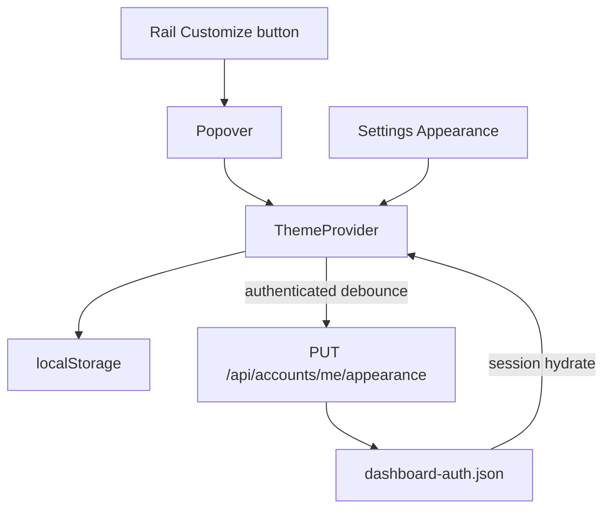

# Appearance Customize (Theme + Accent) Implementation Plan

> **For agentic workers:** REQUIRED SUB-SKILL: Use superpowers:subagent-driven-development (recommended) or superpowers:executing-plans to implement this plan task-by-task. Steps use checkbox (`- [ ]`) syntax for tracking.

**Goal:** Let operators pick Light / Dark / Black / System and one of eight accent presets from a rail Customize popout (and Settings), with preferences synced across devices for signed-in accounts.

**Architecture:** Store `ui_theme` + `ui_accent` on `DashboardAuthRecord` in `watchtower/dashboard-auth.json`. Session JSON exposes them; `PUT /api/accounts/me/appearance` updates the current account. Frontend `ThemeProvider` owns mode + accent, applies `data-theme` (resolved) and `data-accent`, caches to `localStorage`, and debounces account writes when authenticated. Status tokens (`--wt-ok/warn/danger`) stay fixed; only accent / soft / ink / spotlight / scroll-thumb derived accents change.

**Tech Stack:** Java 21 (`watchtower-core` auth), NeoForge `DashboardAuthHttp`, React+Vite dashboard (`theme.tsx`, `shell.tsx`, Settings).

## Global Constraints

- Display brand **WatchTower**; plain-English UI copy
- Themes: `light` | `dark` | `black` | `system` — System resolves via `prefers-color-scheme` to **light or dark only** (never auto-black)
- Accents: exactly **8 presets** — `signal` (default), `amber`, `teal`, `violet`, `rose`, `green`, `coral`, `slate`
- Each accent defines per resolved theme (`light`/`dark`/`black`) values for `--wt-accent`, `--wt-accent-soft`, `--wt-accent-ink` so primary buttons stay readable
- Do **not** put appearance in `/api/settings` / `watchtower.conf` (server-wide ops)
- Signed-in users: prefs sync to their account; always keep `localStorage` mirror for instant paint + pre-auth/fixture
- Viewers may change look; sync works for any authenticated role (not admin-gated)
- Fixture preview: in-memory session prefs (no real auth file)
- Preserve existing Night Watch Desk rail identity — compact popover, not a generic SaaS modal; no purple-on-white default drift beyond the violet **preset**
- Platform: NeoForge 1.21 / embedded dashboard JAR path still audited after UI change

## Locked UX



**Rail:** Replace `.sh-rail__theme` radiogroup with a single **Customize** control (icon + label). Click opens an anchored popover above the rail foot containing:
1. Theme segment: Light / Dark / Black / System
2. Accent swatch row (8 circles; selected ring uses current accent)
3. Escape / outside-click closes; focus trap light (Tab cycles within popover)

**Settings:** New **Appearance** card under General (or its own mini-section) with the same two controls — single source of truth via `useTheme()`.

## File map

| File | Responsibility |
|------|----------------|
| `docs/superpowers/specs/2026-08-02-appearance-customize-design.md` | Locked design |
| `watchtower-core/.../auth/DashboardAuthRecord.java` | `ui_theme`, `ui_accent` fields |
| `watchtower-core/.../auth/DashboardAuthStore.java` | `updateAppearance(accountId, theme, accent)` |
| `watchtower-neoforge-common/.../DashboardAuthHttp.java` | session fields + PUT me/appearance |
| `web/dashboard/src/app/theme.tsx` | mode + accent provider, system listener, sync |
| `web/dashboard/src/app/accents.ts` | preset ids + CSS variable tables |
| `web/dashboard/src/index.css` | `[data-accent='…']` overrides per theme |
| `web/dashboard/src/app/shell.tsx` + `shell.css` | Customize popover |
| `web/dashboard/src/features/settings/view.tsx` | Appearance UI |
| `web/dashboard/src/api/client.ts` | `appearanceSave` |
| `web/dashboard/scripts/fixture-api-core.ts` | session + PUT mirror |
| `docs/wiki` Settings/Dashboard page mention | short note |

### Preset tokens (implement exactly)

Default `signal` keeps today’s blues. Other presets: pick hues that clear WCAG-ish contrast for `--wt-accent-ink` on filled buttons (white ink on deep light-theme accents; dark ink on bright dark/black accents). Soft = accent @ ~12–16% alpha. Do not retint `--wt-warn` / `--wt-danger` / chart instrument channels.

---

### Task 1: Design spec on disk

**Files:**
- Create: `docs/superpowers/specs/2026-08-02-appearance-customize-design.md`
- Create: `docs/superpowers/plans/2026-08-02-appearance-customize.md` (copy of this plan on first execute)

- [ ] **Step 1:** Write locked decisions (UX, sync rules, presets, system resolution, non-goals: no custom hex, no server-wide default theme)
- [ ] **Step 2:** Commit `docs: appearance customize design and plan`

---

### Task 2: Auth record + store + HTTP

**Files:**
- Modify: [`DashboardAuthRecord.java`](watchtower-core/src/main/java/dev/mcstatus/watchtower/core/auth/DashboardAuthRecord.java)
- Modify: [`DashboardAuthStore.java`](watchtower-core/src/main/java/dev/mcstatus/watchtower/core/auth/DashboardAuthStore.java)
- Modify: [`DashboardAuthHttp.java`](watchtower-neoforge-common/src/main/java/dev/mcstatus/watchtower/DashboardAuthHttp.java)
- Test: new `DashboardAuthStoreAppearanceTest` (or extend existing auth store tests)

**Interfaces:**
```java
// DashboardAuthRecord
public String ui_theme;   // light|dark|black|system|null → treat null as dark
public String ui_accent;  // signal|amber|…|null → signal

// DashboardAuthStore
public void updateAppearance(String accountId, String theme, String accent);

// HTTP
// PUT /api/accounts/me/appearance  { "theme": "...", "accent": "..." }
// buildSessionJson adds ui_theme, ui_accent when authenticated
```

Validation: reject unknown theme/accent with 400. Any authenticated fully-logged-in role may PUT self.

- [ ] **Step 1:** Failing store/HTTP tests for update + session fields
- [ ] **Step 2:** Implement + PASS
- [ ] **Step 3:** Commit `feat: per-account ui_theme and ui_accent`

---

### Task 3: Accent token tables + CSS

**Files:**
- Create: `web/dashboard/src/app/accents.ts`
- Modify: [`index.css`](web/dashboard/src/index.css)
- Test: `web/dashboard/src/app/accents.test.ts` (preset list length 8, default id, resolve helpers)

```ts
export type AccentId = 'signal' | 'amber' | 'teal' | 'violet' | 'rose' | 'green' | 'coral' | 'slate';
export type ThemeMode = 'light' | 'dark' | 'black' | 'system';
export type ResolvedTheme = 'light' | 'dark' | 'black';

export const ACCENT_PRESETS: { id: AccentId; label: string; swatch: string }[];
export function resolveThemeMode(mode: ThemeMode, prefersDark: boolean): ResolvedTheme;
export function isAccentId(v: string | null | undefined): v is AccentId;
```

CSS pattern: keep base theme blocks; add e.g.
`html[data-theme='dark'][data-accent='teal'] { --wt-accent: …; --wt-accent-soft: …; --wt-accent-ink: …; --wt-spotlight: …; }`
(and light/black). Scroll thumbs already `color-mix` from `--wt-accent` — leave them.

- [ ] **Step 1:** Unit tests for resolveThemeMode + preset ids
- [ ] **Step 2:** Implement accents.ts + CSS matrices
- [ ] **Step 3:** Commit `feat: accent preset tokens for light dark black`

---

### Task 4: ThemeProvider sync

**Files:**
- Modify: [`theme.tsx`](web/dashboard/src/app/theme.tsx)
- Modify: [`client.ts`](web/dashboard/src/api/client.ts) — `appearanceSave`
- Modify: session hydrate path (read `ui_theme`/`ui_accent` from session store when session loads)

**Behavior:**
1. `localStorage` keys: `wt-theme` (mode, may be `system`), `wt-accent`
2. On mount: read LS → apply immediately
3. When session becomes authenticated: if account has prefs, override LS and apply; if account prefs null, push current LS to account once
4. `setThemeMode` / `setAccent`: update state, apply DOM (`dataset.theme` = resolved, `dataset.accent` = id, `classList.dark` for dark|black), write LS, debounce 300ms `appearanceSave` when authenticated
5. `matchMedia('(prefers-color-scheme: dark)')` listener when mode === `system`
6. Migrate legacy `wt-theme` values; unknown accent → `signal`

- [ ] **Step 1:** Provider + client wiring
- [ ] **Step 2:** Manual/preview: toggle System follows OS; accent paints buttons
- [ ] **Step 3:** Commit `feat: ThemeProvider mode accent and account sync`

---

### Task 5: Rail Customize popover + Settings

**Files:**
- Modify: [`shell.tsx`](web/dashboard/src/app/shell.tsx), [`shell.css`](web/dashboard/src/app/shell.css)
- Modify: [`settings/view.tsx`](web/dashboard/src/features/settings/view.tsx) (+ small CSS)
- Shared presentational piece: `web/dashboard/src/app/appearance-controls.tsx` (theme radios + accent swatches) used by popover + Settings

**Rail:** Customize button shows current resolved theme icon + tiny accent dot. Popover: Night Watch Desk styling (tight radius, hairline border, `wt-bg1`, no glassmorphism stack).

**Settings:** Appearance block with same `AppearanceControls`.

- [ ] **Step 1:** Implement shared controls + rail popover + Settings
- [ ] **Step 2:** Preview smoke — open popover, switch Black + teal, confirm Settings mirrors; reload keeps prefs
- [ ] **Step 3:** Commit `feat: Customize popover and Settings appearance`

---

### Task 6: Fixture API + wiki + packaging

**Files:**
- Modify: [`fixture-api-core.ts`](web/dashboard/scripts/fixture-api-core.ts) — session includes `ui_theme`/`ui_accent`; PUT `/api/accounts/me/appearance` updates session
- Modify: wiki Settings or Dashboard overview note (1 short paragraph)
- Run: `node tools/audit-dashboard-packaging.mjs`
- Run: core auth tests + `npm run test:settings` (or accents unit test script)

- [ ] **Step 1:** Fixture + docs + verify
- [ ] **Step 2:** Commit `docs: appearance customize wiki and fixture`

## Spec coverage

| Requirement | Task |
|-------------|------|
| Design lock | 1 |
| Account fields + API | 2 |
| 8 accents × 3 themes CSS | 3 |
| System mode + LS + sync | 4 |
| Rail popout + Settings | 5 |
| Fixture + verify | 6 |
| Custom hex / server-wide theme | omitted |

## Plain-English end state

Operators open **Customize** on the rail (or Settings → Appearance), pick Light/Dark/Black/System and an accent swatch. Signed-in, that choice follows them on another device; status colors stay the same so warnings still look like warnings.
