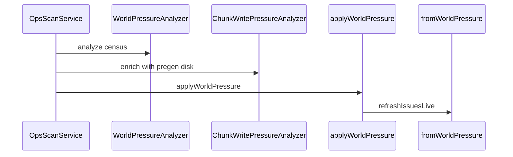

# Chunk Write / Pregen Pressure Issues Implementation Plan

> **For agentic workers:** REQUIRED SUB-SKILL: Use superpowers:subagent-driven-development (recommended) or superpowers:executing-plans to implement this plan task-by-task. Steps use checkbox (`- [ ]`) syntax for tracking.

**Goal:** Raise sustained `WORLD_PRESSURE` Issues for chunk-save backlog, pregen outrunning disk, and heavy chunk generation while players are online, and show light write/pregen/growth meters on Insights → World — advice only, no auto-pause.

**Architecture:** Pure `ChunkWritePressureAnalyzer.enrich` merges classifiers + `meters` onto the existing `world_pressure` block after `WorldPressureAnalyzer.analyze`. `OpsScanService.scanWorldPressure` supplies pregen + disk signals from `LiveMetricsService`. Issues reuse `fromWorldPressure`. Insights reads `world_pressure.meters`.

**Tech Stack:** Java 21, Gradle (`:watchtower-core:test`, neoforge-common compile), React Insights World panel, fixtures under `samples/fixtures/world-pressure/`.

**Spec:** [docs/superpowers/specs/2026-08-02-chunk-write-pregen-pressure-design.md](../specs/2026-08-02-chunk-write-pregen-pressure-design.md)

## Global Constraints

- NeoForge 1.21.x / Java 21 only.
- Issue ids: `WORLD_PRESSURE:<KIND>:<DIMENSION>` with kinds `chunk_save_backlog`, `pregen_outrunning_disk`, `heavy_chunk_generation`.
- Kill-switch `CHUNK_WRITE_PRESSURE_ENABLED` default `true`; latency warn uses existing `DISK_IO_LATENCY_WARN_MS` (default 50).
- Sustained streaks (~3 scans) before emit — same spirit as world pressure; store in `world_pressure.chunk_write_streaks` (do not share entity `streaks`, which WorldPressureAnalyzer decays).
- Advice only: pause pregen / wait for saves / don’t restart mid-flush. Never auto-control pregen. No mod blame without evidence.
- Plain English; display brand **WatchTower**.
- After dashboard changes: `node tools/audit-dashboard-packaging.mjs`.

## File structure

| File | Responsibility |
| ---- | -------------- |
| `watchtower-core/.../analyze/ChunkWritePressureAnalyzer.java` | Pure enrich: meters + classifiers + streaks |
| `watchtower-core/.../ops/OpsCacheSchema.java` | `WORLD_PRESSURE_METERS` constant |
| `watchtower-core/.../report/ReportConfig.java` | `chunkWritePressureEnabled` |
| `tools/watchtower.conf.example` | Document kill-switch |
| `watchtower-neoforge-common/.../OpsScanService.java` | Wire signals + enrich |
| `watchtower-neoforge-common/.../LiveMetricsService.java` | Expose helpers to read pregen + disk for scan (if needed) |
| `web/dashboard/src/features/insights/panels/world.tsx` | Meter strip + empty-state copy |
| `web/dashboard/data/ops-cache.json` | Preview meters + one write/pregen classifier |
| `samples/fixtures/world-pressure/*.json` | Analyzer fixtures |
| `docs/wiki/World-Pressure.md` (+ Issues row if needed) | Operator note |
| Tests under `watchtower-core/src/test/java/...` | TDD |



---

### Task 1: ChunkWritePressureAnalyzer (TDD)

**Files:**
- Create: `watchtower-core/src/main/java/dev/mcstatus/watchtower/core/analyze/ChunkWritePressureAnalyzer.java`
- Create: `watchtower-core/src/test/java/dev/mcstatus/watchtower/core/analyze/ChunkWritePressureAnalyzerTest.java`
- Create fixtures: `samples/fixtures/world-pressure/pregen-outrunning-disk.json`, `chunk-save-backlog.json`, `heavy-chunk-gen-players.json`, `chunk-write-quiet.json`

**Interfaces:**
- Consumes: `world_pressure` block from `WorldPressureAnalyzer.analyze`; signals JSON; previous ops-cache root; `diskWarnMs`
- Produces:

```java
public final class ChunkWritePressureAnalyzer {
  public static final int SUSTAINED = 3;
  public static final String KIND_SAVE_BACKLOG = "chunk_save_backlog";
  public static final String KIND_PREGEN_DISK = "pregen_outrunning_disk";
  public static final String KIND_HEAVY_GEN = "heavy_chunk_generation";

  /**
   * Mutates {@code block} in place: appends classifiers, updates streaks, sets meters.
   * @param signals { "dh_pregen": {}, "chunky_pregen": {}, "write_await_ms": number?, "write_mb_s": number?, "census": {} }
   */
  public static void enrich(JsonObject block, JsonObject signals, JsonObject prevOpsRoot, double diskWarnMs) { ... }
}
```

Classifier object shape (match WorldPressureAnalyzer / `fromWorldPressure`):

```json
{
  "kind": "pregen_outrunning_disk",
  "dimension": "minecraft:overworld",
  "severity": "warning",
  "headline": "...",
  "detail": "...",
  "next_steps": ["Pause pregen …", "Wait for disk …", "Do not restart mid-flush …"]
}
```

Meters object:

```json
{
  "write_await_ms": 72.5,
  "write_warn_ms": 50,
  "pregen_active": true,
  "pregen_label": "Chunky",
  "pregen_rate": "120/s",
  "chunk_growth_label": "+40/min"
}
```

- [ ] **Step 1: Write fixtures + failing tests**

`pregen-outrunning-disk.json` — signals with `chunky_pregen.pregen_active=true`, `write_await_ms=120`, census overworld; empty prev streaks → after 3 enrich calls assert classifier kind present.

`chunk-save-backlog.json` — no pregen; `write_await_ms=100` sustained → `chunk_save_backlog`.

`heavy-chunk-gen-players.json` — players≥1, loaded_chunks growing vs prev meters/census, write latency low → `heavy_chunk_generation` after sustained growth.

`chunk-write-quiet.json` — pregen false, latency 5ms, flat chunks → no write/pregen classifiers; meters still present.

```java
@Test
void pregenOutrunningDiskAfterSustained() {
  JsonObject block = emptyWpBlock();
  JsonObject signals = loadSignals("pregen-outrunning-disk.json");
  JsonObject prev = new JsonObject();
  for (int i = 0; i < 2; i++) {
    ChunkWritePressureAnalyzer.enrich(block, signals, prev, 50);
    prev = wrapWp(block);
    assertFalse(hasKind(block, "pregen_outrunning_disk"));
  }
  ChunkWritePressureAnalyzer.enrich(block, signals, prev, 50);
  assertTrue(hasKind(block, "pregen_outrunning_disk"));
  assertTrue(block.has("meters"));
}

@Test
void saveBacklogWithoutPregen() { /* … */ }

@Test
void heavyGenRequiresPlayersAndGrowth() { /* … */ }

@Test
void quietDoesNotEmitButFillsMeters() { /* … */ }

@Test
void neverBlamesModInCopy() {
  // assert next_steps / detail do not contain fake mod ids
}
```

Normative thresholds for implementer (lock these in code as named constants):
- Latency hot: `write_await_ms >= diskWarnMs`
- Critical latency: `write_await_ms >= diskWarnMs * 3` → severity `critical` for pregen_outrunning_disk / chunk_save_backlog
- Chunk growth hot: loaded_chunks increased by ≥ **48** vs previous census snapshot stored on `meters.prev_loaded_chunks` / streak state (pick overworld or max-growth dim)
- Heavy gen: `players > 0` on that dim (or total players > 0) AND growth hot; do **not** require high latency
- Pregen active: `dh_pregen.pregen_active` OR `chunky_pregen.pregen_active`
- Prefer Chunky label if both active; rate from `cps` / `rate` / similar fields if present else omit `pregen_rate`

Streak keys live in **`block.chunk_write_streaks`** (sibling of `streaks`), **not** in `world_pressure.streaks` — `WorldPressureAnalyzer.classify` decays any streak key it did not touch this scan and would wipe chunk-write progress.

Keys: `<kind>:<dimension>` inside `chunk_write_streaks` only.

- [ ] **Step 2: Run — expect FAIL**

```bash
./gradlew :watchtower-core:test --tests "dev.mcstatus.watchtower.core.analyze.ChunkWritePressureAnalyzerTest"
```

- [ ] **Step 3: Implement ChunkWritePressureAnalyzer**

Merge new classifiers onto existing `classifiers` array (append; do not drop item_storm/mob_spike). Always set `meters`. Carry `prev_loaded_chunks` inside meters or streaks for next delta.

- [ ] **Step 4: Run — expect PASS**

- [ ] **Step 5: Commit**

```bash
git add watchtower-core/src/main/java/dev/mcstatus/watchtower/core/analyze/ChunkWritePressureAnalyzer.java \
  watchtower-core/src/test/java/dev/mcstatus/watchtower/core/analyze/ChunkWritePressureAnalyzerTest.java \
  samples/fixtures/world-pressure/
git commit -m "feat: add ChunkWritePressureAnalyzer for save/pregen Issues"
```

---

### Task 2: ReportConfig kill-switch + OpsCacheSchema meters key

**Files:**
- Modify: `watchtower-core/src/main/java/dev/mcstatus/watchtower/core/report/ReportConfig.java`
- Modify: `watchtower-core/src/main/java/dev/mcstatus/watchtower/core/ops/OpsCacheSchema.java`
- Modify: `tools/watchtower.conf.example`
- Create or extend: `watchtower-core/src/test/java/dev/mcstatus/watchtower/core/report/ReportConfigChunkWritePressureTest.java` (or add method to an existing ReportConfig soft-hang style test)

**Interfaces:**
- Produces: `ReportConfig.chunkWritePressureEnabled()`; `OpsCacheSchema.WORLD_PRESSURE_METERS = "meters"`

- [ ] **Step 1: Failing config test**

```java
@Test
void chunkWritePressureDefaultsTrue() {
  assertTrue(ReportConfig.fromMap(Map.of()).chunkWritePressureEnabled());
}

@Test
void chunkWritePressureCanDisable() {
  assertFalse(ReportConfig.fromMap(Map.of("CHUNK_WRITE_PRESSURE_ENABLED", "false")).chunkWritePressureEnabled());
}
```

- [ ] **Step 2: Run — expect FAIL**

```bash
./gradlew :watchtower-core:test --tests "dev.mcstatus.watchtower.core.report.ReportConfigChunkWritePressureTest"
```

- [ ] **Step 3: Implement**

Mirror `worldPressureEnabled` pattern in ReportConfig (field, builder, fromMap `isTruthy(..., true)`, copy ctor, getter).

Add near other WORLD_PRESSURE keys:

```java
public static final String WORLD_PRESSURE_METERS = "meters";
```

In `tools/watchtower.conf.example` near WORLD_PRESSURE:

```
# CHUNK_WRITE_PRESSURE_ENABLED=true
```

- [ ] **Step 4: Run — expect PASS**

- [ ] **Step 5: Commit**

```bash
git add watchtower-core/src/main/java/dev/mcstatus/watchtower/core/report/ReportConfig.java \
  watchtower-core/src/main/java/dev/mcstatus/watchtower/core/ops/OpsCacheSchema.java \
  watchtower-core/src/test/java/dev/mcstatus/watchtower/core/report/ReportConfigChunkWritePressureTest.java \
  tools/watchtower.conf.example
git commit -m "feat: add CHUNK_WRITE_PRESSURE_ENABLED kill-switch"
```

---

### Task 3: Wire OpsScanService + live signals

**Files:**
- Modify: `watchtower-neoforge-common/src/main/java/dev/mcstatus/watchtower/OpsScanService.java` (`scanWorldPressure`)
- Modify: `watchtower-neoforge-common/src/main/java/dev/mcstatus/watchtower/LiveMetricsService.java` if needed for accessors

**Interfaces:**
- Consumes: `ChunkWritePressureAnalyzer.enrich`, `ReportConfig.chunkWritePressureEnabled()`, `LivePregenTailer` peeks, live disk `write_await_ms` / `write_mb_s`
- Produces: enriched `world_pressure` persisted via existing `applyWorldPressure`

- [ ] **Step 1: Add LiveMetricsService accessors (if not already public)**

```java
/** Latest DH pregen peek, or null. */
public JsonObject latestDhPregen() { ... }

/** Latest Chunky pregen peek, or null. */
public JsonObject latestChunkyPregen() { ... }

/** Latest disk I/O probe peek (write_await_ms / write_mb_s), or null. */
public JsonObject latestDiskIo() { ... }
```

Implement by returning deep copies of existing private/cached fields used in `getLiveResponse()`.

- [ ] **Step 2: Enrich in scanWorldPressure**

After `WorldPressureAnalyzer.analyze(...)`:

```java
if (config.chunkWritePressureEnabled()) {
    JsonObject signals = new JsonObject();
    LiveMetricsService live = LiveMetricsService.get();
    JsonObject dh = live.latestDhPregen();
    JsonObject chunky = live.latestChunkyPregen();
    if (dh != null) signals.add("dh_pregen", dh);
    if (chunky != null) signals.add("chunky_pregen", chunky);
    JsonObject disk = live.latestDiskIo();
    if (disk != null) {
        if (disk.has("write_await_ms")) signals.add("write_await_ms", disk.get("write_await_ms"));
        if (disk.has("write_mb_s")) signals.add("write_mb_s", disk.get("write_mb_s"));
    }
    signals.add("census", census.deepCopy());
    ChunkWritePressureAnalyzer.enrich(block, signals, prev, config.diskIoLatencyWarnMs());
}
```

Keep `scanned_at` + `applyWorldPressure` as today. Issues refresh already happens on the ops tick that consumes world pressure (verify the existing scan path calls `refreshIssuesLive` after world pressure; if not, call it the same way soft-hang / other scanners do).

- [ ] **Step 3: Compile**

```bash
./gradlew :watchtower-neoforge-common:compileJava :neoforge-1.21:compileJava
```

Expected: SUCCESS.

- [ ] **Step 4: Commit**

```bash
git add watchtower-neoforge-common/src/main/java/dev/mcstatus/watchtower/OpsScanService.java \
  watchtower-neoforge-common/src/main/java/dev/mcstatus/watchtower/LiveMetricsService.java
git commit -m "feat: wire chunk write pressure into world pressure scan"
```

---

### Task 4: Evaluator coverage for new kinds

**Files:**
- Modify: `watchtower-core/src/test/java/dev/mcstatus/watchtower/core/ops/IssuesLiveEvaluatorsTest.java`

**Interfaces:**
- Consumes: existing `fromWorldPressure` (no production change unless a bug appears)

- [ ] **Step 1: Add test**

```java
@Test
void fromWorldPressureMapsPregenOutrunningDisk() {
  JsonObject cache = new JsonObject();
  JsonObject wp = new JsonObject();
  JsonArray classifiers = new JsonArray();
  JsonObject c = new JsonObject();
  c.addProperty("kind", "pregen_outrunning_disk");
  c.addProperty("dimension", "minecraft:overworld");
  c.addProperty("severity", "warning");
  c.addProperty("headline", "Pregen is outrunning the disk");
  c.addProperty("detail", "Chunky active with high write latency");
  JsonArray steps = new JsonArray();
  steps.add("Pause pregen and wait for the disk to catch up.");
  c.add("next_steps", steps);
  classifiers.add(c);
  wp.add(OpsCacheSchema.WORLD_PRESSURE_CLASSIFIERS, classifiers);
  cache.add(OpsCacheSchema.WORLD_PRESSURE, wp);
  List<IssuesLiveRecord> rows = IssuesLiveEvaluators.fromWorldPressure(cache, true);
  assertEquals(1, rows.size());
  assertEquals("WORLD_PRESSURE:PREGEN_OUTRUNNING_DISK:MINECRAFT:OVERWORLD", rows.get(0).normalizedKey());
  assertTrue(rows.get(0).fixSteps().get(0).toLowerCase().contains("pregen"));
}
```

(Confirm `normalizedKey` uppercases kind/dimension the same way as item_storm test.)

- [ ] **Step 2: Run**

```bash
./gradlew :watchtower-core:test --tests "dev.mcstatus.watchtower.core.ops.IssuesLiveEvaluatorsTest.fromWorldPressureMapsPregenOutrunningDisk"
```

- [ ] **Step 3: Fix evaluator only if case-normalization differs** (prefer matching existing `WORLD_PRESSURE:ITEM_STORM:…` behavior)

- [ ] **Step 4: Commit**

```bash
git add watchtower-core/src/test/java/dev/mcstatus/watchtower/core/ops/IssuesLiveEvaluatorsTest.java
git commit -m "test: assert WORLD_PRESSURE pregen-disk Issue id mapping"
```

---

### Task 5: Insights World meters + preview fixture

**Files:**
- Modify: `web/dashboard/src/features/insights/panels/world.tsx`
- Modify: `web/dashboard/data/ops-cache.json` (`world_pressure` section)

**Interfaces:**
- Consumes: `ops.world_pressure.meters`
- Produces: three hero metrics — Write latency, Pregen, Chunk growth

- [ ] **Step 1: Read meters in WorldPanel**

```ts
const meters = asRecord(wp.meters);
const writeAwait = num(meters.write_await_ms, NaN);
const writeWarn = num(meters.write_warn_ms, 50);
const pregenActive = Boolean(meters.pregen_active);
const pregenLabel = str(meters.pregen_label, 'Pregen');
const pregenRate = str(meters.pregen_rate);
const growthLabel = str(meters.chunk_growth_label, 'Steady');
```

Add three metric cells after existing Entities / Loaded chunks / Tick impact (or replace Force-kept when meters exist — **prefer append** so existing metrics stay):

- Write latency: `72ms` with warn class when `writeAwait >= writeWarn`
- Pregen: `Active (Chunky)` or `Idle`; append rate if present
- Chunk growth: `growthLabel`

- [ ] **Step 2: Empty-state copy**

Change “Item storms and mob spikes…” to also mention save backlog / pregen disk pressure.

- [ ] **Step 3: Preview ops-cache**

On `world_pressure` add a sample classifier `pregen_outrunning_disk` + `meters` object so preview validates UI without a live server.

- [ ] **Step 4: Packaging audit**

```bash
node tools/audit-dashboard-packaging.mjs
```

- [ ] **Step 5: Commit**

```bash
git add web/dashboard/src/features/insights/panels/world.tsx web/dashboard/data/ops-cache.json
git commit -m "feat: show write/pregen meters on Insights World"
```

---

### Task 6: Wiki

**Files:**
- Modify: `docs/wiki/World-Pressure.md`
- Modify: `docs/wiki/Issues.md` (table row if world-pressure kinds are listed)
- Include approved design spec if not committed yet

- [ ] **Step 1: Add section**

Under classifiers / Issues in World-Pressure.md:

> **Chunk write / pregen (1.1.23):** WatchTower also watches disk write latency and Chunky/DH pregen. Sustained save backlog, pregen outrunning disk, or heavy chunk growth while players are online raise Issues with advice to pause pregen and wait for saves — WatchTower will not pause pregen for you. Insights → World shows write latency, pregen, and chunk-growth meters.

- [ ] **Step 2: Commit**

```bash
git add docs/wiki/World-Pressure.md docs/wiki/Issues.md \
  docs/superpowers/specs/2026-08-02-chunk-write-pregen-pressure-design.md
git commit -m "docs: document chunk write / pregen pressure Issues"
```

---

## Self-review (plan vs spec)

| Spec requirement | Task |
| ---------------- | ---- |
| ChunkWritePressureAnalyzer + 3 kinds | Task 1 |
| meters on world_pressure | Task 1–5 |
| CHUNK_WRITE_PRESSURE_ENABLED | Task 2 |
| Wire OpsScanService + live signals | Task 3 |
| WORLD_PRESSURE Issue ids via fromWorldPressure | Task 4 |
| Insights meters + empty-state | Task 5 |
| Wiki | Task 6 |
| No auto-pause / no Overview row / no mod blame | Out of scope / Task 1 copy test |

No TBDs. Threshold constants locked in Task 1.

## Plain-English summary (end user)

When pregen or chunk saves beat the disk (or chunks explode while players are on), Issues say so with a plain next step, and Insights → World shows write / pregen / growth meters. WatchTower will not pause pregen for you.
