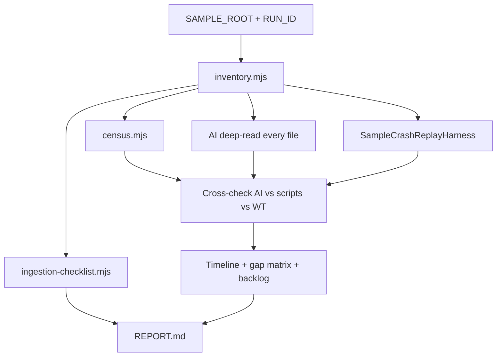

# Log Sample Gap Research Playbook

> **For agentic workers:** REQUIRED SUB-SKILL: Use superpowers:subagent-driven-development (recommended) or superpowers:executing-plans to implement this plan task-by-task. Steps use checkbox (`- [ ]`) syntax for tracking.

**Goal:** Build a reusable sample-gap research toolkit, then run it on a user log/crash dump to produce an incident timeline, WatchTower replay gap matrix, ingestion checklist, and ranked fixture backlog — without changing product classifiers/scanners in this pass. Ground truth requires an **AI forensic deep-read of every corpus file (start→end, every line)**, then a **three-way cross-check** against scripted census and WatchTower replay.

**Pilot census-only status:** Complete — Tasks 1–11 for `2026-08-02-new-samples` (scripts + census + replay + draft backlog) — see `docs/superpowers/research-runs/2026-08-02-new-samples/REPORT.md`.

**Pilot forensic status:** **Complete** — Tasks F1–F6 deep-read (47/47) + cross-check; see `docs/superpowers/research-runs/2026-08-02-new-samples/forensic/` + `REPORT.md`.

**Architecture:** Parameterized playbook. Each run takes `SAMPLE_ROOT` + `RUN_ID`, writes isolated artifacts under `docs/superpowers/research-runs/<RUN_ID>/`, and reuses Node census/inventory scripts plus a Java crash/narrator replay harness gated by `-Dwt.sample.root=…`. After census, the agent deep-reads every non-duplicate scannable file and triangulates AI findings vs scripts vs WatchTower. Timeline-first forensics; ingestion checklist is a required appendix every run.

**Tech Stack:** Node.js (corpus inventory/census), Java 21 + Gradle `:watchtower-core:test` (crash parse/classify/narrate replay), Markdown forensic notes + reports.

**Spec:** [docs/superpowers/specs/2026-08-02-log-sample-gap-research-design.md](../specs/2026-08-02-log-sample-gap-research-design.md)

## How to re-run on new samples

1. Place the dump at `samples/<label>/` with at least `logs/` and usually `crash-reports/`.
2. Choose `RUN_ID` = `YYYY-MM-DD-<short-label>` (never reuse an existing run folder).
3. Tell the agent:

> Run the log sample gap research playbook on `samples/<label>/` with `RUN_ID=<id>` per `docs/superpowers/specs/2026-08-02-log-sample-gap-research-design.md` and this plan. Skip Tasks 1–4 if the toolkit already exists and still matches the plan; execute Tasks 5–11 **and** Tasks F1–F6 (AI forensic deep-read + cross-check + timeline/gap refresh). Do not treat census alone as ground truth.

4. Review `docs/superpowers/research-runs/<RUN_ID>/REPORT.md`, `forensic/cross-check.md`, and `fixture-backlog.md`. Open a separate implementation plan only if you want code fixes.

## Global Constraints

- Research only: no product classifier/scanner/narrator/UI behavior changes in this pass (test/tools harnesses allowed).
- Full corpus every run — all rotates, debug*, kubejs, Jade, nested archives; dedupe archives before counts **and** before deep-read.
- **AI forensic deep-read is mandatory:** every non-duplicate scannable file, start→end, every line; write per-file notes + `forensic/manifest.json` with `read_complete: true` for each.
- Scripted census is a **companion** for counts/coverage — never a substitute for deep-read.
- **Three-way cross-check required:** AI forensic notes ↔ census ↔ WatchTower replay/code map; document disagreements in `forensic/cross-check.md`.
- Verification = code map + runtime replay; do not invent WatchTower output.
- Gap scoring = full operator path (kind + surfacing + Fix/advice quality).
- Advisory only forever; plain English; display brand **WatchTower**; no Modrinth download claims; no auto-restart.
- NeoForge 1.21.x / Java 21 primary lane for replay harness.
- WatchTower log lines in the pack are not the incident unless evidence says so.
- Every run writes a fresh `docs/superpowers/research-runs/<RUN_ID>/` directory (forensic re-pass on the pilot may add `forensic/` under the existing OUT_DIR).

## Run inputs (set before Task 5)

| Variable | First run value | Future runs |
| -------- | ----------------- | ----------- |
| `SAMPLE_ROOT` | `samples/new samples 02.08.2026` | `samples/<label>` |
| `RUN_ID` | `2026-08-02-new-samples` | `YYYY-MM-DD-<short-label>` |
| `OUT_DIR` | `docs/superpowers/research-runs/2026-08-02-new-samples` | `docs/superpowers/research-runs/<RUN_ID>` |
| `REPO_ROOT` | repo root (`D:/mc-status` locally) | same |

## File structure

| File | Responsibility |
| ---- | -------------- |
| `tools/sample-gap-research/README.md` | Operator/agent how-to for any run |
| `tools/sample-gap-research/lib/patterns.mjs` | Shared signal pattern catalog (+ WT reader hints) |
| `tools/sample-gap-research/inventory.mjs` | Walk SAMPLE_ROOT → inventory.json (+ archive dedupe) |
| `tools/sample-gap-research/census.mjs` | Full-corpus pattern census → census.json |
| `tools/sample-gap-research/ingestion-checklist.mjs` | File-class × WT reader coverage → ingestion-checklist.md |
| `tools/sample-gap-research/templates/*.md` | Empty shells for timeline / gap-matrix / fixture-backlog / REPORT |
| `watchtower-core/.../research/SampleCrashReplayHarness.java` | Parse → classify → narrate → JSON (test harness) |
| `watchtower-core/.../research/SampleCrashReplayHarnessTest.java` | Enabled only when `-Dwt.sample.root` set |
| `docs/superpowers/research-runs/<RUN_ID>/*` | Per-run artifacts (never commit secrets; samples may be large) |
| `docs/superpowers/research-runs/<RUN_ID>/forensic/files/*.md` | Per-file AI deep-read notes (one note per non-duplicate scannable file) |
| `docs/superpowers/research-runs/<RUN_ID>/forensic/manifest.json` | Proof every file was deep-read (`read_complete`) |
| `docs/superpowers/research-runs/<RUN_ID>/forensic/cross-check.md` | AI ↔ census ↔ WatchTower triangulation |
| Prior art to learn from (do not hard-code its paths): `tools/analyze-log-corpus.mjs` | Older fixtures/server-logs auditor — pattern ideas only |



---

### Task 1: Playbook README + run templates

**Files:**
- Create: `tools/sample-gap-research/README.md`
- Create: `tools/sample-gap-research/templates/timeline.md`
- Create: `tools/sample-gap-research/templates/gap-matrix.md`
- Create: `tools/sample-gap-research/templates/fixture-backlog.md`
- Create: `tools/sample-gap-research/templates/REPORT.md`
- Create: `docs/superpowers/research-runs/.gitkeep`

**Interfaces:**
- Consumes: none
- Produces: documented CLI contract:

```text
node tools/sample-gap-research/inventory.mjs --sample <SAMPLE_ROOT> --out <OUT_DIR>
node tools/sample-gap-research/census.mjs --sample <SAMPLE_ROOT> --out <OUT_DIR> --inventory <OUT_DIR>/inventory.json
node tools/sample-gap-research/ingestion-checklist.mjs --inventory <OUT_DIR>/inventory.json --out <OUT_DIR>/ingestion-checklist.md
./gradlew :watchtower-core:test --tests "*.SampleCrashReplayHarnessTest" -Dwt.sample.root=<abs-or-repo-relative> -Dwt.research.out=<OUT_DIR>
```

- [ ] **Step 1: Write README with reuse instructions**

Create `tools/sample-gap-research/README.md` containing:

```markdown
# Sample gap research toolkit

Reusable corpus → gap audit → fixture backlog helpers for WatchTower.

## Inputs
- `--sample` / `SAMPLE_ROOT`: folder with `logs/` and optional `crash-reports/`
- `--out` / `OUT_DIR`: `docs/superpowers/research-runs/<RUN_ID>/`
- Java: `-Dwt.sample.root=...` `-Dwt.research.out=...`

## Spec / plan
- docs/superpowers/specs/2026-08-02-log-sample-gap-research-design.md
- docs/superpowers/plans/2026-08-02-log-sample-gap-research.md

## Do not
- Change product classifiers in a research run
- Reuse an existing RUN_ID folder
- Double-count files inside mega.tar.gz / nested archives that already exist as peers
```

- [ ] **Step 2: Write Markdown templates**

`templates/gap-matrix.md`:

```markdown
# Gap matrix — RUN_ID

| id | ground_truth | wt_failure_kind | wt_primary | wt_fix_summary | tags | severity | notes |
| -- | ------------ | --------------- | ---------- | ---------------- | ---- | -------- | ----- |
```

`templates/fixture-backlog.md`:

```markdown
# Fixture backlog — RUN_ID

## Entry template
- id:
- title:
- source_files:
- ground_truth:
- expected.failure_kind:
- expected.issue_id:
- expected.primary_mod:
- expected.fix_must_include:
- expected.fix_must_not:
- proposed_fixture_dir:
- wt_gap_tags:
- severity:
- suggested_code_touch:
- acceptance:
```

`templates/timeline.md` and `templates/REPORT.md` should include section headings: Summary, Day-by-day, Ranked hurts vs noise, Crashes, Soft signals, Gaps, Backlog pointer, Ingestion appendix pointer.

- [ ] **Step 3: Add research-runs keep file**

Create empty `docs/superpowers/research-runs/.gitkeep`.

- [ ] **Step 4: Commit**

```bash
git add tools/sample-gap-research/README.md tools/sample-gap-research/templates docs/superpowers/research-runs/.gitkeep
git commit -m "docs(tools): scaffold reusable sample-gap research playbook"
```

---

### Task 2: Shared pattern catalog

**Files:**
- Create: `tools/sample-gap-research/lib/patterns.mjs`

**Interfaces:**
- Consumes: none
- Produces:

```js
export const SIGNAL_PATTERNS = [
  // ids defined in Step 1: server_done, server_stop, tick_lag_cant_keep_up,
  // watchdog_fatal, oom_heap, nosuchmethod, spark_profiler_inactive,
  // sable_body_removed, jade_invwrapper_npe, kubejs_recipe_parse,
  // createfood_recipe, distxform_client, loot_parse, db_addon_fail,
  // player_join, opac_better_commands
];

export function modErrorCategory(line) { /* subset mirroring ModErrorCategory — rules in Step 1 */ }
export function matchSignals(line) { /* returns pattern ids hit — implementation in Step 1 */ }
```

- [ ] **Step 1: Implement `patterns.mjs` with at least these ids**

Include entries (copy exact `id` values — later tasks rely on them):

```js
export const SIGNAL_PATTERNS = [
  { id: 'server_done', re: /Done \(\d+\.?\d*s\)! For help/i, category: 'lifecycle', wt_readers: ['LogScanner'], logscanner_field: 'server_started', should_be_issue: false, default_severity: 1 },
  { id: 'server_stop', re: /Stopping server/i, category: 'lifecycle', wt_readers: ['LogScanner'], logscanner_field: 'clean_shutdown', should_be_issue: false, default_severity: 1 },
  { id: 'tick_lag_cant_keep_up', re: /Can't keep up/i, category: 'tick_lag', wt_readers: ['LogScanner', 'OpsLogTailScanner'], logscanner_field: 'cant_keep_up_*', should_be_issue: true, default_severity: 4 },
  { id: 'watchdog_fatal', re: /ServerHangWatchdog|Server Watchdog\/FATAL|single server tick took/i, category: 'watchdog', wt_readers: ['CrashReportScanner', 'LogScanner'], logscanner_field: 'WATCHDOG_FATAL_LOG', should_be_issue: true, default_severity: 5 },
  { id: 'oom_heap', re: /OutOfMemoryError|Java heap space/i, category: 'oom', wt_readers: ['LogScanner'], logscanner_field: 'oom_evidence', should_be_issue: true, default_severity: 5 },
  { id: 'nosuchmethod', re: /NoSuchMethodError/i, category: 'mod_compat', wt_readers: ['CrashReportScanner', 'CrashClassifier'], logscanner_field: 'none', should_be_issue: true, default_severity: 5 },
  { id: 'spark_profiler_inactive', re: /Profiler job no longer active/i, category: 'shutdown_noise', wt_readers: ['CrashReportScanner'], logscanner_field: 'none', should_be_issue: false, default_severity: 2 },
  { id: 'sable_body_removed', re: /Body has been removed/i, category: 'mod_runtime', wt_readers: ['CrashReportScanner'], logscanner_field: 'none', should_be_issue: true, default_severity: 5 },
  { id: 'jade_invwrapper_npe', re: /InvWrapper\.getInv\(\)|snownee\.jade/i, category: 'sidecar', wt_readers: [], logscanner_field: 'none', should_be_issue: true, default_severity: 3 },
  { id: 'kubejs_recipe_parse', re: /Failed to parse recipe|KubeRecipe/i, category: 'recipe_noise', wt_readers: ['ModLogAnalyzer'], logscanner_field: 'none', should_be_issue: true, default_severity: 3 },
  { id: 'createfood_recipe', re: /createfood:/i, category: 'recipe_noise', wt_readers: ['ModLogAnalyzer'], logscanner_field: 'none', should_be_issue: false, default_severity: 2 },
  { id: 'distxform_client', re: /RuntimeDistCleaner\/DISTXFORM|invalid dist DEDICATED_SERVER/i, category: 'boot_noise', wt_readers: ['ModLogAnalyzer'], logscanner_field: 'none', should_be_issue: false, default_severity: 2 },
  { id: 'loot_parse', re: /Couldn't parse element ResourceKey.*loot_table/i, category: 'datapack', wt_readers: ['ModLogAnalyzer', 'StartupProfileScanner'], logscanner_field: 'none', should_be_issue: true, default_severity: 3 },
  { id: 'db_addon_fail', re: /Database connection failed/i, category: 'addon_config', wt_readers: ['ModLogAnalyzer'], logscanner_field: 'none', should_be_issue: true, default_severity: 3 },
  { id: 'player_join', re: /joined the game/i, category: 'activity', wt_readers: ['OpsLogTailScanner', 'LogScanner'], logscanner_field: 'PLAYER_JOIN', should_be_issue: false, default_severity: 1 },
  { id: 'opac_better_commands', re: /opac_better_commands/i, category: 'mod_compat', wt_readers: ['CrashReportScanner'], logscanner_field: 'none', should_be_issue: true, default_severity: 5 },
];

export function matchSignals(line) {
  const hits = [];
  for (const p of SIGNAL_PATTERNS) {
    if (p.re.test(line)) hits.push(p.id);
  }
  return hits;
}
```

Also export `modErrorCategory(line)` adapted from `tools/analyze-log-corpus.mjs` (same rules: `client_on_server`, `loot_parse`, `recipe_format`, `logger_error`, skip `dev.mcstatus.watchtower` as `engine_packaging`).

- [ ] **Step 2: Sanity-check patterns in Node**

Run:

```bash
node --input-type=module -e "import { matchSignals } from './tools/sample-gap-research/lib/patterns.mjs'; console.log(matchSignals(\"Can't keep up! Is the server overloaded?\"));"
```

Expected: prints `[ 'tick_lag_cant_keep_up' ]` (and possibly others only if those substrings appear).

- [ ] **Step 3: Commit**

```bash
git add tools/sample-gap-research/lib/patterns.mjs
git commit -m "feat(tools): add shared signal patterns for sample-gap research"
```

---

### Task 3: Inventory + census scripts

**Files:**
- Create: `tools/sample-gap-research/inventory.mjs`
- Create: `tools/sample-gap-research/census.mjs`

**Interfaces:**
- Consumes: `SIGNAL_PATTERNS`, `matchSignals`, `modErrorCategory` from `./lib/patterns.mjs`
- Produces:
  - `inventory.json` schema:

```json
{
  "schema": "sample-gap-inventory-v1",
  "sample_root": "samples/...",
  "generated_at": "ISO-8601",
  "files": [
    {
      "rel": "logs/latest.log",
      "kind": "latest|debug|rotate_gz|debug_gz|crash|kubejs|jade|archive|other",
      "bytes": 0,
      "sha256": "optional-for-archives",
      "duplicate_of": null
    }
  ],
  "dedupe": { "archive": "logs/mega.tar.gz", "skipped_members": ["2026-08-01-1.log.gz"] }
}
```

  - `census.json` schema:

```json
{
  "schema": "sample-gap-census-v1",
  "sample_root": "...",
  "files": [
    {
      "rel": "logs/2026-08-01-5.log.gz",
      "line_count": 0,
      "time_start": null,
      "time_end": null,
      "signal_counts": { "tick_lag_cant_keep_up": 207 },
      "error_lines": 0,
      "mod_error_category_hits": {},
      "samples": { "tick_lag_cant_keep_up": { "line_no": 12, "text": "..." } }
    }
  ],
  "totals": { "tick_lag_cant_keep_up": 0 }
}
```

- [ ] **Step 1: Implement `inventory.mjs`**

Must:

1. Recursively list under `--sample` (follow `logs/` and `crash-reports/`; also accept flat dumps).
2. Classify `kind` by name/path (`JadeErrorOutput.txt` → `jade`, `kubejs/` → `kubejs`, `*.log.gz` → `rotate_gz` or `debug_gz`).
3. If `*.tar.gz` / `*.zip` present: list members; when a member basename already exists as a peer file under `logs/`, mark inventory entry `duplicate_of` and add to `dedupe.skipped_members`.
4. Write `--out/inventory.json`. Create `--out` if missing.

CLI parse: support `--sample` and `--out` (no positional-only).

- [ ] **Step 2: Implement `census.mjs`**

Must:

1. Read inventory; skip files with `duplicate_of != null`.
2. Stream `.log` / `.txt`; gunzip `.gz` via `zlib.createGunzip()`; skip nested archives already deduped.
3. For each line: `matchSignals`, count ERROR lines, `modErrorCategory`.
4. Parse NeoForge timestamps with the same month map as `tools/analyze-log-corpus.mjs` (`[02Aug2026 15:32:57.758]`).
5. Write `census.json` with per-file + `totals`.

- [ ] **Step 3: Smoke on first-run sample**

```bash
mkdir -p "docs/superpowers/research-runs/2026-08-02-new-samples"
node tools/sample-gap-research/inventory.mjs --sample "samples/new samples 02.08.2026" --out "docs/superpowers/research-runs/2026-08-02-new-samples"
node tools/sample-gap-research/census.mjs --sample "samples/new samples 02.08.2026" --out "docs/superpowers/research-runs/2026-08-02-new-samples" --inventory "docs/superpowers/research-runs/2026-08-02-new-samples/inventory.json"
```

Expected: `inventory.json` lists ≥6 crashes + latest/debug + gz + jade + kubejs; `census.json` totals include `tick_lag_cant_keep_up` > 0 and `jade_invwrapper_npe` > 0 when Jade file scanned.

- [ ] **Step 4: Commit toolkit (not necessarily huge run JSON if too large — commit scripts; run JSON can be committed if small enough)**

```bash
git add tools/sample-gap-research/inventory.mjs tools/sample-gap-research/census.mjs
git commit -m "feat(tools): inventory and census for sample-gap research"
```

---

### Task 4: Ingestion checklist + Java crash replay harness

**Files:**
- Create: `tools/sample-gap-research/ingestion-checklist.mjs`
- Create: `watchtower-core/src/test/java/dev/mcstatus/watchtower/core/research/SampleCrashReplayHarness.java`
- Create: `watchtower-core/src/test/java/dev/mcstatus/watchtower/core/research/SampleCrashReplayHarnessTest.java`

**Interfaces:**
- Consumes: inventory.json; `CrashReportParser.parse`, `CrashClassifier.classify`, `CrashNarrator.narrate`
- Produces:
  - `ingestion-checklist.md` rows: `kind | example path | wt_readers | status (seen|partial|unread) | notes`
  - `crash-replay.json`:

```json
{
  "schema": "sample-gap-crash-replay-v1",
  "sample_root": "...",
  "crashes": [
    {
      "file": "crash-reports/crash-....txt",
      "description": "...",
      "exception": "...",
      "failure_kind": "...",
      "category": "...",
      "primary_mod_id": "...",
      "suspect_mod_id": "...",
      "plain_english": "...",
      "likely_cause": "...",
      "confidence": "...",
      "fix_hints": ["..."],
      "manual_review": false
    }
  ]
}
```

- [ ] **Step 1: Implement ingestion checklist script**

Hard-code the coverage table used for status:

```js
const KIND_READERS = {
  latest: { readers: ['LogScanner', 'OpsLogTailScanner'], status: 'seen' },
  debug: { readers: ['LogScanner'], status: 'seen' },
  rotate_gz: { readers: ['LogScanner', 'GzipLineReader'], status: 'seen' },
  debug_gz: { readers: ['LogScanner', 'GzipLineReader'], status: 'seen' },
  crash: { readers: ['CrashReportScanner', 'CrashMtimeScanner', 'CrashClassifier', 'CrashNarrator'], status: 'seen' },
  kubejs: { readers: ['SilentFailSignatures (partial via latest only)'], status: 'partial', notes: 'Dedicated kubejs/*.log not in LogScanner file set' },
  jade: { readers: [], status: 'unread', notes: 'JadeErrorOutput.txt sidecar not scanned today' },
  archive: { readers: [], status: 'unread', notes: 'Nested archives not auto-ingested; inventory dedupes members' },
  other: { readers: [], status: 'partial', notes: 'Unknown sidecar — review manually' },
};
```

Write Markdown table to `--out`.

- [ ] **Step 2: Write failing harness test gate**

`SampleCrashReplayHarnessTest.java`:

```java
package dev.mcstatus.watchtower.core.research;

import org.junit.jupiter.api.Test;
import org.junit.jupiter.api.condition.EnabledIfSystemProperty;

import java.nio.file.Path;

import static org.junit.jupiter.api.Assertions.assertTrue;

class SampleCrashReplayHarnessTest {

    @Test
    @EnabledIfSystemProperty(named = "wt.sample.root", matches = ".+")
    void replayCrashesToResearchOut() throws Exception {
        Path sampleRoot = Path.of(System.getProperty("wt.sample.root"));
        Path outDir = Path.of(System.getProperty(
                "wt.research.out",
                "docs/superpowers/research-runs/_adhoc"));
        Path written = SampleCrashReplayHarness.replay(sampleRoot, outDir);
        assertTrue(java.nio.file.Files.isRegularFile(written), "missing " + written);
    }
}
```

- [ ] **Step 3: Implement harness**

```java
package dev.mcstatus.watchtower.core.research;

import com.google.gson.Gson;
import com.google.gson.GsonBuilder;
import com.google.gson.JsonArray;
import com.google.gson.JsonObject;
import dev.mcstatus.watchtower.core.analyze.CrashClassifier;
import dev.mcstatus.watchtower.core.analyze.CrashNarrator;
import dev.mcstatus.watchtower.core.collect.CrashReportParser;

import java.nio.charset.StandardCharsets;
import java.nio.file.Files;
import java.nio.file.Path;
import java.time.Instant;
import java.util.ArrayList;
import java.util.Comparator;
import java.util.List;
import java.util.stream.Stream;

public final class SampleCrashReplayHarness {
    private static final Gson GSON = new GsonBuilder().setPrettyPrinting().create();

    private SampleCrashReplayHarness() {}

    public static Path replay(Path sampleRoot, Path outDir) throws Exception {
        Path crashesDir = sampleRoot.resolve("crash-reports");
        if (!Files.isDirectory(crashesDir)) {
            crashesDir = sampleRoot; // allow flat dumps
        }
        List<Path> files = new ArrayList<>();
        try (Stream<Path> s = Files.list(crashesDir)) {
            s.filter(p -> p.getFileName().toString().endsWith(".txt"))
                    .sorted(Comparator.comparing(p -> p.getFileName().toString()))
                    .forEach(files::add);
        }
        JsonObject root = new JsonObject();
        root.addProperty("schema", "sample-gap-crash-replay-v1");
        root.addProperty("sample_root", sampleRoot.toString().replace('\\', '/'));
        root.addProperty("generated_at", Instant.now().toString());
        JsonArray crashes = new JsonArray();
        for (Path file : files) {
            String text = Files.readString(file, StandardCharsets.UTF_8);
            CrashReportParser.ParsedCrash parsed = CrashReportParser.parse(text, List.of());
            JsonObject report = new JsonObject();
            report.addProperty("file", relativize(sampleRoot, file));
            parsed.applyTo(report);
            CrashClassifier.Classification c = CrashClassifier.classify(report);
            CrashNarrator.Narrative n = CrashNarrator.narrate(report, new JsonArray());
            JsonObject row = new JsonObject();
            row.addProperty("file", relativize(sampleRoot, file));
            row.addProperty("description", report.has("description") ? report.get("description").getAsString() : "");
            row.addProperty("exception", report.has("exception") ? report.get("exception").getAsString() : "");
            row.addProperty("failure_kind", c.failureKind());
            row.addProperty("category", c.category());
            row.addProperty("primary_mod_id", c.primaryModId());
            row.addProperty("suspect_mod_id", c.suspectModId());
            row.addProperty("plain_english", n.plainEnglish());
            row.addProperty("likely_cause", n.likelyCause());
            row.addProperty("confidence", n.confidence());
            row.add("fix_hints", n.fixHints());
            row.addProperty("manual_review", n.manualReview());
            crashes.add(row);
        }
        root.add("crashes", crashes);
        Files.createDirectories(outDir);
        Path out = outDir.resolve("crash-replay.json");
        Files.writeString(out, GSON.toJson(root), StandardCharsets.UTF_8);
        return out;
    }

    private static String relativize(Path root, Path file) {
        try {
            return root.toAbsolutePath().relativize(file.toAbsolutePath()).toString().replace('\\', '/');
        } catch (Exception e) {
            return file.getFileName().toString();
        }
    }
}
```

- [ ] **Step 4: Run replay against first sample**

From repo root (PowerShell-friendly):

```bash
./gradlew :watchtower-core:test --tests "dev.mcstatus.watchtower.core.research.SampleCrashReplayHarnessTest" -Dwt.sample.root="samples/new samples 02.08.2026" -Dwt.research.out="docs/superpowers/research-runs/2026-08-02-new-samples"
```

Expected: PASS; `crash-replay.json` has 6 crash rows with non-empty `failure_kind` and `plain_english`.

- [ ] **Step 5: Run ingestion checklist**

```bash
node tools/sample-gap-research/ingestion-checklist.mjs --inventory "docs/superpowers/research-runs/2026-08-02-new-samples/inventory.json" --out "docs/superpowers/research-runs/2026-08-02-new-samples/ingestion-checklist.md"
```

Expected: Jade `unread`, kubejs `partial`, crash/latest `seen`.

- [ ] **Step 6: Commit harness + script**

```bash
git add tools/sample-gap-research/ingestion-checklist.mjs watchtower-core/src/test/java/dev/mcstatus/watchtower/core/research/
git commit -m "feat(tools): ingestion checklist and crash replay harness for sample research"
```

---

### Task 5: First-run inventory refresh + verify corpus census complete

**Files:**
- Modify/write: `docs/superpowers/research-runs/2026-08-02-new-samples/inventory.json`
- Modify/write: `docs/superpowers/research-runs/2026-08-02-new-samples/census.json`

**Interfaces:**
- Consumes: Task 3 CLIs; `SAMPLE_ROOT` / `OUT_DIR` from Run inputs
- Produces: complete census covering every non-duplicate file

- [ ] **Step 1: Re-run inventory + census for first run**

```bash
node tools/sample-gap-research/inventory.mjs --sample "samples/new samples 02.08.2026" --out "docs/superpowers/research-runs/2026-08-02-new-samples"
node tools/sample-gap-research/census.mjs --sample "samples/new samples 02.08.2026" --out "docs/superpowers/research-runs/2026-08-02-new-samples" --inventory "docs/superpowers/research-runs/2026-08-02-new-samples/inventory.json"
```

- [ ] **Step 2: Verify full-corpus coverage**

Open `inventory.json` and confirm these kinds exist (or explicitly absent with note): `latest`, `debug`, `rotate_gz`, `crash`, `kubejs`, `jade`, `archive`.

Confirm `census.json` `files.length` equals inventory files where `duplicate_of == null` and kind is scannable (`latest|debug|rotate_gz|debug_gz|kubejs|jade|other text`).

- [ ] **Step 3: Spot-check Aug 1 lag**

From census totals / per-file: at least one `2026-08-01-*.log.gz` has `tick_lag_cant_keep_up` ≥ 100 (preliminary scan saw 207 / 153 / 130).

- [ ] **Step 4: Commit run JSON if size is reasonable**

If each JSON is under ~2 MB:

```bash
git add docs/superpowers/research-runs/2026-08-02-new-samples/inventory.json docs/superpowers/research-runs/2026-08-02-new-samples/census.json
git commit -m "docs(research): census first-run sample corpus 2026-08-02"
```

If larger, keep locally and note paths in REPORT only (do not force-commit multi‑MB gz-derived dumps).

---

## Forensic deep-read + triangulation (Tasks F1–F6)

**Required on every run** after inventory/census (and on the pilot sample before closing under the revised spec).  
**Pilot defaults:** `SAMPLE_ROOT=samples/new samples 02.08.2026`, `OUT_DIR=docs/superpowers/research-runs/2026-08-02-new-samples`.

### Task F1: Forensic manifest scaffold

**Files:**
- Create: `docs/superpowers/research-runs/<RUN_ID>/forensic/manifest.json`
- Create: `docs/superpowers/research-runs/<RUN_ID>/forensic/files/` (directory)
- Create: `tools/sample-gap-research/templates/forensic-file-note.md` (if missing)

**Interfaces:**
- Consumes: `inventory.json`
- Produces: manifest with one entry per inventory file:

```json
{
  "schema": "sample-gap-forensic-manifest-v1",
  "sample_root": "...",
  "files": [
    {
      "rel": "logs/2026-08-01-5.log.gz",
      "kind": "rotate_gz",
      "duplicate_of": null,
      "read_complete": false,
      "note_path": "forensic/files/logs__2026-08-01-5.log.gz.md",
      "line_count": null
    }
  ]
}
```

Skip deep-read for rows with `duplicate_of != null` (mark `read_complete: true`, `note_path: null`, note reason `deduped`).

- [ ] **Step 1: Build manifest from inventory** (all files listed; scannable non-dupes `read_complete: false`)
- [ ] **Step 2: Add forensic-file-note template** with sections: Time span, Session phases, Notable events, Player/ops impact, Noise vs hurt, Surprises / script-blind candidates, WT relevance
- [ ] **Step 3: Commit** scaffold + template

```bash
git add tools/sample-gap-research/templates/forensic-file-note.md docs/superpowers/research-runs/<RUN_ID>/forensic/manifest.json
git commit -m "docs(research): scaffold forensic deep-read manifest"
```

---

### Task F2: AI deep-read every non-duplicate scannable file

**Files:**
- Create: one note under `forensic/files/` per non-duplicate scannable file
- Modify: `forensic/manifest.json` (`read_complete`, `line_count`)

**Interfaces:**
- Consumes: SAMPLE_ROOT files + manifest
- Produces: complete forensic notes; every non-dup scannable row `read_complete: true`

**Rules (non-negotiable):**
- Read each file **from the first line to the last line** (decompress `.gz` as needed).
- Do not stop after sampling the head/tail; spam may be summarized only after full traversal with first/last occurrence + approximate volume.
- Parallelize across files with subagents if needed; controller verifies 100% completion against inventory.
- Crashes, latest, debug, every rotate, debug rotates, kubejs, Jade, and other text logs all require notes.

- [ ] **Step 1: Assign file batches** from manifest (`read_complete: false`)
- [ ] **Step 2: Deep-read each file and write its forensic note**
- [ ] **Step 3: Mark `read_complete: true` and set `line_count` when known**
- [ ] **Step 4: Controller audit** — zero remaining `read_complete: false` among non-dup scannable files
- [ ] **Step 5: Commit** forensic notes + updated manifest

```bash
git add docs/superpowers/research-runs/<RUN_ID>/forensic/
git commit -m "docs(research): forensic deep-read notes for full sample corpus"
```

---

### Task F3: Three-way cross-check (AI ↔ census ↔ WatchTower)

**Files:**
- Create: `docs/superpowers/research-runs/<RUN_ID>/forensic/cross-check.md`

**Interfaces:**
- Consumes: forensic notes + manifest, `census.json`, `crash-replay.json`, `code-map.md`, `ingestion-checklist.md`
- Produces: explicit disagreement table + new gap candidates

Required sections:
1. Coverage proof (manifest complete)
2. AI-only finds (scripts missed)
3. Census false positives / noise overcounts
4. WatchTower misses vs AI ground truth (kind / primary / advice / blind / linkage / noise_drown)
5. Cases where scripts and WT agree but AI disagrees (priority product gaps)
6. Pattern-catalog extensions to consider (names only; no product code)

- [ ] **Step 1: Write cross-check.md**
- [ ] **Step 2: Commit**

```bash
git add docs/superpowers/research-runs/<RUN_ID>/forensic/cross-check.md
git commit -m "docs(research): triangulate AI forensic notes vs census vs WatchTower"
```

---

### Task F4: Refresh timeline from forensic notes

**Files:**
- Modify: `docs/superpowers/research-runs/<RUN_ID>/timeline.md`

**Interfaces:**
- Consumes: `forensic/files/*`, `forensic/cross-check.md`, census (supporting counts only)
- Produces: timeline rewritten so day-by-day and crash vignettes cite forensic notes as primary evidence

- [ ] **Step 1: Rewrite Summary / day-by-day / ranked hurts vs noise from deep-read**
- [ ] **Step 2: Update crash vignettes with forensic-confirmed details**
- [ ] **Step 3: Commit**

```bash
git add docs/superpowers/research-runs/<RUN_ID>/timeline.md
git commit -m "docs(research): refresh timeline from forensic deep-read"
```

---

### Task F5: Refresh gap matrix + fixture backlog from triangulation

**Files:**
- Modify: `docs/superpowers/research-runs/<RUN_ID>/gap-matrix.md`
- Modify: `docs/superpowers/research-runs/<RUN_ID>/fixture-backlog.md`

**Interfaces:**
- Consumes: cross-check.md, refreshed timeline, crash-replay.json
- Produces: gap rows for every triangulation miss; P0/P1 backlog entries updated/added with full required fields

- [ ] **Step 1: Update gap-matrix** (include AI-only and script/WT disagreement rows)
- [ ] **Step 2: Update fixture-backlog** (all new P0/P1; keep Jade/recipe P2 minimum)
- [ ] **Step 3: Commit**

```bash
git add docs/superpowers/research-runs/<RUN_ID>/gap-matrix.md docs/superpowers/research-runs/<RUN_ID>/fixture-backlog.md
git commit -m "docs(research): refresh gaps and backlog after forensic triangulation"
```

---

### Task F6: Refresh REPORT + verification bar (forensic complete)

**Files:**
- Modify: `docs/superpowers/research-runs/<RUN_ID>/REPORT.md`
- Modify: `tools/sample-gap-research/README.md` (verification bar must include forensic items)

**Interfaces:**
- Consumes: all prior artifacts including `forensic/`
- Produces: REPORT stating forensic deep-read complete; verification bar fully ticked under revised spec

- [x] **Step 1: Update REPORT** — add forensic package + cross-check pointers; executive summary must mention deep-read + triangulation
- [x] **Step 2: Tick revised verification bar** (see Global / Spec — includes manifest + cross-check)
- [x] **Step 3: Commit**

```bash
git add docs/superpowers/research-runs/<RUN_ID>/REPORT.md tools/sample-gap-research/README.md
git commit -m "docs(research): mark forensic deep-read pass complete"
```

---

### Task 6: Ground-truth timeline narrative

**Files:**
- Create: `docs/superpowers/research-runs/2026-08-02-new-samples/timeline.md`

**Interfaces:**
- Consumes: `forensic/files/*` (primary), `forensic/cross-check.md`, `census.json` (supporting counts), crash files, `crash-replay.json`
- Produces: plain-English day-by-day narrative + ranked hurts vs noise rooted in deep-read

- [ ] **Step 1: Copy template and fill Summary**

Start from `tools/sample-gap-research/templates/timeline.md`. Summary must answer: pack/MC/loader, host hints, what repeatedly killed the server vs what was noise — citing forensic notes, not census alone.

- [ ] **Step 2: Write day-by-day from forensic notes**

For each calendar day: synthesize from the deep-read notes for that day’s files; use census only for volume. Include boots, stops, cant-keep-up, notable ERROR themes, crashes.

- [ ] **Step 3: Write crash vignettes**

One subsection per crash file. State **preliminary → confirmed** ground truth using crash text + replay:

1. Spark profiler inactive on shutdown  
2. opac_better_commands NSM (command)  
3. opac_better_commands NSM (chat listener)  
4. Watchdog follow-up after #3  
5. Sable body removed on sublevel save  
6. Watchdog follow-up after #5  

Explicitly mark follow-ups as `linkage` candidates.

- [ ] **Step 4: Ranked hurts vs noise**

Two lists:

- Hurts: OPAC API mismatch, Sable body-removed, chronic tick lag  
- Noise: createfood recipe flood, DISTXFORM, Spark shutdown crash, Jade sidecar (non-fatal but real)

- [ ] **Step 5: Commit**

```bash
git add docs/superpowers/research-runs/2026-08-02-new-samples/timeline.md
git commit -m "docs(research): timeline for 2026-08-02 sample corpus"
```

---

### Task 7: Code map appendix (reusable section in REPORT)

**Files:**
- Create: `docs/superpowers/research-runs/2026-08-02-new-samples/code-map.md`

**Interfaces:**
- Consumes: WatchTower sources listed below
- Produces: signal → reader/classifier/advisor map for this run (copy-forwardable)

- [ ] **Step 1: Map each census signal id to code**

Read and cite these paths (absolute-friendly from repo root):

- `watchtower-core/src/main/java/dev/mcstatus/watchtower/core/collect/GzipLineReader.java`
- `watchtower-core/src/main/java/dev/mcstatus/watchtower/core/collect/LogScanner.java`
- `watchtower-core/src/main/java/dev/mcstatus/watchtower/core/ops/OpsLogTailScanner.java`
- `watchtower-core/src/main/java/dev/mcstatus/watchtower/core/collect/LogPatterns.java`
- `watchtower-core/src/main/java/dev/mcstatus/watchtower/core/collect/CrashReportScanner.java`
- `watchtower-core/src/main/java/dev/mcstatus/watchtower/core/analyze/CrashClassifier.java`
- `watchtower-core/src/main/java/dev/mcstatus/watchtower/core/analyze/CrashNarrator.java`
- `watchtower-core/src/main/java/dev/mcstatus/watchtower/core/collect/ModLogAnalyzer.java`
- `watchtower-core/src/main/java/dev/mcstatus/watchtower/core/collect/SilentFailSignatures.java`
- `watchtower-core/src/main/java/dev/mcstatus/watchtower/core/ops/IssuesLiveEvaluators.java`

Table columns: `signal_id | wt_component | captures? (yes/no/partial) | notes`

- [ ] **Step 2: Document known limits that matter for this corpus**

Must include: OpsLogTail 4 MB/scan; crash enrich budget; kubejs sidecar partial; Jade unread; recipe WARN flood risk; watchdog follow-up linkage.

- [ ] **Step 3: Commit**

```bash
git add docs/superpowers/research-runs/2026-08-02-new-samples/code-map.md
git commit -m "docs(research): WatchTower code map for sample gap run"
```

---

### Task 8: Gap matrix (full operator path)

**Files:**
- Create: `docs/superpowers/research-runs/2026-08-02-new-samples/gap-matrix.md`

**Interfaces:**
- Consumes: timeline.md, crash-replay.json, census.json, code-map.md, ingestion-checklist.md, `forensic/cross-check.md`, forensic notes
- Produces: one row per miss; tags from spec (`blind|wrong_kind|wrong_primary|no_surface|bad_advice|noise_drown|linkage`); severity P0–P3; include triangulation disagreements as gap rows

- [ ] **Step 1: Seed rows from suspected backlog (confirm or reject each)**

For each seed, write a matrix row after comparing ground truth to `crash-replay.json` / census:

1. Spark shutdown crash advice quality  
2. opac NSM classification + Fix text (API mismatch vs generic mod_runtime)  
3. Watchdog follow-up linkage (20:43 and 21:50)  
4. Sable body-removed primary + advice  
5. JadeErrorOutput blind  
6. createfood/KubeJS recipe flood noise_drown  
7. DISTXFORM / loot-parse spam  

- [ ] **Step 2: Add any new misses found in census/replay not in the seed list**

Every new miss needs: id, ground_truth, wt fields, tags, severity, notes.

- [ ] **Step 3: Ensure every crash has a row**

Even “no gap / acceptable” crashes get a row with tags empty or `ok` note — proves replay was reviewed.

- [ ] **Step 4: Commit**

```bash
git add docs/superpowers/research-runs/2026-08-02-new-samples/gap-matrix.md
git commit -m "docs(research): gap matrix for 2026-08-02 sample corpus"
```

---

### Task 9: Ranked fixture backlog

**Files:**
- Create: `docs/superpowers/research-runs/2026-08-02-new-samples/fixture-backlog.md`

**Interfaces:**
- Consumes: gap-matrix.md
- Produces: backlog entries with all required fields from the spec

- [ ] **Step 1: Create one backlog entry per P0/P1 gap**

Required fields (all must be filled — no blanks):

```markdown
### FB-01 — <title>
- id: FB-01
- title: ...
- source_files: [`samples/new samples 02.08.2026/crash-reports/...`]
- ground_truth: ...
- expected.failure_kind: ...
- expected.issue_id: (or `n/a`)
- expected.primary_mod: ...
- expected.fix_must_include: ["..."]
- expected.fix_must_not: ["..."]
- proposed_fixture_dir: `samples/fixtures/crash-intelligence/<slug>/`
- wt_gap_tags: [bad_advice, wrong_kind]
- severity: P0
- suggested_code_touch: CrashClassifier, CrashNarrator
- acceptance: Golden test fails today on failure_kind/Fix assertion X; passes after implementation plan lands.
```

- [ ] **Step 2: Add P2 entries for Jade blind + recipe noise (at least)**

Same schema; severity P2.

- [ ] **Step 3: Rank list P0 → P3**

Number entries in recommended implementation order.

- [ ] **Step 4: Commit**

```bash
git add docs/superpowers/research-runs/2026-08-02-new-samples/fixture-backlog.md
git commit -m "docs(research): fixture backlog from 2026-08-02 sample gaps"
```

---

### Task 10: Final REPORT + playbook verification bar

**Files:**
- Create: `docs/superpowers/research-runs/2026-08-02-new-samples/REPORT.md`
- Modify: `tools/sample-gap-research/README.md` (add “Verification bar” checklist if missing)

**Interfaces:**
- Consumes: all prior run artifacts
- Produces: single operator-facing research report + confirmed reusable checklist

- [ ] **Step 1: Write REPORT.md**

Sections (required):

1. Run metadata (`SAMPLE_ROOT`, `RUN_ID`, date, agent/human)  
2. Executive summary (5–10 lines plain English)  
3. Pointers to timeline / gap-matrix / fixture-backlog / ingestion-checklist / crash-replay / census / **forensic/manifest.json** / **forensic/cross-check.md**  
4. Top P0/P1 recommendations (names only — details live in backlog)  
5. Explicit “no product code changed” statement  
6. Next step: open implementation writing-plans from backlog **or** wait for more samples  

- [ ] **Step 2: Tick verification bar**

All must be true:

- [ ] Every file class on ingestion checklist  
- [ ] Every crash has ground-truth + replay row  
- [ ] Full-corpus census completed  
- [ ] **Every non-duplicate scannable file has forensic `read_complete: true` + note**  
- [ ] **`forensic/cross-check.md` documents AI ↔ census ↔ WT**  
- [ ] Gap matrix covers confirmed miss types  
- [ ] Every P0/P1 has fixture backlog entry with acceptance  
- [ ] No product code changed  

- [ ] **Step 3: Commit report**

```bash
git add docs/superpowers/research-runs/2026-08-02-new-samples/REPORT.md tools/sample-gap-research/README.md
git commit -m "docs(research): complete 2026-08-02 sample gap research report"
```

---

### Task 11: Spec/plan reuse polish (so future you can one-shot it)

**Files:**
- Modify: `docs/superpowers/specs/2026-08-02-log-sample-gap-research-design.md` (Reuse section already present — ensure OUT_DIR path matches this plan)
- Modify: `docs/superpowers/plans/2026-08-02-log-sample-gap-research.md` (this file — add First-run status note at top when complete)

**Interfaces:**
- Consumes: completed first run
- Produces: copy-paste agent prompt frozen in README

- [ ] **Step 1: Add frozen agent prompt to toolkit README**

```markdown
## Agent prompt (copy/paste)

Run the log sample gap research playbook on `SAMPLE_ROOT_HERE` with
`RUN_ID=YYYY-MM-DD-label` per
`docs/superpowers/specs/2026-08-02-log-sample-gap-research-design.md` and
`docs/superpowers/plans/2026-08-02-log-sample-gap-research.md`.

If `tools/sample-gap-research/` already exists and matches the plan, skip Tasks 1–4.
Execute Tasks 5–11 and **Tasks F1–F6** (AI forensic deep-read of every file
start-to-end, every line; three-way cross-check AI vs census vs WatchTower;
refresh timeline/gaps/backlog/REPORT). Write artifacts under
`docs/superpowers/research-runs/<RUN_ID>/`. Do not change product classifiers.
Do not treat census alone as ground truth.
```

- [x] **Step 2: Update pilot status in this plan header**

Pilot header set to:

```markdown
**Pilot forensic status:** Complete — see `docs/superpowers/research-runs/2026-08-02-new-samples/forensic/` + `REPORT.md`
```

(Census-only status kept as Complete; forensic status set Complete after F1–F6.)

- [ ] **Step 3: Commit**

```bash
git add tools/sample-gap-research/README.md docs/superpowers/plans/2026-08-02-log-sample-gap-research.md docs/superpowers/specs/2026-08-02-log-sample-gap-research-design.md
git commit -m "docs: freeze reusable sample-gap research agent prompt"
```

---

## Future runs (cheat sheet)

| Step | Command / action |
| ---- | ---------------- |
| 1 | Drop dump at `samples/<label>/` |
| 2 | Pick new `RUN_ID` |
| 3 | Paste agent prompt from `tools/sample-gap-research/README.md` (includes F1–F6 deep-read) |
| 4 | Confirm `forensic/manifest.json` is 100% `read_complete` for non-dup scannable files |
| 5 | Review `REPORT.md`, `forensic/cross-check.md`, `fixture-backlog.md` |
| 6 | Optional: new implementation plan from P0/P1 backlog only |

## Spec coverage self-check

| Spec requirement | Task |
| ---------------- | ---- |
| Full corpus census | 3, 5 |
| **AI forensic deep-read every file every line** | **F1, F2** |
| **Three-way cross-check AI ↔ scripts ↔ WT** | **F3** |
| Timeline-first narrative (from deep-read) | 6, **F4** |
| Code map | 7 |
| Runtime crash/narrator replay | 4, 8 |
| Ingestion checklist appendix | 4, 10 |
| Gap matrix full operator path | 8, **F5** |
| Fixture backlog with acceptance | 9, **F5** |
| No product code in research pass | Global + 10 + F6 |
| Reuse for future samples | 1, 11 + How to re-run |

## Plain English (end user)

You get a repeatable lab procedure: drop a user’s logs in `samples/…`, run the playbook, and the agent **reads every file start to finish**, compares that careful read to counting scripts and to what WatchTower would say, then writes a folder of gaps and golden-fixture ideas. The pilot census-only pass is not enough under the revised rules until Tasks F1–F6 finish on that dump.
