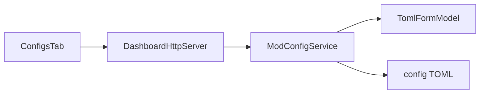

# Mod Config Form Editor (TOML) Implementation Plan

> **For agentic workers:** REQUIRED SUB-SKILL: Use superpowers:subagent-driven-development (recommended) or superpowers:executing-plans to implement this plan task-by-task. Steps use checkbox (`- [ ]`) syntax for tracking.

**Goal:** On Mods → Configs, open `.toml` files as a typed form (sections, toggles, numbers, strings, arrays) when parse succeeds; otherwise keep the raw editor — with clean TOML rewrite on form save and existing backup/undo/audit.

**Architecture:** Add `TomlFormModel` in loader-free `watchtower-core` (TomlJ parse → Gson field tree; hand serializer for clean rewrite). `ModConfigService.read` attaches `editor` + `fields`. Form save accepts `fields` and serializes before the existing backup/write path. React `configs-tab` renders form + Form|Raw; browser never invents TOML.

**Tech Stack:** Java 21 / JUnit 5 (`watchtower-core`), `org.tomlj:tomlj:1.1.1` (shaded like SnakeYAML), NeoForge HTTP (`DashboardHttpServer`), React+Vite Mods UI.

**Spec (write first):** [`docs/superpowers/specs/2026-08-02-mod-config-form-editor-design.md`](docs/superpowers/specs/2026-08-02-mod-config-form-editor-design.md)  
**Supersedes:** raw-only lock in [`docs/superpowers/specs/2026-08-02-mod-config-editor-design.md`](docs/superpowers/specs/2026-08-02-mod-config-editor-design.md)  
**Also copy this plan to:** [`docs/superpowers/plans/2026-08-02-mod-config-form-editor.md`](docs/superpowers/plans/2026-08-02-mod-config-form-editor.md) on first execute task.

## Global Constraints

- Form when TOML parse is clean; raw when not (no half-broken forms)
- TOML forms only — JSON/JSON5/YAML/properties/cfg stay raw
- Clean rewrite on form save (comments may be lost; values correct)
- Schema-from-file — no per-mod hand schemas
- Form|Raw toggle when form available; switching Form→Raw regenerates text from current fields
- Roots: `config/` only; max **512 KiB**; backup + undo + mtime **409** unchanged
- Audit / Activity = path only; secrets masked in list via existing heuristics
- Kill-switch: `MOD_CONFIG_EDIT_ENABLED` (403 all config routes when false)
- Display brand **WatchTower**; plain-English copy
- Platform: NeoForge 1.21.x / Java 21; core loader-free
- Shade TomlJ + ANTLR into core shadowJar (mirror SnakeYAML pattern) — avoid JPMS clashes

## File map

| File | Responsibility |
|------|----------------|
| `docs/superpowers/specs/2026-08-02-mod-config-form-editor-design.md` | Locked design |
| `watchtower-core/build.gradle` | `tomlRuntime` + shade/relocate TomlJ+ANTLR |
| `watchtower-core/.../config/TomlFormModel.java` | parse / serialize / hint extract |
| `watchtower-core/.../config/ModConfigService.java` | attach editor/fields; save from fields |
| `watchtower-neoforge-common/.../DashboardHttpServer.java` | PUT accepts `fields` |
| `web/dashboard/src/features/mods/configs-tab.tsx` | Form UI + Form\|Raw |
| `web/dashboard/src/api/client.ts` | `modsConfigSave` union payload |
| `web/dashboard/scripts/fixture-api-core.ts` | mirror editor/fields |
| `samples/fixtures/mod-config-form/` | trimmed TOML corpus |
| `docs/wiki/Mods.md` + `HTTP-API.md` | docs |



### Field JSON shape (locked)

```json
{
  "kind": "bool|integer|number|string|array|table",
  "key": "bulkPressing",
  "path": "recipes.bulkPressing",
  "section": "recipes",
  "value": false,
  "hint": "Default: false",
  "children": []
}
```

- Root scalars use `section: ""` (UI label **General**)
- `table` nodes have `children[]`; leaf nodes have `value`
- Arrays: `value` is a JSON array (strings/numbers/bools only); nested table-in-array → whole-file raw fallback

---

### Task 1: Design spec on disk

**Files:**
- Create: `docs/superpowers/specs/2026-08-02-mod-config-form-editor-design.md`
- Modify: `docs/superpowers/specs/2026-08-02-mod-config-editor-design.md` — add note at top: superseded for editor UX by form-editor design; sandbox/backup/API roots still apply
- Create: `docs/superpowers/plans/2026-08-02-mod-config-form-editor.md` — copy of this plan

- [ ] **Step 1: Write approved design** (locked decisions, architecture, field JSON, ship-when, non-goals from brainstorming)

- [ ] **Step 2: Commit**

```bash
git add docs/superpowers/specs/2026-08-02-mod-config-form-editor-design.md docs/superpowers/specs/2026-08-02-mod-config-editor-design.md docs/superpowers/plans/2026-08-02-mod-config-form-editor.md
git commit -m "docs: add TOML form config editor design and plan"
```

---

### Task 2: Gradle — shaded TomlJ

**Files:**
- Modify: [`watchtower-core/build.gradle`](watchtower-core/build.gradle)

**Why shade:** NeoForge mod classloaders + ANTLR versions clash easily. Mirror existing `yamlRuntime` / relocate pattern.

- [ ] **Step 1: Add configuration + dependency**

```gradle
configurations {
    protobufRuntime
    yamlRuntime
    tomlRuntime
}

dependencies {
    // ...existing...
    compileOnly 'org.tomlj:tomlj:1.1.1'
    tomlRuntime 'org.tomlj:tomlj:1.1.1'
    testImplementation 'org.tomlj:tomlj:1.1.1'
}

tasks.named('shadowJar', com.github.jengelman.gradle.plugins.shadow.tasks.ShadowJar) {
    configurations = [
        project.configurations.protobufRuntime,
        project.configurations.yamlRuntime,
        project.configurations.tomlRuntime
    ]
    relocate 'com.google.protobuf', 'dev.mcstatus.watchtower.core.internal.protobuf'
    relocate 'org.yaml.snakeyaml', 'dev.mcstatus.watchtower.core.internal.yaml'
    relocate 'org.tomlj', 'dev.mcstatus.watchtower.core.internal.tomlj'
    relocate 'org.antlr', 'dev.mcstatus.watchtower.core.internal.antlr'
    // ...existing exclude/manifest...
}
```

- [ ] **Step 2: Compile check**

Run: `./gradlew :watchtower-core:compileJava -q`  
Expected: PASS

- [ ] **Step 3: Commit** — `build: shade TomlJ into watchtower-core`

---

### Task 3: `TomlFormModel` — parse + serialize + hints (TDD)

**Files:**
- Create: `watchtower-core/src/main/java/dev/mcstatus/watchtower/core/config/TomlFormModel.java`
- Create: `watchtower-core/src/test/java/dev/mcstatus/watchtower/core/config/TomlFormModelTest.java`
- Create: `samples/fixtures/mod-config-form/simple.toml` (flat bools/ints)
- Create: `samples/fixtures/mod-config-form/nested-comments.toml` (trimmed Create-style `[recipes]` snippet from user corpus)
- Create: `samples/fixtures/mod-config-form/bad.toml` (`=` garbage)

**Interfaces:**

```java
public final class TomlFormModel {
  public record ParseResult(boolean formOk, JsonArray fields, List<String> warnings) {}

  /** Parse TOML text. formOk false → use raw editor. */
  public static ParseResult parse(String tomlText);

  /** Clean rewrite from field tree. Throws IllegalArgumentException if tree invalid. */
  public static String serialize(JsonArray fields);

  /** Optional: extract # Default / # Range lines immediately above each key. */
  static Map<String /*dotted path*/, String /*hint*/> extractHints(String tomlText);
}
```

**Parse rules:**
- Use `org.tomlj.Toml.parse` (or relocated package after shade — **in source use `org.tomlj`**; tests use compile classpath)
- If `result.hasErrors()` → `formOk=false`, warnings = error messages
- Walk tables → emit `table` nodes + leaf `bool|integer|number|string|array`
- Array of tables or heterogeneous nested structures → `formOk=false` with warning `unsupported_structure`
- Attach hints onto leaves when `extractHints` has a matching dotted path

**Serialize rules:**
- Emit `# WatchTower form rewrite` header comment (one line) then tables
- Quote strings; booleans lowercase; integers without decimal; doubles as needed
- Arrays as `[ a, b ]` of scalars only

- [ ] **Step 1: Failing tests**

```java
@Test
void parseSimpleOffersForm() {
  String toml = Files.readString(Path.of("samples/fixtures/mod-config-form/simple.toml"));
  var r = TomlFormModel.parse(toml);
  assertTrue(r.formOk());
  assertFalse(r.fields().isEmpty());
}

@Test
void badTomlFallsBack() {
  var r = TomlFormModel.parse("not = = toml");
  assertFalse(r.formOk());
}

@Test
void roundTripNestedValues() {
  String toml = """
      [recipes]
      bulkPressing = false
      maxFireworkIngredientsInCrafter = 9
      """;
  var r = TomlFormModel.parse(toml);
  assertTrue(r.formOk());
  String out = TomlFormModel.serialize(r.fields());
  var again = TomlFormModel.parse(out);
  assertTrue(again.formOk());
  // assert leaf values equal (compare by path map)
}

@Test
void hintsFromDefaultComment() {
  String toml = """
      # Default: 20
      # Range: > 5
      tickrateSyncTimer = 20
      """;
  var r = TomlFormModel.parse(toml);
  assertTrue(r.formOk());
  JsonObject leaf = findByPath(r.fields(), "tickrateSyncTimer");
  assertTrue(leaf.get("hint").getAsString().contains("Default"));
}
```

- [ ] **Step 2: Run FAIL** — `./gradlew :watchtower-core:test --tests "dev.mcstatus.watchtower.core.config.TomlFormModelTest" -q`

- [ ] **Step 3: Implement `TomlFormModel`**

- [ ] **Step 4: Run PASS**

- [ ] **Step 5: Commit** — `feat: TomlFormModel parse serialize and hints`

---

### Task 4: `ModConfigService` — editor on read + fields save

**Files:**
- Modify: [`ModConfigService.java`](watchtower-core/src/main/java/dev/mcstatus/watchtower/core/config/ModConfigService.java)
- Modify: `ModConfigServiceTest.java`

**Interfaces:**
- Consumes: `TomlFormModel.parse` / `serialize`
- Produces:

```java
// read() adds:
//   editor: "form" | "raw"
//   fields: JsonArray (only when editor=form)
//   content: always present
//   parse_warnings: merge existing soft warnings + TomlFormModel warnings

public static JsonObject save(
    Path serverDir, Path watchtowerDir, String relativePath,
    String content, long expectedMtimeEpochSec) throws IOException; // unchanged

/** Serialize fields → TOML then delegate to save(... content ...). */
public static JsonObject saveFields(
    Path serverDir, Path watchtowerDir, String relativePath,
    JsonArray fields, long expectedMtimeEpochSec) throws IOException;
```

**read() logic:**
```
out = existing fields...
if (pathKey.toLowerCase(Locale.ROOT).endsWith(".toml")) {
  ParseResult pr = TomlFormModel.parse(content);
  warnings.addAll(pr.warnings());
  if (pr.formOk()) {
    out.addProperty("editor", "form");
    out.add("fields", pr.fields());
  } else {
    out.addProperty("editor", "raw");
  }
} else {
  out.addProperty("editor", "raw");
}
```

- [ ] **Step 1: Failing tests** — read `.toml` returns `editor=form` + fields; read `.json` returns `editor=raw` without fields; `saveFields` changes file bytes and creates backup; bad fields throw

- [ ] **Step 2–4: Implement + PASS**

- [ ] **Step 5: Commit** — `feat: ModConfigService TOML form read and saveFields`

---

### Task 5: HTTP + fixture API

**Files:**
- Modify: [`DashboardHttpServer.java`](watchtower-neoforge-common/src/main/java/dev/mcstatus/watchtower/DashboardHttpServer.java) `handleModsConfigs` PUT branch (~3862)
- Modify: [`fixture-api-core.ts`](web/dashboard/scripts/fixture-api-core.ts)
- Modify: [`client.ts`](web/dashboard/src/api/client.ts) — widen save payload

**HTTP PUT:**
```
if (body.has("fields") && body.get("fields").isJsonArray()) {
  result = ModConfigService.saveFields(..., body.getAsJsonArray("fields"), expectedMtime);
} else if (body.has("content")) {
  result = ModConfigService.save(..., content, expectedMtime);
} else {
  400 "content or fields required"
}
```

**Fixture:** On GET read of `.toml` from in-memory store, run a **preview-side** lightweight parse (or prebake `editor`/`fields` in `mod-configs.json`). Prefer: store content only; on GET if path ends with `.toml`, call a small TS mirror that builds bool/number/string/section fields for **simple** fixtures, else `editor: raw`. For reliability in preview, bake `fields` into `mod-configs.json` for the sample TOML files.

**Client:**
```ts
modsConfigSave: (payload: {
  path: string;
  expected_mtime: number;
  content?: string;
  fields?: unknown[];
}) => apiFetch(...)
```

- [ ] **Step 1: Wire HTTP + compile** — `./gradlew :watchtower-neoforge-common:compileJava :watchtower-core:test --tests "*ModConfig*" --tests "*TomlForm*" -q`

- [ ] **Step 2: Fixture + client**

- [ ] **Step 3: Commit** — `feat: HTTP and preview for TOML form config save`

---

### Task 6: Configs tab form UI

**Files:**
- Modify: [`configs-tab.tsx`](web/dashboard/src/features/mods/configs-tab.tsx)
- Modify: [`mods.css`](web/dashboard/src/features/mods/mods.css)

**Behavior:**
1. After read: if `editor === 'form'`, default mode `form`; else `raw` only
2. Segmented **Form | Raw** when form available
3. Form: group by `section` (empty → General); collapsible; filter by key search
4. Controls: checkbox/toggle for bool; `input type=number` for integer/number; text for string; textarea JSON for array
5. Show `hint` under field when present
6. Dirty = form values ≠ baseline fields OR raw draft ≠ baseline content
7. Form→Raw: `api` cannot serialize in browser — call a **local** `serializeFieldsClient` that mirrors server rules **or** keep a `previewContent` updated on each form change by posting to a new endpoint. **Locked for v1:** implement `serializeTomlFields(fields): string` in `web/dashboard/src/features/mods/toml-form-serialize.ts` matching server rules (duplicate logic, covered by fixture smoke). Diff uses that string when saving from form mode via `fields` payload (server is source of truth for written bytes; client string is for diff preview only — after save, reload from server).
8. Save from form: `modsConfigSave({ path, expected_mtime, fields })` — not client-serialized content
9. Save from raw: `{ path, expected_mtime, content }` as today
10. `useCanWrite()` disables edits

- [ ] **Step 1: Implement serialize helper + form render + toggle**

- [ ] **Step 2: Preview smoke** — open `config/create-common.toml` or fixture TOML; flip a bool; Review & save; undo

- [ ] **Step 3: Commit** — `feat: Mods Configs TOML form editor UI`

---

### Task 7: Wiki + packaging verify

**Files:**
- Modify: [`docs/wiki/Mods.md`](docs/wiki/Mods.md) — Configs section: form for TOML, raw fallback, comment rewrite note
- Modify: [`docs/wiki/HTTP-API.md`](docs/wiki/HTTP-API.md) — GET `editor`/`fields`; PUT `fields`
- Run: `node tools/audit-dashboard-packaging.mjs`
- Run: `./gradlew :watchtower-core:test -q`

**Ship-when checklist:**
- [ ] Nested TOML form edit → diff → save → valid TOML; undo restores prior
- [ ] Bad/non-TOML → raw only
- [ ] Form|Raw keeps in-progress edits
- [ ] Viewer cannot save
- [ ] Packaging audit OK (newest jar)

- [ ] **Step 1–3: Docs + verify + fix commit if needed** — `docs: TOML form config editor wiki`

---

## Spec coverage

| Spec item | Task |
|-----------|------|
| Design doc | 1 |
| TomlJ shaded dep | 2 |
| Parse/serialize/hints | 3 |
| Service read/saveFields | 4 |
| HTTP + fixtures | 5 |
| Form UI | 6 |
| Wiki + ship-when | 7 |
| JSON/YAML forms / comment preserve | omitted |

## Plain-English end state

Operators open a `.toml` under **Mods → Configs** and get toggles and sectioned fields instead of a wall of text. If WatchTower cannot parse the file safely, they still get the raw editor. Saves still backup and undo; the rewritten file may drop original comments.
