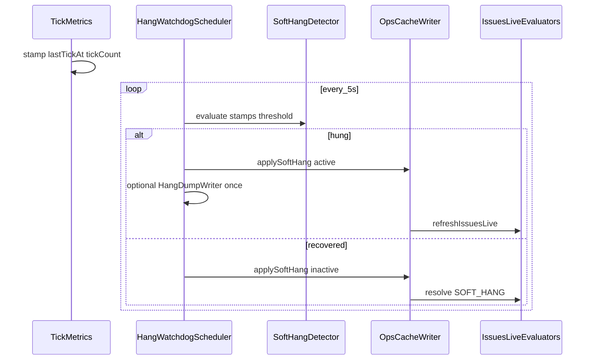

# Soft-Hang / Freeze Issues Implementation Plan

> **For agentic workers:** REQUIRED SUB-SKILL: Use superpowers:subagent-driven-development (recommended) or superpowers:executing-plans to implement this plan task-by-task. Steps use checkbox (`- [ ]`) syntax for tracking.

**Goal:** Detect dedicated-server tick freezes, raise a `SOFT_HANG` Issues card with phase/duration, optionally write one bounded hang dump, wire support quality-gate `hang_dump`, and resolve on recovery — never auto-restart.

**Architecture:** NeoForge tick stamps + ~5s `HangWatchdog` daemon write `ops-cache.soft_hang`; pure core threshold/detector + `IssuesLiveEvaluators.fromSoftHang` map to Issues; opt-in `HangDumpWriter` under `watchtower/hangs/`; SupportQualityGate `hang_dump` uses dump presence.

**Tech Stack:** Java 21, Gradle (`:watchtower-core:test`, `:watchtower-neoforge-common:compileJava`, `:neoforge-1.21:compileJava`), NeoForge 1.21 `ServerTickEvent` / lifecycle, React Issues helpers + fixtures.

**Spec:** [docs/superpowers/specs/2026-08-02-soft-hang-freeze-issues-design.md](../specs/2026-08-02-soft-hang-freeze-issues-design.md)

## Global Constraints

- NeoForge 1.21.x / Java 21 only (`watchtower-core`, `watchtower-neoforge-common`, `mods/neoforge-1.21`, `web/dashboard`).
- Stall requires **both** wall-clock gap on `lastTickAt` **and** unchanged tick count.
- Effective threshold: if `max-tick-time < 0` use `SOFT_HANG_SECONDS` (90); else `max(30, floor(maxTickMs/1000) - 15)`.
- Dump only when `SOFT_HANG_THREAD_DUMP=true`; during hang; `dumpAllThreads(false, false)`; once per episode; ~2 MB cap; off tick thread.
- Issue id exactly `SOFT_HANG`. Never auto-restart. No dashboard Dump-now button in v1.
- Plain English UI copy; display brand **WatchTower**.
- After dashboard changes: `node tools/audit-dashboard-packaging.mjs`.

## File structure

| File | Responsibility |
| ---- | -------------- |
| `watchtower-core/.../analyze/SoftHangThreshold.java` | Pure effective-threshold math |
| `watchtower-core/.../analyze/SoftHangDetector.java` | Pure hung/recovered decision from stamps |
| `watchtower-core/.../analyze/HangDumpWriter.java` | MXBean dump → file, size-capped |
| `watchtower-core/.../ops/OpsCacheSchema.java` | `SOFT_HANG` + field keys |
| `watchtower-core/.../ops/OpsCacheWriter.java` | `applySoftHang` |
| `watchtower-core/.../ops/IssuesLiveEvaluators.java` | `fromSoftHang` + merge/resolve |
| `watchtower-core/.../report/ReportConfig.java` | `SOFT_HANG_*` keys |
| `watchtower-core/.../report/SupportQualityGate.java` | Real `hang_dump` check |
| `watchtower-core/.../report/SupportBundleCatalog.java` | List `watchtower/hangs/` |
| `watchtower-core/.../report/SupportComposer.java` | Include hang dumps in zip |
| `watchtower-neoforge-common/.../HangWatchdogScheduler.java` | Daemon poll, peek write, dump trigger |
| `mods/neoforge-1.21/.../TickMetrics.java` | Stamp `lastTickAtMs` + `tickCount` |
| `mods/neoforge-1.21/.../WatchtowerBootstrap.java` | Start/stop watchdog; phase hooks |
| `tools/watchtower.conf.example` | Document keys |
| `web/dashboard/.../issues/helpers.ts` | `SOFT_HANG` primary action |
| `samples/fixtures/soft-hang/` | Active + recovered peeks |
| `docs/wiki/Issues.md` (+ Health-Reports id row) | Operator note |
| Tests under matching `src/test/java/...` | TDD per task |



---

### Task 1: SoftHangThreshold (TDD)

**Files:**
- Create: `watchtower-core/src/main/java/dev/mcstatus/watchtower/core/analyze/SoftHangThreshold.java`
- Create: `watchtower-core/src/test/java/dev/mcstatus/watchtower/core/analyze/SoftHangThresholdTest.java`

**Interfaces:**
- Consumes: none
- Produces:

```java
public final class SoftHangThreshold {
  public static final int FLOOR_SECONDS = 30;
  public static final int WATCHDOG_LEAD_SECONDS = 15;
  /** @param maxTickTimeMs from server.properties; use -1 when disabled; missing → treat as 60000 */
  public static int effectiveSeconds(long maxTickTimeMs, int softHangSeconds) { ... }
}
```

- [ ] **Step 1: Write failing tests**

```java
@Test
void disabledWatchdogUsesConfSeconds() {
  assertEquals(90, SoftHangThreshold.effectiveSeconds(-1, 90));
}

@Test
void defaultWatchdogIsFortyFive() {
  assertEquals(45, SoftHangThreshold.effectiveSeconds(60_000, 90));
}

@Test
void shortWatchdogFloorsAtThirty() {
  assertEquals(30, SoftHangThreshold.effectiveSeconds(20_000, 90));
}
```

- [ ] **Step 2: Run — expect FAIL**

```bash
./gradlew :watchtower-core:test --tests "dev.mcstatus.watchtower.core.analyze.SoftHangThresholdTest"
```

- [ ] **Step 3: Implement**

```java
public static int effectiveSeconds(long maxTickTimeMs, int softHangSeconds) {
  int base = Math.max(1, softHangSeconds);
  if (maxTickTimeMs < 0) return base;
  long sec = maxTickTimeMs / 1000L;
  long adjusted = sec - WATCHDOG_LEAD_SECONDS;
  return (int) Math.max(FLOOR_SECONDS, adjusted);
}
```

- [ ] **Step 4: Tests PASS**

- [ ] **Step 5: Commit** `feat(soft-hang): add SoftHangThreshold math`

---

### Task 2: SoftHangDetector (TDD)

**Files:**
- Create: `watchtower-core/src/main/java/dev/mcstatus/watchtower/core/analyze/SoftHangDetector.java`
- Create: `watchtower-core/src/test/java/dev/mcstatus/watchtower/core/analyze/SoftHangDetectorTest.java`

**Interfaces:**
- Consumes: threshold seconds from Task 1
- Produces:

```java
public final class SoftHangDetector {
  public record TickStamp(long lastTickAtMs, long tickCount, String phase) {}
  public record PollState(long previousTickCount, boolean wasActive, long hangStartedAtMs) {}
  public record Decision(
      boolean active,
      long stallSeconds,
      long hangStartedAtMs,
      String phase,
      boolean newlyActive,
      boolean newlyRecovered
  ) {}

  public static Decision evaluate(
      TickStamp stamp,
      PollState prev,
      long nowMs,
      int effectiveThresholdSec
  ) { ... }
}
```

Logic:
- `stallSeconds = max(0, (nowMs - stamp.lastTickAtMs()) / 1000)`
- `tickStuck = stamp.tickCount() == prev.previousTickCount()` (first poll after start: treat previousTickCount as stamp.tickCount so not stuck until a poll sees no advance — initialize prev.previousTickCount to `Long.MIN_VALUE` and require `prev.previousTickCount != Long.MIN_VALUE` for stuck, OR: stuck only when `prev.previousTickCount == stamp.tickCount()` after at least one prior poll; HangWatchdog sets previous after each poll)
- `shouldBeActive = stallSeconds >= effectiveThresholdSec && tickStuck`
- If becoming active: `newlyActive=true`, `hangStartedAtMs=nowMs - stallSeconds*1000` (or nowMs)
- If was active and !shouldBeActive: `newlyRecovered=true`

- [ ] **Step 1: Failing tests**

```java
@Test
void bothSignalsRequired() {
  TickStamp s = new TickStamp(0L, 10L, "ticking");
  PollState prev = new PollState(10L, false, 0L);
  Decision d = SoftHangDetector.evaluate(s, prev, 45_000L, 45);
  assertTrue(d.active());
  assertTrue(d.newlyActive());
}

@Test
void wallGapAloneNotEnough() {
  TickStamp s = new TickStamp(0L, 11L, "ticking"); // tick advanced
  PollState prev = new PollState(10L, false, 0L);
  Decision d = SoftHangDetector.evaluate(s, prev, 45_000L, 45);
  assertFalse(d.active());
}

@Test
void recoversWhenTicksResume() {
  TickStamp s = new TickStamp(50_000L, 12L, "ticking");
  PollState prev = new PollState(10L, true, 5_000L);
  Decision d = SoftHangDetector.evaluate(s, prev, 55_000L, 45);
  assertFalse(d.active());
  assertTrue(d.newlyRecovered());
}
```

- [ ] **Step 2: Run — FAIL**

```bash
./gradlew :watchtower-core:test --tests "dev.mcstatus.watchtower.core.analyze.SoftHangDetectorTest"
```

- [ ] **Step 3: Implement minimal `evaluate`**

- [ ] **Step 4: PASS**

- [ ] **Step 5: Commit** `feat(soft-hang): add SoftHangDetector evaluate`

---

### Task 3: ReportConfig + conf.example

**Files:**
- Modify: `watchtower-core/src/main/java/dev/mcstatus/watchtower/core/report/ReportConfig.java` (fields, `fromEnv`, getters, Builder)
- Modify: `tools/watchtower.conf.example`
- Modify or create: `watchtower-core/src/test/java/dev/mcstatus/watchtower/core/report/ReportConfigSoftHangTest.java` (or extend existing ReportConfig test if present)

**Interfaces:**
- Produces getters: `softHangEnabled()`, `softHangSeconds()`, `softHangThreadDump()`, `softHangCooldownMin()`

- [ ] **Step 1: Failing test** — `fromEnv` with map containing `SOFT_HANG_SECONDS=120` asserts `120`; defaults `enabled=true`, `seconds=90`, `threadDump=false`, `cooldownMin=15`

- [ ] **Step 2: Run — FAIL** (getters missing)

- [ ] **Step 3: Add fields mirroring `externalKillDetectEnabled` pattern**

```java
b.softHangEnabled = isTruthy(env.get("SOFT_HANG_ENABLED"), true);
b.softHangSeconds = parseInt(env.get("SOFT_HANG_SECONDS"), 90);
b.softHangThreadDump = isTruthy(env.get("SOFT_HANG_THREAD_DUMP"), false);
b.softHangCooldownMin = parseInt(env.get("SOFT_HANG_COOLDOWN_MIN"), 15);
```

- [ ] **Step 4: Document in `tools/watchtower.conf.example`**

```properties
# Soft hang / freeze Issues (1.1.22)
# SOFT_HANG_ENABLED=true
# SOFT_HANG_SECONDS=90
# SOFT_HANG_THREAD_DUMP=false
# SOFT_HANG_COOLDOWN_MIN=15
```

- [ ] **Step 5: Tests PASS + commit** `feat(soft-hang): add SOFT_HANG_* ReportConfig keys`

---

### Task 4: Ops-cache schema + applySoftHang + fixtures

**Files:**
- Modify: `watchtower-core/src/main/java/dev/mcstatus/watchtower/core/ops/OpsCacheSchema.java`
- Modify: `watchtower-core/src/main/java/dev/mcstatus/watchtower/core/ops/OpsCacheWriter.java`
- Create: `samples/fixtures/soft-hang/active.json`
- Create: `samples/fixtures/soft-hang/recovered.json`
- Create: `watchtower-core/src/test/java/dev/mcstatus/watchtower/core/ops/OpsCacheWriterSoftHangTest.java`

**Interfaces:**
- Schema: `SOFT_HANG = "soft_hang"` plus field constants matching spec (`active`, `phase`, `stall_seconds`, …)
- Produces: `OpsCacheWriter.applySoftHang(Path opsCachePath, JsonObject softHang) throws IOException` — replaces `cache.soft_hang`, touches `updated_at`, returns cache (follow `applyWorldPressure` simplicity: load → set → save)

- [ ] **Step 1: Failing test** — temp ops-cache; apply active object; reload; assert `soft_hang.active == true` and `phase`

- [ ] **Step 2: FAIL**

- [ ] **Step 3: Implement schema + apply + write fixtures**

`active.json` minimal:

```json
{
  "soft_hang": {
    "active": true,
    "phase": "ticking",
    "stall_seconds": 48,
    "effective_threshold_seconds": 45,
    "max_tick_time_ms": 60000,
    "started_at": "2026-08-02T00:00:00Z",
    "last_tick_at": "2026-08-02T00:00:00Z",
    "tick_count": 1200,
    "dump_path": null,
    "recovered_at": null
  }
}
```

- [ ] **Step 4: PASS + commit** `feat(soft-hang): ops-cache soft_hang peek`

---

### Task 5: IssuesLiveEvaluators.fromSoftHang (TDD)

**Files:**
- Modify: `watchtower-core/src/main/java/dev/mcstatus/watchtower/core/ops/IssuesLiveEvaluators.java`
- Modify: `watchtower-core/src/test/java/dev/mcstatus/watchtower/core/ops/IssuesLiveEvaluatorsTest.java`

**Interfaces:**
- Consumes: `cache.soft_hang` from Task 4
- Produces:

```java
public static List<IssuesLiveRecord> fromSoftHang(JsonObject cache) {
  // if active → SOFT_HANG critical, message "Server tick frozen", fix steps, evidence soft_hang
  // if !active → empty list (resolve path in evaluateAndMerge)
}
```

Wire into `evaluateAndMerge` (full overload with all flags):
- `detected.addAll(fromSoftHang(cache));`
- clear: `if (!hasSoftHang) cur = IssuesLiveStore.resolve(cur, "SOFT_HANG", nowIso);`

Cooldown: evaluator does **not** suppress; HangWatchdog (Task 8) avoids writing `active=true` during cooldown. Document that in HangWatchdog.

Fix steps (exact plain English):
1. `Check whether a world save or pregen is stuck.`
2. `If hang dumps are enabled, open the file under watchtower/hangs/.`
3. `Build a Support pack for Discord or a bug report.`
4. `WatchTower will not restart the server for you.`

- [ ] **Step 1: Failing tests**

```java
@Test
void fromSoftHangActiveEmitsSoftHang() { /* load fixture active → id SOFT_HANG, severity critical */ }

@Test
void evaluateAndMergeResolvesWhenInactive() {
  // existing open SOFT_HANG + recovered peek → resolved
}
```

- [ ] **Step 2: FAIL**

- [ ] **Step 3: Implement `fromSoftHang` + merge/resolve**

- [ ] **Step 4: PASS**

```bash
./gradlew :watchtower-core:test --tests "dev.mcstatus.watchtower.core.ops.IssuesLiveEvaluatorsTest"
```

- [ ] **Step 5: Commit** `feat(soft-hang): Issues live SOFT_HANG mapping`

---

### Task 6: HangDumpWriter (TDD)

**Files:**
- Create: `watchtower-core/src/main/java/dev/mcstatus/watchtower/core/analyze/HangDumpWriter.java`
- Create: `watchtower-core/src/test/java/dev/mcstatus/watchtower/core/analyze/HangDumpWriterTest.java`

**Interfaces:**

```java
public final class HangDumpWriter {
  public static final long MAX_BYTES = 2L * 1024L * 1024L;
  /** @return relative path watchtower/hangs/... or null on failure */
  public static Path writeOnce(Path serverDir, String phase, long stallSeconds) { ... }
}
```

- Use `ManagementFactory.getThreadMXBean().dumpAllThreads(false, false)`
- Dir: `serverDir/watchtower/hangs/`
- Filename: `hang-yyyyMMdd-HHmmss.txt`
- Truncate written UTF-8 text to `MAX_BYTES`
- Never throw to caller — catch, return null
- Header lines: phase, stallSeconds, ISO timestamp

- [ ] **Step 1: Failing test** — `@TempDir` serverDir; call writeOnce; assert file exists under `watchtower/hangs`, size ≤ MAX_BYTES, contains `phase`

- [ ] **Step 2: FAIL**

- [ ] **Step 3: Implement**

- [ ] **Step 4: PASS + commit** `feat(soft-hang): HangDumpWriter size-capped dump`

---

### Task 7: TickMetrics stamps + phase helpers

**Files:**
- Modify: `mods/neoforge-1.21/src/main/java/dev/mcstatus/watchtower/neoforge/TickMetrics.java`
- Modify: `mods/neoforge-1.21/src/main/java/dev/mcstatus/watchtower/neoforge/WatchtowerBootstrap.java` (phase setters only in this task if small; else Task 8)

**Interfaces:**

```java
// TickMetrics
private static volatile long lastTickAtMs;
private static volatile long lastTickCount;
private static volatile String phase = "unknown";

public static void onTickPost(...) {
  // existing mspt logic
  lastTickAtMs = System.currentTimeMillis();
  lastTickCount = event.getServer().getTickCount(); // verify 1.21 API; use getTickCount() on MinecraftServer
  if ("starting".equals(phase) || "loading_world".equals(phase)) {
    phase = "ticking";
  }
}
public static long lastTickAtMs() { return lastTickAtMs; }
public static long lastTickCount() { return lastTickCount; }
public static String phase() { return phase; }
public static void setPhase(String p) { phase = p != null ? p : "unknown"; }
public static SoftHangDetector.TickStamp stamp() {
  return new SoftHangDetector.TickStamp(lastTickAtMs, lastTickCount, phase);
}
```

- [ ] **Step 1: Compile check after edits**

```bash
./gradlew :neoforge-1.21:compileJava
```

If `getTickCount()` name differs, use the NeoForge 1.21 server tick counter available on `MinecraftServer` (search usages in repo / MDK).

- [ ] **Step 2: In `WatchtowerBootstrap`:** before start complete set phase `starting`; on `ServerStartedEvent` set `loading_world` then after existing start work set `ticking`; on stopping set `unknown`. Best-effort only — no save hook required for v1 (phase may stay `ticking` during saves).

- [ ] **Step 3: Commit** `feat(soft-hang): tick stamps and phase on TickMetrics`

---

### Task 8: HangWatchdogScheduler

**Files:**
- Create: `watchtower-neoforge-common/src/main/java/dev/mcstatus/watchtower/HangWatchdogScheduler.java`
- Modify: `mods/neoforge-1.21/.../WatchtowerBootstrap.java` — `HangWatchdogScheduler.start(ctx)` after other schedulers; `stop()` in `onServerStopping`

**Interfaces:**
- Pattern: copy structure from `ExternalKillPostmortemScheduler` / `OpsPollScheduler` — daemon `ScheduledExecutorService`, `start`/`stop`, `AtomicBoolean`
- Poll every **5 seconds**
- Read `ReportConfig` via `ModReportConfig.forServer(server)`
- If `!softHangEnabled()` return early each poll
- Read `max-tick-time` from `serverDir/server.properties` (simple Properties load; missing key → `60000`; parse long)
- `effective = SoftHangThreshold.effectiveSeconds(maxTickMs, config.softHangSeconds())`
- `Decision d = SoftHangDetector.evaluate(TickMetrics.stamp(), pollState, now, effective)` — **Note:** `TickMetrics` is in neoforge-1.21 module; HangWatchdog is in neoforge-common. **Do not call TickMetrics from common.**

**Module boundary fix (locked):** Keep `HangWatchdogScheduler` in `mods/neoforge-1.21` next to bootstrap (same pattern as tick-only glue), **or** pass a `Supplier<SoftHangDetector.TickStamp>` / small `SoftHangProbe` interface registered from NeoForge. Prefer **HangWatchdog in `mods/neoforge-1.21`** as `HangWatchdog.java` to avoid common→mod dependency. neoforge-common already depends on core; 1.21 depends on common. Put scheduler in **1.21 module**:

- Create: `mods/neoforge-1.21/src/main/java/dev/mcstatus/watchtower/neoforge/HangWatchdog.java`

On `newlyActive`:
- Build `JsonObject` soft_hang peek (all spec fields)
- If `softHangThreadDump()`: `Path dump = HangDumpWriter.writeOnce(...);` set `dump_path`
- `OpsCacheWriter.applySoftHang(opsPath, peek)`
- `OpsCacheWriter.refreshIssuesLive(...)` with same flags as ops poll (use existing ModReportConfig-driven call site — mirror a nearby refresh call in OpsPollScheduler / Live path)

On `newlyRecovered`:
- Write peek `active=false`, `recovered_at=now`
- refreshIssuesLive
- Record `lastRecoveredAtMs` for cooldown

Cooldown: if `!wasActive` and `now - lastRecoveredAtMs < cooldownMin * 60_000` and would newlyActive → skip writing active (still update pollState tick count)

Parse `max-tick-time` helper as private method in HangWatchdog.

- [ ] **Step 1: Implement HangWatchdog + wire start/stop in bootstrap**

- [ ] **Step 2: Compile**

```bash
./gradlew :neoforge-1.21:compileJava :watchtower-core:test
```

- [ ] **Step 3: Commit** `feat(soft-hang): HangWatchdog daemon writes soft_hang peek`

---

### Task 9: SupportQualityGate hang_dump

**Files:**
- Modify: `watchtower-core/src/main/java/dev/mcstatus/watchtower/core/report/SupportQualityGate.java`
- Modify: `watchtower-core/src/test/java/dev/mcstatus/watchtower/core/report/SupportQualityGateTest.java`

**Interfaces:**
- Replace always-SKIP stub with `checkHangDump(serverDir, ops, opts)`

Rules:
- List `serverDir/watchtower/hangs/*.txt` (or `.log`) — any readable file counts as dump present
- Hang-relevant when: ops `soft_hang.active==true` OR `soft_hang.recovered_at` within last 24h OR options category/note contains `hang`/`freeze` (case-insensitive) OR preset `SERVER_TRIAGE`/`FULL_EVIDENCE` **and** soft_hang block exists (even inactive recent)
- Simpler locked rule for v1:
  - If dump file exists → **PASS** “Hang dump included under watchtower/hangs.”
  - Else if `soft_hang.active` or soft_hang present with `stall_seconds > 0` → **WARN** “No hang dump on disk — enable SOFT_HANG_THREAD_DUMP or attach stacks another way.”
  - Else → **SKIP** “No soft-hang context for this pack.”

- [ ] **Step 1: Replace `hangDumpAlwaysSkipped` test** with pass/warn/skip cases using `@TempDir`

- [ ] **Step 2: FAIL**

- [ ] **Step 3: Implement `checkHangDump`

- [ ] **Step 4: PASS + commit** `feat(soft-hang): quality gate hang_dump check`

---

### Task 10: Support catalog + composer include hangs

**Files:**
- Modify: `watchtower-core/src/main/java/dev/mcstatus/watchtower/core/report/SupportBundleCatalog.java` — add `hangs` array (name, size, mtime, path)
- Modify: `watchtower-core/src/main/java/dev/mcstatus/watchtower/core/report/SupportComposer.java` — for `SERVER_TRIAGE` / `FULL_EVIDENCE` (and when hang files selected), copy newest ≤3 hang dumps into zip under `evidence/hangs/`
- Modify: `SupportComposeOptions` only if a new include flag is required — **prefer** auto-include when preset is SERVER_TRIAGE or FULL_EVIDENCE and files exist (no new conf key)
- Test: extend `SupportComposerTest` or catalog test — temp hangs file appears in catalog JSON

- [ ] **Step 1: Failing catalog test** — create `watchtower/hangs/hang-test.txt`; `SupportBundleCatalog.build` → `hangs` array length ≥ 1

- [ ] **Step 2: Implement list + composer copy (read file bytes; skip if > soft budget individually)

- [ ] **Step 3: PASS + commit** `feat(soft-hang): include hang dumps in support packs`

---

### Task 11: Dashboard Issues + fixture preview

**Files:**
- Modify: `web/dashboard/src/features/issues/helpers.ts` — in `fromLedgerRow`, if `id === 'SOFT_HANG'` set `primaryAction: { label: 'Build support pack', tab: 'support' }` (use the same tab id the rail uses for Support — grep `Build support` / support modal open; if support is modal-only, use `tab: 'overview'` with params or existing support entry — **grep `support` tab ids** and match)
- Modify fixture ops-cache used by preview OR `web/dashboard/scripts/fixture-api-core.ts` to include an `issues_live` row `SOFT_HANG` and `soft_hang` peek from `samples/fixtures/soft-hang/active.json`
- Optional: `helpers.test.ts` assert primary action for SOFT_HANG

- [ ] **Step 1: Grep support navigation**

```bash
rg -n "support|Build support" web/dashboard/src --glob "*.tsx" | head -40
```

Wire primaryAction to the existing Support entry point.

- [ ] **Step 2: Implement helpers + fixture**

- [ ] **Step 3: Packaging**

```bash
node tools/audit-dashboard-packaging.mjs
```

- [ ] **Step 4: Commit** `feat(soft-hang): Issues card action + preview fixture`

---

### Task 12: Wiki + roadmap checkboxes

**Files:**
- Modify: `docs/wiki/Issues.md` — short paragraph on soft hang
- Modify: `docs/wiki/Health-Reports.md` — add `SOFT_HANG` to problem-types table
- Modify: `docs/dev/roadmap/versions/1.1.19-1.1.29-change-safety-and-recovery.md` — tick Ship when (local gitignored ok)
- Ensure this plan exists at `docs/superpowers/plans/2026-08-02-soft-hang-freeze-issues.md` (this file)

Wiki copy:

> If the server process is up but ticks stop, WatchTower raises **Server tick frozen** (`SOFT_HANG`) with phase and how long it has been stuck. Optional hang dumps land under `watchtower/hangs/` when `SOFT_HANG_THREAD_DUMP=true`. WatchTower never restarts the server for you.

- [ ] **Step 1: Edit wiki files**

- [ ] **Step 2: Commit** `docs: soft-hang Issues wiki note`

---

## Verification (end-to-end)

```bash
./gradlew :watchtower-core:test --tests "dev.mcstatus.watchtower.core.analyze.SoftHangThresholdTest" \
  --tests "dev.mcstatus.watchtower.core.analyze.SoftHangDetectorTest" \
  --tests "dev.mcstatus.watchtower.core.analyze.HangDumpWriterTest" \
  --tests "dev.mcstatus.watchtower.core.ops.IssuesLiveEvaluatorsTest" \
  --tests "dev.mcstatus.watchtower.core.report.SupportQualityGateTest"
./gradlew :neoforge-1.21:compileJava
cd web/dashboard && npm run preview
# Issues: SOFT_HANG fixture card visible
node tools/audit-dashboard-packaging.mjs
```

## Spec coverage checklist

- Dual stall signals — Task 2, 7, 8
- Watchdog-aware threshold — Task 1, 8
- Phase on Issue — Task 5, 7
- Opt-in dump during hang, once, capped — Task 6, 8
- SOFT_HANG open/resolve + cooldown — Task 5, 8
- Quality gate hang_dump — Task 9
- Support pack include dumps — Task 10
- Dashboard + fixtures — Task 11
- Wiki/conf — Task 3, 12
- No auto-restart / no Dump-now — Global Constraints

## Plain-English summary (end user)

When the Minecraft server freezes mid-tick, WatchTower notices even if lag charts go quiet, shows a **Server tick frozen** Issue, and can save one hang dump for helpers — without restarting anything for you.
