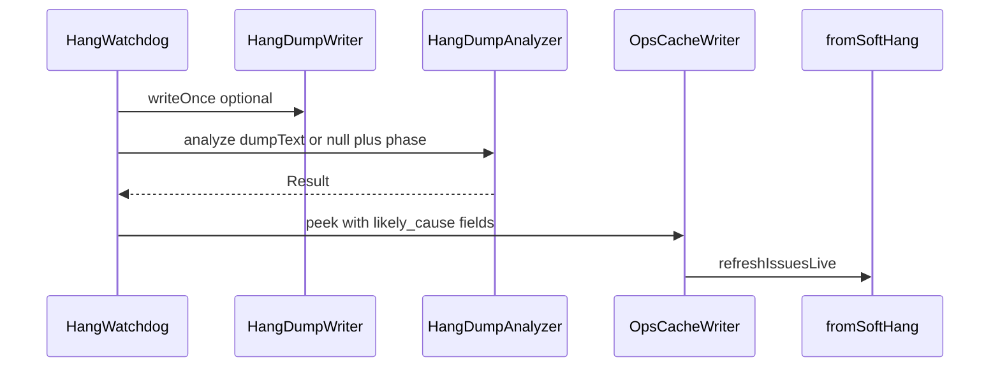

# Soft-Hang Likely Cause Implementation Plan

> **For agentic workers:** REQUIRED SUB-SKILL: Use superpowers:subagent-driven-development (recommended) or superpowers:executing-plans to implement this plan task-by-task. Steps use checkbox (`- [ ]`) syntax for tracking.

**Goal:** After a soft hang is detected, classify a likely cause (category + optional suspect-mod hint), store it on `ops-cache.soft_hang`, and show it on the Issues card Fix steps and Details.

**Architecture:** Pure core `HangDumpAnalyzer` runs once on the HangWatchdog daemon thread when a hang becomes newly active (on dump text if present, else phase-only). Results merge into the soft_hang peek and are preserved on stall refresh. `fromSoftHang` and the React Issues Details surface the fields without re-parsing.

**Tech Stack:** Java 21, Gradle `:watchtower-core:test` / `:neoforge-1.21:compileJava`, React Issues helpers + `queue.tsx`, preview `ops-cache.json`.

**Spec:** [docs/superpowers/specs/2026-08-02-soft-hang-likely-cause-design.md](../specs/2026-08-02-soft-hang-likely-cause-design.md)

## Global Constraints

- NeoForge 1.21.x / Java 21 only.
- Analyze **once** per hang episode (newlyActive); never on tick thread; never per Details open.
- Confidence never above `medium`. Suspect mod is a hint with fixed note: `Hint from the hang dump — not proof.`
- Do not put suspect mod in the Issues list title.
- Primary CTA stays **Build support pack**. Never auto-restart.
- Plain English copy; display brand **WatchTower**.
- After dashboard changes: `node tools/audit-dashboard-packaging.mjs`.

## File structure

| File | Responsibility |
| ---- | -------------- |
| `watchtower-core/.../analyze/HangDumpAnalyzer.java` | Pure analyze(dumpText, phase) → Result |
| `watchtower-core/.../ops/OpsCacheSchema.java` | New soft_hang field key constants |
| `mods/neoforge-1.21/.../HangWatchdog.java` | Call analyzer on newlyActive; preserve on refresh |
| `watchtower-core/.../ops/IssuesLiveEvaluators.java` | Message suffix + category Fix steps |
| `web/dashboard/src/features/issues/helpers.ts` | Enrich metrics with analysis fields |
| `web/dashboard/src/features/issues/queue.tsx` | Details: Likely cause + Suspect mod |
| `web/dashboard/data/ops-cache.json` | Preview soft_hang + SOFT_HANG issue |
| `samples/fixtures/soft-hang/*.txt` | Analyzer unit fixtures |
| `docs/wiki/Issues.md` | One-line operator note |
| Tests under matching `src/test/java/...` | TDD per task |



---

### Task 1: HangDumpAnalyzer (TDD)

**Files:**
- Create: `watchtower-core/src/main/java/dev/mcstatus/watchtower/core/analyze/HangDumpAnalyzer.java`
- Create: `watchtower-core/src/test/java/dev/mcstatus/watchtower/core/analyze/HangDumpAnalyzerTest.java`
- Create fixtures under: `samples/fixtures/soft-hang/`

**Interfaces:**
- Consumes: none
- Produces:

```java
public final class HangDumpAnalyzer {
  public static final String NOTE_HINT = "Hint from the hang dump — not proof.";

  public record Result(
      String likelyCause,           // saving|world_gen|entity_tick|network|deadlock|unknown
      String likelyCauseSummary,
      String likelyCauseConfidence, // low|medium
      String suspectMod,            // nullable
      String suspectModNote         // NOTE_HINT or null
  ) {}

  /** @param dumpText full hang dump or null/blank for phase-only */
  public static Result analyze(String dumpText, String phase) { ... }
}
```

- [ ] **Step 1: Write fixture dumps + failing tests**

Create `samples/fixtures/soft-hang/entity-tick-server-thread.txt` (minimal ThreadInfo-style text with `"Server thread"` and `net.minecraft.world.entity` frames).

Create `samples/fixtures/soft-hang/saving-server-thread.txt` (Server thread + `save` / `FileIO` / `ChunkSerializer` style frames).

Create `samples/fixtures/soft-hang/suspect-mod.txt` (Server thread with `com.example.laggy.ModTick.tick` above vanilla).

```java
@Test
void phaseOnlyTickingMapsToEntityTickLow() {
  HangDumpAnalyzer.Result r = HangDumpAnalyzer.analyze(null, "ticking");
  assertEquals("entity_tick", r.likelyCause());
  assertEquals("low", r.likelyCauseConfidence());
  assertNull(r.suspectMod());
  assertTrue(r.likelyCauseSummary().toLowerCase().contains("entit"));
}

@Test
void phaseOnlySaving() {
  assertEquals("saving", HangDumpAnalyzer.analyze("", "saving").likelyCause());
}

@Test
void phaseOnlyLoadingWorld() {
  assertEquals("world_gen", HangDumpAnalyzer.analyze(null, "loading_world").likelyCause());
}

@Test
void dumpEntityTickIsMedium() throws Exception {
  String text = Files.readString(Path.of("samples/fixtures/soft-hang/entity-tick-server-thread.txt"));
  HangDumpAnalyzer.Result r = HangDumpAnalyzer.analyze(text, "ticking");
  assertEquals("entity_tick", r.likelyCause());
  assertEquals("medium", r.likelyCauseConfidence());
}

@Test
void dumpSaving() throws Exception {
  String text = Files.readString(Path.of("samples/fixtures/soft-hang/saving-server-thread.txt"));
  assertEquals("saving", HangDumpAnalyzer.analyze(text, "unknown").likelyCause());
}

@Test
void suspectModFromNonVanillaFrame() throws Exception {
  String text = Files.readString(Path.of("samples/fixtures/soft-hang/suspect-mod.txt"));
  HangDumpAnalyzer.Result r = HangDumpAnalyzer.analyze(text, "ticking");
  assertNotNull(r.suspectMod());
  assertEquals(HangDumpAnalyzer.NOTE_HINT, r.suspectModNote());
  assertNotEquals("high", r.likelyCauseConfidence());
}
```

Also add tests for `network`, `deadlock` (conservative: e.g. two threads BLOCKED waiting on each other → `deadlock`, else unknown), and blank dump → phase fallback.

- [ ] **Step 2: Run — expect FAIL**

```bash
./gradlew :watchtower-core:test --tests "dev.mcstatus.watchtower.core.analyze.HangDumpAnalyzerTest"
```

Expected: FAIL (class missing).

- [ ] **Step 3: Implement HangDumpAnalyzer**

Normative behavior:
1. If dump blank → phase map: `saving`→saving, `loading_world`→world_gen, `ticking`→entity_tick, else `unknown`; confidence `low`; no suspect.
2. Else extract Server thread block (first `"Server thread"` … until next `"\""` thread header or EOF).
3. Score keywords in that stack (case-insensitive): save/FileIO/ChunkSerializer → saving; ChunkGenerator/world.level.chunk / gen → world_gen; entity / EntityTickList → entity_tick; network / Connection / PacketListener → network.
4. Deadlock: only if dump shows clear multi-thread BLOCKED/WAITING deadlock pattern; else never force it.
5. Pick best category; confidence `medium` when dump matched; `unknown` + `low` if no match (still allow phase as weak secondary only if dump had no Server thread).
6. Suspect: walk Server thread frames top-down; skip `java.` `jdk.` `sun.` `net.minecraft` `com.mojang` `net.neoforged` `cpw.mods` `org.spongepowered`; first other package → short label (e.g. second segment or full top package); set note to `NOTE_HINT`.

Summaries must match the spec table verbatim where possible.

- [ ] **Step 4: Run — expect PASS**

```bash
./gradlew :watchtower-core:test --tests "dev.mcstatus.watchtower.core.analyze.HangDumpAnalyzerTest"
```

- [ ] **Step 5: Commit**

```bash
git add watchtower-core/src/main/java/dev/mcstatus/watchtower/core/analyze/HangDumpAnalyzer.java \
  watchtower-core/src/test/java/dev/mcstatus/watchtower/core/analyze/HangDumpAnalyzerTest.java \
  samples/fixtures/soft-hang/
git commit -m "$(cat <<'EOF'
feat: add HangDumpAnalyzer for soft-hang likely cause

EOF
)"
```

---

### Task 2: OpsCacheSchema keys + persist through applySoftHang

**Files:**
- Modify: `watchtower-core/src/main/java/dev/mcstatus/watchtower/core/ops/OpsCacheSchema.java`
- Modify: `watchtower-core/src/test/java/dev/mcstatus/watchtower/core/ops/OpsCacheWriterSoftHangTest.java`

**Interfaces:**
- Consumes: none
- Produces: constants used by watchdog + evaluators:

```java
public static final String SOFT_HANG_LIKELY_CAUSE = "likely_cause";
public static final String SOFT_HANG_LIKELY_CAUSE_SUMMARY = "likely_cause_summary";
public static final String SOFT_HANG_LIKELY_CAUSE_CONFIDENCE = "likely_cause_confidence";
public static final String SOFT_HANG_SUSPECT_MOD = "suspect_mod";
public static final String SOFT_HANG_SUSPECT_MOD_NOTE = "suspect_mod_note";
```

Note: `applySoftHang` already deep-copies the provided JsonObject — no writer logic change unless a whitelist strips unknown keys (verify; if it strips, extend the whitelist).

- [ ] **Step 1: Extend SoftHang writer test**

```java
@Test
void applySoftHangPersistsLikelyCauseFields() throws Exception {
  Path ops = tempDir.resolve("ops-cache.json");
  JsonObject peek = new JsonObject();
  peek.addProperty(OpsCacheSchema.SOFT_HANG_ACTIVE, true);
  peek.addProperty(OpsCacheSchema.SOFT_HANG_PHASE, "ticking");
  peek.addProperty(OpsCacheSchema.SOFT_HANG_LIKELY_CAUSE, "entity_tick");
  peek.addProperty(OpsCacheSchema.SOFT_HANG_LIKELY_CAUSE_SUMMARY, "Looks stuck while ticking entities");
  peek.addProperty(OpsCacheSchema.SOFT_HANG_LIKELY_CAUSE_CONFIDENCE, "medium");
  peek.addProperty(OpsCacheSchema.SOFT_HANG_SUSPECT_MOD, "example");
  peek.addProperty(OpsCacheSchema.SOFT_HANG_SUSPECT_MOD_NOTE, HangDumpAnalyzer.NOTE_HINT);
  OpsCacheWriter.applySoftHang(ops, peek);
  JsonObject soft = OpsCacheWriter.read(ops).getAsJsonObject(OpsCacheSchema.SOFT_HANG);
  assertEquals("entity_tick", soft.get(OpsCacheSchema.SOFT_HANG_LIKELY_CAUSE).getAsString());
  assertEquals("example", soft.get(OpsCacheSchema.SOFT_HANG_SUSPECT_MOD).getAsString());
}
```

(Adjust `read` helper to whatever the existing test uses.)

- [ ] **Step 2: Run — expect FAIL** (missing constants)

```bash
./gradlew :watchtower-core:test --tests "dev.mcstatus.watchtower.core.ops.OpsCacheWriterSoftHangTest"
```

- [ ] **Step 3: Add schema constants** (and fix any strip/whitelist if needed)

- [ ] **Step 4: Run — expect PASS**

- [ ] **Step 5: Commit**

```bash
git add watchtower-core/src/main/java/dev/mcstatus/watchtower/core/ops/OpsCacheSchema.java \
  watchtower-core/src/test/java/dev/mcstatus/watchtower/core/ops/OpsCacheWriterSoftHangTest.java
git commit -m "$(cat <<'EOF'
feat: persist soft_hang likely_cause peek fields

EOF
)"
```

---

### Task 3: HangWatchdog — analyze once + preserve on refresh

**Files:**
- Modify: `mods/neoforge-1.21/src/main/java/dev/mcstatus/watchtower/neoforge/HangWatchdog.java`

**Interfaces:**
- Consumes: `HangDumpAnalyzer.analyze(String, String)`, `HangDumpWriter.writeOnce`, `OpsCacheSchema.SOFT_HANG_*`
- Produces: peek always includes the five analysis fields after newlyActive; refresh/recovery reuse last episode analysis

- [ ] **Step 1: Add instance fields + merge helper**

```java
private HangDumpAnalyzer.Result lastAnalysis;

private static void putAnalysis(JsonObject o, HangDumpAnalyzer.Result r) {
  if (r == null) return;
  o.addProperty(OpsCacheSchema.SOFT_HANG_LIKELY_CAUSE, r.likelyCause());
  o.addProperty(OpsCacheSchema.SOFT_HANG_LIKELY_CAUSE_SUMMARY, r.likelyCauseSummary());
  o.addProperty(OpsCacheSchema.SOFT_HANG_LIKELY_CAUSE_CONFIDENCE, r.likelyCauseConfidence());
  if (r.suspectMod() != null && !r.suspectMod().isBlank()) {
    o.addProperty(OpsCacheSchema.SOFT_HANG_SUSPECT_MOD, r.suspectMod());
    o.addProperty(OpsCacheSchema.SOFT_HANG_SUSPECT_MOD_NOTE,
        r.suspectModNote() != null ? r.suspectModNote() : HangDumpAnalyzer.NOTE_HINT);
  } else {
    o.add(OpsCacheSchema.SOFT_HANG_SUSPECT_MOD, JsonNull.INSTANCE);
    o.add(OpsCacheSchema.SOFT_HANG_SUSPECT_MOD_NOTE, JsonNull.INSTANCE);
  }
}
```

- [ ] **Step 2: On newlyActive — analyze after optional dump**

Inside the existing `if (d.newlyActive())` block, after dump write:

```java
String dumpText = null;
if (dumpRel != null) {
  try {
    dumpText = Files.readString(server.serverDirectory().resolve(dumpRel), StandardCharsets.UTF_8);
  } catch (Exception ignored) {
    dumpText = null;
  }
}
lastAnalysis = HangDumpAnalyzer.analyze(dumpText, d.phase());
JsonObject peek = buildPeek(true, d, effective, maxTickMs, dumpRel, null);
putAnalysis(peek, lastAnalysis);
```

- [ ] **Step 3: On active refresh and newlyRecovered — preserve analysis**

After `buildPeek(...)` in both branches, call `putAnalysis(peek, lastAnalysis)`. Do **not** re-call `analyze`. On newlyRecovered, keep `lastAnalysis` so recovery peek still carries explanation (clear only when starting a brand-new hang after cooldown, which already resets via newlyActive overwrite).

- [ ] **Step 4: Compile**

```bash
./gradlew :neoforge-1.21:compileJava
```

Expected: SUCCESS.

- [ ] **Step 5: Commit**

```bash
git add mods/neoforge-1.21/src/main/java/dev/mcstatus/watchtower/neoforge/HangWatchdog.java
git commit -m "$(cat <<'EOF'
feat: attach hang likely-cause analysis on soft hang detect

EOF
)"
```

---

### Task 4: fromSoftHang message + Fix steps

**Files:**
- Modify: `watchtower-core/src/main/java/dev/mcstatus/watchtower/core/ops/IssuesLiveEvaluators.java` (`fromSoftHang`)
- Modify: `watchtower-core/src/test/java/dev/mcstatus/watchtower/core/ops/IssuesLiveEvaluatorsTest.java`

**Interfaces:**
- Consumes: peek fields `likely_cause`, `likely_cause_summary`, `suspect_mod`
- Produces: Issue message with ` — {summary}` suffix; category-aware fix_steps per spec

- [ ] **Step 1: Extend failing tests**

```java
@Test
void fromSoftHangIncludesLikelyCauseInMessageAndSteps() {
  JsonObject cache = new JsonObject();
  JsonObject soft = new JsonObject();
  soft.addProperty(OpsCacheSchema.SOFT_HANG_ACTIVE, true);
  soft.addProperty(OpsCacheSchema.SOFT_HANG_PHASE, "ticking");
  soft.addProperty(OpsCacheSchema.SOFT_HANG_STALL_SECONDS, 48);
  soft.addProperty(OpsCacheSchema.SOFT_HANG_STARTED_AT, "2026-08-02T00:00:00Z");
  soft.addProperty(OpsCacheSchema.SOFT_HANG_LIKELY_CAUSE, "entity_tick");
  soft.addProperty(OpsCacheSchema.SOFT_HANG_LIKELY_CAUSE_SUMMARY, "Looks stuck while ticking entities");
  soft.addProperty(OpsCacheSchema.SOFT_HANG_LIKELY_CAUSE_CONFIDENCE, "medium");
  soft.addProperty(OpsCacheSchema.SOFT_HANG_SUSPECT_MOD, "example");
  soft.addProperty(OpsCacheSchema.SOFT_HANG_DUMP_PATH, "watchtower/hangs/hang-x.txt");
  cache.add(OpsCacheSchema.SOFT_HANG, soft);
  IssuesLiveRecord r = IssuesLiveEvaluators.fromSoftHang(cache).getFirst();
  assertTrue(r.message().contains("Looks stuck while ticking entities"));
  assertFalse(r.message().contains("example")); // no suspect in title
  assertTrue(r.fixSteps().stream().anyMatch(s -> s.contains("entity") || s.contains("farm") || s.contains("mob")));
  assertTrue(r.fixSteps().stream().anyMatch(s -> s.contains("example") && s.contains("lead")));
}
```

Update existing `fromSoftHangActiveEmitsSoftHang` if message/steps shape changes (phase-only path may still lack analysis fields — message stays freeze-only or append only when summary present).

- [ ] **Step 2: Run — expect FAIL**

```bash
./gradlew :watchtower-core:test --tests "dev.mcstatus.watchtower.core.ops.IssuesLiveEvaluatorsTest.fromSoftHangIncludesLikelyCauseInMessageAndSteps"
```

- [ ] **Step 3: Implement fromSoftHang**

```java
String summary = str(soft, OpsCacheSchema.SOFT_HANG_LIKELY_CAUSE_SUMMARY);
if (!summary.isBlank()) {
  msg.append(" — ").append(summary);
}
String cause = str(soft, OpsCacheSchema.SOFT_HANG_LIKELY_CAUSE);
String firstStep = switch (cause) {
  case "saving" -> "Check whether a world save or disk I/O is stuck.";
  case "world_gen" -> "Check pregen / chunk loading / worldgen mods.";
  case "entity_tick" -> "Check dense entity farms, mob caps, or entity-heavy mods.";
  case "network" -> "Check connection handling / proxy / network mods.";
  case "deadlock" -> "Capture a Support pack; a careful restart may be needed — WatchTower will not restart for you.";
  default -> "Check whether a world save or pregen is stuck.";
};
b.addFixStep(firstStep);
String suspect = str(soft, OpsCacheSchema.SOFT_HANG_SUSPECT_MOD);
if (!suspect.isBlank()) {
  b.addFixStep("Hang dump hint points at " + suspect + " — treat as a lead, not proof.");
}
if (!dumpPath.isBlank()) {
  b.addFixStep("Open the hang dump under watchtower/hangs/.");
} else {
  b.addFixStep("If hang dumps are enabled, open the file under watchtower/hangs/.");
}
b.addFixStep("Build a Support pack for Discord or a bug report.");
b.addFixStep("WatchTower will not restart the server for you.");
```

(Replace the previous hard-coded four steps.)

- [ ] **Step 4: Run full evaluator soft-hang tests — expect PASS**

```bash
./gradlew :watchtower-core:test --tests "dev.mcstatus.watchtower.core.ops.IssuesLiveEvaluatorsTest"
```

- [ ] **Step 5: Commit**

```bash
git add watchtower-core/src/main/java/dev/mcstatus/watchtower/core/ops/IssuesLiveEvaluators.java \
  watchtower-core/src/test/java/dev/mcstatus/watchtower/core/ops/IssuesLiveEvaluatorsTest.java
git commit -m "$(cat <<'EOF'
feat: surface soft-hang likely cause on Issues card

EOF
)"
```

---

### Task 5: Dashboard Details + preview fixture

**Files:**
- Modify: `web/dashboard/src/features/issues/helpers.ts` (`enrichSoftHangFromOps`)
- Modify: `web/dashboard/src/features/issues/queue.tsx` (Details metrics)
- Modify: `web/dashboard/data/ops-cache.json` (`soft_hang` + `SOFT_HANG` issue)

**Interfaces:**
- Consumes: ops `soft_hang.likely_cause*` / `suspect_mod*`
- Produces: metrics keys `soft_hang_likely_cause_summary`, `soft_hang_likely_cause_confidence`, `soft_hang_suspect_mod`, `soft_hang_suspect_mod_note`

- [ ] **Step 1: Enrich metrics in helpers.ts**

In `enrichSoftHangFromOps`, add:

```ts
soft_hang_likely_cause: str(soft.likely_cause) || null,
soft_hang_likely_cause_summary: str(soft.likely_cause_summary) || null,
soft_hang_likely_cause_confidence: str(soft.likely_cause_confidence) || null,
soft_hang_suspect_mod: str(soft.suspect_mod) || null,
soft_hang_suspect_mod_note: str(soft.suspect_mod_note) || null,
```

- [ ] **Step 2: Details UI in queue.tsx**

Above the dump preview (still inside the soft-hang metrics area), after Phase:

```tsx
{selected.metrics.soft_hang_likely_cause_summary != null ? (
  <div className="is-metric">
    <div className="is-metric__label">Likely cause</div>
    <div className="is-metric__value">
      {str(selected.metrics.soft_hang_likely_cause_summary)}
      {str(selected.metrics.soft_hang_likely_cause_confidence)
        ? ` (${str(selected.metrics.soft_hang_likely_cause_confidence)})`
        : ''}
    </div>
  </div>
) : null}
{str(selected.metrics?.soft_hang_suspect_mod) ? (
  <div className="is-metric">
    <div className="is-metric__label">Suspect mod</div>
    <div className="is-metric__value">
      {str(selected.metrics.soft_hang_suspect_mod)}
      {str(selected.metrics.soft_hang_suspect_mod_note)
        ? ` — ${str(selected.metrics.soft_hang_suspect_mod_note)}`
        : ''}
    </div>
  </div>
) : null}
```

Keep existing Stall / Phase / dump preview. Do not change primaryAction.

- [ ] **Step 3: Update preview ops-cache.json**

On `soft_hang` add:

```json
"likely_cause": "entity_tick",
"likely_cause_summary": "Looks stuck while ticking entities",
"likely_cause_confidence": "medium",
"suspect_mod": "examplelag",
"suspect_mod_note": "Hint from the hang dump — not proof."
```

Update the `SOFT_HANG` issue `message` to include ` — Looks stuck while ticking entities` and refresh `fix_steps` to match Task 4 copy (including suspect lead line).

- [ ] **Step 4: Packaging audit**

```bash
node tools/audit-dashboard-packaging.mjs
```

Expected: PASS (or only pre-existing unrelated warnings).

- [ ] **Step 5: Commit**

```bash
git add web/dashboard/src/features/issues/helpers.ts \
  web/dashboard/src/features/issues/queue.tsx \
  web/dashboard/data/ops-cache.json
git commit -m "$(cat <<'EOF'
feat: show soft-hang likely cause on Issues Details

EOF
)"
```

---

### Task 6: Wiki one-liner

**Files:**
- Modify: `docs/wiki/Issues.md` (soft-hang paragraph ~line 39)

- [ ] **Step 1: Extend operator note**

Append to the existing soft-hang paragraph:

> When a hang dump is available, WatchTower also shows a likely cause category and may hint at a suspect mod — treat that as a lead, not proof.

- [ ] **Step 2: Commit**

```bash
git add docs/wiki/Issues.md docs/superpowers/specs/2026-08-02-soft-hang-likely-cause-design.md
git commit -m "$(cat <<'EOF'
docs: note soft-hang likely cause on Issues wiki

EOF
)"
```

(Include the approved design spec if not already committed.)

---

## Self-review (plan vs spec)

| Spec requirement | Task |
| ---------------- | ---- |
| HangDumpAnalyzer pure core + categories | Task 1 |
| Phase-only + dump heuristics + suspect hint | Task 1 |
| Peek fields on soft_hang | Task 2–3 |
| Analyze once at newlyActive; preserve refresh | Task 3 |
| Issues message + Fix steps; no suspect in title | Task 4 |
| Details Likely cause / Suspect + preview fixture | Task 5 |
| Wiki note | Task 6 |
| Out of scope (Spark, Modrinth, dump button, restart) | Not planned |

No TBDs. Confidence capped in Task 1. Primary CTA unchanged (Task 5).

## Plain-English summary (end user)

When the server freezes, the Issues card can say what the freeze looks like (saving, entities, worldgen, network, deadlock, or unknown) and sometimes names a suspect mod as a hint—not proof. Support pack stays the main action.
