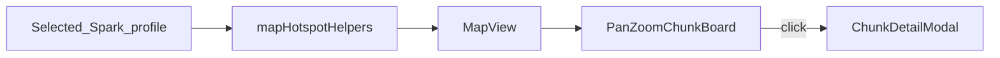

# Spark Map (ops lag heatmap) Implementation Plan

> **For agentic workers:** REQUIRED SUB-SKILL: Use superpowers:subagent-driven-development (recommended) or superpowers:executing-plans to implement this plan task-by-task. Steps use checkbox (`- [ ]`) syntax for tracking.

**Goal:** Add Spark → Map: a pan/zoom abstract chunk board heated from the selected profile’s `entity_hotspots`, with click-through to the existing chunk detail dialog — no live census, no terrain, no new Java API.

**Architecture:** Pure helpers in `model.ts` filter/cap/scale hotspots and compute fit bounds. New `MapView` hosts dimension chrome + legend + `PanZoomChunkBoard`. Export `ChunkDetailModal` from `tabs.tsx` for reuse. Wire a new `map` entry in Spark `VIEWS`. Client-only; shared profile picker unchanged.

**Tech Stack:** React 19 + Vite (`web/dashboard`), existing Spark CSS tokens, `tsx --test` for pure helpers, packaging audit via `tools/audit-dashboard-packaging.mjs`.

**Spec:** [docs/superpowers/specs/2026-08-02-spark-map-heatmap-design.md](../specs/2026-08-02-spark-map-heatmap-design.md)

## Global Constraints

- Home is **Spark → Map** only — do not add an Insights → World map in this plan.
- Heat from selected profile `context.entity_hotspots` only — no live census, no Issues paint, no `world_heatmap` Java / ops-cache field.
- Board is abstract chunk lattice + heat (**3a**); no World Preview / region / BlueMap terrain underlay.
- Cap painted cells at **256** (top by `total_entities` for the selected dimension).
- One dimension at a time; default = dimension with highest sum of `total_entities`.
- Reuse existing `ChunkDetailModal` behavior/copy; do not invent a second chunk panel.
- Night Watch Desk: Geist / JetBrains Mono, lantern-amber heat, signal-blue chrome; tight radii (`--radius-wt*`); no glass/periwinkle SaaS map kit.
- Respect `prefers-reduced-motion` (no animated camera easing).
- Display brand **WatchTower**; plain English empties.
- Do not add `useMemo` / `useCallback` unless the file already relies on them for the same pattern.
- After dashboard changes: `node tools/audit-dashboard-packaging.mjs`.
- Do not git commit unless the user asks; when committing, one logical unit per task.

## File structure

| File | Responsibility |
| ---- | -------------- |
| `web/dashboard/src/features/spark/model.ts` | Pure map helpers: dims, filter/cap, intensity, bbox fit |
| `web/dashboard/src/features/spark/map-helpers.test.ts` | `tsx --test` for those helpers |
| `web/dashboard/src/features/spark/tabs.tsx` | Export `ChunkDetailModal` |
| `web/dashboard/src/features/spark/map-view.tsx` | Dimension switcher, legend, empties, board + modal |
| `web/dashboard/src/features/spark/pan-zoom-chunk-board.tsx` | Camera, lattice, heat cells, pointer handlers |
| `web/dashboard/src/features/spark/view.tsx` | Add `map` to `VIEWS`; render `MapView` |
| `web/dashboard/src/features/spark/spark.css` | `.sp-map-*` board chrome |
| `web/dashboard/package.json` | Add `test:spark-map` script |
| `docs/wiki/Using-Spark-with-Watchtower.md` | Mention Map subtab |
| `CHANGELOG.md` / `docs/wiki/Changelog.md` | Ship note when implementing |
| Roadmap files | Already amended in Task 0 if not done; verify anchors |



---

### Task 1: Pure map helpers (TDD)

**Files:**
- Modify: `web/dashboard/src/features/spark/model.ts` (append helpers near `worldDimensionLabel` / hotspot usage ~L461+)
- Create: `web/dashboard/src/features/spark/map-helpers.test.ts`
- Modify: `web/dashboard/package.json` (add script)

**Interfaces:**
- Consumes: `UnknownRecord` hotspot rows; `numeric` / `text` / `array` already in `model.ts`
- Produces:

```ts
export const MAP_HOTSPOT_CAP = 256;

export type ChunkBBox = { minX: number; maxX: number; minZ: number; maxZ: number };

/** Distinct dimension ids present on hotspots (stable sort by label then id). */
export function hotspotDimensions(hotspots: UnknownRecord[]): string[];

/** Dimension with highest sum(total_entities); empty string if none. */
export function busiestHotspotDimension(hotspots: UnknownRecord[]): string;

/**
 * Filter by dimension, sort desc by total_entities, cap to MAP_HOTSPOT_CAP.
 * Rows missing finite chunk_x/chunk_z are dropped.
 */
export function mapHotspotsForDimension(
  hotspots: UnknownRecord[],
  dimension: string,
): UnknownRecord[];

/** Inclusive chunk bbox; null if empty. */
export function hotspotChunkBBox(hotspots: UnknownRecord[]): ChunkBBox | null;

/**
 * Relative heat 0..1 using max total_entities in the painted set.
 * Returns 0 when max <= 0.
 */
export function hotspotHeatIntensity(totalEntities: number, maxEntities: number): number;
```

- [ ] **Step 1: Write the failing test**

```ts
import assert from 'node:assert/strict';
import { describe, it } from 'node:test';
import {
  MAP_HOTSPOT_CAP,
  busiestHotspotDimension,
  hotspotChunkBBox,
  hotspotDimensions,
  hotspotHeatIntensity,
  mapHotspotsForDimension,
} from './model.ts';

const rows = [
  { dimension: 'overworld', chunk_x: 0, chunk_z: 0, total_entities: 10 },
  { dimension: 'overworld', chunk_x: 2, chunk_z: -1, total_entities: 50 },
  { dimension: 'the_nether', chunk_x: 1, chunk_z: 1, total_entities: 100 },
  { dimension: 'overworld', chunk_x: 'bad', chunk_z: 0, total_entities: 999 },
];

describe('spark map helpers', () => {
  it('lists dimensions and picks busiest', () => {
    assert.deepEqual(hotspotDimensions(rows), ['overworld', 'the_nether']);
    assert.equal(busiestHotspotDimension(rows), 'the_nether');
  });

  it('filters, sorts, drops bad coords, respects cap', () => {
    const many = Array.from({ length: 300 }, (_, i) => ({
      dimension: 'overworld',
      chunk_x: i,
      chunk_z: 0,
      total_entities: i + 1,
    }));
    const painted = mapHotspotsForDimension(many, 'overworld');
    assert.equal(painted.length, MAP_HOTSPOT_CAP);
    assert.equal(painted[0].total_entities, 300);
    assert.equal(mapHotspotsForDimension(rows, 'overworld').length, 2);
  });

  it('bbox and intensity', () => {
    const ow = mapHotspotsForDimension(rows, 'overworld');
    assert.deepEqual(hotspotChunkBBox(ow), { minX: 0, maxX: 2, minZ: -1, maxZ: 0 });
    assert.equal(hotspotHeatIntensity(25, 50), 0.5);
    assert.equal(hotspotHeatIntensity(10, 0), 0);
  });
});
```

- [ ] **Step 2: Run test to verify it fails**

Run: `cd web/dashboard && npx tsx --test src/features/spark/map-helpers.test.ts`

Expected: FAIL — exports not found / not a function.

- [ ] **Step 3: Write minimal implementation**

Append to `model.ts` (use existing `numeric` / `text`):

```ts
export const MAP_HOTSPOT_CAP = 256;

export type ChunkBBox = { minX: number; maxX: number; minZ: number; maxZ: number };

export function hotspotDimensions(hotspots: UnknownRecord[]): string[] {
  const set = new Set<string>();
  for (const row of hotspots) {
    const d = text(row.dimension);
    if (d) set.add(d);
  }
  return [...set].sort((a, b) => worldDimensionLabel(a).localeCompare(worldDimensionLabel(b)) || a.localeCompare(b));
}

export function busiestHotspotDimension(hotspots: UnknownRecord[]): string {
  const sums = new Map<string, number>();
  for (const row of hotspots) {
    const d = text(row.dimension);
    if (!d) continue;
    sums.set(d, (sums.get(d) ?? 0) + numeric(row.total_entities));
  }
  let best = '';
  let bestSum = -1;
  for (const [d, sum] of sums) {
    if (sum > bestSum) {
      best = d;
      bestSum = sum;
    }
  }
  return best;
}

export function mapHotspotsForDimension(
  hotspots: UnknownRecord[],
  dimension: string,
): UnknownRecord[] {
  return hotspots
    .filter((row) => text(row.dimension) === dimension)
    .filter((row) => Number.isFinite(numeric(row.chunk_x, NaN)) && Number.isFinite(numeric(row.chunk_z, NaN)))
    .sort((a, b) => numeric(b.total_entities) - numeric(a.total_entities))
    .slice(0, MAP_HOTSPOT_CAP);
}

export function hotspotChunkBBox(hotspots: UnknownRecord[]): ChunkBBox | null {
  if (!hotspots.length) return null;
  let minX = Infinity;
  let maxX = -Infinity;
  let minZ = Infinity;
  let maxZ = -Infinity;
  for (const row of hotspots) {
    const x = numeric(row.chunk_x);
    const z = numeric(row.chunk_z);
    minX = Math.min(minX, x);
    maxX = Math.max(maxX, x);
    minZ = Math.min(minZ, z);
    maxZ = Math.max(maxZ, z);
  }
  return { minX, maxX, minZ, maxZ };
}

export function hotspotHeatIntensity(totalEntities: number, maxEntities: number): number {
  if (!(maxEntities > 0)) return 0;
  return Math.min(1, Math.max(0, totalEntities / maxEntities));
}
```

Note: if `numeric(value, fallback)` does not support `NaN` fallback today, use a local `finiteChunkCoord(row, key)` that returns `null` when missing/invalid instead of changing `numeric` globally.

- [ ] **Step 4: Run test to verify it passes**

Run: `cd web/dashboard && npx tsx --test src/features/spark/map-helpers.test.ts`

Expected: PASS

- [ ] **Step 5: Add npm script**

In `web/dashboard/package.json` scripts:

```json
"test:spark-map": "tsx --test src/features/spark/map-helpers.test.ts"
```

Run: `npm run test:spark-map` — Expected: PASS

- [ ] **Step 6: Commit** (only if user asked)

```bash
git add web/dashboard/src/features/spark/model.ts web/dashboard/src/features/spark/map-helpers.test.ts web/dashboard/package.json
git commit -m "feat(spark): add map hotspot helpers"
```

---

### Task 2: Export ChunkDetailModal

**Files:**
- Modify: `web/dashboard/src/features/spark/tabs.tsx` (~L1283 — change `function ChunkDetailModal` to `export function ChunkDetailModal`)

**Interfaces:**
- Consumes: existing props `{ hotspot: UnknownRecord; onClose: () => void }`
- Produces: named export `ChunkDetailModal` for `map-view.tsx`

- [ ] **Step 1: Export the modal**

Find:

```ts
function ChunkDetailModal({
```

Replace with:

```ts
export function ChunkDetailModal({
```

Do not move the component to a new file in v1 (keeps World + Map on one implementation).

- [ ] **Step 2: Typecheck**

Run: `cd web/dashboard && npx tsc -b --pretty false`

Expected: PASS (or no new errors from this export)

- [ ] **Step 3: Commit** (only if user asked)

```bash
git add web/dashboard/src/features/spark/tabs.tsx
git commit -m "refactor(spark): export ChunkDetailModal for Map"
```

---

### Task 3: Map route shell + CSS tokens

**Files:**
- Create: `web/dashboard/src/features/spark/map-view.tsx` (shell only — board comes in Task 4–5)
- Modify: `web/dashboard/src/features/spark/view.tsx` (~L29–38 `VIEWS`, ~L25–27 imports, ~L478 view switch)
- Modify: `web/dashboard/src/features/spark/spark.css` (append `.sp-map-*`)

**Interfaces:**
- Consumes: `profile: UnknownRecord` (same as `WorldView`)
- Produces: `export function MapView({ profile }: { profile: UnknownRecord })`

- [ ] **Step 1: Add VIEWS entry + stub MapView**

In `view.tsx`, insert after world:

```ts
const VIEWS = [
  { id: 'overview', label: 'Overview' },
  { id: 'findings', label: 'Findings' },
  { id: 'world', label: 'World' },
  { id: 'map', label: 'Map' },
  { id: 'sources', label: 'Sources' },
  { id: 'timeline', label: 'Timeline' },
  { id: 'calls', label: 'Call paths' },
  { id: 'technical', label: 'Technical' },
  { id: 'compare', label: 'Compare' },
] as const;
```

Import `MapView` from `./map-view` and render:

```tsx
{view === 'map' ? <MapView profile={profile} /> : null}
```

Create `map-view.tsx`:

```tsx
import { useState } from 'react';
import { EmptyState } from '../../ui/patterns';
import {
  array,
  busiestHotspotDimension,
  hotspotDimensions,
  mapHotspotsForDimension,
  record,
  text,
  worldDimensionLabel,
  type UnknownRecord,
} from './model';

export function MapView({ profile }: { profile: UnknownRecord }) {
  const context = record(profile.context);
  const hotspots = array<UnknownRecord>(context.entity_hotspots);
  const dims = hotspotDimensions(hotspots);
  const [dimension, setDimension] = useState(() => busiestHotspotDimension(hotspots) || dims[0] || '');
  const painted = mapHotspotsForDimension(hotspots, dimension);

  if (!hotspots.length) {
    return (
      <EmptyState title="No busy chunks listed">
        This capture didn’t include chunk entity maps.
      </EmptyState>
    );
  }

  return (
    <div className="sp-view-stack sp-map">
      <div className="sp-map__toolbar">
        <div className="sp-map__dims" role="tablist" aria-label="Dimension">
          {dims.map((id) => (
            <button
              key={id}
              type="button"
              role="tab"
              aria-selected={id === dimension}
              className={id === dimension ? 'sp-map__dim is-active' : 'sp-map__dim'}
              onClick={() => setDimension(id)}
            >
              {worldDimensionLabel(id)}
            </button>
          ))}
        </div>
        <p className="sp-map__hint">
          Heat from this Spark profile · {painted.length} chunk{painted.length === 1 ? '' : 's'}
          {text(dimension) ? ` · ${worldDimensionLabel(dimension)}` : ''}
        </p>
      </div>
      <div className="sp-map__board-slot" data-testid="sp-map-board-slot">
        {/* Task 5 mounts PanZoomChunkBoard here */}
        <EmptyState title="Map board pending">Implement pan-zoom board next.</EmptyState>
      </div>
    </div>
  );
}
```

When `dimension` becomes stale (profile change), reset in a `useEffect` that sets dimension to `busiestHotspotDimension(hotspots) || dims[0] || ''` when current dimension is missing from `dims`.

Remove the temporary “Map board pending” empty in Task 5.

- [ ] **Step 2: Append CSS**

Append to `spark.css`:

```css
.sp-map__toolbar {
  display: flex;
  flex-wrap: wrap;
  align-items: center;
  justify-content: space-between;
  gap: 0.75rem;
  margin-bottom: 0.75rem;
}

.sp-map__dims {
  display: flex;
  flex-wrap: wrap;
  gap: 0.35rem;
}

.sp-map__dim {
  font-family: var(--font-geist, inherit);
  font-size: 0.8125rem;
  padding: 0.35rem 0.65rem;
  border-radius: var(--radius-wt-sm);
  border: 1px solid var(--wt-line);
  background: var(--wt-bg1);
  color: var(--wt-ink);
  cursor: pointer;
}

.sp-map__dim.is-active {
  border-color: color-mix(in oklab, var(--wt-signal) 55%, var(--wt-line));
  box-shadow: inset 0 0 0 1px color-mix(in oklab, var(--wt-signal) 35%, transparent);
}

.sp-map__hint {
  margin: 0;
  font-size: 0.75rem;
  color: var(--wt-muted);
  font-family: var(--font-mono, ui-monospace, monospace);
}

.sp-map__board-slot {
  position: relative;
  min-height: min(62vh, 640px);
  border: 1px solid var(--wt-line);
  border-radius: var(--radius-wt);
  background:
    radial-gradient(120% 80% at 50% 0%, color-mix(in oklab, var(--wt-signal) 6%, transparent), transparent 55%),
    var(--wt-bg0);
  overflow: hidden;
  box-shadow: var(--wt-shadow);
}

.sp-map__legend {
  display: flex;
  align-items: center;
  gap: 0.5rem;
  font-size: 0.75rem;
  color: var(--wt-muted);
}

.sp-map__legend-swatch {
  width: 4.5rem;
  height: 0.55rem;
  border-radius: var(--radius-wt-sm);
  background: linear-gradient(
    90deg,
    color-mix(in oklab, var(--wt-amber, #f59e0b) 25%, transparent),
    var(--wt-amber, #f59e0b)
  );
}
```

If `--wt-amber` is not defined in `index.css`, use the existing lantern/warn token the Spark World cards already use (grep `sp-chunk` / warn tokens and match).

- [ ] **Step 3: Preview smoke**

Run: `cd web/dashboard && npm run preview`

Open Spark → **Map** with a profile that has hotspots. Expect toolbar + dims; placeholder until Task 5.

- [ ] **Step 4: Commit** (only if user asked)

```bash
git add web/dashboard/src/features/spark/view.tsx web/dashboard/src/features/spark/map-view.tsx web/dashboard/src/features/spark/spark.css
git commit -m "feat(spark): add Map subtab shell"
```

---

### Task 4: PanZoomChunkBoard camera + lattice

**Files:**
- Create: `web/dashboard/src/features/spark/pan-zoom-chunk-board.tsx`

**Interfaces:**
- Consumes: painted hotspots + callbacks
- Produces:

```tsx
export type PanZoomChunkBoardProps = {
  hotspots: UnknownRecord[];
  onInspect: (hotspot: UnknownRecord) => void;
};

export function PanZoomChunkBoard({ hotspots, onInspect }: PanZoomChunkBoardProps): JSX.Element;
```

Camera model (chunk space → screen):

```ts
type Camera = { x: number; z: number; scale: number }; // scale = CSS px per chunk
```

Constants (lock in file):

```ts
const MIN_SCALE = 4;
const MAX_SCALE = 48;
const DEFAULT_SCALE = 16;
const FIT_PADDING_CHUNKS = 2;
```

- [ ] **Step 1: Implement board without heat first (grid + pan/zoom)**

```tsx
import { useEffect, useRef, useState } from 'react';
import {
  hotspotChunkBBox,
  hotspotHeatIntensity,
  numeric,
  text,
  type UnknownRecord,
} from './model';

const MIN_SCALE = 4;
const MAX_SCALE = 48;
const DEFAULT_SCALE = 16;
const FIT_PADDING_CHUNKS = 2;

type Camera = { x: number; z: number; scale: number };

function preferReducedMotion(): boolean {
  return typeof window !== 'undefined'
    && window.matchMedia('(prefers-reduced-motion: reduce)').matches;
}

function fitCamera(hotspots: UnknownRecord[], width: number, height: number): Camera {
  const bbox = hotspotChunkBBox(hotspots);
  if (!bbox || width <= 0 || height <= 0) {
    return { x: 0, z: 0, scale: DEFAULT_SCALE };
  }
  const spanX = bbox.maxX - bbox.minX + 1 + FIT_PADDING_CHUNKS * 2;
  const spanZ = bbox.maxZ - bbox.minZ + 1 + FIT_PADDING_CHUNKS * 2;
  const scale = Math.min(MAX_SCALE, Math.max(MIN_SCALE, Math.min(width / spanX, height / spanZ)));
  const cx = (bbox.minX + bbox.maxX) / 2;
  const cz = (bbox.minZ + bbox.maxZ) / 2;
  return { x: cx, z: cz, scale };
}

export function PanZoomChunkBoard({
  hotspots,
  onInspect,
}: {
  hotspots: UnknownRecord[];
  onInspect: (hotspot: UnknownRecord) => void;
}) {
  const viewportRef = useRef<HTMLDivElement>(null);
  const [camera, setCamera] = useState<Camera>({ x: 0, z: 0, scale: DEFAULT_SCALE });
  const dragRef = useRef<{
    pointerId: number;
    startClientX: number;
    startClientZ: number;
    originX: number;
    originZ: number;
    moved: boolean;
  } | null>(null);

  useEffect(() => {
    const el = viewportRef.current;
    if (!el) return;
    const apply = () => {
      const rect = el.getBoundingClientRect();
      setCamera(fitCamera(hotspots, rect.width, rect.height));
    };
    apply();
    const ro = new ResizeObserver(apply);
    ro.observe(el);
    return () => ro.disconnect();
  }, [hotspots]);

  const maxEntities = hotspots.reduce((m, row) => Math.max(m, numeric(row.total_entities)), 0);

  function chunkToScreen(chunkX: number, chunkZ: number, cam: Camera, w: number, h: number) {
    const sx = (chunkX - cam.x) * cam.scale + w / 2;
    const sy = (chunkZ - cam.z) * cam.scale + h / 2;
    return { sx, sy };
  }

  // pointer handlers: pan on move > 4px; click without drag → onInspect nearest cell under cursor
  // wheel: zoom toward cursor (skip smooth tween when preferReducedMotion())

  return (
    <div
      ref={viewportRef}
      className="sp-map-board"
      role="application"
      aria-label="Chunk heat map"
      onWheel={(e) => {
        e.preventDefault();
        const el = viewportRef.current;
        if (!el) return;
        const rect = el.getBoundingClientRect();
        const factor = e.deltaY < 0 ? 1.1 : 0.9;
        setCamera((cam) => {
          const nextScale = Math.min(MAX_SCALE, Math.max(MIN_SCALE, cam.scale * factor));
          // zoom toward cursor: adjust cam.x/z so point under cursor stays fixed
          const wx = (e.clientX - rect.left - rect.width / 2) / cam.scale + cam.x;
          const wz = (e.clientY - rect.top - rect.height / 2) / cam.scale + cam.z;
          const x = wx - (e.clientX - rect.left - rect.width / 2) / nextScale;
          const z = wz - (e.clientY - rect.top - rect.height / 2) / nextScale;
          void preferReducedMotion;
          return { x, z, scale: nextScale };
        });
      }}
    >
      <div
        className="sp-map-board__world"
        style={{
          // position heat cells absolutely using chunkToScreen
        }}
      >
        {/* lattice: optional SVG rect grid clipped to viewport when scale >= 10 */}
        {hotspots.map((row) => {
          const intensity = hotspotHeatIntensity(numeric(row.total_entities), maxEntities);
          const key = `${text(row.dimension)}:${numeric(row.chunk_x)}:${numeric(row.chunk_z)}`;
          return (
            <button
              key={key}
              type="button"
              className="sp-map-board__cell"
              style={{
                // left/top/width/height from camera; opacity/background from intensity
                ['--sp-map-heat' as string]: String(intensity),
              }}
              aria-label={`Chunk ${numeric(row.chunk_x)}, ${numeric(row.chunk_z)}, ${numeric(row.total_entities)} entities`}
              onPointerDown={(e) => {
                dragRef.current = {
                  pointerId: e.pointerId,
                  startClientX: e.clientX,
                  startClientZ: e.clientY,
                  originX: camera.x,
                  originZ: camera.z,
                  moved: false,
                };
                (e.currentTarget as HTMLElement).setPointerCapture(e.pointerId);
              }}
              onPointerMove={(e) => {
                const drag = dragRef.current;
                if (!drag || drag.pointerId !== e.pointerId) return;
                const dx = e.clientX - drag.startClientX;
                const dy = e.clientY - drag.startClientZ;
                if (Math.hypot(dx, dy) > 4) drag.moved = true;
                if (!drag.moved) return;
                setCamera((cam) => ({
                  ...cam,
                  x: drag.originX - dx / cam.scale,
                  z: drag.originZ - dy / cam.scale,
                }));
              }}
              onPointerUp={(e) => {
                const drag = dragRef.current;
                dragRef.current = null;
                if (!drag || drag.moved) return;
                onInspect(row);
              }}
            />
          );
        })}
      </div>
    </div>
  );
}
```

Implement layout fully: measure viewport size each render via ref + state `size`, compute each cell’s `left`/`top` as `chunkToScreen`, `width`/`height` = `camera.scale` (minus 1px gap).

Pan should also work on empty board background (attach pointer handlers to `sp-map-board`, not only cells).

- [ ] **Step 2: Board CSS**

Append:

```css
.sp-map-board {
  position: absolute;
  inset: 0;
  touch-action: none;
  cursor: grab;
  user-select: none;
}

.sp-map-board:active {
  cursor: grabbing;
}

.sp-map-board__world {
  position: absolute;
  inset: 0;
}

.sp-map-board__cell {
  position: absolute;
  box-sizing: border-box;
  border: 1px solid color-mix(in oklab, var(--wt-line) 70%, transparent);
  border-radius: 2px;
  padding: 0;
  cursor: pointer;
  background: color-mix(
    in oklab,
    var(--wt-amber, #f59e0b) calc(var(--sp-map-heat, 0) * 85%),
    color-mix(in oklab, var(--wt-bg1) 80%, transparent)
  );
}

.sp-map-board__cell:focus-visible {
  outline: 2px solid var(--wt-signal);
  outline-offset: 1px;
}

@media (prefers-reduced-motion: reduce) {
  .sp-map-board__cell {
    transition: none;
  }
}
```

- [ ] **Step 3: Manual check of camera math**

Use two hotspots at `(0,0)` and `(10,0)` — after fit they should both be visible and separated by ~10×scale pixels.

- [ ] **Step 4: Commit** (only if user asked)

```bash
git add web/dashboard/src/features/spark/pan-zoom-chunk-board.tsx web/dashboard/src/features/spark/spark.css
git commit -m "feat(spark): pan-zoom chunk board"
```

---

### Task 5: Wire MapView — board, modal, legend, empties

**Files:**
- Modify: `web/dashboard/src/features/spark/map-view.tsx`
- Modify: `web/dashboard/src/features/spark/spark.css` (legend if not already)

**Interfaces:**
- Consumes: `PanZoomChunkBoard`, `ChunkDetailModal`, helpers from Task 1
- Produces: complete Map UX per spec

- [ ] **Step 1: Replace placeholder with board + modal**

```tsx
import { useEffect, useState } from 'react';
import { EmptyState } from '../../ui/patterns';
import { ChunkDetailModal } from './tabs';
import { PanZoomChunkBoard } from './pan-zoom-chunk-board';
import {
  array,
  busiestHotspotDimension,
  hotspotDimensions,
  mapHotspotsForDimension,
  record,
  worldDimensionLabel,
  type UnknownRecord,
} from './model';

export function MapView({ profile }: { profile: UnknownRecord }) {
  const context = record(profile.context);
  const hotspots = array<UnknownRecord>(context.entity_hotspots);
  const dims = hotspotDimensions(hotspots);
  const [dimension, setDimension] = useState(() => busiestHotspotDimension(hotspots) || dims[0] || '');
  const [selected, setSelected] = useState<UnknownRecord | null>(null);

  useEffect(() => {
    if (dimension && dims.includes(dimension)) return;
    setDimension(busiestHotspotDimension(hotspots) || dims[0] || '');
  }, [hotspots, dims, dimension]);

  const painted = dimension ? mapHotspotsForDimension(hotspots, dimension) : [];

  if (!hotspots.length) {
    return (
      <EmptyState title="No busy chunks listed">
        This capture didn’t include chunk entity maps.
      </EmptyState>
    );
  }

  return (
    <div className="sp-view-stack sp-map">
      <div className="sp-map__toolbar">
        <div className="sp-map__dims" role="tablist" aria-label="Dimension">
          {dims.map((id) => (
            <button
              key={id}
              type="button"
              role="tab"
              aria-selected={id === dimension}
              className={id === dimension ? 'sp-map__dim is-active' : 'sp-map__dim'}
              onClick={() => setDimension(id)}
            >
              {worldDimensionLabel(id)}
            </button>
          ))}
        </div>
        <div className="sp-map__legend" aria-hidden="true">
          <span>Fewer</span>
          <span className="sp-map__legend-swatch" />
          <span>More entities</span>
        </div>
      </div>
      <div className="sp-map__board-slot">
        {painted.length ? (
          <PanZoomChunkBoard hotspots={painted} onInspect={setSelected} />
        ) : (
          <EmptyState title="No chunks in this dimension">
            Try another dimension — this profile has no busy chunks here.
          </EmptyState>
        )}
      </div>
      {selected ? <ChunkDetailModal hotspot={selected} onClose={() => setSelected(null)} /> : null}
    </div>
  );
}
```

- [ ] **Step 2: Preview verification**

Run: `cd web/dashboard && npm run preview`

Checklist:
- Spark → Map visible after World
- Profile with hotspots (preview data or import fixture-backed profile) paints cells
- Click opens modal with same chunk coords
- Dimension switch filters
- Wheel zoom + drag pan work
- No-hotspot profile shows empty

If preview mock profiles lack hotspots, temporarily point preview at a parsed fixture profile the Spark picker already loads, or import `expected-h5bvv4annz.json`-derived upload if the preview harness supports it — do **not** invent fake live census data.

- [ ] **Step 3: Helpers still pass**

Run: `cd web/dashboard && npm run test:spark-map`

Expected: PASS

- [ ] **Step 4: Commit** (only if user asked)

```bash
git add web/dashboard/src/features/spark/map-view.tsx
git commit -m "feat(spark): wire Map board and chunk modal"
```

---

### Task 6: Wiki + changelog

**Files:**
- Modify: `docs/wiki/Using-Spark-with-Watchtower.md` (~L20 workflow list)
- Modify: `CHANGELOG.md` (Unreleased / next patch section)
- Modify: `docs/wiki/Changelog.md` (mirror brief)

- [ ] **Step 1: Wiki**

In “Quick workflow”, change the evidence line to include Map:

```markdown
4. **Read the evidence** — Overview, Findings, World, **Map** (chunk heat from this capture), Sources, Timeline, Call paths, Technical, Compare
```

Add a short subsection after World mentions (or new `## Map`):

```markdown
## Map

**Map** shows busy chunks from the **selected Spark profile** on a pan/zoom grid (not a live world map, not terrain). Click a square for the same chunk details as World cards. Switch dimension when the capture includes more than one.
```

- [ ] **Step 2: Changelog**

Add under Unreleased:

```markdown
- Spark → **Map**: pan/zoom chunk heat from the selected profile’s entity hotspots (click for chunk details).
```

- [ ] **Step 3: Commit** (only if user asked)

```bash
git add docs/wiki/Using-Spark-with-Watchtower.md CHANGELOG.md docs/wiki/Changelog.md
git commit -m "docs: note Spark Map subtab"
```

---

### Task 7: Packaging audit + ship-when gate

**Files:**
- None required unless audit fails

- [ ] **Step 1: Packaging audit**

Run: `node tools/audit-dashboard-packaging.mjs`

Expected: PASS

- [ ] **Step 2: Optional parity**

Run: `node tools/audit-dashboard-parity.mjs`

Expected: PASS or only pre-existing failures unrelated to Map

- [ ] **Step 3: Final checklist (spec ship-when)**

- Fixture / preview hotspots at correct chunk coords; modal matches
- Multi-dim switcher works; default = busiest dim
- Empties honest
- `prefers-reduced-motion` does not break pan/zoom (no tween required)
- Roadmap §1.1.28 already says Spark → Map (verify anchors)

- [ ] **Step 4: Commit** (only if user asked and there are leftover fixes)

---

## Self-review

| Spec requirement | Task |
| ---------------- | ---- |
| Spark → Map home | 3 |
| entity_hotspots only | 1, 5 |
| Pan/zoom abstract board, no terrain | 4 |
| Cap 256 / one dim / busiest default | 1, 5 |
| Reuse ChunkDetailModal | 2, 5 |
| Shared profile picker / empties | 3, 5 (picker unchanged in view.tsx) |
| Night Watch CSS + reduced motion | 3, 4 |
| Wiki / changelog | 6 |
| Packaging audit | 7 |
| No Java world_heatmap | (none — intentional) |

Placeholder scan: no TBD steps; helpers, modal export, board, wire, docs, audit all concrete.
