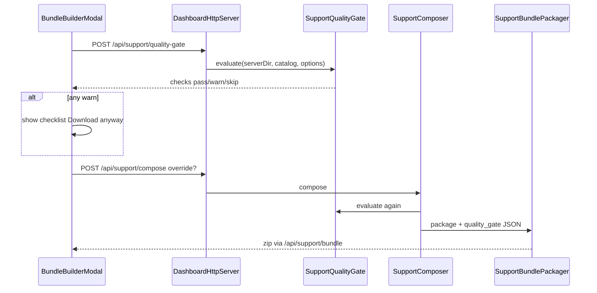

# Support Pack Quality Gate Implementation Plan

> **For agentic workers:** REQUIRED SUB-SKILL: Use superpowers:subagent-driven-development (recommended) or superpowers:executing-plans to implement this plan task-by-task. Steps use checkbox (`- [ ]`) syntax for tracking.

**Goal:** Before Support pack download, show a green/yellow/skip preflight checklist; never hard-block; allow Download anyway; embed `quality_gate` in every compose zip’s `manifest.json`.

**Architecture:** Pure evaluator `SupportQualityGate` in `watchtower-core` shared by `POST /api/support/quality-gate` and `SupportComposer` → `SupportBundlePackager`. Dashboard modal runs preflight first; if any `warn`, show checklist and require explicit override. Redaction always still applies.

**Tech Stack:** Java 21, Gradle (`:watchtower-core:test`), NeoForge dashboard HTTP (`watchtower-neoforge-common`), React+Vite Support modal (`web/dashboard`), fixture API for preview.

**Spec:** [docs/superpowers/specs/2026-08-02-support-pack-quality-gate-design.md](docs/superpowers/specs/2026-08-02-support-pack-quality-gate-design.md)

## Global Constraints

- NeoForge 1.21.x / Java 21 only (`watchtower-core`, `watchtower-neoforge-common`, `web/dashboard`).
- Missing selected log = **strong yellow**, never hard-block.
- No new `watchtower.conf` keys in v1 (incident window grace = 2 hours constant).
- `hang_dump` always `skip` until 1.1.22.
- Secrets still redacted on anyway path (`SupportRedactor` unchanged).
- Plain English UI copy; display brand **WatchTower**.
- After dashboard UI: `node tools/audit-dashboard-packaging.mjs`.
- Persist this plan also at `docs/superpowers/plans/2026-08-02-support-pack-quality-gate.md` when implementing (copy from this plan).

## File structure

| File | Responsibility |
| ---- | -------------- |
| `watchtower-core/.../report/SupportQualityGate.java` | Evaluate checks; return JSON-serializable result |
| `watchtower-core/.../report/SupportComposeOptions.java` | Parse/store `quality_gate_override` |
| `watchtower-core/.../report/SupportComposer.java` | Run gate; pass result into packager |
| `watchtower-core/.../report/SupportBundlePackager.java` | Embed `quality_gate` in `manifest.json` |
| `watchtower-neoforge-common/.../DashboardHttpServer.java` | `POST /api/support/quality-gate` |
| `web/dashboard/src/api/client.ts` | `supportQualityGate` |
| `web/dashboard/src/features/support/bundle-builder-modal.tsx` | Preflight → checklist → anyway |
| `web/dashboard/src/features/support/support.css` | Gate panel styles |
| `web/dashboard/scripts/fixture-api-core.ts` | Preview stub |
| `docs/wiki/Health-Reports.md` | One-paragraph operator note |
| Tests + optional `samples/fixtures/support-gate/` | Coverage |



---

### Task 1: SupportQualityGate core evaluator (TDD)

**Files:**
- Create: `watchtower-core/src/main/java/dev/mcstatus/watchtower/core/report/SupportQualityGate.java`
- Create: `watchtower-core/src/test/java/dev/mcstatus/watchtower/core/report/SupportQualityGateTest.java`
- Optional fixtures under: `samples/fixtures/support-gate/` (inline `@TempDir` trees are enough for v1)

**Interfaces:**
- Consumes: `SupportComposeOptions`, catalog-shaped `JsonObject` (same fields as `SupportBundleCatalog.build`: `logs[]`, `crashes[]`, `stores`), `Path serverDir`, `Path opsCachePath`
- Produces:

```java
public final class SupportQualityGate {
  public enum Status { PASS, WARN, SKIP }

  public record Check(String id, Status status, String message, boolean required) {}

  public record Summary(int pass, int warn, int skip) {}

  public record Result(
      Instant evaluatedAt,
      boolean overrideAllowed, // always true in v1
      Summary summary,
      List<Check> checks
  ) {
    public boolean hasWarnings() { /* any WARN */ }
    public JsonObject toJson() { /* API + manifest shape */ }
    public JsonObject toManifestJson(boolean override) { /* adds override + evaluated_at ISO-8601 */ }
  }

  public static Result evaluate(
      Path serverDir,
      Path opsCachePath,
      JsonObject catalog, // may be null → build minimal from disk
      SupportComposeOptions options
  ) { ... }

  public static final long INCIDENT_WINDOW_GRACE_SECONDS = 2L * 60L * 60L;
}
```

Check IDs (exact): `log_present`, `mod_list`, `java_loader`, `secrets_redacted`, `crash_if_relevant`, `incident_window`, `hang_dump`.

- [ ] **Step 1: Write failing tests** in `SupportQualityGateTest.java`

```java
@Test
void missingSelectedLogIsWarnNotBlock() throws Exception {
  // server with no logs/; options that select latest.log
  Result r = SupportQualityGate.evaluate(serverDir, opsPath, catalog, options);
  Check c = find(r, "log_present");
  assertEquals(Status.WARN, c.status());
  assertTrue(r.overrideAllowed());
  assertTrue(r.hasWarnings());
}

@Test
void crashRelevantWithoutCrashWarns() { /* SERVER_TRIAGE / category server_lag, crash_files empty, catalog has crashes */ }

@Test
void incidentWindowWarnsWhenLogOlderThanCrashBeyondGrace() { /* crash mtime T, log mtime T-3h */ }

@Test
void incidentWindowSkipsWhenNoCrashSelected() { /* status SKIP */ }

@Test
void hangDumpAlwaysSkipped() { /* id hang_dump → SKIP */ }

@Test
void secretsRedactedPassesWhenRedactorAvailable() { /* always PASS in v1 — redactor is compile-time present */ }

@Test
void allGreenWhenLogModsEnvPresent() { /* warn count 0 */ }
```

- [ ] **Step 2: Run tests — expect FAIL** (class missing)

```bash
./gradlew :watchtower-core:test --tests "dev.mcstatus.watchtower.core.report.SupportQualityGateTest"
```

- [ ] **Step 3: Implement `SupportQualityGate`**

Logic notes:
- **log_present:** If `options.logs()` empty and `!includeLatestLogTail()` → SKIP “Logs turned off for this pack.” Else resolve each selected basename under `serverDir/logs` via `SupportSafePaths`; WARN if none exist. Message: “No log file on disk for this pack — Discord helpers usually need latest.log.”
- **mod_list:** Load ops-cache; PASS if `mods_light.mods` or inventory non-empty; else WARN.
- **java_loader:** PASS if `System.getProperty("java.version")` non-blank (always on JVM) AND options/environment implies loader from ops `server.loader` / catalog — if ops missing loader string, WARN “Loader version missing from ops snapshot.”
- **secrets_redacted:** Always PASS with message “Secrets, IPs, and UUIDs are stripped when the zip is built.”
- **crash_if_relevant:** Relevant when preset is `SERVER_TRIAGE` or `FULL_EVIDENCE` OR category contains `crash`/`lag`/`server` (use existing category strings from UI: `server_lag`, `watchtower_bug`, `other`). If relevant and `crashFiles()` empty and catalog has crashes → WARN. If not relevant → SKIP.
- **incident_window:** If no selected crash → SKIP. Else take max selected crash `mtime` (catalog seconds) and max selected log `mtime`; PASS if `abs(crash - log) <= grace` OR log mtime >= crash - grace. Else WARN. Missing mtimes → SKIP “Could not verify log coverage for this crash.”
- **hang_dump:** Always SKIP “Hang dumps come in a later WatchTower update.”

- [ ] **Step 4: Re-run tests — expect PASS**

- [ ] **Step 5: Commit**

```bash
git add watchtower-core/src/main/java/dev/mcstatus/watchtower/core/report/SupportQualityGate.java \
  watchtower-core/src/test/java/dev/mcstatus/watchtower/core/report/SupportQualityGateTest.java
git commit -m "feat(support): add SupportQualityGate evaluator"
```

---

### Task 2: Options override flag + manifest embedding

**Files:**
- Modify: [SupportComposeOptions.java](watchtower-core/src/main/java/dev/mcstatus/watchtower/core/report/SupportComposeOptions.java) (`fromJson`, `toJson`, `Builder`, field + getter)
- Modify: [SupportBundlePackager.java](watchtower-core/src/main/java/dev/mcstatus/watchtower/core/report/SupportBundlePackager.java) — extend `PackageRequest` with `JsonObject qualityGate` (nullable); `buildManifest` adds it
- Modify: [SupportComposer.java](watchtower-core/src/main/java/dev/mcstatus/watchtower/core/report/SupportComposer.java) — evaluate gate before package; pass `toManifestJson(options.qualityGateOverride())`
- Modify: [SupportComposerTest.java](watchtower-core/src/test/java/dev/mcstatus/watchtower/core/report/SupportComposerTest.java)

**Interfaces:**
- Consumes: `SupportQualityGate.Result`
- Produces: `manifest.quality_gate` object; options JSON key `quality_gate_override` (boolean)

- [ ] **Step 1: Failing test** — unzip compose result, parse `manifest.json`, assert `quality_gate.checks` array non-empty and `override` false by default

```java
@Test
void composeEmbedsQualityGateInManifest() throws Exception {
  // reuse existing temp server tree from composeBuildsZip...
  // ZipFile → read manifest.json entry
  assertTrue(manifest.has("quality_gate"));
  assertTrue(manifest.getAsJsonObject("quality_gate").get("checks").isJsonArray());
  assertFalse(manifest.getAsJsonObject("quality_gate").get("override").getAsBoolean());
}
```

- [ ] **Step 2: Run — FAIL** (no quality_gate yet)

- [ ] **Step 3: Implement**
  - Add `boolean qualityGateOverride` to options (default false); `fromJson` reads `quality_gate_override`; `toJson` writes it.
  - Add `JsonObject qualityGate` to `PackageRequest` (add overload or new trailing param — update all `packageSupportBundle` call sites; prefer extending the record and fixing compile errors).
  - In `buildManifest`, if `qualityGate != null`, `manifest.add("quality_gate", qualityGate)`.
  - In `SupportComposer.compose`, after options resolved:

```java
JsonObject catalog = SupportBundleCatalog.build(new SupportBundleCatalog.Request(
    req.serverDir(), req.opsCachePath(), req.rollupsPath(), null, null, req.sparkUploadDir()));
SupportQualityGate.Result gate = SupportQualityGate.evaluate(
    req.serverDir(), req.opsCachePath(), catalog, options);
JsonObject gateJson = gate.toManifestJson(options.qualityGateOverride());
// pass into PackageRequest
```

  - If catalog build throws, fail-open: single WARN check `gate_error` with message “Could not fully check this pack.”

- [ ] **Step 4: Tests PASS** including existing compose tests

```bash
./gradlew :watchtower-core:test --tests "dev.mcstatus.watchtower.core.report.SupportComposerTest" \
  --tests "dev.mcstatus.watchtower.core.report.SupportQualityGateTest"
```

- [ ] **Step 5: Commit** `feat(support): embed quality_gate in support zip manifest`

---

### Task 3: HTTP preflight endpoint

**Files:**
- Modify: [DashboardHttpServer.java](watchtower-neoforge-common/src/main/java/dev/mcstatus/watchtower/DashboardHttpServer.java) (~line 180 context registration; add handler beside `handleSupportCompose` ~2009)

**Interfaces:**
- Consumes: `SupportComposeOptions.fromJson`, `SupportBundleCatalog.build`, `SupportQualityGate.evaluate`
- Produces: `POST /api/support/quality-gate` → 200 JSON `{ ok, override_allowed, summary, checks }`

- [ ] **Step 1: Register route** next to compose:

```java
server.createContext("/api/support/quality-gate", this::handleSupportQualityGate);
```

- [ ] **Step 2: Implement handler** (mirror catalog/compose auth: `requireApiAuth` only — same as compose today; no extra write gate unless compose already has one)

```java
private void handleSupportQualityGate(HttpExchange ex) throws IOException {
  // POST only; requireApiAuth; serverContext non-null
  // parse body → SupportComposeOptions.fromJson
  // build catalog like handleSupportCatalog
  // Result r = SupportQualityGate.evaluate(...)
  // JsonObject out = r.toJson(); out.addProperty("ok", true);
  // sendJson(ex, 200, out);
}
```

- [ ] **Step 3: Smoke via existing server or unit-free compile**

```bash
./gradlew :watchtower-neoforge-common:compileJava :watchtower-core:test
```

- [ ] **Step 4: Commit** `feat(support): add POST /api/support/quality-gate`

---

### Task 4: Fixture API + client

**Files:**
- Modify: [web/dashboard/src/api/client.ts](web/dashboard/src/api/client.ts) (~340 support APIs)
- Modify: [web/dashboard/scripts/fixture-api-core.ts](web/dashboard/scripts/fixture-api-core.ts) (~1460 support routes)

- [ ] **Step 1: Client**

```ts
supportQualityGate: (payload: Record<string, unknown>) =>
  apiFetch<Record<string, unknown>>('/api/support/quality-gate', {
    method: 'POST',
    body: JSON.stringify(payload),
  }),
```

- [ ] **Step 2: Fixture stub** — return one WARN (`log_present` pass, `crash_if_relevant` warn or similar) so UI can exercise the checklist; accept body; ignore disk.

- [ ] **Step 3: Commit** `feat(support): client + fixture quality-gate API`

---

### Task 5: Bundle Builder modal UI

**Files:**
- Modify: [bundle-builder-modal.tsx](web/dashboard/src/features/support/bundle-builder-modal.tsx)
- Modify: [support.css](web/dashboard/src/features/support/support.css)

**UX (locked):**
1. User clicks **Build and download**.
2. Call `api.supportQualityGate(payload)`.
3. If no warns → existing compose + download path.
4. If warns → set `gateResult` state; show checklist panel; do **not** compose yet.
5. **Download anyway** → compose with `quality_gate_override: true`.
6. **Back** / edit picks clears gate panel.

- [ ] **Step 1: State**

```ts
const [gate, setGate] = useState<Record<string, unknown> | null>(null);
const [awaitingOverride, setAwaitingOverride] = useState(false);
```

- [ ] **Step 2: Rewrite `handleBuild`**

```ts
async function handleBuild(optsExtra?: { quality_gate_override?: boolean }) {
  setBuilding(true); setError(''); setResult(null);
  try {
    const payload = { ...opts, preset, category: categoryForPreset(preset), note, ...optsExtra };
    if (!optsExtra?.quality_gate_override) {
      const gateRes = asRecord(await api.supportQualityGate(payload));
      const checks = asArray(gateRes.checks);
      const warned = checks.some((c) => str(asRecord(c).status).toLowerCase() === 'warn');
      if (warned) {
        setGate(gateRes);
        setAwaitingOverride(true);
        setBuilding(false);
        return;
      }
    }
    setGate(null);
    setAwaitingOverride(false);
    // existing compose + waitForZipReady + download
    const res = asRecord(await api.supportCompose(payload));
    ...
  } catch ...
}
```

- [ ] **Step 3: Checklist UI** (in body when `awaitingOverride && gate`)

```tsx
<section className="sp-gate" aria-label="Pack checklist">
  <h3 className="sp-section-label">Before you download</h3>
  <ul className="sp-gate__list">
    {checks.map(... status pass|warn|skip → class sp-gate__row--pass/warn/skip)}
  </ul>
  <p className="sp-gate__hint">You can still download. Warnings are stored in the zip manifest.</p>
</section>
```

Foot actions when awaiting: Cancel · Back (clear gate) · **Download anyway** (primary).

- [ ] **Step 4: CSS** — quiet Night Watch Desk rows; warn uses `--wt-warn`; pass `--wt-ok`; skip muted. No purple glass.

- [ ] **Step 5: Manual preview** `cd web/dashboard && npm run preview` — trigger warn path via fixture.

- [ ] **Step 6: Packaging**

```bash
node tools/audit-dashboard-packaging.mjs
```

- [ ] **Step 7: Commit** `feat(support): quality gate checklist in bundle builder`

---

### Task 6: Wiki + roadmap ship checkbox + plan file

**Files:**
- Modify: [docs/wiki/Health-Reports.md](docs/wiki/Health-Reports.md) — short note under Build support pack
- Modify: [docs/dev/roadmap/versions/1.1.19-1.1.29-change-safety-and-recovery.md](docs/dev/roadmap/versions/1.1.19-1.1.29-change-safety-and-recovery.md) — tick Ship when items when done
- Create: `docs/superpowers/plans/2026-08-02-support-pack-quality-gate.md` (copy of this plan for agent execution)

- [ ] **Step 1: Wiki** — “Before download, WatchTower checks for a log, mod list, and crash coverage when relevant. Yellow warnings don’t block you; Download anyway notes them in the zip.”

- [ ] **Step 2: Commit** `docs: support quality gate wiki + plan`

---

## Verification (end-to-end)

```bash
./gradlew :watchtower-core:test --tests "dev.mcstatus.watchtower.core.report.SupportQualityGateTest" \
  --tests "dev.mcstatus.watchtower.core.report.SupportComposerTest"
cd web/dashboard && npm run preview
# Support modal: force warn via fixture → checklist → Download anyway
node tools/audit-dashboard-packaging.mjs
```

## Spec coverage checklist

- Missing log strong yellow + anyway — Tasks 1, 5
- Crash without report warn — Task 1
- Secrets still redacted — Task 2 (no redactor change) + Task 5 anyway path
- Manifest lists checks + override — Task 2
- Fixture checklist — Tasks 4–5
- Core tests — Task 1–2
- Preflight API — Task 3
- hang_dump stub — Task 1
- CLI embeds gate without interactive force — Task 2 (compose path)
