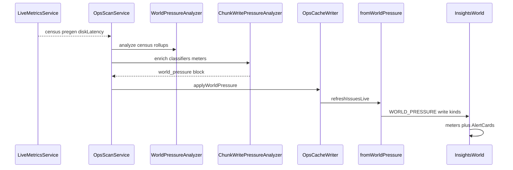

# 1.1.23 — Chunk write / pregen pressure Issues

**Status:** Approved for planning (2026-08-02)  
**Roadmap:** [1.1.19–1.1.29 change safety](../../dev/roadmap/versions/1.1.19-1.1.29-change-safety-and-recovery.md#1123--chunk-write--pregen-pressure-issues)  
**Size:** Medium  
**Depends on:** World pressure census (1.1.9); `LivePregenTailer` / Chunky + DH; live disk write latency  
**Platforms:** NeoForge 1.21.x / Java 21

## Problem

Generation and chunk-save backlog are a different failure mode from entity storms. Operators running Chunky / Distant Horizons (or heavy exploration) can saturate disk while the process still looks “online,” then restart mid-flush and make things worse. WatchTower already has pregen tails and disk write latency, but Issues only tell the entity/chunk-pressure story.

## Goal

Raise sustained Issues for chunk-save backlog, pregen outrunning disk, and heavy chunk generation while players are online; show light meters on Insights → World; advice only (pause pregen / wait for saves / don’t restart mid-flush). Never auto-control pregen.

## Decisions (locked)

| Decision | Choice |
| -------- | ------ |
| Surfaces | **Issues + light Insights → World meters** (same release) |
| Architecture | Hybrid: pure `ChunkWritePressureAnalyzer`; classifiers + meters stored on `world_pressure` |
| Issue ids | `WORLD_PRESSURE:<KIND>:<DIMENSION>` via existing `fromWorldPressure` |
| Kinds | `chunk_save_backlog`, `pregen_outrunning_disk`, `heavy_chunk_generation` |
| Kill-switch | `CHUNK_WRITE_PRESSURE_ENABLED` default `true` |
| New threshold conf | None in v1 beyond existing `DISK_IO_LATENCY_WARN_MS` |
| Auto-pause pregen / Overview attention row | Out of scope |
| Mod blame | Never without evidence |

## Architecture

```text
OpsScanService.scanWorldPressure
  → WorldPressureAnalyzer.analyze (entity/mob classifiers)
  → if CHUNK_WRITE_PRESSURE_ENABLED:
       ChunkWritePressureAnalyzer.enrich(block, signals, prev, diskWarnMs)
  → OpsCacheWriter.applyWorldPressure
  → refreshIssuesLive → fromWorldPressure

Insights WorldPanel
  → world_pressure.meters (write latency, pregen, chunk growth)
  → existing AlertCards for all classifiers including new kinds
```



## Classifiers

| kind | When | Severity (v1) | Advice (next_steps) |
| ---- | ---- | ------------- | ------------------- |
| `pregen_outrunning_disk` | Pregen active (DH or Chunky) **and** write latency sustained ≥ `DISK_IO_LATENCY_WARN_MS` (or elevated write MB/s with latency) | warning (critical if latency ≫ warn) | Pause pregen; wait for disk; do not restart mid-flush |
| `chunk_save_backlog` | Write latency sustained high **without** requiring pregen | warning | Wait for saves to finish; avoid restart mid-flush |
| `heavy_chunk_generation` | Players online **and** loaded-chunk growth sustained high | warning | Pause pregen / exploration burst; check view distance / gen load — no random mod blame |

Sustained window: same spirit as world pressure (e.g. ~3 consecutive scan hits via streaks on `world_pressure.streaks`). Dimension id from the busiest / relevant census dimension (overworld default when pregen is global).

## Signals

| Signal | Source |
| ------ | ------ |
| Pregen active + rate | `LivePregenTailer` → `dh_pregen` / `chunky_pregen` (`pregen_active`, cps/rate when present) |
| Disk write latency / MB/s | Live disk snapshot (`write_await_ms`, `write_mb_s`) or L1 rollup averages as fallback |
| Loaded chunk growth | Census `loaded_chunks` delta vs previous `world_pressure` snapshot |
| Players | Census `players` (required for `heavy_chunk_generation`) |
| Warn threshold | `DISK_IO_LATENCY_WARN_MS` (default 50) |

## Peek additions (`world_pressure`)

- Existing classifiers array gains new `kind` values.
- New object `meters` (see below).
- New object `chunk_write_streaks` — integer streak counters keyed by `kind:dimension`. **Do not** store these in `streaks` (entity classifiers); `WorldPressureAnalyzer` decays unused streak keys each scan.

```json
"meters": {
  "write_await_ms": 72.5,
  "write_warn_ms": 50,
  "pregen_active": true,
  "pregen_label": "Chunky",
  "pregen_rate": "120/s",
  "chunk_growth_label": "+40/min"
}
```

Meters are filled every enrich pass (even when no classifier fires) so Insights stays honest.

## Insights → World

In the existing hero metric strip ([`world.tsx`](../../../web/dashboard/src/features/insights/panels/world.tsx)):

- **Write latency** — value + warn tone when ≥ warn ms  
- **Pregen** — Idle / Active (+ rate if present)  
- **Chunk growth** — `chunk_growth_label` or Steady  

Needs attention `AlertCard` list unchanged (new kinds appear automatically). Empty-state copy mentions save/pregen pressure as well as item/mob storms.

## Issues

- Ids: `WORLD_PRESSURE:CHUNK_SAVE_BACKLOG:…` etc.  
- Primary action: existing **Open World pressure** for `WORLD_PRESSURE*`  
- Fix steps from classifier `next_steps`  
- Preview: ops-cache + `samples/fixtures/world-pressure/` fixtures for each kind + quiet negative  

## Config (`watchtower.conf`)

| Key | Default | Purpose |
| --- | ------- | ------- |
| `CHUNK_WRITE_PRESSURE_ENABLED` | `true` | Kill-switch for enrich + new classifier emission |
| `DISK_IO_LATENCY_WARN_MS` | `50` | Existing — latency compare for backlog / pregen-disk |

Requires `WORLD_PRESSURE_ENABLED` for the scan path that hosts enrich.

## Components

| Unit | Responsibility |
| ---- | -------------- |
| `ChunkWritePressureAnalyzer` | Pure enrich: meters + classifiers + streaks |
| `OpsScanService.scanWorldPressure` | Build signals; call enrich when enabled |
| `ReportConfig` | `chunkWritePressureEnabled` |
| `fromWorldPressure` | Already maps classifiers → Issues |
| Insights `WorldPanel` | Meter strip from `world_pressure.meters` |
| Fixtures + `ChunkWritePressureAnalyzerTest` | TDD |
| Wiki World-Pressure / Issues | Operator note |

## Testing

- Unit fixtures: pregen+disk, save backlog only, heavy gen with players, quiet negative  
- One evaluator assertion that new kind → expected Issue id  
- Packaging audit after dashboard meter changes  

## Out of scope

- Auto-pause / command bridge for Chunky or DH  
- Invented JVM “save queue depth” we cannot measure  
- Dedicated Overview attention row work  
- Blaming a mod without stack/evidence  
- New fine-grained threshold conf keys beyond kill-switch  

## Plain-English summary (end user)

When pregen or chunk saves are beating the disk (or chunks are exploding while players are on), WatchTower raises an Issue with a plain next step — pause pregen, wait for saves, don’t restart mid-flush — and shows small write/pregen/growth meters on Insights → World. It will not pause pregen for you.
