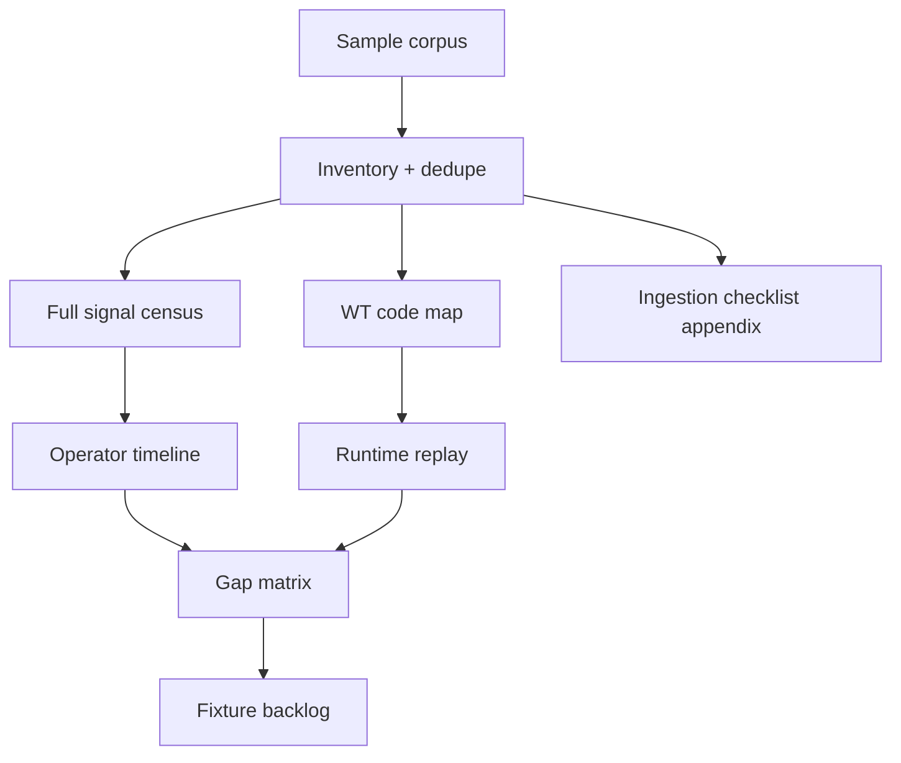

# Log sample gap research (corpus → gap audit → fixture backlog)

**Status:** Approved for planning (2026-08-02)  
**Size:** Medium (research only; no product code in this pass)  
**Platforms:** NeoForge 1.21.x / Java 21 (sample pack is 1.21.1 / NeoForge 21.1.x)  
**Sample root:** `samples/new samples 02.08.2026/`

## Problem

A user sent a full logs + crash-reports dump. Before changing WatchTower parsers or Fix copy, we need a grounded answer to:

1. What actually happened on this server across the whole corpus?
2. What would WatchTower read, classify, surface, and advise today?
3. Where are the gaps (blind spots, wrong kinds, missing Issues, bad advice, noise drowning, missing event linkage)?
4. Which golden fixtures should a later implementation plan add first?

Without that research pass, classifier tweaks risk chasing one crash while missing chronic lag, sidecar files, and spam that drowns real signals.

## Goal

Produce a **gap audit + ranked fixture backlog** for WatchTower log/crash reading and operator advice against this corpus. No product behavior changes in this research pass. A separate implementation plan may follow from the backlog.

## Decisions (locked)

| Decision | Choice |
| -------- | ------ |
| Primary deliverable | **B** — Gap audit + fixture backlog (not implement fixes yet) |
| Corpus depth | **Full corpus** — all rotates, debug*, kubejs, Jade, mega.tar.gz |
| Verification | **Code map + runtime replay** — reading Java is not enough; capture real WT output |
| Gap scoring | **Full operator path** — kind + surfacing + Fix/advice quality |
| Research shape | **Timeline-first forensics** + **ingestion checklist appendix** |
| Product code | Out of scope for this pass |
| Modrinth / auto-restart / jar mutation | Out of scope (advisory only forever) |

## Sample context (preliminary; confirm during research)

Pack appears to be Create-heavy NeoForge **1.21.1** with Sable/Shtreimel, C2ME, Spark, KubeJS, OpenPartiesAndClaims, and **WatchTower** installed. Host: Linux, Java 21, high-core AMD box; RAM flags include `-XX:MaxRAMPercentage=95.0`.

### Crash reports present (6)

| File | Time | Preliminary ground truth |
| ---- | ---- | ------------------------ |
| `crash-2026-07-31_17.27.20-server.txt` | Jul 31 17:27 | Spark shutdown: `IllegalStateException: Profiler job no longer active!` during server stop — likely **not** the root stability incident |
| `crash-2026-08-01_19.24.51-server.txt` | Aug 1 19:24 | `opac_better_commands` `NoSuchMethodError` on OPAC `getPlayerConfigs()` via party chat **command** |
| `crash-2026-08-01_20.42.00-server.txt` | Aug 1 20:42 | Same `NoSuchMethodError` via party chat **listener** (chat path) |
| `crash-2026-08-01_20.43.06-server.txt` | Aug 1 20:43 | `ServerHangWatchdog` (~60M seconds) — likely **follow-up** after prior tick-loop crash |
| `crash-2026-08-01_21.49.17-server.txt` | Aug 1 21:49 | Sable: `RuntimeException: Body has been removed` during sublevel serialize/save |
| `crash-2026-08-01_21.50.21-server.txt` | Aug 1 21:50 | Second watchdog follow-up after Sable crash |

### Non-crash signals already visible

- `logs/JadeErrorOutput.txt` — repeated Jade `InvWrapper.getInv()` NPE (sidecar; likely unread by WT today)
- `logs/kubejs/*.log` — heavy createfood / Create recipe parse WARN spam
- `latest.log` — DISTXFORM client-on-server ERROR noise; GriefLogger MariaDB fail; loot-table parse errors for missing deps; chronic `Can't keep up` on Aug 1 rotates (100–200+ per file in samples checked)
- `mega.tar.gz` — duplicate subset of Aug 1 rotates; must **dedupe** before counts

These seeds inform the backlog but are **not** final until the full census + replay complete.

## Architecture (research flow)

```text
samples/new samples 02.08.2026/
  → Corpus inventory + mega.tar.gz dedupe
  → Full-corpus signal census (scripted)
  → Day-by-day operator timeline (ground truth)
  → Code map: signal → LogScanner / OpsLogTail / Crash* / Classifier / Narrator / Issues
  → Runtime replay against staged server root
  → Gap matrix (ground truth × WT output × Fix quality)
  → Ranked fixture backlog + ingestion checklist appendix
```



## Method

### 1. Corpus inventory

Catalog every file under the sample root:

- `crash-reports/*.txt`
- `logs/latest.log`, `logs/debug.log`
- `logs/*.log.gz`, `logs/debug-*.log.gz`
- `logs/kubejs/*`
- `logs/JadeErrorOutput.txt`
- `logs/mega.tar.gz` (list + dedupe against already-present rotates)

Record size, date span, and whether WT has a reader for that path.

### 2. Ground-truth pass (full corpus)

For each file, extract signal classes at least:

Boot `Done (`, `Can't keep up`, ERROR/WARN floods, crash/watchdog, `NoSuchMethodError`, Spark profiler shutdown, Sable body-removed, Jade NPE, KubeJS/createfood recipe parse, DISTXFORM, loot-table missing deps, MariaDB addon fail, joins/leaves, `Stopping server`.

Build:

- Day-by-day timeline (Jul 29 → Aug 2)
- Ranked “what actually hurt players/ops” vs “noise”

Use scripted decompression + pattern counts; do not hand-read every line.

### 3. Code map

Map each signal class to concrete WatchTower paths, including known limits:

| Area | Key paths |
| ---- | --------- |
| Line IO | `GzipLineReader`, `LogScanner`, `OpsLogTailScanner` |
| Crashes | `CrashReportParser`, `CrashReportScanner`, `CrashMtimeScanner` |
| Classify / advise | `CrashClassifier`, `CrashNarrator`, `ModIssueAdvisor`, `ModLogAnalyzer` |
| Soft signals | `SilentFailSignatures`, `JoinRejectionSignatures`, `LogPatterns` |
| Issues | `IssuesLiveEvaluators`, ops-cache peeks |
| Known limits | Tail 4 MB/scan; crash enrich budget; same-line silent fails; YAML packs only override `unknown` unless configured; no Jade sidecar reader observed |

### 4. Runtime replay

Stage the sample tree as a fake server root. Drive existing collectors/classifiers (golden-test style harness or thin test/tools driver). Capture:

- `failure_kind`, primary/suspect mod
- Issues ids / ops peeks when applicable
- Narrator Fix hints

Prefer real API output over invented expectations. If no “point at arbitrary server root” path exists, add a **test/tools-only** driver noted in the plan — still not a product change.

### 5. Gap matrix + fixture backlog

Score each miss on the full operator path. Rank by severity × frequency × fixability. Propose fixtures matching existing golden styles (`crash-intelligence`, `ca-parity`, `issues-live`).

## Gap rubric

### Miss tags (a row may carry several)

| Tag | Meaning |
| --- | ------- |
| `blind` | File/signal never ingested |
| `wrong_kind` | Wrong `failure_kind` / Issue id |
| `wrong_primary` | Wrong blamed mod/primary |
| `no_surface` | Detected internally but not in Issues / crash card / brief |
| `bad_advice` | Kind OK but Fix copy wrong, vague, or misleading |
| `noise_drown` | Real signal buried; WT over-weights spam |
| `linkage` | Related events not grouped (e.g. crash → watchdog follow-up) |

### Severity

| Level | Meaning |
| ----- | ------- |
| `P0` | Player-facing outage / repeated crash |
| `P1` | Wrong blame or misleading Fix |
| `P2` | Missing soft signal / noise handling |
| `P3` | Nice-to-have polish |

### Fixture backlog entry (required fields)

- `id`, `title`
- `source_files` (paths under the sample tree)
- `ground_truth` (1–3 sentences)
- `expected`: `failure_kind` / Issue id / primary mod / Fix must-include / Fix must-not
- `proposed_fixture_dir` (e.g. `samples/fixtures/crash-intelligence/opac-nsm-…`)
- `wt_gap_tags`, `severity`
- `suggested_code_touch` (classifier / narrator / scanner / patterns — names only)
- `acceptance`: how a later golden test fails today and passes after the fix

### Suspected backlog seeds (confirm; not final)

1. Spark “Profiler job no longer active!” on shutdown → must not look like the root incident  
2. `opac_better_commands` `NoSuchMethodError` vs OPAC → API/version mismatch advice  
3. Watchdog follow-ups after prior tick-loop crashes → linkage  
4. Sable “Body has been removed” during sublevel save  
5. `JadeErrorOutput.txt` sidecar NPEs → ingestion blind spot  
6. createfood/KubeJS recipe parse flood → noise / soft Issue aggregation  
7. DISTXFORM / loot-table missing-dep ERROR spam → suppress or bucket  

## Deliverables

1. **Incident narrative** — plain English across the full corpus  
2. **Gap matrix** — ground truth → WT output → miss tags  
3. **Ingestion checklist appendix** — every relevant file type vs WT reader coverage  
4. **Ranked fixture backlog** — ready for a later implementation writing-plans pass  

Optional working artifact if the matrix is large: `docs/superpowers/plans/2026-08-02-log-sample-gap-matrix.md`.

## Artifacts & locations

| Artifact | Path |
| -------- | ---- |
| This spec | `docs/superpowers/specs/2026-08-02-log-sample-gap-research-design.md` |
| Research plan (next) | `docs/superpowers/plans/2026-08-02-log-sample-gap-research.md` |
| Optional matrix dump | `docs/superpowers/plans/2026-08-02-log-sample-gap-matrix.md` |
| Source samples | `samples/new samples 02.08.2026/` (unchanged as source of truth) |
| Future goldens | `samples/fixtures/...` only when a backlog item needs a durable fixture |

## Verification bar (“research done”)

- Every file class in the corpus appears on the ingestion checklist (`seen` / `unread` / `partial`)
- Every crash report has a ground-truth row and a WT replay row
- Full-corpus pattern census completed (not crash-days only)
- Gap matrix has ≥1 row per confirmed miss type found
- Every P0/P1 item has a fixture backlog entry with acceptance criteria
- No product code changed; any replay harness is test/tools-only and documented

## Risks & constraints

- Large gz corpus → scripted counts only; avoid full manual reads
- `mega.tar.gz` duplicates Aug 1 rotates → always dedupe before totals
- Runtime replay may need a thin test driver — preferred over inventing WT output
- Sable / Jade / OPAC advice stays advisory, plain English; no download claims
- WatchTower is installed on this pack — do not treat its own log lines as the incident unless they are
- Status can fragment across Overview / Issues live / brief / crash review — note fragmentation when it appears in replay

## Out of scope

- Shipping classifier, scanner, narrator, or UI changes
- Modrinth lookups or jar installs
- Auto-restart / world mutation
- Treating this research plan as the implementation plan

## Handoff

After the research plan executes and the backlog is accepted, run a **separate** writing-plans pass to turn ranked P0/P1 fixtures into implementation tasks (TDD goldens → classifier/narrator/scanner).

## Plain English (end user)

We take this user’s full log dump, figure out what actually broke their server day by day, then check what WatchTower would have said. We write down every miss — unread files, wrong labels, missing Issues, bad Fix text, spam drowning the real problem — and turn the worst misses into a fixture shopping list for later coding. This pass itself does not change the mod.
