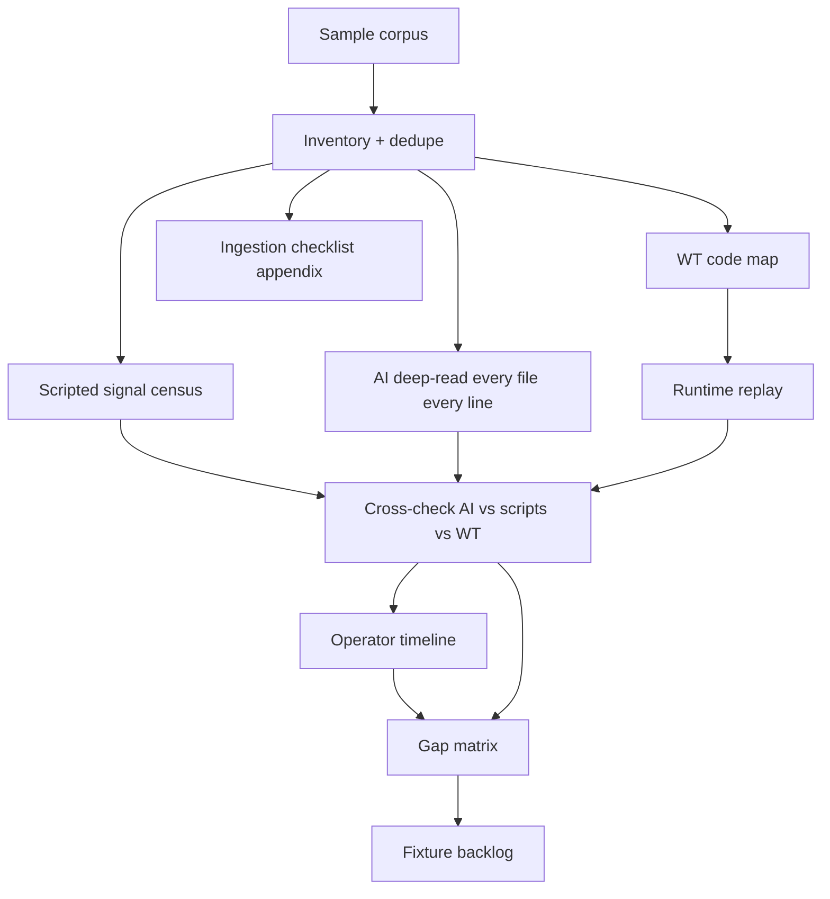

# Log sample gap research (corpus → gap audit → fixture backlog)

**Status:** Approved for planning (2026-08-02); **revised 2026-08-02** — forensic deep-read mandatory  
**Size:** Large (research only; no product code in this pass)  
**Platforms:** NeoForge 1.21.x / Java 21 (sample pack is 1.21.1 / NeoForge 21.1.x)  
**Sample root (pilot):** `samples/new samples 02.08.2026/`  
**Pilot census-only run:** `docs/superpowers/research-runs/2026-08-02-new-samples/` (scripts + replay done; **forensic deep-read not yet done** — must re-run under this revised spec)

## Reuse (future sample dumps)

This is a **playbook**, not a one-shot. For any new user dump:

1. Drop files under `samples/<label>/` (expect `logs/` + optional `crash-reports/`; sidecars allowed).
2. Set run inputs: `SAMPLE_ROOT`, `RUN_ID` (date + short label), optional notes.
3. Tell the agent: *“Run the log sample gap research playbook on `samples/<label>/` per `docs/superpowers/specs/2026-08-02-log-sample-gap-research-design.md` and `docs/superpowers/plans/2026-08-02-log-sample-gap-research.md`.”*
4. Artifacts land in `docs/superpowers/research-runs/<RUN_ID>/` — do not overwrite prior runs.
5. Product classifier/scanner code still stays out of scope unless a **separate** implementation plan is opened from that run’s fixture backlog.

Locked decisions apply to every run unless this spec is explicitly revised: **full corpus**, **AI forensic deep-read of every file (every line, start→end)**, scripted census, code map + runtime replay, three-way cross-check (AI ↔ scripts ↔ WatchTower), full operator-path scoring, timeline-first + ingestion appendix.

## Problem

A user sent a full logs + crash-reports dump. Before changing WatchTower parsers or Fix copy, we need a grounded answer to:

1. What actually happened on this server across the whole corpus?
2. What would WatchTower read, classify, surface, and advise today?
3. Where are the gaps (blind spots, wrong kinds, missing Issues, bad advice, noise drowning, missing event linkage)?
4. Which golden fixtures should a later implementation plan add first?

Without that research pass, classifier tweaks risk chasing one crash while missing chronic lag, sidecar files, and spam that drowns real signals.

## Goal

Produce a **gap audit + ranked fixture backlog** for WatchTower log/crash reading and operator advice against this corpus. Ground truth comes from an **AI forensic deep-read of every corpus file (start to end, every line)**, then a **three-way cross-check** against (1) the scripted census toolkit and (2) what WatchTower would actually classify/surface/advise. No product behavior changes in this research pass. A separate implementation plan may follow from the backlog.

## Decisions (locked)

| Decision | Choice |
| -------- | ------ |
| Primary deliverable | **B** — Gap audit + fixture backlog (not implement fixes yet) |
| Corpus depth | **Full corpus** — all rotates, debug*, kubejs, Jade, nested archives (dedupe members) |
| AI forensic read | **Mandatory** — every non-duplicate scannable file is read by the agent **start→end, every line**; pattern scripts alone are not enough |
| Scripted census | **Required companion** — inventory/census for counts and coverage; never a substitute for the AI deep-read |
| Triangulation | **Required** — cross-check AI findings ↔ census scripts ↔ WatchTower replay/code map; record disagreements |
| Verification | **Code map + runtime replay** — reading Java is not enough; capture real WT output |
| Gap scoring | **Full operator path** — kind + surfacing + Fix/advice quality |
| Research shape | **Timeline-first forensics** + **ingestion checklist appendix** |
| Product code | Out of scope for this pass |
| Modrinth / auto-restart / jar mutation | Out of scope (advisory only forever) |

## Sample context (preliminary; confirm during research)

Pack appears to be Create-heavy NeoForge **1.21.1** with Sable/Shtreimel, C2ME, Spark, KubeJS, OpenPartiesAndClaims, and **WatchTower** installed. Host: Linux, Java 21, high-core AMD box; RAM flags include `-XX:MaxRAMPercentage=95.0`.

### Crash reports present (6)

| File | Time | Preliminary ground truth |
| ---- | ---- | ------------------------ |
| `crash-2026-07-31_17.27.20-server.txt` | Jul 31 17:27 | Spark shutdown: `IllegalStateException: Profiler job no longer active!` during server stop — likely **not** the root stability incident |
| `crash-2026-08-01_19.24.51-server.txt` | Aug 1 19:24 | `opac_better_commands` `NoSuchMethodError` on OPAC `getPlayerConfigs()` via party chat **command** |
| `crash-2026-08-01_20.42.00-server.txt` | Aug 1 20:42 | Same `NoSuchMethodError` via party chat **listener** (chat path) |
| `crash-2026-08-01_20.43.06-server.txt` | Aug 1 20:43 | `ServerHangWatchdog` (~60M seconds) — likely **follow-up** after prior tick-loop crash |
| `crash-2026-08-01_21.49.17-server.txt` | Aug 1 21:49 | Sable: `RuntimeException: Body has been removed` during sublevel serialize/save |
| `crash-2026-08-01_21.50.21-server.txt` | Aug 1 21:50 | Second watchdog follow-up after Sable crash |

### Non-crash signals already visible

- `logs/JadeErrorOutput.txt` — repeated Jade `InvWrapper.getInv()` NPE (sidecar; likely unread by WT today)
- `logs/kubejs/*.log` — heavy createfood / Create recipe parse WARN spam
- `latest.log` — DISTXFORM client-on-server ERROR noise; GriefLogger MariaDB fail; loot-table parse errors for missing deps; chronic `Can't keep up` on Aug 1 rotates (100–200+ per file in samples checked)
- `mega.tar.gz` — duplicate subset of Aug 1 rotates; must **dedupe** before counts

These seeds inform the backlog but are **not** final until the **AI forensic deep-read**, full census, replay, and triangulation complete.

## Architecture (research flow)

```text
SAMPLE_ROOT/
  → Corpus inventory + archive dedupe
  → Full-corpus signal census (scripted)          [counts / coverage]
  → AI forensic deep-read EVERY file, EVERY line  [ground truth understanding]
  → Per-file forensic notes + forensic manifest
  → Three-way cross-check: AI ↔ census ↔ WatchTower
  → Day-by-day operator timeline (ground truth from deep-read)
  → Code map: signal → LogScanner / OpsLogTail / Crash* / Classifier / Narrator / Issues
  → Runtime replay against staged server root
  → Gap matrix (AI ground truth × WT output × Fix quality × script disagreements)
  → Ranked fixture backlog + ingestion checklist appendix
```



## Method

### 1. Corpus inventory

Catalog every file under the sample root:

- `crash-reports/*.txt`
- `logs/latest.log`, `logs/debug.log`
- `logs/*.log.gz`, `logs/debug-*.log.gz`
- `logs/kubejs/*`
- `logs/JadeErrorOutput.txt`
- nested archives such as `logs/mega.tar.gz` (list + dedupe against already-present rotates)

Record size, date span, and whether WT has a reader for that path.

### 2. Scripted census (companion, not ground truth)

Run inventory + census tools across every non-duplicate scannable file. Capture pattern counts (boot `Done (`, `Can't keep up`, ERROR/WARN floods, crash/watchdog, `NoSuchMethodError`, Spark profiler shutdown, Sable body-removed, Jade NPE, KubeJS/createfood recipe parse, DISTXFORM, loot-table missing deps, MariaDB addon fail, joins/leaves, `Stopping server`, and any other patterns in the toolkit catalog).

Scripts exist to **quantify and prevent missed files**. They do **not** replace the AI deep-read.

### 3. AI forensic deep-read (mandatory ground truth)

The researching agent MUST read **every non-duplicate scannable file in the corpus from the first line to the last line**. That includes all crash reports, `latest.log`, `debug.log`, every rotate `.log.gz` / `debug-*.log.gz`, kubejs logs, Jade sidecars, and any other text logs listed in inventory after dedupe.

Rules:

- Decompress gz/archives as needed; do not skip “quiet” days or large files.
- For each file, write a **per-file forensic note** under `docs/superpowers/research-runs/<RUN_ID>/forensic/files/` covering: time span, session phases (boot / runtime / stop), notable events, player-facing impact, noise vs hurt, and anything surprising that scripts might miss (odd stack traces, rare mods, panel/host lines, auth storms, datapack quirks, WatchTower’s own lines, etc.).
- Maintain `forensic/manifest.json`: one row per inventory file with `rel`, `kind`, `duplicate_of`, `read_complete` (must be `true` for every non-duplicate scannable file before the run can close), `note_path`, `line_count` if known.
- Parallel subagents may split the file list, but the controller must ensure **100% of non-duplicate scannable files** reach `read_complete: true` with a note. No “spot-check only” shortcuts.
- Repeating spam (e.g. thousands of identical recipe WARNs) may be summarized **after** the agent has confirmed the pattern by reading through the file; the agent still must traverse the whole file and record approximate volume / first-last occurrence — not sample the middle and stop.

### 4. Three-way cross-check (AI ↔ scripts ↔ WatchTower)

After deep-read + census + crash/narrator replay (+ code map):

Write `forensic/cross-check.md` that explicitly compares:

| Lens | Role |
| ---- | ---- |
| AI forensic notes | What a careful human would say happened |
| Scripted census | What the pattern toolkit counted / missed |
| WatchTower | What classifiers, scanners, Issues, and Fix advice would produce today |

Call out:

- Signals the AI found that census patterns missed (extend pattern catalog or note as gap)
- Census hits that were noise / false positives on deep-read
- WT wrong kind / wrong primary / bad advice / blind / no_surface / noise_drown / linkage misses
- Cases where scripts and WT agree but both disagree with AI ground truth (highest-value product gaps)

### 5. Code map

Map each signal class to concrete WatchTower paths, including known limits:

| Area | Key paths |
| ---- | --------- |
| Line IO | `GzipLineReader`, `LogScanner`, `OpsLogTailScanner` |
| Crashes | `CrashReportParser`, `CrashReportScanner`, `CrashMtimeScanner` |
| Classify / advise | `CrashClassifier`, `CrashNarrator`, `ModIssueAdvisor`, `ModLogAnalyzer` |
| Soft signals | `SilentFailSignatures`, `JoinRejectionSignatures`, `LogPatterns` |
| Issues | `IssuesLiveEvaluators`, ops-cache peeks |
| Known limits | Tail 4 MB/scan; crash enrich budget; same-line silent fails; YAML packs only override `unknown` unless configured; no Jade sidecar reader observed |

### 6. Runtime replay

Stage the sample tree as a fake server root. Drive existing collectors/classifiers (golden-test style harness or thin test/tools driver). Capture:

- `failure_kind`, primary/suspect mod
- Issues ids / ops peeks when applicable
- Narrator Fix hints

Prefer real API output over invented expectations. If no “point at arbitrary server root” path exists, add a **test/tools-only** driver noted in the plan — still not a product change.

### 7. Timeline, gap matrix + fixture backlog

Build the day-by-day timeline from **forensic notes first**, with census counts as supporting evidence.

Score each miss on the full operator path, incorporating triangulation findings. Rank by severity × frequency × fixability. Propose fixtures matching existing golden styles (`crash-intelligence`, `ca-parity`, `issues-live`).

## Gap rubric

### Miss tags (a row may carry several)

| Tag | Meaning |
| --- | ------- |
| `blind` | File/signal never ingested |
| `wrong_kind` | Wrong `failure_kind` / Issue id |
| `wrong_primary` | Wrong blamed mod/primary |
| `no_surface` | Detected internally but not in Issues / crash card / brief |
| `bad_advice` | Kind OK but Fix copy wrong, vague, or misleading |
| `noise_drown` | Real signal buried; WT over-weights spam |
| `linkage` | Related events not grouped (e.g. crash → watchdog follow-up) |

### Severity

| Level | Meaning |
| ----- | ------- |
| `P0` | Player-facing outage / repeated crash |
| `P1` | Wrong blame or misleading Fix |
| `P2` | Missing soft signal / noise handling |
| `P3` | Nice-to-have polish |

### Fixture backlog entry (required fields)

- `id`, `title`
- `source_files` (paths under the sample tree)
- `ground_truth` (1–3 sentences)
- `expected`: `failure_kind` / Issue id / primary mod / Fix must-include / Fix must-not
- `proposed_fixture_dir` (e.g. `samples/fixtures/crash-intelligence/opac-nsm-…`)
- `wt_gap_tags`, `severity`
- `suggested_code_touch` (classifier / narrator / scanner / patterns — names only)
- `acceptance`: how a later golden test fails today and passes after the fix

### Suspected backlog seeds (confirm; not final)

1. Spark “Profiler job no longer active!” on shutdown → must not look like the root incident  
2. `opac_better_commands` `NoSuchMethodError` vs OPAC → API/version mismatch advice  
3. Watchdog follow-ups after prior tick-loop crashes → linkage  
4. Sable “Body has been removed” during sublevel save  
5. `JadeErrorOutput.txt` sidecar NPEs → ingestion blind spot  
6. createfood/KubeJS recipe parse flood → noise / soft Issue aggregation  
7. DISTXFORM / loot-table missing-dep ERROR spam → suppress or bucket  

## Deliverables

1. **Forensic package** — `forensic/manifest.json` + per-file notes proving every non-duplicate scannable file was deep-read  
2. **Cross-check report** — `forensic/cross-check.md` (AI ↔ scripts ↔ WatchTower)  
3. **Incident narrative** — plain English across the full corpus, rooted in deep-read  
4. **Gap matrix** — ground truth → WT output → miss tags (plus script disagreements)  
5. **Ingestion checklist appendix** — every relevant file type vs WT reader coverage  
6. **Ranked fixture backlog** — ready for a later implementation writing-plans pass  
7. **Scripted census** — inventory.json + census.json as quantitative companion  

Optional working artifact if the matrix is large: `docs/superpowers/plans/2026-08-02-log-sample-gap-matrix.md`.

## Artifacts & locations

| Artifact | Path |
| -------- | ---- |
| This spec | `docs/superpowers/specs/2026-08-02-log-sample-gap-research-design.md` |
| Research plan | `docs/superpowers/plans/2026-08-02-log-sample-gap-research.md` |
| Per-run root | `docs/superpowers/research-runs/<RUN_ID>/` |
| Forensic notes | `docs/superpowers/research-runs/<RUN_ID>/forensic/files/` |
| Forensic manifest | `docs/superpowers/research-runs/<RUN_ID>/forensic/manifest.json` |
| Cross-check | `docs/superpowers/research-runs/<RUN_ID>/forensic/cross-check.md` |
| Source samples | `samples/...` (unchanged as source of truth) |
| Future goldens | `samples/fixtures/...` only when a backlog item needs a durable fixture |

## Verification bar (“research done”)

- Every file class in the corpus appears on the ingestion checklist (`seen` / `unread` / `partial`)
- Every crash report has a ground-truth row and a WT replay row
- Full-corpus pattern census completed (not crash-days only)
- **Every non-duplicate scannable inventory file has `read_complete: true` in `forensic/manifest.json` and a forensic note**
- **`forensic/cross-check.md` exists and documents AI ↔ census ↔ WT disagreements**
- Gap matrix has ≥1 row per confirmed miss type found (including triangulation finds)
- Every P0/P1 item has a fixture backlog entry with acceptance criteria
- No product code changed; any replay harness is test/tools-only and documented

## Risks & constraints

- Large gz corpus → deep-read is expensive; use parallel file-splitting subagents, but **never** skip files or replace deep-read with census alone
- `mega.tar.gz` (and similar) duplicates peer rotates → always dedupe before totals and before deep-read (do not double-read identical members)
- Runtime replay may need a thin test driver — preferred over inventing WT output
- Sable / Jade / OPAC advice stays advisory, plain English; no download claims
- WatchTower is installed on this pack — do not treat its own log lines as the incident unless they are
- Status can fragment across Overview / Issues live / brief / crash review — note fragmentation when it appears in replay
- The 2026-08-02 pilot census-only run is **insufficient** under this revised spec until the forensic deep-read + cross-check pass completes

## Out of scope

- Shipping classifier, scanner, narrator, or UI changes
- Modrinth lookups or jar installs
- Auto-restart / world mutation
- Treating this research plan as the implementation plan
- Using pattern census or crash-replay alone as a substitute for reading every file

## Handoff

After the research plan executes (including forensic deep-read + triangulation) and the backlog is accepted, run a **separate** writing-plans pass to turn ranked P0/P1 fixtures into implementation tasks (TDD goldens → classifier/narrator/scanner).

## Plain English (end user)

We take the user’s full log dump and actually read every file, start to finish — not just run counters. Then we compare what a careful reader saw, what our counting scripts saw, and what WatchTower would have said. We write down every miss — unread files, wrong labels, missing Issues, bad Fix text, spam drowning the real problem, and things the scripts never looked for — and turn the worst misses into a fixture shopping list for later coding. This pass itself does not change the mod.
