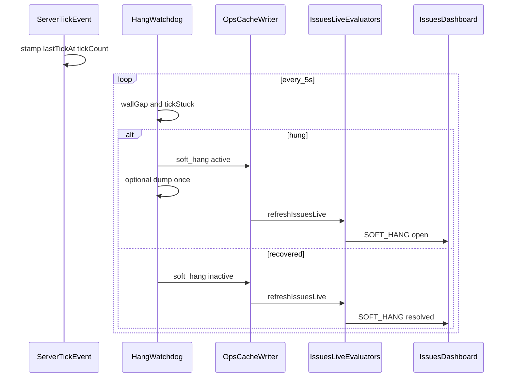

# 1.1.22 — Soft-hang / freeze Issues

**Status:** Approved for planning (2026-08-02)  
**Roadmap:** [1.1.19–1.1.29 change safety](../../dev/roadmap/versions/1.1.19-1.1.29-change-safety-and-recovery.md#1122--soft-hang--freeze-issues)  
**Size:** Medium  
**Depends on:** NeoForge 1.21 sampler/tick hooks; Issues live pipeline; Support quality gate `hang_dump` stub (1.1.21)

## Problem

Gap research #7: the dedicated server process can look “online” (JVM up, panel green) while **server ticks stop advancing**. Existing WatchTower lag paths (`TICK_LAG` / `MSPT_HIGH`) only update when ticks run, so a true freeze goes silent. Operators get no Issue, no hang dump, and Discord packs lack freeze evidence. Vanilla `max-tick-time` (default 60s) may force-crash later — or may be disabled (`-1`) on many hosts — so soft-hang must be **aware of that setting**.

## Goal

Detect soft hangs on NeoForge dedicated servers, raise a continuous Issues card (`SOFT_HANG`) with phase + duration, optionally write one bounded thread dump for support packs, wire the quality-gate `hang_dump` check, and resolve cleanly when ticks resume. Never auto-restart.

## Decisions (locked)

| Decision | Choice |
| -------- | ------ |
| Scope (v1) | Detect + Issues + **opt-in** auto dump + quality-gate hook; **no** dashboard “Dump now” button |
| Architecture | **NeoForge watchdog + core Issue mapping** (Approach 1) |
| Stall signals | **Both** required: wall-clock gap on `lastTickAt` **and** unchanged tick count |
| Poll | Background daemon ~5s; stamps updated on `ServerTickEvent` (volatile reads only — negligible cost) |
| Phases | Best-effort: `starting` / `loading_world` / `ticking` / `saving` / `unknown` on the Issue |
| Dump timing | **During hang** (not after recovery) — post-recovery stacks lose diagnostic value |
| Dump API | `ThreadMXBean.dumpAllThreads(false, false)` once per hang episode; off tick thread; ~2 MB cap; no retry |
| Dump default | `SOFT_HANG_THREAD_DUMP=false` (opt-in) |
| Base threshold | `SOFT_HANG_SECONDS=90` when vanilla watchdog is **off** (`max-tick-time=-1`) |
| Watchdog-aware threshold | When `max-tick-time > 0`: effective threshold = `max(30, maxTickSeconds - 15)` so WatchTower can alert before a likely vanilla kill |
| Issue id | `SOFT_HANG` (Issues-live SCREAMING_SNAKE style) |
| Recovery | Clear peek `active`, resolve Issue; cooldown `SOFT_HANG_COOLDOWN_MIN=15` against reopen spam |
| Platforms | NeoForge 1.21.x / Java 21 only in v1 |
| Auto-restart | Never |

## Architecture

```text
ServerTickEvent (tick thread)
  → stamp lastTickAtMs + tickCount (+ phase hints)
HangWatchdog daemon (~5s)
  → read max-tick-time → effectiveThresholdSec
  → if wallGap && tickUnchanged ≥ threshold:
       write ops-cache.soft_hang (active=true)
       optional once dump → watchtower/hangs/*.txt
       refreshIssuesLive
  → if ticks resume:
       soft_hang.active=false, recovered_at=…
       refreshIssuesLive → resolve SOFT_HANG

IssuesLiveEvaluators.fromSoftHang
  → upsert/resolve SOFT_HANG

SupportQualityGate.hang_dump
  → PASS if dump on disk when hang-relevant
  → WARN if hang-relevant and no dump
  → SKIP otherwise
```



## Components

| Unit | Responsibility |
| ---- | -------------- |
| `TickMetrics` / bootstrap hooks | Update `lastTickAtMs` + `lastTickCount` every tick; set phase on lifecycle |
| `HangWatchdog` (NeoForge / neoforge-common) | Daemon poll; threshold math; write peek; trigger dump |
| `HangDumpWriter` | MXBean dump → `watchtower/hangs/`; size cap |
| `SoftHangThreshold` (core, pure) | `effectiveSeconds(maxTickTimeMs, softHangSeconds)` — unit-tested |
| `OpsCacheSchema.SOFT_HANG` + writer apply | Peek block shape |
| `IssuesLiveEvaluators.fromSoftHang` | Map peek → `SOFT_HANG` record; merge/resolve |
| `SupportQualityGate` hang_dump | Replace always-SKIP stub |
| Support composer / catalog | Include recent hang dump text when present |
| Dashboard Issues | Ledger-driven card copy + Fix steps; fixture sample |
| Fixtures | `samples/fixtures/soft-hang/` |

## ops-cache peek shape (`soft_hang`)

| Field | Type | Notes |
| ----- | ---- | ----- |
| `active` | boolean | Open hang |
| `phase` | string | `starting` \| `loading_world` \| `ticking` \| `saving` \| `unknown` |
| `stall_seconds` | number | Observed stall length |
| `effective_threshold_seconds` | number | Threshold used for this detection |
| `max_tick_time_ms` | number | From `server.properties` (−1 if disabled) |
| `started_at` | ISO-8601 | When hang became active |
| `last_tick_at` | ISO-8601 | Last successful tick stamp |
| `tick_count` | number | Frozen tick count |
| `dump_path` | string \| null | Relative or absolute path under server dir |
| `recovered_at` | ISO-8601 \| null | Set when ticks resume |

## Config (`watchtower.conf`)

| Key | Default | Purpose |
| --- | ------- | ------- |
| `SOFT_HANG_ENABLED` | `true` | Master toggle |
| `SOFT_HANG_SECONDS` | `90` | Base threshold when `max-tick-time=-1` |
| `SOFT_HANG_THREAD_DUMP` | `false` | Auto dump on hang |
| `SOFT_HANG_COOLDOWN_MIN` | `15` | Dedupe / reopen guard after resolve |

No dump button or extra dashboard write APIs in v1.

### Threshold function (normative)

```text
if !SOFT_HANG_ENABLED → do not detect
maxTickMs = parse server.properties max-tick-time (default 60000 if missing)
if maxTickMs < 0:  // disabled watchdog
  effective = SOFT_HANG_SECONDS
else:
  effective = max(30, floor(maxTickMs / 1000) - 15)
```

Example: default `60000` → effective **45s**. Disabled `-1` → **90s**.

## Issue card (operator-facing)

- **Id:** `SOFT_HANG`
- **Severity:** critical while `active`
- **Title:** Server tick frozen
- **Summary:** Plain English — how long, phase, whether a hang dump was written, note that vanilla watchdog may still kill the process if enabled
- **Fix steps (examples):** Check whether a save/pregen is stuck; open the hang dump if present; gather a Support pack; WatchTower will not restart the server for you
- **Primary action:** Link to Support pack builder when useful (especially if `dump_path` set)

## Support pack + quality gate

- Include newest hang dump file(s) from `watchtower/hangs/` on SERVER_TRIAGE / FULL_EVIDENCE (and when customize selects them once catalog lists them)
- `hang_dump` check:
  - **PASS** — hang-relevant pack and dump file present
  - **WARN** — hang-relevant (active/recent soft_hang or category implies hang) and no dump
  - **SKIP** — no hang context / dumps not applicable

## False positives / safety

| Signal | Rule |
| ------ | ---- |
| Long `/save-all` | Threshold ≥ 30s floor; phase `saving` when known; tune via conf |
| Watchdog about to fire | Alert earlier (`maxTick − 15`) so dump can land before kill when dumps enabled |
| Debugger / single-player | Dedicated server path only |
| Dump worsens hang | Off tick thread; plain stacks; once; size-capped; default off |
| Duplicate Issues | Single `SOFT_HANG` key; cooldown after resolve |

## Out of scope (v1)

- Auto-restart or process kill  
- Dashboard “Dump now”  
- Locked-monitors dumps (`dumpAllThreads(true, true)`)  
- Root-cause attribution from stacks  
- Fabric / NeoForge 1.20 backport  
- Inferring hang only from “live samples stopped” without tick stamps  

## Testing

| Layer | Coverage |
| ----- | -------- |
| Core | `SoftHangThreshold` math; `fromSoftHang` open/resolve; quality-gate `hang_dump` PASS/WARN/SKIP |
| Fixtures | `samples/fixtures/soft-hang/` active + recovered timelines |
| Mod | Stamp + double-check logic; dump writer truncate without live freeze |
| Preview | Fixture Issues card for `SOFT_HANG` |
| Packaging | `node tools/audit-dashboard-packaging.mjs` after dashboard copy changes |

## Ship when

- [ ] Induced stall fixture → Issue with phase  
- [ ] Recovery resolves without duplicate spam (cooldown)  
- [ ] Effective threshold respects `max-tick-time`  
- [ ] Dump path opt-in, once-per-hang, size-capped, off tick thread  
- [ ] Quality gate `hang_dump` no longer always SKIP  
- [ ] Wiki + `watchtower.conf.example` updated  

## Plain-English summary (end user)

If the Minecraft server process is still running but the world stops ticking, WatchTower raises a **Server tick frozen** Issue with how long it has been stuck and what phase it was in. When you turn on hang dumps in config, it can save one thread dump under `watchtower/hangs/` for Discord or a bug report. WatchTower never restarts the server for you.
