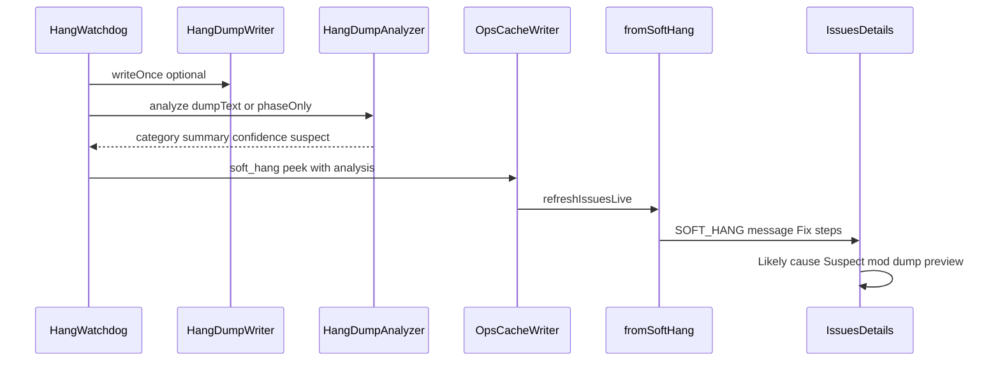

# Soft-hang likely cause (category + optional suspect hint)

**Status:** Approved for planning (2026-08-02)  
**Depends on:** [1.1.22 Soft-hang / freeze Issues](./2026-08-02-soft-hang-freeze-issues-design.md)  
**Size:** Small–medium  
**Platforms:** NeoForge 1.21.x / Java 21 (same as soft-hang v1)

## Problem

`SOFT_HANG` tells the operator the server tick is frozen (phase + stall + optional dump), but not **what kind of freeze** it looks like. Opening a raw hang dump is specialist work. Operators need a plain-English category and, when the dump supports it, an optional **suspect mod hint** clearly labeled as not proof.

## Goal

Analyze hang dumps (or phase alone when dumps are off) once per hang episode, store a likely-cause category on `ops-cache.soft_hang`, and surface it on the Issues card Fix steps and Details — without aggressive mod blame or tick-thread CPU cost.

## Decisions (locked)

| Decision | Choice |
| -------- | ------ |
| Wording scope | Category + optional suspect mod **hint** (“hint, not proof”); not aggressive blame |
| When to analyze | **Once** at dump write (watchdog daemon thread). No per-poll or per-Details re-parse |
| No dump | Cheap **phase-only** category; `confidence=low`; no `suspect_mod` |
| Architecture | Pure core `HangDumpAnalyzer` (Approach 1); patterns inspired by `CrashClassifier`, not a wholesale reuse |
| Confidence cap | Never above `medium` |
| Suspect mod | Only from non-vanilla / non-loader frames near the top of the **Server thread** stack |
| Primary Issues CTA | Unchanged: **Build support pack** |
| Auto-restart / Modrinth / Spark correlation | Out of scope |

## Architecture

```text
HangWatchdog (newlyActive)
  → optional HangDumpWriter.writeOnce
  → HangDumpAnalyzer.analyze(dumpText | null, phase)
  → merge fields onto soft_hang peek
  → OpsCacheWriter.applySoftHang + refreshIssuesLive

HangWatchdog (active refresh)
  → update stall_seconds only; **preserve** prior likely_cause* / suspect_* fields

IssuesLiveEvaluators.fromSoftHang
  → message suffix + category-aware Fix steps from peek

Dashboard enrichSoftHangFromOps + Details
  → Likely cause + Suspect mod rows above dump preview
```



## Categories

| id | Plain English summary |
| ---- | --------------------- |
| `saving` | Looks stuck while saving the world |
| `world_gen` | Looks stuck in world generation / chunk loading |
| `entity_tick` | Looks stuck while ticking entities |
| `network` | Looks stuck in network / connection handling |
| `deadlock` | Possible thread deadlock (threads waiting on each other) |
| `unknown` | Freeze detected; stacks don’t match a clear pattern |

### Phase-only mapping (no dump)

| `soft_hang.phase` | `likely_cause` |
| ----------------- | -------------- |
| `saving` | `saving` |
| `loading_world` | `world_gen` |
| `ticking` | `entity_tick` |
| `starting` / `unknown` / other | `unknown` |

Confidence for phase-only: always `low`. No `suspect_mod`.

### Dump heuristics (normative intent)

- Prefer the **Server thread** stack when present.
- Match package / method patterns for save, chunk gen, entity tick, network; deadlock when multiple threads show BLOCKED/WAITING with clear mutual wait signals (conservative — else `unknown`).
- `suspect_mod`: first non-`net.minecraft` / non-`java.` / non-NeoForge-loader frame near top of Server thread; store a short id/package label; set `suspect_mod_note` to the fixed disclaimer below.
- If dump text is empty or unparseable: fall back to phase-only.

## ops-cache peek additions (`soft_hang`)

| Field | Type | Notes |
| ----- | ---- | ----- |
| `likely_cause` | string | Category id |
| `likely_cause_summary` | string | One plain-English sentence |
| `likely_cause_confidence` | string | `low` \| `medium` |
| `suspect_mod` | string \| null | Optional hint label |
| `suspect_mod_note` | string \| null | Fixed: `Hint from the hang dump — not proof.` when suspect set; else null |

Existing soft_hang fields unchanged. Analysis fields are written on `newlyActive` and **carried forward** on stall refresh and recovery peek (so Details still explain the episode after resolve if the card remains visible briefly / in history fixtures).

## Issue card (operator-facing)

**Message:** keep freeze line, append category when known:

> Server tick frozen for 48s (phase: ticking) — Looks stuck while ticking entities

Do **not** put the suspect mod in the list title.

**Fix steps:**

1. Category-specific advisory first step (examples):
   - `saving` — Check whether a world save or disk I/O is stuck.
   - `world_gen` — Check pregen / chunk loading / worldgen mods.
   - `entity_tick` — Check dense entity farms, mob caps, or entity-heavy mods.
   - `network` — Check connection handling / proxy / network mods.
   - `deadlock` — Capture a Support pack; a careful restart may be needed — WatchTower will not restart for you.
   - `unknown` — Check whether a world save or pregen is stuck.
2. If `suspect_mod` set: `Hang dump hint points at {mod} — treat as a lead, not proof.`
3. If dump present: open under `watchtower/hangs/`; if missing: note enabling `SOFT_HANG_THREAD_DUMP`.
4. Build a Support pack for Discord or a bug report.
5. WatchTower will not restart the server for you.

**Primary action:** Build support pack (unchanged).

## Dashboard Details

Above the hang dump preview:

- **Likely cause** — `likely_cause_summary` + confidence chip (`low` / `medium`)
- **Suspect mod** — only if set; show name + `suspect_mod_note`
- Existing stall / phase / dump preview unchanged

`enrichSoftHangFromOps` copies the five analysis fields into issue metrics for Details rendering. Preview fixture (`web/dashboard/data/ops-cache.json`) includes a medium-confidence `entity_tick` example with optional suspect so preview validates the UI.

## Components

| Unit | Responsibility |
| ---- | -------------- |
| `HangDumpAnalyzer` (core) | Pure analyze(dumpText, phase) → result record |
| `HangWatchdog` | Call analyzer once on newlyActive; merge into peek; preserve on refresh |
| `OpsCacheSchema` + applySoftHang | Persist new fields |
| `IssuesLiveEvaluators.fromSoftHang` | Message suffix + Fix steps |
| Issues helpers + queue Details | Metrics enrich + Likely cause / Suspect rows |
| Fixtures | `samples/fixtures/soft-hang/` dump texts + ops peek samples |
| Tests | `HangDumpAnalyzerTest`; evaluator message/fix coverage |

## Testing

- Unit fixtures: saving, entity_tick, deadlock-ish WAITING, unknown, one fake mod package for suspect.
- Evaluator: when peek has analysis, message and fix_steps include summary / suspect line.
- No heavy NeoForge IT beyond ensuring watchdog still applies analysis fields after dump write.

## Out of scope

- Continuous re-analysis while hung
- Spark / profiler correlation
- Modrinth lookup or jar download
- Auto-restart or “Dump now” button
- Claiming proven root cause or confidence above `medium`

## Plain-English summary (end user)

When the server freezes, WatchTower still raises the soft-hang Issue. If a hang dump was captured, it also says what the freeze **looks like** (saving, entities, worldgen, network, possible deadlock, or unknown) and may name a **suspect mod as a hint, not proof**. Without a dump, you still get a cautious category from the hang phase alone. Support pack remains the main action.
