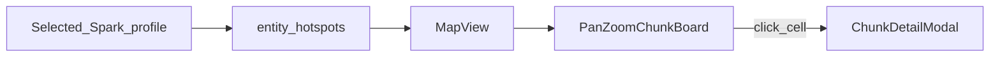

# 1.1.28 — Spark Map (ops lag heatmap)

**Status:** Approved for planning (2026-08-02)  
**Roadmap:** [1.1.19–1.1.29 change safety](../../dev/roadmap/versions/1.1.19-1.1.29-change-safety-and-recovery.md#1128--ops-lag-heatmap-spark--map)  
**Size:** Medium  
**Depends on:** Existing Spark profile parse (`context.entity_hotspots`); Spark World tab (cards + `ChunkDetailModal`)  
**Platforms:** NeoForge 1.21.x / Java 21 (dashboard only for v1)

## Problem

Operators can see busy chunks as a card list on Spark → World, but cannot see **where** those chunks sit relative to each other. Roadmap called for an Insights → World map fed by live census / Issues — that would add tick pressure and a new Java heatmap API. Spark profiles already carry chunk coordinates on `entity_hotspots`.

## Goal

Add **Spark → Map**: a pan/zoom abstract chunk board with a heat overlay from the **selected Spark profile’s** `entity_hotspots`. Click a cell to open the existing chunk detail dialog. Honest empties when no profile or no hotspots. No live census, no terrain underlay, no new server tick work.

## Decisions (locked)

| Decision | Choice |
| -------- | ------ |
| Home | **Spark → Map** new subtab (not Insights → World) |
| World tab | Cards / composition stay; Map does not replace them |
| Heat source | Selected profile `context.entity_hotspots` only |
| Live census / Issues paint | Out of scope for v1 |
| Board | **3a** — pan/drag/zoom abstract chunk lattice + heat; **no** World Preview / region terrain |
| Profile picker | Shared Spark chrome picker; same empty as other Spark views |
| Click cell | Reuse `ChunkDetailModal` from Spark World |
| Backend | Client-side only; **no** `world_heatmap` Java API / ops-cache field in v1 |
| Visual | Night Watch Desk (Geist, JetBrains Mono, lantern-amber heat, signal-blue chrome) |
| Motion | `prefers-reduced-motion`: no animated camera easing |

## Architecture

```text
Selected Spark profile (already loaded)
  → context.entity_hotspots[]
  → MapView (dimension filter + legend + empty)
  → PanZoomChunkBoard (camera, lattice, heat cells)
  → click → ChunkDetailModal (same as World)
```



No NeoForge sampler changes. No new ops-cache fields.

## Data shape (existing)

Each hotspot row (from Spark parse / fixtures such as `samples/fixtures/spark/expected-h5bvv4annz.json`):

```json
{
  "dimension": "overworld",
  "chunk_x": -102,
  "chunk_z": -17,
  "block_x_min": -1632,
  "block_x_max": -1617,
  "block_z_min": -272,
  "block_z_max": -257,
  "total_entities": 180,
  "top_type": "minecraft:experience_orb",
  "top_count": 180,
  "entity_counts": [{ "id": "minecraft:experience_orb", "count": 180 }],
  "same_dimension_players": 3,
  "nearest_player_chunk_distance": 63
}
```

Heat intensity = `total_entities` (relative scale within the painted set for the selected dimension).

## UI behavior (v1)

- **Tab:** `VIEWS` entry `{ id: 'map', label: 'Map' }` after `world` in [`view.tsx`](../../../web/dashboard/src/features/spark/view.tsx).
- **Dimension:** One dimension at a time. Default = dimension with highest sum of `total_entities`. Switcher lists dimensions present in hotspots (labels via `worldDimensionLabel`).
- **Fit:** On profile or dimension change, fit camera to hotspot bounding box (with padding).
- **Cap:** Paint at most top **256** cells by `total_entities` for the selected dimension.
- **Board:** Faint chunk lattice at mid/high zoom; heat fill amber → warn (CSS vars). Wheel zoom toward cursor; drag pan; click-without-drag opens modal.
- **Empty:** No profiles → existing Spark empty. Profile loaded but no hotspots (or none in dim) → same spirit as World’s “No busy chunks listed”.
- **Chrome:** Full-bleed board inside Spark content plate; tight Night Watch radii; no generic map-kit / glass SaaS chrome.

## Operator scenario

1. Capture / import a Spark profile while lagging.
2. Open **Spark → Map**, keep the same profile as World.
3. Amber cells cluster where entities piled up.
4. Click a cell → chunk dialog (coords, top types, counts) — same as World cards.

## Ship when

- [ ] Fixture profile with hotspots → cells at correct `chunk_x` / `chunk_z`; click opens matching `ChunkDetailModal`
- [ ] Multi-dimension hotspots → switcher filters; default picks busiest dim
- [ ] No-hotspot / no-profile → honest empties
- [ ] `prefers-reduced-motion` respected for camera
- [ ] `node tools/audit-dashboard-packaging.mjs` (+ parity if routes change)
- [ ] Roadmap §1.1.28 + wiki Spark note updated

## Out of scope

| Idea | Why |
| ---- | --- |
| Insights → World map | Locked home is Spark → Map |
| Live census / Issues heat layers | Tick cost + new aggregation API |
| Terrain / region / BlueMap underlay | Cost; not WatchTower’s job |
| Player radar / claims | Surveillance / world-integrations line |
| New Java `world_heatmap` | YAGNI for v1 |
| Auto-suppress / tick-thread paint | N/A — profile-only |

## Plain-English end-user summary

On the Spark tab, **Map** shows where the busy chunks from that capture sit on a simple pan/zoom grid. Click a square for the same chunk details you already get from World cards. It only uses the selected Spark profile — it does not watch the live world or draw real terrain.
